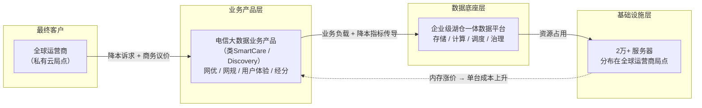
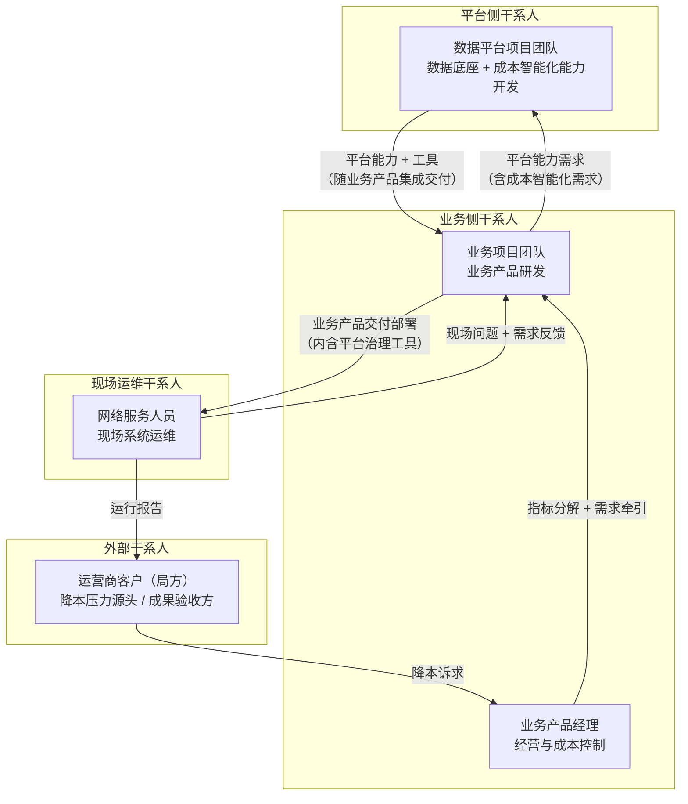
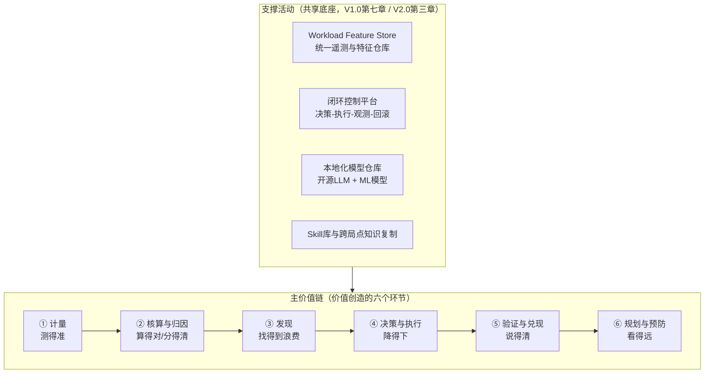
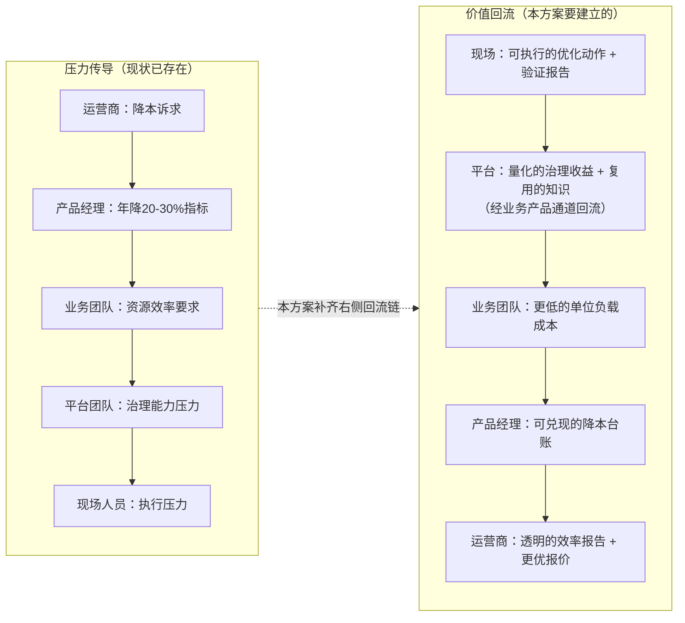
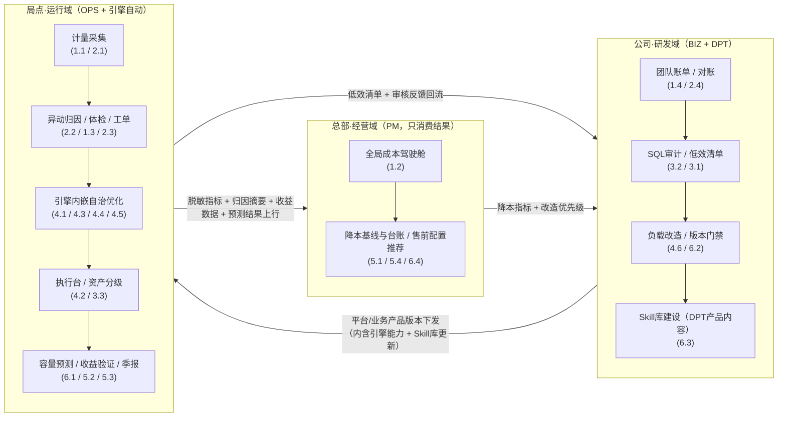
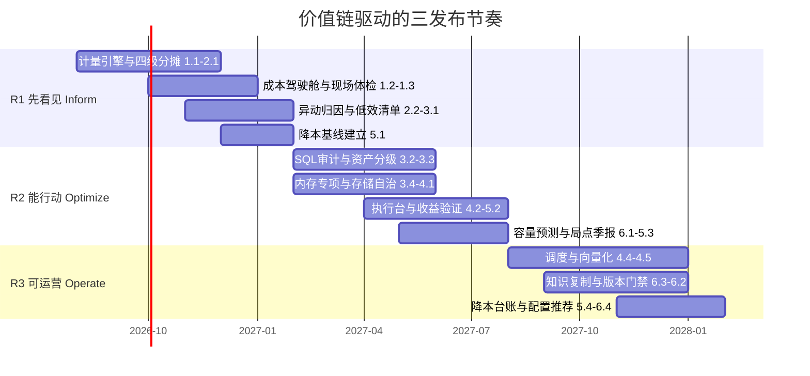

# AI时代数据成本智能化治理——价值链与用户故事地图V1.0

> **作者**：向春（架构师）
> **日期**：2026年7月
> **定位**：本文档是《AI时代数据成本智能化治理——前瞻技术提案V1.0》与《数据平台FinOps智能化——成本智能治理技术提案V2.0》的**业务侧配套文档**——前两份回答"有什么技术、怎么做技术方案"，本文档回答"**为谁创造什么价值、按什么顺序交付**"
> **方法**：价值链分析（Value Chain）+ 用户故事地图（User Story Mapping, Jeff Patton方法）
> **场景锚定**：企业级湖仓一体数据平台，支撑电信领域大数据业务产品（类华为SmartCare/Discovery），以私有云方式部署在全球运营商，涉及服务器超2万台

---

## 目录

- [第一章：场景与问题定义](#第一章场景与问题定义)
- [第二章：干系人分析与价值主张](#第二章干系人分析与价值主张)
- [第三章：成本智能治理价值链](#第三章成本智能治理价值链)
- [第四章：用户故事地图与产品功能视图](#第四章用户故事地图与产品功能视图)
- [第五章：发布切片与交付节奏](#第五章发布切片与交付节奏)
- [第六章：北极星指标与度量体系](#第六章北极星指标与度量体系)
- [附录：待确认问题清单](#附录待确认问题清单)

---

## 第一章：场景与问题定义

### 1.1 业务场景链条

这条链条上的**成本压力传导**是本文档一切分析的起点：

| 环节 | 压力表现 |
|------|---------|
| **硬件侧** | 内存价格大幅上涨 → 单台服务器采购/扩容成本显著增加；大数据负载恰恰是内存密集型（Spark执行内存、MPP内存表、缓存层、索引） |
| **商务侧** | 运营商自身背负降本增效指标，向业务产品传导议价压力；私有云模式下硬件成本直接进入项目报价与交付成本 |
| **产品侧** | 业务产品经理**每年背负20-30%的降成本指标**——这不是"锦上添花"，而是经营硬约束 |
| **平台侧** | 数据平台承接了业务产品绝大部分资源消耗，是降本指标最终的落点；但传统手段（规则调优、专家驻场）已接近天花板 |

### 1.2 私有云局点场景的四个特殊性

这四个特殊性决定了：**不能照搬公有云FinOps叙事**，价值链和用户故事必须为本场景重新推导。

| 特殊性 | 含义 | 对方案的约束 |
|-------|------|------------|
| **资源不可退还** | 服务器一旦部署在局点，不能像公有云一样缩容退费；降本的现实路径是**减少新增采购、延缓扩容、腾挪存量、支撑更多业务不加机器** | 核心指标从"账单金额"变为"利用率 + 单位业务量资源消耗"（以标准资源当量计，金额化仅作可选换算层） |
| **局点分散且封闭** | 全球运营商局点，普遍网络隔离、数据不出局、无法依赖云端SaaS与云端大模型 | AI能力必须本地化部署（开源模型）；跨局点复用只能复制"知识/模型/规则"，不能集中数据 |
| **现场运维人力有限** | 网络服务人员一人管多个系统，不具备DBA/数据架构师技能 | 智能化输出必须是"低门槛可执行"的——一键体检、建议+审核、白话解释，而非专家工具 |
| **规模乘数效应** | 2万+服务器、上百局点；单点节省10%，全网就是数千台服务器的采购避免 | 一切能力必须**产品化、可复制**，拒绝单局点定制化优化 |

### 1.3 问题定义

> **在私有云局点资源不可退还、现场人力有限、局点分散封闭的约束下，如何通过数据平台内建的成本智能治理能力，帮助业务产品每年兑现20-30%的降成本承诺，并把这个能力沉淀为可跨局点复制的产品竞争力？**

这个问题拆成三个子问题，分别对应价值链的三段：

1. **看得见**：2万+服务器的资源消耗，能不能归因到"哪个局点/哪个业务模块/哪个作业/哪条SQL"？（Inform）
2. **降得下**：发现的浪费，能不能转化为现场可执行、风险可控的优化动作？（Optimize）
3. **说得清**：降下来的成本，能不能量化兑现到产品经理的经营报表和对客户的承诺上？（Operate）

---

## 第二章：干系人分析与价值主张

### 2.1 干系人全景

在你给出的四类干系人基础上，补充一个**外部干系人**（运营商客户）——他们不直接使用系统，但是降本压力的源头和降本成果的最终验收方，价值链分析不能缺席。干系人按四层排布：**平台侧**（数据平台项目团队）、**业务侧**（产品经理 + 业务项目团队）、**现场运维**（网络服务人员，独立于平台侧）、**外部客户**（运营商局方）。

图自上而下四层：**平台侧 → 业务侧 → 现场运维 → 外部客户**。需求传导路径为「客户降本诉求 → 产品经理 → 业务项目团队 → 平台团队」；交付与反馈路径为「平台能力 → 业务产品集成 → 现场运维使用 → 问题反馈回流业务侧」。

**两条通道的约定（重要）：**

| 通道 | 走向 | 说明 |
|------|------|------|
| **需求通道** | 产品经理 → 业务项目团队 → 数据平台团队 | 产品经理不直接对平台提能力需求；降本指标与经营诉求先由产品经理分解给业务项目团队，再由业务项目团队**转化为平台能力需求**（功能、性能、成本智能化能力）统一提交给平台团队。平台团队的需求入口只有一个：业务项目团队 |
| **交付通道** | 数据平台团队 → 业务产品 → 网络服务人员 | 平台团队只提供**平台能力与工具**，不直接对接现场；治理能力（体检、建议执行台、报告生成等）作为平台组件**集成在业务产品中**，随业务产品版本交付到局点；网络服务人员的对接界面是业务产品，现场问题与需求反馈也经业务产品/项目团队通道回流 |

> 这个约定对方案设计有一个直接推论：**所有面向网服人员的用户故事（1.3 / 2.3 / 3.3 / 4.2 / 5.3），其交付形态都是"业务产品内的功能"，而非平台侧的独立工具**——平台团队负责能力实现，业务项目团队负责产品化集成，两者共同对现场可用性负责。

### 2.2 各干系人的痛点与价值主张

**① 业务产品经理（经营与成本控制）**

| 维度 | 内容 |
|------|------|
| **现状痛点** | 成本只有"局点总账"，看不到结构与趋势；降本指标层层下压，但**不知道降本空间在哪里、降了多少、还能降多少**；对客户承诺降本缺乏量化依据；扩容申请无法判断真伪 |
| **价值主张** | **把成本从"黑盒总账"变成"可归因、可预测、可承诺"的经营变量**——每个局点的成本画像、降本空间评估、降本进度追踪、对客户的量化叙事 |
| **成功判据** | 年度20-30%降本指标可分解、可追踪、可兑现；商务谈判中"成本效率"成为可展示的产品竞争力 |

**② 业务项目团队（业务产品研发）**

在本方案中业务项目团队承担**三重角色**：① 平台的**唯一需求入口**（把产品经理的经营诉求转化为平台能力需求提交）；② 平台上**负载的产生方**（业务产品的SQL/作业/模型消耗了平台绝大部分资源，是降本动作的主要改造对象）；③ 治理能力的**产品化集成方**（把平台提供的治理工具集成进业务产品交付给现场）。

| 维度 | 内容 |
|------|------|
| **现状痛点** | 不知道自己写的SQL/作业花了多少资源；资源申请靠拍脑袋加安全余量（宁多勿少）；版本上线后资源膨胀无感知；被平台方追责"你们的作业吃资源"时缺乏数据自证或改进抓手 |
| **价值主张** | **让资源效率成为研发过程的内建质量属性**——开发时有SQL审计把关，上线前有容量评估，上线后有本团队的资源账单与低效作业清单 |
| **成功判据** | 头部低效SQL/作业被持续识别和改造；新版本上线的资源增量可预测、可控制；资源申请从"拍脑袋"变为"有依据" |

**③ 数据平台项目团队（数据底座 + 成本智能化能力开发）**

| 维度 | 内容 |
|------|------|
| **现状痛点** | 承接了降本指标的最终落点，但手段停留在专家经验+静态规则；治理"剪刀差"叠加专家稀缺——数据资产指数增长 vs 治理人力线性增长，而具备性能与成本分析能力的专家又非常稀缺，逐局点人工调优在**人力数量和专家技能两个维度上都不可持续**；平台价值难以向业务侧证明 |
| **价值主张** | **把成本智能治理建成平台的产品能力而非项目服务**——一次开发、百点复用；用自治化/学习型机制替代专家驻场；用量化收益证明平台价值 |
| **成功判据** | 智能治理能力随平台版本发布，新局点开箱即用；单局点治理人力投入下降；平台成为业务产品降本叙事的核心支撑 |

**④ 网络服务人员（现场运维干系人）**

网络服务人员**不属于平台侧**——他们隶属现场交付与运维体系，对接界面是业务产品（而非数据平台团队）。平台只提供能力与工具，由业务产品集成后交付现场。

| 维度 | 内容 |
|------|------|
| **现状痛点** | 一人管多系统，不懂大数据内核调优；收到"磁盘水位高/内存告警"只会扩容或找总部专家；总部专家远程支持时区/语言/环境三重摩擦；优化操作不敢做（怕出事故背责任） |
| **价值主张** | **把专家能力封装为现场可用的低门槛工具**——一键成本体检、白话版归因解释、带风险评级和回滚方案的建议清单、执行后自动生成验证报告（均经业务产品界面使用） |
| **成功判据** | 现场能独立完成80%的常规成本治理动作；升级到总部专家的工单量下降；执行建议不出事故（回滚机制兜底） |

**⑤ 运营商客户（外部，间接）**

| 维度 | 内容 |
|------|------|
| **诉求** | 同等业务能力下更低的硬件投资；扩容有依据（不被"技术绑架式扩容"）；本地数据与元数据不出局 |
| **我们提供的价值** | 透明的资源效率报告；基于预测的扩容论证（而非拍脑袋报价）；全栈本地化部署的AI治理能力 |

### 2.3 干系人在治理闭环中的协作关系（RACI）

| 价值链环节 | 业务产品经理 | 业务项目团队 | 数据平台团队 | 网络服务人员 |
|-----------|:---:|:---:|:---:|:---:|
| 平台能力需求提出与管理 | C（经营诉求输入） | **R/A**（唯一需求入口） | C（可行性评估） | I（现场诉求经此通道汇入） |
| 成本计量与核算体系 | C（口径确认） | I | **R/A** | C（现场数据） |
| 成本归因与异常发现 | I | C | **R/A** | R（现场核实） |
| 优化建议生成 | I | C | **R/A** | I |
| 优化动作执行 | I | R（SQL/作业改造） | C（方案与护栏） | **R/A**（通过业务产品内的工具执行） |
| 治理能力产品化集成 | I | **R/A**（集成进业务产品） | R（能力与工具提供） | C（现场可用性验证） |
| 收益验证与报告 | **A** | R（产品侧呈现） | R（验证能力） | R（现场报告） |
| 降本目标管理与经营呈现 | **R/A** | I | C | I |
| 容量规划与扩容决策 | **A** | **R**（评估与申请提出） | C（预测能力支撑） | C（现场数据） |
| 知识沉淀与跨局点复制 | I | C（反馈通道） | **R/A** | R（反馈来源） |

> R=执行责任 A=最终负责 C=需咨询 I=需知会。可以看到一条清晰的分工线：**平台团队负责"能力"（不直接触达现场），业务项目团队负责"需求转化 + 负载改造 + 产品化集成"（承上启下的枢纽），网络服务人员通过业务产品完成"现场执行"，产品经理负责"经营闭环"**——四方各有不可替代的环节，这正是用户故事地图需要按角色组织的原因。

---

## 第三章：成本智能治理价值链

### 3.1 价值链总图

参照波特价值链的"主活动+支撑活动"结构，结合FinOps的 Inform → Optimize → Operate 生命周期（见V2.0第一章），本场景的成本智能治理价值链如下：

### 3.2 六环节的价值逻辑（一表总览）

| 环节 | 创造的价值（一句话） | 本场景的关键判断 |
|------|-------------------|----------------|
| **①计量·测得准** | 2万+服务器的资源消耗采集到作业/SQL/表级——一切环节的原材料 | **内存维度必须一等公民**：内存涨价是本轮压力源头，传统计量往往只精细化了CPU和存储 |
| **②核算归因·分得清** | 以**标准资源当量**（CPU核·时/内存GB·时/存储TB·月）四级分摊到"局点→模块→团队→作业" | 私有云无账单、折旧难对齐——**主口径用资源当量而非金额**，金额化仅作可选换算层（附录问题1） |
| **③发现·找得到浪费** | 自动发现异常突增、低效SQL、冷数据、内存超配、重复计算、闲置资源 | 头部20%的低效负载占60-80%资源——发现能力的价值在于**让优化火力聚焦头部** |
| **④决策执行·降得下** | 发现转化为分级动作：引擎内嵌自治（自动+可回滚）/建议审核（人工确认）/业务改造（排期） | 信任边界（V1.0 §2.2）：**自治化/学习型可autonomous，Agent建议必须人工审核**——这条边界决定了两种交付形态（详见§4.4 F8/F9） |
| **⑤验证兑现·说得清** | 收益按"基线→执行→对比"自动验证，累计为降本台账 | 私有云的"节省"要换算成业务语言：**避免采购台数、延缓扩容周期、腾出余量支撑新业务** |
| **⑥规划预防·看得远** | 治理从事后前移到事前：容量预测、版本门禁、售前配置推荐 | 内存涨价下，**CPU/内存/存储采购配比优化本身就是降本**——预测输出的不只是"要几台"，还有"什么配置" |

> 本表只回答"每个环节为什么创造价值"。各环节**落在哪个域、如何串联**见§4.2三域部署视图；**给谁、验收什么、何时交付**见§4.3故事总表；**靠什么功能与技术、信任边界**见§4.4功能映射表；**如何度量**见第六章指标体系——单一事实只在一处维护。

### 3.3 压力传导链 vs 价值回流链

价值链的完整性体现在"压力向下传导、价值向上回流"形成闭环：

> **关键洞察**：今天的问题不是压力传导链缺失（它运转得很好，压力人人有份），而是**价值回流链断裂**——现场做了优化说不清收益，平台做了能力证明不了价值，产品经理背了指标拿不出台账。用户故事地图的主骨架，就是把这条回流链拆成可交付的故事；这条回流链在空间上如何经"局点→研发域→总部"走通，由§4.2三域部署视图唯一承载。

---

## 第四章：用户故事地图与产品功能视图

> 本章将原"用户故事地图"（价值维度）与"产品功能视图"（产品/技术维度）合并：§4.1交代骨架与前文的对应，§4.2给出三域部署视图（工具与活动在空间上如何串联），§4.3用**一张用户故事总表**承载全部24个故事，§4.4用**一张功能映射表**承载产品功能、使用者、支撑技术与信任边界。信息不再分散于子章节。

### 4.1 地图骨架与前文的对应

按 Jeff Patton 用户故事地图方法，骨干（Backbone）为六个活动，与第三章价值链六环节一一对应；发布切片R1/R2/R3与V2.0第八章三阶段路线图对齐。骨干活动与第一章问题定义（§1.3三个子问题）、第二章全景流程（§2.1两条通道）的对应关系：

| 骨干活动 | 价值链环节（§3.1） | §1.3子问题 | FinOps阶段 | 主发布 | 在§2.1全景流程中的位置 |
|---------|-----------------|-----------|-----------|-------|---------------------|
| ①看见成本 ②归因成本 | ①计量 ②核算与归因 | **看得见** | Inform | R1 | 交付通道下行：计量底座随业务产品部署到局点；脱敏指标沿"局点→总部"上行，汇聚成经营视图 |
| ③发现浪费 ④执行压降 | ③发现 ④决策与执行 | **降得下** | Optimize | R2 | 交付通道+反馈通道：引擎内嵌能力在局点自动生效；建议类动作经业务产品由现场审核执行；低效清单沿"局点→公司研发域"路由给业务团队改造 |
| ⑤验证兑现 ⑥规划预防 | ⑤验证与兑现 ⑥规划与预防 | **说得清** | Operate | R3 | 价值回流链（§3.3）的终点：收益数据上行总部形成台账，支撑产品经理对经营层与客户的呈现 |

角色缩写：**PM**=业务产品经理，**BIZ**=业务项目团队，**DPT**=数据平台项目团队，**OPS**=网络服务人员。

**交付形态约定**（承接§2.1两条通道）：故事标注的角色是"价值受益人/使用者"，不代表直接交付关系——所有OPS故事的落地形态都是**业务产品内集成的功能**：DPT实现平台能力，BIZ完成产品化集成后随业务产品版本交付到局点。

### 4.2 三域部署视图——人、价值流、工具怎么串联

价值链能否闭合，关键不在"有哪些活动"，而在**活动和工具落在哪个域、域之间流动什么**。全部功能落位三个域：

| 域 | 物理位置与载体 | 常驻角色 | 落位的活动与工具 |
|----|-------------|---------|---------------|
| **总部·经营域** | 公司总部（PM常年出差，以客户与经营为主，界面必须极简） | PM | **只有两样**：全局成本驾驶舱、降本基线与台账（含售前配置推荐）——其余一切计算与治理都不在这个域发生，PM只消费结果 |
| **公司·研发域** | 业务产品与数据平台的研发/发布流程 | BIZ、DPT | BIZ侧：团队账单与对账、SQL智能审计、负载改造闭环、版本资源门禁；DPT侧：**Skill库建设**（数据平台的产品内容，随平台版本分发，与经营无关） |
| **局点·运行域** | 随业务产品部署在运营商局点（数据不出局） | OPS（现场审核执行）、引擎（自动运行） | 资源计量、**异动归因**、成本体检、异常工单、资产分级、建议执行台、引擎内嵌自治优化、**容量预测**、收益验证、局点季报——所有依赖局点数据的计算都在局点完成 |

三条串联规则（价值链在空间上闭合的关键）：

1. **总部经营域极简**——PM常年出差、以客户与经营为主，只看驾驶舱和台账两个入口；异动归因、容量预测等计算全部在局点完成，总部只接收结果摘要。经营域不承载任何治理计算职能；
2. **业务项目团队的"资源效率内建"发生在公司研发域**——SQL审计与版本门禁在版本出厂前拦截低效负载，是成本问题的上游治理；**Skill库同属研发域**：它是数据平台团队开发维护的产品内容，被业务产品集成、随版本分发到局点，与经营域无关；
3. **局点是治理的主战场**——所有依赖局点数据的计算（计量、归因、预测、验证）都在局点完成，数据不出局；域之间流动的只有**脱敏指标/摘要/结果、清单与反馈、产品版本（内含Skill）**。

### 4.3 用户故事总表

先看地图形状（发布×活动矩阵），再看总表：

| 骨干活动 → | ① 看见成本 | ② 归因成本 | ③ 发现浪费 | ④ 执行压降 | ⑤ 验证兑现 | ⑥ 规划预防 |
|-----------|-----------|-----------|-----------|-----------|-----------|-----------|
| **R1 先看见** | 1.1 / 1.2 / 1.3 | 2.1 / 2.2 | 3.1 | — | 5.1 | — |
| **R2 能行动** | 1.4 | 2.3 / 2.4 | 3.2 / 3.3 / 3.4 | 4.1 / 4.2 / 4.3 | 5.2 / 5.3 | 6.1 |
| **R3 可运营** | — | — | 3.5 | 4.4 / 4.5 / 4.6 | 5.4 | 6.2 / 6.3 / 6.4 |

| 活动 | # | 故事 | 部署域 | 用户故事（角色 → 期望 → 价值） | 关键验收点 | 功能 | 发布 |
|------|---|------|--------|---------------------------|-----------|------|------|
| ①看见 | 1.1 | 局点资源全景计量 | 局点 | DPT：内建计量引擎，采集全组件CPU/**内存**/存储/IO到作业与SQL级，为一切治理能力供数 | 全组件覆盖；内存峰值/均值精确；延迟≤1h；新局点零定制 | F1 | R1 |
| ①看见 | 1.2 | 全局成本驾驶舱 | **总部** | PM：一屏看全球各局点资源消耗总量/结构/趋势与横向对比，识别重点治理局点 | 局点/区域/全球三级；单位业务量消耗横向对比；月度自动更新 | F2 | R1 |
| ①看见 | 1.3 | 现场一键成本体检 | 局点 | OPS：一键生成本局点健康报告与同档局点基准差距，自主回应局方问询 | 5分钟产出；运维语言；可导出 | F3 | R1 |
| ①看见 | 1.4 | 团队资源账单 | 研发域 | BIZ：每月收到本模块资源账单与TOP消耗作业，主动管理资源足迹 | 按代码属主归集；异动>10%高亮；可下钻SQL | F4 | R2 |
| ②归因 | 2.1 | 四级资源分摊模型 | 局点+总部 | DPT：以**标准资源当量**为主口径建立"局点→模块→团队→作业"四级分摊，归因统一可审计 | 可归因>90%；不依赖财务口径即可上线；金额层可选 | F1 | R1 |
| ②归因 | 2.2 | 成本异动白话归因 | 局点（摘要上行驾驶舱） | PM：局点异动自动生成自然语言归因摘要，区分业务增长/配置变化/疑似浪费——归因计算在局点完成，PM在驾驶舱只看结果 | 自动触发；下钻到作业级证据；抽检准确率>80% | F5 | R1 |
| ②归因 | 2.3 | 现场异常工单化归因 | 局点 | OPS：资源异常在告警前生成归因工单（作业/原因/建议/风险级），提前处置 | 时滞降到小时级；对接运维工单系统；误报<20% | F5 | R2 |
| ②归因 | 2.4 | 账单异议对账助手 | 研发域 | BIZ：对账单异议向问答助手自助澄清，不依赖平台人工拉数 | 回答附数据出处；覆盖80%常见问题 | F4 | R2 |
| ③发现 | 3.1 | TOP低效作业清单 | 局点→研发域 | DPT：自动输出"高消耗×低效率"清单并路由到对应业务团队，火力集中在头部负载 | 周度刷新；自动路由到团队 | F6 | R1 |
| ③发现 | 3.2 | SQL智能审计 | 研发域 | BIZ：提交SQL时获得反模式识别+等价改写建议+预估节省，上线前消除低效写法 | 集成研发流程；识别精确率>85%；**改写必须人工确认** | F6 | R2 |
| ③发现 | 3.3 | 数据资产价值分级 | 局点 | OPS：定期获得资产热/温/冷/可归档分级与置信证据，有据执行降冷归档 | 覆盖>90%资产；**删除双确认**；接受率>60% | F7 | R2 |
| ③发现 | 3.4 | 内存浪费专项识别 | 局点 | DPT：识别内存超配/缓存低效驻留/内存表膨胀，正面回应内存涨价这一压力源头 | 超配>30%作业画像；内存可节省量独立呈现 | F8 | R2 |
| ③发现 | 3.5 | 隐性重复计算识别 | 局点（离线分析） | DPT：SQL语义相似分析识别跨团队重复计算，输入公共层建设与MV候选——SQL日志不出局，分析在局点执行、结论回流研发域 | 探索性技术；仅作分析输入不作决策依据 | F6 | R3 |
| ④执行 | 4.1 | 存储自治优化 | 局点（**引擎内嵌**） | DPT：托管表启用预测式生命周期优化与自适应布局，存储治理零现场负担 | 试点闭环3个月；决策日志+回滚；不达预期自动降级 | F8 | R2 |
| ④执行 | 4.2 | 现场分级建议执行台 | 局点 | OPS：建议按风险绿/黄/红分级，白话说明+预估收益+一键回滚，敢执行能回退 | 现场独立完成率>80%；事故率≈0 | F9 | R2 |
| ④执行 | 4.3 | 自动索引与物化视图 | 局点（**引擎内嵌**） | DPT：基于workload自动推荐/维护/淘汰索引与MV，摆脱DBA经验依赖 | 净收益可量化；建议起步、稳定后自动 | F8 | R2 |
| ④执行 | 4.4 | 混合负载智能调度 | 局点（**引擎内嵌**） | DPT：负载预测+动态分配，利用率从30-40%提至60-70%——私有云降本第一杠杆 | 高优业务SLA零劣化；折算"避免扩容台数"入台账 | F8 | R3 |
| ④执行 | 4.5 | 执行引擎向量化 | 局点（**引擎内嵌**） | DPT：批引擎接入Gluten+Velox，同样负载用更少CPU/内存，不依赖业务侧改造 | 先测fallback比例；批窗口与资源收益量化 | F8 | R3 |
| ④执行 | 4.6 | 业务负载改造闭环 | 研发域 | BIZ：低效改造纳入版本迭代管理（清单→排期→改造→收益确认），有正向激励 | 与3.1/3.2清单联动；改造前后对比入台账 | F6+F10 | R3 |
| ⑤验证 | 5.1 | 降本基线建立 | **总部** | PM：治理前建立各局点基线与"什么都不做"的自然增长曲线（资源当量口径） | 口径经PM确认；版本化管理不可事后篡改 | F10 | R1 |
| ⑤验证 | 5.2 | 收益自动验证 | 局点+总部 | DPT：每个优化动作自动验证收益（对比基线、剔除业务量波动），可信可累计可审计 | 四科目归集；负收益自动预警并触发回滚评估 | F10 | R2 |
| ⑤验证 | 5.3 | 局点运行季报 | 局点 | OPS：一键生成面向局方的季度资源效率报告，治理工作变成客户可见的服务价值 | 模板化自动生成；客户语言；多语言输出 | F3 | R2 |
| ⑤验证 | 5.4 | 年度降本台账 | **总部** | PM：自动累计台账（分局点/手段/科目，含避免采购台数），支撑经营汇报与商务谈判 | 数据全部来自5.2自动验证；支持推广推演 | F2+F10 | R3 |
| ⑥规划 | 6.1 | 容量预测与扩容论证 | 局点（结果供采购决策） | PM：局点滚动容量预测（预测计算在局点完成），扩容申请附预测依据与最优采购配比（内存涨价下的配比优化） | 季度误差<15%；申请单自动附预测对比 | F11 | R2 |
| ⑥规划 | 6.2 | 版本资源门禁 | 研发域 | BIZ：新版本发布前资源增量评估门禁，资源膨胀在出厂前被拦截 | 超阈值需优化/容量方案才放行；实际vs评估回流校准 | F6+F11 | R3 |
| ⑥规划 | 6.3 | 跨局点知识复制 | 研发域→局点（随版本分发） | DPT：局点验证过的优化知识回流沉淀为Skill库（数据平台的产品内容），被业务产品集成、随版本分发全网——"一点学会、百点受益" | 审核结果结构化回流；新局点命中率显著优于冷启动 | F12 | R3 |
| ⑥规划 | 6.4 | 新局点配置推荐 | **总部**（售前） | PM：报价阶段基于同类局点画像推荐硬件配置，成本最优性前移到售前 | 输入业务规模输出配置与依据；偏差回流校准 | F11 | R3 |

**关键场景备注**（仅列影响成败的几条）：

- **1.4**：Showback先行，Chargeback（真实归账考核）待组织机制成熟再议（附录问题5）；
- **3.2**：电信SQL大量使用方言扩展与超长脚本，Parser兼容度是首要工程风险（V1.0 §4.4适用边界）；
- **3.3**：电信数据有监管留存要求（信令/话单保存期限），合规约束必须作为硬规则注入Agent上下文（附录问题8）；
- **3.4**：本文档相对V1.0/V2.0新增强调的切片——内存涨价场景下，内存节省的单位价值高于CPU/存储；
- **④执行的两种形态**：4.1/4.3/4.4/4.5为**引擎内嵌**——随平台版本升级到局点自动生效、现场零操作；4.2为**治理应用**——承载所有需人工审核的动作（对应§3.2④环节、§4.4功能表F8/F9）。

### 4.4 产品功能与技术映射表

产品维度回答"平台到底提供哪些功能、部署在哪个域、谁使用、靠什么技术、信任边界在哪"。**形态约定**：除F1（计量底座）与F8（引擎内核能力）外，平台功能**以智能体（Agent）为主体存在**——F3-F7、F10、F11均为Agent，被业务产品集成后在对应域运行；F2是经营域的唯一呈现入口（自身不做计算，只呈现各Agent上行的结果），F9是各Agent建议的统一审核执行界面，F12是各Agent共享的知识底座。

| # | 平台功能 | 形态与部署域 | 直接使用者 | 支撑故事 | 支撑技术（出处）与信任边界 |
|---|---------|------------|----------|---------|----------------------|
| F1 | 资源计量与核算服务 | **底座服务**（非Agent），局点采集核算（无界面，向上供数），脱敏指标上行汇聚 | 无直接用户（数据地基） | 1.1 / 2.1 | 资源计量引擎（V2.0 §4.1）+核算分摊（V2.0 §4.2；V1.0 §5.4） |
| F2 | 全局成本驾驶舱与降本台账 | **总部经营域唯一入口**（只读呈现，不做任何计算与执行）——呈现F1指标、F5归因摘要、F10台账、F11预测结果 | PM | 1.2 / 5.1 / 5.4 / 6.4（呈现侧） | Showback看板（V2.0 §4.3）；只读 |
| F3 | 局点体检与报告Agent | **Agent**，局点，业务产品内 | OPS | 1.3 / 5.3 | 成本问答+基准测量（V2.0 §4.3）；报告叙事用本地部署LLM生成，只读 |
| F4 | 账单与成本问答Agent | **Agent**，研发域门户 | BIZ | 1.4 / 2.4 | Showback+成本问答Agent（V1.0 §5.4；V2.0 §4.3）；问答只读、无执行权 |
| F5 | 异常归因Agent | **Agent**，局点（检测与归因全部在局点完成）；归因摘要经F2上行呈现，**总部不执行任何动作** | OPS（唯一执行侧使用者，经工单处置） | 2.2 / 2.3 | 异常检测引擎（学习型，可自治告警）+归因Agent（LLM，建议+人工审核）（V1.0 §5.2；V2.0 §5.1/5.2） |
| F6 | SQL审计Agent | **Agent**，研发域，研发/发布流程插件 | BIZ开发者 | 3.1 / 3.2 / 3.5 / 4.6 / 6.2 | SQL审计/重写Agent（V1.0 §4.4）——识别可自动、**改写必须人工确认**；SQL Embedding相似查询识别（V1.0 §6.5，探索性、仅作分析输入） |
| F7 | 资产价值评估Agent | **Agent**，局点后台+业务产品内审核界面 | OPS（审核执行）、DPT（策略配置） | 3.3 | 资产价值评估Agent（V1.0 §3.4；V2.0 §5.3）——严格L2建议模式，**删除双确认** |
| F8 | 引擎内嵌自治优化 | **引擎内核能力**（非Agent），局点，随版本升级自动生效 | 无直接用户（自动运行）；DPT配置护栏 | 3.4 / 4.1 / 4.3 / 4.4 / 4.5 | Predictive Optimization+自适应布局（V1.0 §3.2/3.3，护栏+回滚+降级）；自动索引/MV（V1.0 §4.3，建议起步）；智能缓存与内存画像（V1.0 §6.4，可回滚）；Workload-aware调度（V1.0 §4.5，SLA护栏）；向量化Gluten+Velox（V1.0 §6.2，fallback兜底） |
| F9 | 优化建议执行台 | 局点，业务产品内功能——**各Agent（F5/F6/F7/F10/F11）建议的统一审核执行界面**（分级+审核+回滚） | OPS | 4.2 | 闭环控制平台（V1.0 §7.2；V2.0 §6.3）——统一决策-执行-观测协议、审计可追溯 |
| F10 | 收益验证Agent与台账服务 | **Agent**，局点（验证计算在局点完成）；台账数据经F2上行呈现 | DPT（验证运营）；PM经F2消费台账 | 5.1 / 5.2 / 5.4 / 4.6 | 闭环观测协议+基线四步法（V1.0 §7.2/§9.2）；台账数据不允许手工填报 |
| F11 | 容量预测Agent | **Agent**，局点（预测计算在局点完成）；预测结果经F2/扩容申请单上行，供采购与售前决策 | OPS（扩容申请）、BIZ（版本评估）；PM经F2消费预测结果 | 6.1 / 6.2 / 6.4 | 预测性容量规划（V1.0 §5.3；V2.0 §6.1）——预测供决策、采购由人拍板 |
| F12 | Skill库与知识分发 | **各Agent共享的知识底座**——研发域，数据平台的产品内容（DPT开发维护），被业务产品集成、随版本分发到局点；与经营域无关 | DPT | 6.3（放大全部Agent效果） | Skill库与跨站点复制（V2.0 §6.2）+数据飞轮（V1.0 §7.3）；**脱敏回流与分发，不含局点业务数据** |

> 三点说明：① 全部Agent的特征来源是Workload Feature Store（V1.0 §7.2），它与F1同属底座，不单列；PM在本表中只出现在F2——总部只消费呈现结果，任何计算与执行都发生在局点或研发域；② **两个检查结论**：V1.0中每一项达到"1-2年可落地"门槛的技术都至少支撑一个故事（没有悬空的技术投资），每个故事都能追溯到有商用Reference的技术（没有悬空的价值承诺）；③ 唯一的探索性技术（SQL Embedding）已降级为R3分析型故事（3.5）。

---

## 第五章：发布切片与交付节奏

### 5.1 三个发布的价值主题

与V2.0第八章三阶段路线图对齐，每个发布用**一个干系人能直接感知的价值主题**命名：

### 5.2 每个发布的"最小可信闭环"

用户故事地图方法强调每个发布切片必须是**端到端可用的窄闭环**，而非某一层的完整堆砌：

| 发布 | 最小可信闭环（验收叙事） | 对应干系人时刻 |
|------|---------------------|--------------|
| **R1 先看见** | 选2-3个试点局点：PM第一次看到局点成本结构与横向对比；OPS第一次一键生成体检报告给局方；BIZ第一次收到自己团队的账单；一次真实成本异动被Agent正确归因 | "原来钱是这么花的"——信任建立时刻 |
| **R2 能行动** | 试点局点跑通"发现→建议→现场审核执行→自动验证收益"完整链路至少50次；累计验证收益进入降本台账；零执行事故 | "建议真的能落地、收益真的能算清"——价值兑现时刻 |
| **R3 可运营** | 能力随平台版本发布到10+局点开箱即用；Skill库使新局点建议命中率显著优于冷启动；PM用台账+推演支撑年度经营汇报与至少一次客户商务谈判 | "这是产品能力，不是项目服务"——规模化时刻 |

### 5.3 切片原则的三个提醒

| 提醒 | 内容 |
|------|------|
| **R1不做任何AI闭环** | 与V1.0 §9.3反模式二一致——遥测与核算没打牢之前上Agent，模型会在脏数据上自信地犯错，反噬信任。R1唯一的Agent是只读的归因/问答 |
| **R2优先内存与存储** | 内存涨价是本轮压力的直接来源，内存专项（3.4）与存储自治（4.1）的收益故事最容易向经营层证明"智能化值得投入"，为R3的深水区（调度/向量化）赢得资源 |
| **R3的组织配套先行启动** | 版本门禁（6.2）与改造闭环（4.6）涉及业务团队流程与考核变化，组织沟通应在R2期间启动——V1.0 §9.3反模式三：这一项的难度往往超过技术实现本身 |

---

## 第六章：北极星指标与度量体系

### 6.1 北极星指标

> **单位业务量资源消耗**（标准资源当量/万用户/月 或 标准资源当量/TB日处理量/月，按业务产品口径二选一）——**年降幅≥20%**。资源当量为主口径（利用率与消耗量可直接测量、不依赖财务核算）；对外报价与经营报告需要金额时，在资源当量之上做可选换算

选它做北极星的理由：① 直接对应PM的经营指标；② 剔除了业务自然增长的干扰（总成本可能涨，单位成本必须降）；③ 全部六个价值链环节的改善最终都汇入此指标。

### 6.2 分层指标体系

| 层级 | 指标 | 目标（R3末） | 责任角色 |
|------|------|------------|---------|
| **经营层** | 单位业务量资源消耗年降幅（资源当量口径） | ≥20% | PM |
| **经营层** | 避免采购/延缓扩容折算台数 | 进入年度台账 | PM |
| **价值链-Inform** | 成本可归因比例 | >90% | DPT |
| **价值链-Inform** | 异常发现时滞 | 月级→小时级 | DPT |
| **价值链-Optimize** | 建议采纳率 | >60%且持续提升 | DPT+OPS |
| **价值链-Optimize** | 局点资源利用率（重点内存） | 30-40% → 60%+ | DPT |
| **价值链-Operate** | 收益自动验证覆盖率 | 100%（台账不允许手工填报） | DPT |
| **价值链-Operate** | 现场独立处置率 | >80% | OPS |
| **健康度** | 自治动作事故率 / 回滚成功率 | ≈0 / 100% | DPT |
| **健康度** | 容量预测季度误差 | <15% | DPT |
| **飞轮** | Skill库条目数与跨局点命中率 | 逐季上升 | DPT |

### 6.3 反指标（防止指标博弈）

| 反指标 | 防的是什么 |
|-------|-----------|
| 业务SLA达标率不得下降 | 用牺牲业务性能换降本数字 |
| 建议误报率持续收敛 | 用海量低质建议刷"发现数" |
| 台账收益必须来自自动验证 | 手工填报拼凑降本成绩 |
| 现场加班工时不上升 | 把"智能化"变成现场新负担 |

---

## 附录：待确认问题清单

以下问题不阻塞本文档定稿，但会影响后续故事细化与优先级微调，建议逐项对齐：

| # | 问题 | 影响的故事 |
|---|------|-----------|
| 1 | **成本核算口径**：局点服务器折旧年限、内存单价权重、共享组件分摊规则，公司财务/项目核算是否已有既定口径可继承？ | 2.1 / 5.1 / 5.4 |
| 2 | **降本指标的精确定义**：20-30%是指TCO年降幅、新增采购降幅、还是单位业务量成本降幅？分母是否剔除业务自然增长？ | 5.1 / 5.4 / 北极星指标 |
| 3 | **局点数据回传边界**：局点的脱敏运行指标（非业务数据）能否回传总部用于跨局点基准与模型训练？还是连指标也不出局、只能分发模型/Skill？ | 1.2 / 6.3 / 6.4 |
| 4 | **现有计量基础**：平台当前是否已有作业级计量？若有，覆盖哪些组件、粒度如何？（决定R1是"新建"还是"补齐"，影响工期） | 1.1 |
| 5 | **Showback还是Chargeback**：业务团队账单是否要与真实预算/考核挂钩？涉及组织机制，建议R1只做Showback，R3前决策 | 1.4 / 4.6 |
| 6 | **技术栈清单**：平台具体组件构成（批引擎/MPP/缓存/消息队列的具体选型与版本），决定向量化（4.5）、存储自治（4.1）的适配工作量与可行性 | 4.1 / 4.5 |
| 7 | **局点大模型部署条件**：局点侧是否有可部署开源LLM的GPU/NPU资源？若无，Agent类能力是退化为规则版，还是采用总部集中推理+局点脱敏请求？ | 全部Agent类故事 |
| 8 | **合规留存规则库**：各运营商对信令/话单/日志的监管留存要求是否已有结构化清单？（资产价值评估Agent的硬约束输入） | 3.3 |

---

> **文档版本**：V1.0
> **配套文档**：[AI时代数据成本智能化治理——前瞻技术提案V1.0](AI时代数据成本智能化治理——前瞻技术提案V1.0.md)（技术全景）、[数据平台FinOps智能化——成本智能治理技术提案V2.0](数据平台FinOps智能化——成本智能治理技术提案V2.0.md)（产品技术方案）
> **本文档角色**：业务价值侧——价值链定义"价值如何流动"，第四章的用户故事总表定义"按什么顺序为谁交付"、产品功能映射表保证"价值-产品功能-技术"三个视角双向可追溯
