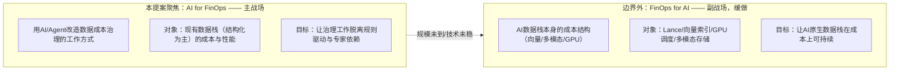
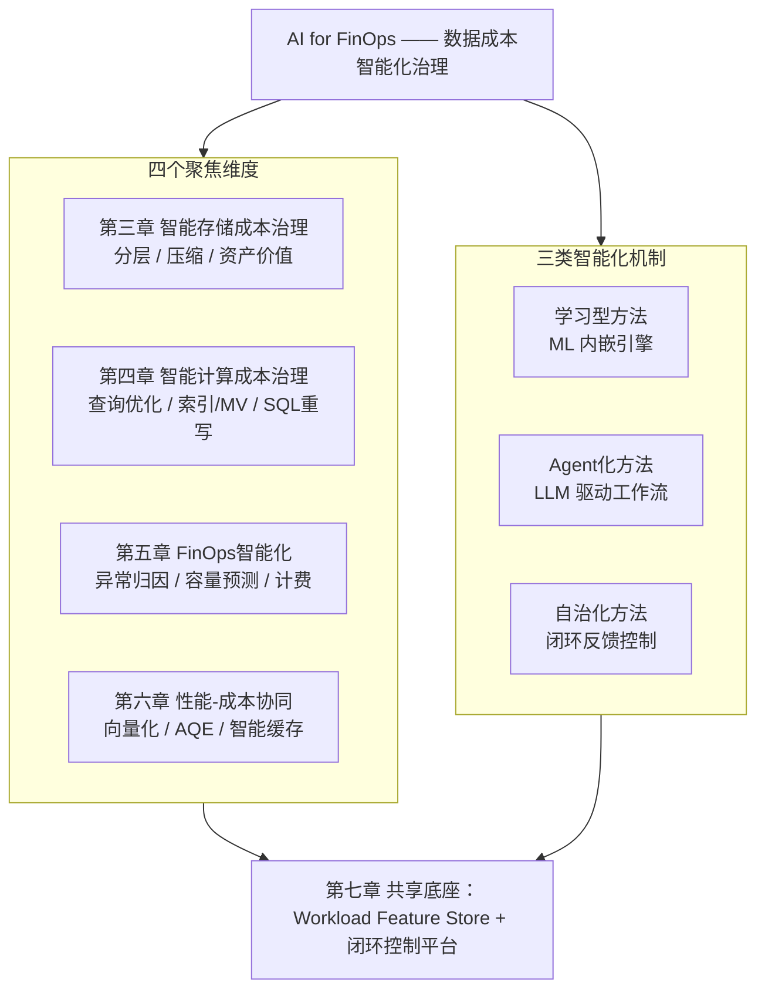
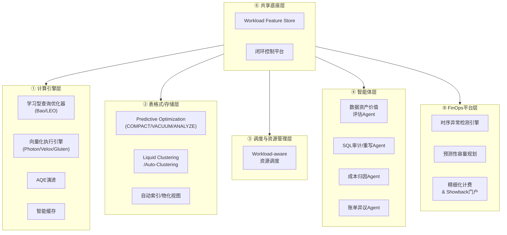
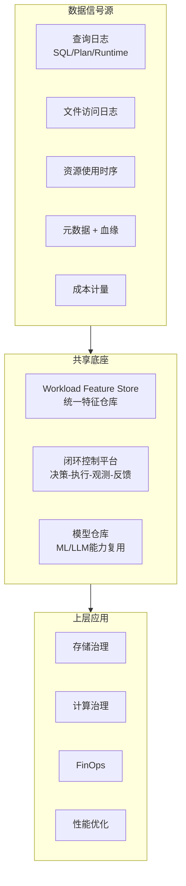
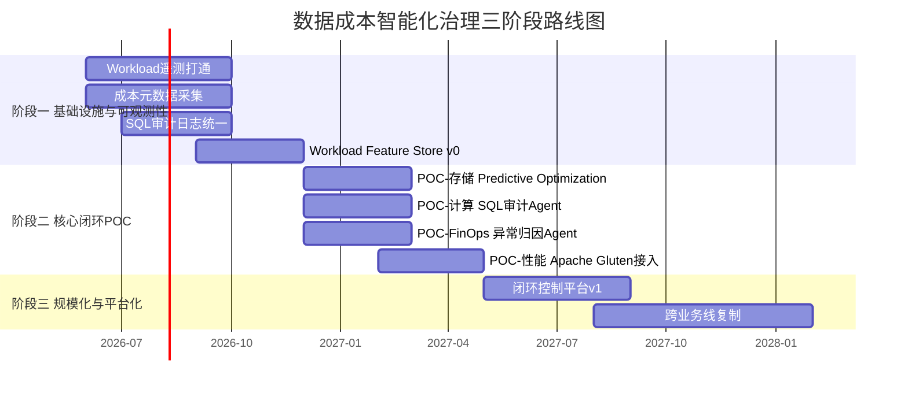

# AI时代数据成本智能化治理——前瞻技术提案V1.0

> **作者**：向春（架构师）
> **日期**：2026年5月
> **受众**：公司大数据技术委员会
> **调研基础**：延续24年9月《数据智能技术分析及规划策略》、25年7月《生成式AI驱动的数据治理范式变革洞察》、26年5月《从Data Agent商用元年到知识驱动的范式跃迁》三轮调研成果，并与同期完成的《AI时代的数据智能技术变革——深度调研》形成姊妹篇
> **定位**：从"成本治理与性能优化"这一独立角度切入数据治理智能化命题，给出1-2年可落地的前瞻技术储备建议、商用Reference与POC路线图

---

## 写在前面：这份提案要回答什么

前期的三轮调研与培训材料，主线一直是**Data for AI**（基础设施为AI而变）和**AI for Data**（工作方式为AI而变）。这两条线很重要，但它们不能直接回答大数据技术委员会面临的另一个迫切问题——

> **数据规模继续指数级膨胀、AI负载新增吃掉大量算力、治理人力却始终线性增长的局面下，我们的数据基础设施如何在不牺牲可用性的前提下持续降本增效？**

这份提案不重复多模态AI数据湖、Data Agent应用建设这两条已经被深度覆盖的赛道，而是**把同一个"AI驱动"的方法论投射到成本治理与性能优化这一独立的工程命题上**——研究问题是：

1. AI/Agent技术如何系统性地改造数据成本治理工作的范式？
2. 哪些前瞻技术已经达到1-2年可落地的商用门槛？依据是什么？
3. 这些技术的差异化竞争力来自哪里？我们的护城河是什么？
4. 在工程实践上应该按什么节奏推进？

提案严格遵循三条信息密度约束：
- 每一项前瞻技术必须同时给出 **Know-why（值不值得做）+ Know-how（核心机制）+ Reference（已有商用/学术案例）+ 适用性边界**
- 凡涉及量化收益必须**注明数据来源**，不杜撰
- 对每项技术给出**严格的边界条件**（什么场景适用、什么场景不适用），避免"银弹"叙事

---

## 目录

- [第一章：背景——AI时代数据成本治理的双重压力](#第一章背景ai时代数据成本治理的双重压力)
- [第二章：分析框架——双层结构与四维×三机制矩阵](#第二章分析框架双层结构与四维三机制矩阵)
  - [2.4 关键技术的实现层归属——"这些技术落在哪里"](#24-关键技术的实现层归属这些技术落在哪里)
- [第三章：维度一——智能存储成本治理](#第三章维度一智能存储成本治理)
- [第四章：维度二——智能计算成本治理](#第四章维度二智能计算成本治理)
- [第五章：维度三——FinOps智能化](#第五章维度三finops智能化)
- [第六章：维度四——性能-成本协同的智能化优化](#第六章维度四性能-成本协同的智能化优化)
- [第七章：协同效应与共享底座](#第七章协同效应与共享底座)
- [第八章：差异化竞争力分析](#第八章差异化竞争力分析)
- [第九章：推进节奏建议](#第九章推进节奏建议)
- [结语：成本竞争力 = AI竞争力](#结语成本竞争力--ai竞争力)
- [附录：参考资料汇总](#附录参考资料汇总)

---

## 第一章：背景——AI时代数据成本治理的双重压力

### 1.1 双重压力下的成本结构演变

AI时代数据基础设施的成本结构正在被**两股力量**同时拉变形——一股来自数据侧（数据"长得不一样了"），一股来自算力侧（算力"用得不一样了"）。这两股力量叠加，造成传统数据成本治理范式的失效。

**变形一：数据规模与构成的双重爆发**

| 数据类型 | AI时代之前 | AI时代之后 | 成本含义 |
|---------|-----------|-----------|---------|
| 结构化业务数据 | 主体；线性增长 | 仍为主体；增速大体不变 | 存储/计算成本基线 |
| 非结构化数据 | 几乎不被消费的"暗数据"；存着也用不上 | 第一次可被规模化利用，进入主消费链路 | 存储成本快速放大 |
| 向量/Embedding数据 | 不存在 | 模型迭代驱动反复重写；维度高、可压缩性差 | 全新的成本科目 |
| 模型/训练中间制品 | 不存在 | Checkpoint、特征文件、试错数据 | 占据可观存储 |

非结构化数据从"暗数据"转为"核心资产"是好事，但它带来的是**单位数据的存储/索引成本量级提升**——一张2MB的现场照片折算的存储费用可以等于一千条结构化记录；一个1536维Embedding的存储成本与索引开销在向量库场景中可以达到原始文本的数倍。

**变形二：算力结构的CPU↔GPU重构**

| 维度 | 传统批处理时代 | AI混合负载时代 |
|------|--------------|--------------|
| 计算单元 | CPU为绝对主体 | CPU/GPU/异构加速器并存 |
| 负载特征 | 批量为主、潮汐明显（夜间ETL高峰） | 批/流/推理三类负载交融，推理常驻 |
| 资源利用率 | 通过潮汐调度可达较高水平 | 三类负载难以错峰，静态资源池利用率持续下行 |
| 单位算力成本 | 摩尔定律持续下降 | 单价继续下降，但**总支出加速上升**（用量爆炸） |

GPU与AI推理的引入打破了传统批处理潮汐调度的前提——在线推理负载在白天高峰、批量ETL在夜间高峰、模型训练对GPU的尖峰需求随时插入，三类负载叠加后**总体资源水位长期偏低，但峰值需求仍然持续被刷新**。这是一种最坏的成本组合：**用量爬坡、利用率下行、采购计划失准**。

**变形三：治理"剪刀差"——资产指数增长 vs 治理人力线性增长**

| 时间 | 数据资产规模 | 治理人力 | 缺口 |
|------|-----------|---------|------|
| 五年前 | T1 | H1 | 单人覆盖 ~ T1/H1 |
| 现在 | T1 × ~10 | H1 × ~1.5（人力线性扩） | 单人覆盖恶化为 T1×10 / H1×1.5 ≈ 6.7倍 |
| 未来三年 | T1 × ~30（含多模态/向量） | H1 × ~2 | 单人覆盖恶化为 ~10倍 |

这个剪刀差意味着——**人均能管理的资产正在以每年20%-30%的速度恶化**。继续依靠扩编工程师团队来管理治理工作，在数学上不可持续。

### 1.2 传统成本治理范式的三重局限

面对上述压力，传统成本治理范式（以静态规则、报表驱动、专家经验为核心）的局限正在被放大：

| 局限 | 表现 | 为什么AI时代被放大 |
|------|------|----------------|
| **静态规则驱动** | 固定保留天数、固定分层阈值、固定压缩格式、固定分区策略 | 数据负载特征漂移加剧，"上线时配置正确，半年后配置过时"成为普遍现象 |
| **工具碎片化** | 监控、计量、归因、调优分属不同系统；跨格式（Iceberg/Hive/Parquet/向量库）的统一视图缺失 | AI数据栈引入新格式（Lance）、新引擎（Ray）后，工具碎片化指数级加剧 |
| **专家经验依赖** | 资深DBA/数据架构师的经验是优化的核心驱动；新人难以复制 | 数据资产复杂度突破任何单个专家的认知带宽；专家的判断成为整个组织的瓶颈 |

这三重局限叠加的实际表现是：成本数据每月生成一次报表，问题被发现时已滞后4-6周；归因到"某个项目"就停下来，无法下钻到"某个查询/某张表"；优化建议依赖DBA经验输出，输出速度跟不上业务变化速度。

### 1.3 范式拐点：成本治理从"规则驱动"到"智能驱动"

这是一个与[深度调研](AI时代的数据智能技术变革——深度调研.md)中"瓶颈翻转"论证**结构同构**的判断——只是把瓶颈从"知识"换成了"工作方式"，把约束变量从"模型/工具能力"换成了"成本治理范式"。

借用调研中的边际收益模型，把数据成本治理的有效性$E$表达为：

```
E = f(规则覆盖度, 工具完备度, 智能化程度)
```

| 阶段 | 主导约束 | 边际收益最高的投入方向 |
|------|--------|-------------------|
| 五年前 | 工具不完备 | 投资监控/计量/可视化基础设施 |
| 三年前 | 规则覆盖不全 | 补齐生命周期/分区/压缩规则 |
| **现在（AI时代）** | **静态规则的边际收益迅速衰减；智能化方法的边际收益陡升** | **投资学习型方法、Agent化方法、自治化方法** |

**这个判断的三个独立证据：**

| 证据 | 含义 |
|------|------|
| **头部厂商的规模化商用**：Databricks Predictive Optimization 2024年6月GA，至今2400+客户采用，累计自动VACUUM 130PB+、自动COMPACT 14PB+，官方宣称50%存储成本节省（来源：Databricks官方Blog与GA公告） | 这不是"前瞻设想"，而是**已被生产规模验证的范式** |
| **学术研究范式收敛**：从Bao（MIT, SIGMOD 2021）到LEO（Microsoft）到OtterTune（CMU），"learned + closed-loop"成为AI4DB主流方向，Bao已开源并被多个商业系统集成 | **学术-工程的迁移路径已经走通**，不存在"研究-落地"鸿沟 |
| **Snowflake/阿里/字节同步落子**：Snowflake Cortex AISQL（2025/6 PrPv，2025/11部分函数GA）、阿里DAS自治索引、字节DataLeap AI Agent均已商用上线 | 不只是单个厂商在做，而是**全行业头部玩家同步动作**——这是技术范式翻转最强的市场信号 |

**翻转的工程含义**——成本治理的投入排序需要根本性调整：

| 投入方向 | 五年前的边际收益 | 现在的边际收益 |
|---------|-------------|-------------|
| 完善规则覆盖 | 高 | **低**（规则空间已饱和，新增规则边际收益接近零） |
| 完善监控/可视化 | 高 | 中（基础设施已就绪，缺的是"基础设施之上做什么"） |
| **学习型/Agent化/自治化方法** | 低（彼时技术不可用） | **高**（技术达到商用门槛，且每多一份历史数据就多一份模型精度） |

这就是为什么这份提案的标题是"**智能化**治理"——不是"再加几条规则"，而是范式跃迁。

---

## 第二章：分析框架——双层结构与四维×三机制矩阵

### 2.1 双层结构定位：AI for FinOps vs FinOps for AI

借用调研报告中"Data for AI / AI for Data"的对仗结构，可以把"成本治理 + AI"这个命题清晰地拆为**双层**：



**为什么把"AI for FinOps"列为主战场，把"FinOps for AI"列为副战场？**

| 判断维度 | AI for FinOps（主） | FinOps for AI（副） |
|---------|------------------|------------------|
| 当下成本规模 | 主体（传统数据栈仍占95%+成本） | 增长中但占比仍小 |
| 技术成熟度 | 头部厂商已规模化商用（PO/Liquid Clustering/Photon） | 仍在快速演进，标准未稳（Lance v2.2刚GA） |
| 落地ROI | 高（直接作用于现有成本基线） | 中（场景规模仍在扩张） |
| 1-2年可商用性 | 强 | 部分技术尚需验证 |

**这个取舍与[深度调研第六章](AI时代的数据智能技术变革——深度调研.md)的"基于边际收益的投入优先级"原则完全一致**——把资源放在边际收益最高的方向上，AI原生栈本身的成本治理留待规模到达时再启动。

### 2.2 四维 × 三机制矩阵：本提案的论证骨架

把"AI for FinOps"主战场进一步拆解为**四个聚焦维度 × 三类智能化机制**的矩阵——这是后续四章的导航：



**三类机制的边界定义（避免概念模糊）：**

| 机制类型 | 核心特征 | 代表技术 | 信任边界 |
|---------|--------|---------|---------|
| **学习型方法** | ML/统计模型嵌入引擎内部，替代或辅助原有的启发式规则 | 学习型查询优化器（Bao）、神经基数估计、预测性Compaction | **可autonomous**——决策被引擎执行验证；模型出错时可fallback |
| **Agent化方法** | LLM驱动的工作流，引入自然语言交互、归因、建议 | SQL审计/重写Agent、成本归因Agent、数据资产价值评估Agent | **建议+人工审核**——回扣[深度调研](AI时代的数据智能技术变革——深度调研.md)L2/L3边界，autonomous仍不可靠 |
| **自治化方法** | 闭环反馈控制，"执行-观测-反馈-重训"的自我演化 | Databricks Predictive Optimization、Auto-Clustering、Auto-Indexing | **可autonomous**——但前提是闭环可观测、错误可回滚 |

这个分类的实际意义在于：**判断一项前瞻技术能不能autonomous部署，关键不在"用了多大的模型"，而在它属于哪一类机制**。Agent化方法在当前成熟度下普遍应保留人工审核环节。

### 2.3 商用就绪度评估

借用调研中"功能成熟度 × 生产就绪度"的双坐标，对四维 × 三机制矩阵中的关键交叉点做诚实评估：

| 交叉点 | 代表技术 | 功能成熟度 | 生产就绪度 | 1-2年可落地 |
|-------|--------|----------|----------|-----------|
| 存储 × 自治化 | Predictive Optimization | ★★★★★ | ★★★★☆ | **可** |
| 存储 × 自治化 | Liquid Clustering / Auto-Clustering | ★★★★★ | ★★★★☆ | **可** |
| 存储 × Agent化 | 数据资产价值评估Agent | ★★★☆☆ | ★★★☆☆ | **可（建议+人工审核模式）** |
| 计算 × 学习型 | Learned Query Optimizer | ★★★★☆ | ★★★☆☆ | **可（限定场景）** |
| 计算 × 自治化 | 自动索引/物化视图 | ★★★★★ | ★★★★☆ | **可** |
| 计算 × Agent化 | SQL审计/重写Agent | ★★★★☆ | ★★★☆☆ | **可（建议模式）** |
| FinOps × 学习型 | 异常检测/容量预测 | ★★★★☆ | ★★★★☆ | **可** |
| FinOps × Agent化 | 成本归因Agent | ★★★★☆ | ★★★☆☆ | **可（建议模式）** |
| 性能 × 学习型 | 向量化执行（Photon/Velox/Gluten） | ★★★★★ | ★★★★☆ | **可** |
| 性能 × 学习型 | AQE/智能缓存 | ★★★★★ | ★★★★★ | **已成熟** |

**总体判断**：四维各自都至少有2-3项前瞻技术达到"1-2年可落地"门槛，且头部厂商已经规模化商用——这意味着**现在不是"是否做"的问题，而是"按什么节奏做、从哪里切入"的问题**。

### 2.4 关键技术的实现层归属——"这些技术落在哪里"

前面的矩阵回答了"做什么"和"用哪类机制做"，但还没有回答一个工程落地必须回答的问题——**这些技术最终落在架构的哪一层？由谁来承载？**

这个问题的实际意义在于：不同实现层意味着不同的开发团队、不同的技术栈、不同的部署方式和不同的风险控制策略。把它厘清，是从"技术方案"走向"工程计划"的关键一步。

#### 2.4.1 实现层定义

本提案涉及的技术可归入**六个实现层**：

| 实现层 | 定义 | 典型技术栈 | 变更侵入性 |
|-------|------|----------|----------|
| **① 计算引擎层** | 嵌入到Spark/Presto/数据库引擎内部，作为引擎的原生能力运行 | C++/Java/Scala；修改引擎代码或通过Plugin/Extension机制注入 | **高**——需要深入理解引擎内核；但一旦落地，所有使用该引擎的workload自动受益 |
| **② 表格式/存储层** | 作用于Delta/Iceberg/Hudi等表格式的元数据管理和文件组织 | Delta Log协议、Iceberg Manifest、Parquet文件操作 | **中**——在表格式层操作，不修改引擎代码；但需要统一Catalog体系 |
| **③ 调度与资源管理层** | 作用于YARN/K8s/自研调度器的资源分配和作业调度 | Go/Java；K8s Operator/Scheduler Plugin/YARN扩展 | **中**——通过调度器扩展机制注入，不改变作业本身 |
| **④ 智能体层（Agent Layer）** | 独立部署的LLM驱动Agent服务，通过MCP/API与数据栈交互，不嵌入引擎内部 | Python；LLM推理框架 + MCP协议 + RAG + Skill库 | **低**——旁路部署，不入侵现有系统；但需要MCP连接器对接各数据源 |
| **⑤ FinOps平台层** | 独立的成本管理平台，采集、计量、展示、归因 | Web平台 + 时序数据库 + OLAP引擎 + 可视化 | **低**——作为独立平台叠加在现有栈之上 |
| **⑥ 共享底座层** | 跨维度共享的Workload Feature Store + 闭环控制平台 | 时序数据库 + 特征仓库 + ML平台 + 控制平面 | **中**——需要打通各层的遥测采集，是其他层的数据基础 |

#### 2.4.2 四维关键技术的实现层归属总览



#### 2.4.3 逐项归属详解

| 维度 | 关键技术 | 实现层 | 落地位置说明 | 与现有系统的关系 |
|------|---------|-------|------------|--------------|
| **存储** | Predictive Optimization | **② 表格式/存储层** | 落在Delta/Iceberg的表维护层——读取表格式元数据（Delta Log/Iceberg Manifest），做出COMPACT/VACUUM/ANALYZE决策，执行文件级操作。不需要修改计算引擎代码。 | 依赖统一Catalog（Unity Catalog / REST Catalog）；执行层可用Serverless Spark或专用维护服务 |
| **存储** | Liquid Clustering | **② 表格式/存储层** | 落在Delta/Iceberg的写入路径和OPTIMIZE路径——修改的是表格式的文件组织策略（从分区+Z-ORDER转为Hilbert曲线聚簇），不修改上层引擎的查询逻辑。 | 写入路径需要引擎配合（Spark Writer支持Clustering），但核心逻辑在表格式层 |
| **存储** | 数据资产价值评估Agent | **④ 智能体层** | 作为独立Agent服务部署，通过MCP连接Catalog、血缘、查询日志等数据源。Agent不嵌入任何引擎或存储系统内部，是"旁路观察+建议输出"的模式。 | 需要MCP Server对接现有Catalog/血缘/查询日志系统；LLM部署在内网GPU集群 |
| **计算** | 学习型查询优化器（Bao） | **① 计算引擎层** | 落在计算引擎的查询优化器内部——通过Hint注入机制影响CBO的Plan选择。需要在引擎侧集成模型推理（Tree-CNN）和反馈采集。 | 与PostgreSQL/Spark/Presto的优化器深度集成；需要引擎级开发能力 |
| **计算** | 自动索引/物化视图 | **② 表格式/存储层 + ① 计算引擎层** | 跨两层实现——候选挖掘和收益预测在外部服务（偏存储层），索引/MV的创建和使用在引擎层。淘汰监控在外部服务。 | 需要引擎支持自动MV命中（Query Rewrite）；候选推荐服务独立部署 |
| **计算** | SQL审计/重写Agent | **④ 智能体层** | 作为独立Agent服务部署。SQL采集→AST解析→LLM分析→改写生成→EXPLAIN验证全在Agent侧完成。不修改引擎代码，不入侵SQL执行链路。 | 需要接入查询日志（读取）和EXPLAIN接口（验证）；Agent独立于引擎运行 |
| **计算** | Workload-aware资源调度 | **③ 调度与资源管理层** | 落在YARN/K8s调度器层——通过Scheduler Plugin/Operator注入预测驱动的调度策略。不修改作业代码或引擎代码。 | 需要修改或扩展YARN/K8s调度器；作业侧需支持Checkpoint-Resume |
| **FinOps** | 成本异常检测与归因 | **⑤ FinOps平台层 + ④ 智能体层** | 双引擎架构——时序异常检测引擎落在FinOps平台层（独立的ML服务），归因Agent落在智能体层（LLM驱动，通过MCP下钻）。 | 需要FinOps平台接入成本计量数据；Agent需要MCP连接作业/SQL/血缘系统 |
| **FinOps** | 预测性容量规划 | **⑤ FinOps平台层** | 落在FinOps平台的规划模块——独立的预测服务，输入历史资源时序和业务事件，输出容量预测和采购建议。 | 需要接入资源监控数据（Prometheus/CloudWatch等）和业务事件日历 |
| **FinOps** | 精细化计费/Showback | **⑤ FinOps平台层 + ④ 智能体层** | 计量核心落在FinOps平台层（采集→归集→计量→展示）；账单异议Agent落在智能体层（LLM回答用户关于费用的自然语言提问）。 | 需要接入作业元数据（SparkListener等）和财务系统 |
| **性能** | 向量化执行（Photon/Velox/Gluten） | **① 计算引擎层** | 落在计算引擎的执行层——替换或增强JVM执行器为Native C++执行器。这是引擎最核心的改动。 | Gluten作为Spark Plugin接入；需要引擎级的集成和测试 |
| **性能** | AQE | **① 计算引擎层** | 落在计算引擎的运行时优化层——引擎在执行过程中根据runtime统计调整后续Plan。 | Spark AQE已内置；增强版需要引擎级开发 |
| **性能** | 智能缓存 | **① 计算引擎层** | 落在计算引擎的数据访问层——结果缓存和数据缓存在引擎侧管理。 | 可在引擎侧（Spark Disk Cache）或独立缓存层（Alluxio）实现 |

#### 2.4.4 按实现层的工程含义总结

| 实现层 | 包含技术数 | 核心工程挑战 | 所需团队能力 | 落地风险 |
|-------|----------|-----------|-----------|---------|
| **① 计算引擎层** | 5项（学习型优化器、向量化、AQE、智能缓存、自动索引部分） | 引擎内核改动，需要深度理解优化器/执行器/存储引擎的交互 | 引擎内核开发（C++/Scala）、ML工程 | **高**——改错影响全局；但收益也最大（全量workload自动受益） |
| **② 表格式/存储层** | 3项（Predictive Optimization、Liquid Clustering、自动索引部分） | 需要统一Catalog体系作为前提；文件级操作的正确性保障 | 数据平台开发、表格式协议理解 | **中**——依赖Catalog统一进度；但技术方案头部厂商已验证 |
| **③ 调度与资源管理层** | 1项（Workload-aware调度） | 调度器扩展的稳定性；多负载混部的隔离保障 | K8s/YARN调度器开发、时序预测 | **中**——调度器是关键基础设施，变更需谨慎 |
| **④ 智能体层** | 4项（资产评估Agent、SQL审计Agent、归因Agent、账单异议Agent） | LLM推理的准确性和延迟；MCP连接器的覆盖度；Skill库的积累 | LLM应用开发、Prompt工程、MCP协议 | **低**——旁路部署，不影响现有系统；但价值依赖MCP连接的数据源丰富度 |
| **⑤ FinOps平台层** | 3项（异常检测、容量预测、Showback） | 数据采集的完整性和准确性；与财务系统的对接 | 全栈开发、时序ML、前端可视化 | **低**——独立平台，不入侵现有系统；但对数据质量要求高 |
| **⑥ 共享底座层** | 2项（Feature Store、闭环控制平台） | 跨层遥测采集的统一性；特征Schema的设计 | 数据平台架构、ML平台 | **中**——是其他层的基础，需要优先建设 |

**关键洞察**——从实现层归属可以得出三个工程判断：

1. **智能体层是"最安全的起步点"**：4项Agent化技术全部在旁路部署，不入侵现有系统——这意味着可以**先做Agent，积累经验和数据，再做引擎层的深度改造**。
2. **计算引擎层是"收益最大但风险最高的投入"**：5项技术落在引擎内部，一旦落地全量workload自动受益；但引擎层改动需要深厚的内核能力且变更风险高——这类投入适合在阶段二/三展开。
3. **共享底座层是"必须先建的基础设施"**：无论从哪个维度切入，都需要Workload Feature Store提供遥测数据——这验证了第九章"阶段一先打基础"的路线判断。

---

## 第三章：维度一——智能存储成本治理

### 3.1 痛点拆解

存储成本看似"单价低"，但在数据规模爆发的背景下，**总存储支出的增速通常是单价下降速度的3-5倍**。规则驱动的存储治理在AI时代失效的具体表现是：

| 痛点 | 表现 | 规则驱动失效的原因 |
|------|------|----------------|
| **冷热失衡** | 大量冷数据停留在热存储；个别热数据被错误降冷 | 访问模式频繁漂移，固定阈值跟不上 |
| **压缩策略固化** | 全表统一一种压缩格式（如snappy） | 不同分区、不同列、不同workload的最优压缩格式不同 |
| **小文件膨胀** | 流写/Spark分区写产生大量小文件，metadata膨胀，扫描成本剧增 | 合并时机靠定时任务，要么过频（开销）要么过疏（积累） |
| **数据布局衰退** | 一次性Z-ORDER/分区设计随业务变化失效 | 重排成本高，难以增量调整 |
| **跨表数据冗余** | 多个业务线建相似宽表，相同事实数据被多次落地 | 跨表的语义比对超出规则覆盖能力 |

### 3.2 前瞻技术1：Predictive Optimization——数据生命周期智能化

**Know-why——为什么从规则驱动迁移到学习型预测**

数据生命周期治理的核心动作有三类：**OPTIMIZE（小文件合并/聚簇）、VACUUM（清理过期版本）、ANALYZE（统计信息更新）**。这三类动作的执行时机与执行强度都在求解一个问题——"什么时候做、做多深，使长期总成本（执行成本 + 后续查询成本）最低"。

规则驱动方案（"每天凌晨2点合并所有分区"）的本质是**忽略了"每张表、每个分区、每种workload"的差异化最优解**。学习型方案则把决策建模为：

```
最优执行时机 = argmin_t [ E(执行成本 | t) + ∫ E(后续查询成本 | t, τ) dτ ]
```

把每张表/每个分区作为一个"个体"，用ML模型学习它的特征到最优时机的映射，**这就是Predictive Optimization的数学本质**。

**Know-how——核心机制**

| 组件 | 实现 |
|------|------|
| 特征工程 | 表/分区的访问频率、查询模式（点查/扫描/聚合）、文件大小分布、版本演化速度、列基数等 |
| 预测模型 | 通常采用GBDT/XGBoost类树模型（特征解释性好、训练快、对标签噪声鲁棒），或针对特定动作的专用回归模型 |
| 调度执行 | 模型输出"下一次执行的时机与强度"，调度系统按serverless/弹性方式触发实际操作 |
| 反馈闭环 | 每次执行的"成本-收益"被纳入训练集，模型按周/月重训 |
| 安全护栏 | 对决策施加上下界（不会过频也不会过疏）、回滚机制（执行后效果不达预期则降级到规则） |

**具体功能清单**

Predictive Optimization 不是单一能力，而是围绕数据生命周期的**一组可独立启停的自治化功能模块**：

| 功能模块 | 具体能力 | 输入 | 输出 | 自治等级 |
|---------|--------|------|------|---------|
| **智能COMPACT** | 自动识别小文件膨胀分区，在最优时机触发合并；合并粒度自适应（不是"合成一个大文件"而是合到最优文件大小） | 文件大小分布、写入速率、查询扫描频率 | 合并任务（目标文件数/大小/时间窗口） | 全自治 |
| **智能VACUUM** | 自动识别过期版本文件（Delta/Iceberg的历史快照），在不影响Time Travel的前提下清理 | 版本保留策略、快照引用关系、合规保留需求 | 清理任务（待删文件列表、执行时间窗口） | 全自治 |
| **智能ANALYZE** | 自动识别统计信息过期的表/分区，触发统计信息更新；更新深度自适应（全量/增量/采样） | 数据变更量、统计信息新鲜度、下游查询对统计精度的敏感性 | 统计更新任务（目标表/分区、采样比例） | 全自治 |
| **冷热分层建议** | 基于访问模式预测数据的冷热趋势，建议分层迁移（热→温→冷） | 访问频率时序、查询类型、业务SLA | 分层迁移建议（候选分区、目标层级、预估节省） | 建议+人工确认 |
| **压缩格式推荐** | 对不同列/分区推荐最优压缩编码（如Zstd vs LZ4 vs Dictionary Encoding） | 列基数、数据类型、读写比、查询模式 | 压缩格式建议（列级推荐、预估压缩比变化） | 建议+人工确认 |

**核心流程详解**

Predictive Optimization 的端到端流程可拆解为五个阶段，形成完整的闭环：

```
┌──────────────────────────────────────────────────────────────────────────────┐
│                    Predictive Optimization 核心流程                           │
│                                                                              │
│  ┌─────────┐    ┌──────────┐    ┌──────────┐    ┌──────────┐    ┌─────────┐ │
│  │ 阶段一   │───→│ 阶段二    │───→│ 阶段三    │───→│ 阶段四    │───→│ 阶段五  │ │
│  │ 遥测采集 │    │ 特征工程  │    │ 预测决策  │    │ 调度执行  │    │ 反馈闭环 │ │
│  └─────────┘    └──────────┘    └──────────┘    └──────────┘    └─────────┘ │
│       │                                                              │       │
│       └──────────────────────────────────────────────────────────────┘       │
│                              持续校准循环                                     │
└──────────────────────────────────────────────────────────────────────────────┘
```

**阶段一：遥测采集（Telemetry Collection）**

| 采集项 | 数据源 | 采集频率 | 存储位置 |
|-------|-------|---------|---------|
| 文件级元数据 | Catalog（Delta Log / Iceberg Manifest） | 每次Commit | Workload Feature Store |
| 文件大小分布 | 存储层统计 | 每小时 | Workload Feature Store |
| 分区级访问计数 | 查询引擎埋点（Spark/Presto的File Scan统计） | 每次查询 | Workload Feature Store |
| 查询模式标签 | SQL解析器（点查/范围扫描/全扫描/聚合） | 每次查询 | Workload Feature Store |
| 版本演化速率 | Delta Log / Iceberg Snapshot历史 | 每次Commit | Workload Feature Store |
| 列级统计信息新鲜度 | ANALYZE历史 + 数据变更量对比 | 每小时 | Workload Feature Store |

**阶段二：特征工程（Feature Engineering）**

从原始遥测数据中提取预测模型所需的结构化特征向量：

| 特征类别 | 特征示例 | 计算方式 |
|---------|--------|---------|
| **文件健康度特征** | 小文件比例、平均文件大小、文件大小方差、最大/最小文件大小比 | 基于文件元数据直接计算 |
| **访问模式特征** | 7天/30天访问频率、访问频率趋势（上升/平稳/下降）、最近一次访问距今天数、访问模式周期性强度 | 时序统计 + FFT周期检测 |
| **查询结构特征** | 点查占比、范围扫描占比、全扫描占比、平均扫描行数/文件数、Join参与频率 | 查询日志聚合 |
| **数据演化特征** | 日均新增行数、日均新增文件数、更新/删除比例、Schema变更频率 | Delta Log / Iceberg Snapshot差分 |
| **统计信息特征** | 统计信息年龄、统计信息覆盖率（有统计的列占比）、数据变更量与统计更新量的比值 | 元数据对比 |
| **上下文特征** | 表大小等级（MB/GB/TB/PB）、分区键类型（时间/ID/枚举）、表类型（事实表/维度表/日志表） | 元数据标注 |

**阶段三：预测决策（Prediction & Decision）**

核心预测模型的数学建模——对每张表 \(T\) 的每种操作 \(op \in \{COMPACT, VACUUM, ANALYZE\}\)，模型求解：

\[
t^*_{T,op} = \arg\min_{t} \left[ C_{exec}(T, op, t) + \int_{t}^{t+\Delta} C_{query}(T, \tau \mid \neg op_t) \, d\tau \right]
\]

其中：
- \(C_{exec}(T, op, t)\) = 在时刻 \(t\) 对表 \(T\) 执行操作 \(op\) 的直接成本（CPU·秒 + IO字节数）
- \(C_{query}(T, \tau \mid \neg op_t)\) = 若不在 \(t\) 时刻执行 \(op\)，在后续时间 \(\tau\) 的查询额外成本（因小文件/过期统计导致的性能退化）
- \(\Delta\) = 预测窗口（通常7-30天）

实际工程中，模型输出为：

| 模型输出 | 含义 | 典型值 |
|---------|------|-------|
| **执行紧迫度得分** | 0-1之间的得分，越高表示越应立即执行 | >0.8 触发执行 |
| **推荐执行时间窗口** | 建议在低负载时段执行 | "02:00-06:00 UTC" |
| **推荐执行强度** | 对COMPACT：合并到多大的目标文件；对VACUUM：保留多少历史版本 | "目标文件大小256MB，保留7天历史" |
| **预期收益** | 执行后预计节省的存储/查询成本 | "预计节省存储12GB，查询延迟降低35%" |

**阶段四：调度执行（Scheduling & Execution）**

| 调度策略 | 实现机制 |
|---------|--------|
| **优先级队列** | 按紧迫度得分排序；高优先级任务优先获得执行资源 |
| **资源隔离** | 治理任务使用独立的资源池（或Serverless弹性资源），避免与业务查询争抢 |
| **并发控制** | 同一表的COMPACT/VACUUM/ANALYZE互斥执行；不同表可并行 |
| **增量执行** | 每次只处理变化量最大的分区/文件，避免全量重写 |
| **超时熔断** | 单次执行超过设定阈值（如2小时）自动中止，标记为"需人工介入" |

**阶段五：反馈闭环（Feedback Loop）**

每次执行完成后自动采集反馈信号：

| 反馈指标 | 采集方式 | 用途 |
|---------|---------|------|
| 实际执行成本（CPU·秒、IO字节数） | 执行引擎统计 | 校准 \(C_{exec}\) 估计 |
| 执行前后查询延迟变化（p50/p99） | A/B对比 | 校准 \(C_{query}\) 估计 |
| 执行前后存储占用变化 | 存储层统计 | 量化存储收益 |
| 执行前后文件大小分布变化 | Catalog统计 | 验证COMPACT效果 |

反馈数据按周/月回流到训练集，模型持续重训。**这是"越用越准"飞轮的核心——没有反馈闭环的预测模型不是Predictive Optimization，只是一个Schedule Job。**

**关键技术支撑**

| 关键技术 | 为什么选择 | 如何支撑 |
|---------|----------|---------|
| **GBDT/XGBoost** | 表格特征场景下精度最高、可解释性好、训练快、对标签噪声鲁棒 | 作为核心预测模型，输入特征向量→输出紧迫度得分和执行参数 |
| **Delta Log / Iceberg Manifest** | 提供文件级、版本级的完整变更历史，无需额外埋点 | 作为遥测数据的核心来源，零侵入地获取文件演化信息 |
| **Serverless弹性计算** | 治理任务的计算量波动大（有的表需要合并100GB，有的只需1MB） | 按需分配执行资源，避免预留固定资源池的浪费 |
| **FFT/STL时序分解** | 访问模式具有强周期性（日/周/月），需要提取周期特征 | 用于构造"周期性强度""趋势方向"等特征，提升预测精度 |
| **Thompson Sampling** | 在"是否执行"的决策中平衡探索（尝试新策略）与利用（沿用已知好策略） | 避免模型陷入局部最优，持续发现更好的执行策略 |
| **Copy-on-Write / Merge-on-Read** | Delta/Iceberg的文件写入模式决定了COMPACT/VACUUM的具体实现方式 | COMPACT本质是COW重写+元数据原子替换；VACUUM是文件物理删除+元数据清理 |

**Reference——已有商用案例**

| 厂商/产品 | 状态 | 关键数据 |
|---------|------|--------|
| **Databricks Predictive Optimization** | **2024年6月GA**（Unity Catalog Managed Tables） | 2400+客户采用；累计自动VACUUM 130PB+、自动COMPACT 14PB+；官方宣称50%存储成本节省、2x平均查询性能提升、20x尾延迟降低、68%大表扫描提升（来源：Databricks官方Blog） |
| **Snowflake Auto-Clustering / Search Optimization** | 已GA多年 | 商用稳定，数据规模与商业价值已被市场验证 |
| **AWS S3 Intelligent-Tiering** | 已GA | 朴素版的自治化分层（仅基于访问模式），可作为"AI for FinOps"在云对象存储层的最低门槛基线 |

**适用边界**

- ✅ **适用**：托管表/Catalog体系下的Iceberg、Delta、Hudi等开放格式
- ✅ **适用**：访问日志、查询日志可观测的场景
- ⚠️ **谨慎**：纯Hive Catalog + 自建文件管理的场景，需要先补齐遥测基础
- ❌ **不适用**：完全离线、无访问日志、无统一Catalog的遗留系统

### 3.3 前瞻技术2：自适应数据布局（Liquid Clustering / Auto-Clustering）

**Know-why——为什么传统Z-ORDER在AI时代不够用**

传统的数据布局优化（分区、Z-ORDER）有三个根本局限：

| 局限 | 含义 |
|------|------|
| **非增量** | Z-ORDER需要对全数据重写，每次OPTIMIZE是O(数据量)级别的开销 |
| **键固定** | 一旦选定Z-ORDER键，业务变化后无法平滑调整，只能重做 |
| **局部最优** | 文件级Z-ORDER不保证全局最优，分布偏斜场景下退化严重 |

这三个局限叠加，造成"建得动但维护不动"——大表的Z-ORDER维护成本可能超过它带来的查询收益。

**Know-how——Liquid Clustering的设计选择**

| 设计点 | 实现 |
|------|------|
| **增量重组** | 写入时即按聚簇键放置；不需要全量重写 |
| **键可变更** | 聚簇键可以在不重写历史数据的情况下重新定义，让数据布局跟随业务演化 |
| **全局优化** | 不再是"每个文件内部Z-ORDER"，而是跨文件的全局聚簇 |
| **与Predictive Optimization集成** | 自治化触发，不需要人工OPTIMIZE |

**具体功能清单**

| 功能模块 | 具体能力 | 与传统方案的对比 |
|---------|--------|--------------|
| **写入时聚簇（Write-time Clustering）** | 数据在写入路径上即完成聚簇排序，新文件写入时自动放到聚簇键值接近的文件组中 | Z-ORDER是写后重排（post-write rewrite），开销巨大；Liquid Clustering是写时排列（write-time placement），增量成本极低 |
| **增量重聚簇（Incremental Re-clustering）** | 仅对新增/变更的数据做局部重聚簇，不触碰未变化的文件 | Z-ORDER每次OPTIMIZE需要扫描和重写全分区数据；增量重聚簇只处理增量 |
| **聚簇键在线变更（Live Key Change）** | ALTER TABLE ... CLUSTER BY (new_key) 后，新写入数据按新键排列，历史数据在后续OPTIMIZE中逐步迁移 | 传统分区键/Z-ORDER键变更需要全量重写和schema迁移 |
| **多键联合聚簇** | 支持多个聚簇键的联合排序，使用Hilbert曲线（而非Z曲线）提供更均匀的多维排序 | Z-ORDER的多维排序在维度>3时退化严重；Hilbert曲线的局部性更好 |
| **自动文件大小调节** | 根据表的访问模式和数据量自动决定目标文件大小（不固定128MB/256MB） | 传统方案使用固定文件大小，对不同workload不适配 |
| **与Data Skipping深度集成** | 聚簇后文件的min/max统计信息更精确，Data Skipping命中率显著提升 | Z-ORDER的局部排序使得跨文件的min/max范围重叠度高，Data Skipping效果打折 |

**核心流程详解**

Liquid Clustering 的完整生命周期包含三个核心流程：

```
┌─────────────────────────────────────────────────────────────────────┐
│                  Liquid Clustering 核心流程                          │
│                                                                     │
│  流程一：写入路径聚簇                                                 │
│  ┌──────────┐    ┌───────────┐    ┌───────────┐    ┌────────────┐  │
│  │ 数据写入   │───→│ 聚簇键提取 │───→│ 分桶路由   │───→│ 文件写入    │  │
│  │ (INSERT/  │    │ (extract  │    │ (bucket   │    │ (write to  │  │
│  │  MERGE)   │    │  key vals)│    │  routing) │    │  target)   │  │
│  └──────────┘    └───────────┘    └───────────┘    └────────────┘  │
│                                                                     │
│  流程二：增量重聚簇（由Predictive Optimization触发）                    │
│  ┌──────────┐    ┌───────────┐    ┌───────────┐    ┌────────────┐  │
│  │ 选择候选   │───→│ 读取文件   │───→│ Hilbert   │───→│ 写入新文件  │  │
│  │ 文件组     │    │ 合并排序   │    │ 曲线重排   │    │ 原子替换    │  │
│  └──────────┘    └───────────┘    └───────────┘    └────────────┘  │
│                                                                     │
│  流程三：聚簇键变更                                                   │
│  ┌──────────┐    ┌───────────┐    ┌───────────┐    ┌────────────┐  │
│  │ ALTER KEY │───→│ 元数据更新  │───→│ 新数据按   │───→│ 历史数据    │  │
│  │ 命令      │    │ (立即完成) │    │ 新键写入   │    │ 渐进迁移    │  │
│  └──────────┘    └───────────┘    └───────────┘    └────────────┘  │
└─────────────────────────────────────────────────────────────────────┘
```

**流程一：写入路径聚簇**

| 步骤 | 具体实现 | 性能开销 |
|------|---------|---------|
| 1. 聚簇键值提取 | 从写入行中提取聚簇键列的值 | 极低（列投影） |
| 2. 分桶路由 | 基于聚簇键值计算Hilbert编码，确定目标文件桶 | 极低（数值计算） |
| 3. 桶内排序 | 同一桶内按Hilbert编码排序后写入Parquet文件 | 中等（排序开销，但仅限桶内） |
| 4. 元数据更新 | 更新Delta Log / Iceberg Manifest，记录新文件的聚簇信息和min/max统计 | 极低 |

**流程二：增量重聚簇**

| 步骤 | 具体实现 | 触发条件 |
|------|---------|---------|
| 1. 候选文件选择 | 选择聚簇质量低的文件组——即同一聚簇键范围跨越多个文件（min/max重叠度高） | Predictive Optimization模型判断重聚簇收益>成本 |
| 2. 文件读取与合并 | 读取候选文件组，按聚簇键做多路归并排序 | — |
| 3. Hilbert曲线重排 | 多维聚簇键映射为一维Hilbert编码，按编码排序 | — |
| 4. 写入与原子替换 | 写入新文件，通过事务提交原子替换旧文件引用 | — |

**流程三：聚簇键变更**

| 步骤 | 具体实现 | 对业务的影响 |
|------|---------|-----------|
| 1. 元数据即时更新 | ALTER TABLE仅修改Catalog中的聚簇键定义，不触碰数据文件 | 零停机、零延迟 |
| 2. 新数据按新键写入 | 变更后的所有新写入按新聚簇键排列 | 新数据立即受益 |
| 3. 历史数据渐进迁移 | 后续的OPTIMIZE操作会逐步将历史文件按新键重排 | 无需一次性重写全量数据；迁移节奏由Predictive Optimization控制 |

**关键技术支撑**

| 关键技术 | 为什么选择 | 如何支撑 |
|---------|----------|---------|
| **Hilbert空间填充曲线** | 相比Z曲线，Hilbert曲线在高维空间中的局部性更好——相邻的Hilbert编码对应的多维空间点确实彼此接近，不存在Z曲线的"跳跃"问题 | 作为多键联合聚簇的排序基础，确保聚簇后文件的Data Skipping效果最优 |
| **Delta Log事务协议** | 保证文件替换的原子性——"读旧文件→排序→写新文件→替换引用"在一个事务中完成 | 保障增量重聚簇和键变更的数据一致性；失败时自动回滚 |
| **Parquet列式格式** | 列式存储天然支持列级min/max统计，与Data Skipping深度配合 | 聚簇后的Parquet文件具有更紧凑的min/max范围，使Data Skipping从"跳过10%"提升到"跳过80%+" |
| **写入时分桶（Write-time Bucketing）** | 在Spark/Photon的Shuffle阶段即完成聚簇分桶，避免写后重排 | 将聚簇成本从O(全量)降低到O(增量)，使写入路径的额外开销控制在5-15% |
| **Predictive Optimization集成** | 自动判断何时触发增量重聚簇，避免过频（浪费）或过疏（退化） | 闭环控制重聚簇频率，使布局质量始终维持在最优区间 |

**Reference**

| 厂商/产品 | 状态 | 关键数据 |
|---------|------|--------|
| **Databricks Liquid Clustering** | **2024 GA**（DBR 15.2+） | 1000+客户已采用；累计写入100PB+、读出20EB+；vs 传统分区+Z-ORDER实现2-12x查询加速（来源：Databricks官方Blog） |
| **Snowflake Auto-Clustering** | 已GA | 自治化触发，无需手动OPTIMIZE |
| **Apache Iceberg社区** | 提案/演进中 | 类Liquid Clustering的开源化方向，开放格式生态正在跟进 |

**适用边界**

- ✅ **适用**：高频写入 + 多列查询过滤的大表（如事实表、行为日志表、特征表）
- ⚠️ **谨慎**：纯追加 + 单一时间维度查询的简单场景，传统分区可能仍然更直观
- ❌ **不适用**：尚未支持Liquid Clustering的开源格式版本（需关注Iceberg社区演进）

### 3.4 前瞻技术3：数据资产价值评估Agent——治理工作的Agent化

**Know-why——为什么这是Agent化方法（而非学习型方法）**

"哪些数据可以归档/降冷/删除"这一判断需要综合：
- 技术信号（访问频率、最后访问时间、文件大小）
- 元数据（Owner、业务域、敏感级别）
- 血缘（被多少下游消费、是否在审计/合规链路中）
- **业务知识**（这张表对应什么业务场景，对应客户/合规要求是什么）

前三类是结构化的，传统ML可以处理；**第四类是非结构化的业务知识，必须靠LLM理解**。这就是为什么这是Agent化方法——它的核心价值不是"决策更准"，而是"能把第四类信号纳入决策"。

**Know-how——核心架构**

```
查询日志 + 元数据 + 血缘 + 业务术语表
                    │
                    ▼
        ┌─────────────────────────┐
        │  数据资产价值评估Agent   │
        │  - 检索：MCP连接到Catalog│
        │  - 推理：LLM做综合判断   │
        │  - 输出：归档/降冷/删除建议│
        └─────────────────────────┘
                    │
                    ▼
            人工审核 → 执行/否决
                    │
                    ▼
         反馈进入Agent的Skill库
```

**具体功能清单**

| 功能模块 | 具体能力 | 输入 | 输出 | 自治等级 |
|---------|--------|------|------|---------|
| **资产活跃度评估** | 综合技术信号（访问频率、最后访问时间、查询类型分布）生成每张表/分区的活跃度得分 | 查询日志、文件访问日志 | 活跃度得分（0-100）+ 活跃度趋势（上升/平稳/下降） | 全自动计算 |
| **业务价值标注** | LLM理解表的业务语义（表名、列注释、业务术语映射），判断其业务价值等级 | 元数据、业务术语表、数据字典 | 业务价值等级（核心/重要/一般/低价值）+ 置信度 | Agent建议+人工审核 |
| **下游影响分析** | 沿血缘图分析一张表被归档/删除后影响多少下游表、报表、模型 | 血缘图、Catalog依赖关系 | 影响范围报告（受影响下游数、影响传播路径、最终受影响业务） | 全自动分析 |
| **合规约束检查** | 检查表是否在合规保留范围内（如审计数据7年保留、GDPR约束） | 合规策略库、数据分类标签 | 合规状态（受保护/不受约束）+ 最早可操作日期 | 全自动检查 |
| **综合治理建议** | 综合上述四项信号，生成归档/降冷/删除/保留建议，附理由说明 | 上述四项评估结果 | 治理动作建议 + 自然语言理由 + 预估成本节省 | Agent建议+人工审核 |
| **批量治理排序** | 对全域资产按"治理收益/治理风险"排序，优先推荐高收益低风险的对象 | 全域资产评估结果 | 优先治理清单（Top-N）+ 累计节省估算 | Agent建议+人工审核 |

**核心流程详解**

数据资产价值评估Agent的端到端工作流：

```
┌──────────────────────────────────────────────────────────────────────────────┐
│              数据资产价值评估Agent 核心流程                                     │
│                                                                              │
│  ┌────────┐   ┌────────┐   ┌──────────┐   ┌─────────┐   ┌────────┐         │
│  │ 资产发现 │──→│ 信号采集 │──→│ 多维评估  │──→│ 建议生成 │──→│ 人工审核 │         │
│  └────────┘   └────────┘   └──────────┘   └─────────┘   └────────┘         │
│                                                               │              │
│                                                               ▼              │
│                                                         ┌──────────┐        │
│                                                         │ 反馈学习  │        │
│                                                         └──────────┘        │
└──────────────────────────────────────────────────────────────────────────────┘
```

**步骤一：资产发现（Asset Discovery）**

| 子步骤 | 实现 | 数据来源 |
|-------|------|---------|
| 扫描Catalog获取全部注册表/视图/外部表 | 通过MCP协议连接到Unity Catalog / Hive Metastore / REST Catalog | Catalog API |
| 识别"暗资产"——有存储占用但无Catalog注册的孤儿文件 | 存储层扫描（HDFS/S3路径遍历）与Catalog注册列表做差集 | 存储层 + Catalog |
| 构建资产清单，标注基础属性 | 表名、大小、行数、分区数、创建时间、最后修改时间、Owner | Catalog元数据 |

**步骤二：信号采集（Signal Collection）**

Agent通过MCP Tool调用从多个系统采集四类信号：

| 信号类型 | 具体采集项 | 采集工具 |
|---------|----------|---------|
| **技术信号** | 30/90/180天访问次数、最后访问时间、查询类型分布（读/写/DDL）、平均扫描数据量 | 查询日志MCP Tool |
| **元数据信号** | 表注释、列注释、Owner信息、所属业务域标签、敏感级别标签、创建者 | Catalog MCP Tool |
| **血缘信号** | 上游依赖表数、下游消费表数、下游报表/模型数、血缘链路深度、是否在审计链路中 | 血缘图MCP Tool |
| **业务知识信号** | 业务术语表中的匹配项、业务上下文文档（如需求PRD、数据字典） | 知识库MCP Tool |

**步骤三：多维评估（Multi-dimensional Assessment）**

Agent通过LLM对四类信号做综合推理：

| 评估维度 | 评估方法 | 输出 |
|---------|--------|------|
| **活跃度维度** | 基于技术信号的规则计算（无需LLM）：加权访问频率 + 趋势衰减因子 | 活跃度得分（0-100） |
| **业务价值维度** | LLM推理：将表名、列注释、业务术语匹配结果、Owner信息作为上下文，Prompt引导LLM判断业务价值等级 | 价值等级 + 置信度 + 推理链 |
| **影响范围维度** | 基于血缘信号的图遍历：BFS计算影响传播深度和广度 | 影响度得分 + 影响路径 |
| **合规约束维度** | 基于合规策略库的规则匹配：数据分类标签 × 保留策略矩阵 | 合规状态 + 最早可操作日期 |

LLM推理的Prompt结构示例：

```
你是一个数据资产价值评估专家。请根据以下信息判断该数据资产的业务价值等级。

## 资产信息
- 表名：ods_order_detail_di
- 列：order_id, user_id, product_id, amount, create_time, update_time
- 表注释："订单明细日增量表"
- Owner：数据仓库团队-张三
- 业务域标签：交易域
- 业务术语匹配：[订单, 交易, 商品]

## 访问信息
- 过去30天访问次数：0次
- 过去90天访问次数：3次
- 最后访问时间：62天前
- 下游消费者：2张DWD层表、1个BI报表

## 判断要求
1. 给出业务价值等级：核心 / 重要 / 一般 / 低价值
2. 给出置信度（0-1）
3. 给出推理链（为什么这样判断）
4. 如果置信度<0.7，指出需要额外确认的信息
```

**步骤四：建议生成（Recommendation Generation）**

Agent将四维评估结果综合为治理建议：

| 决策矩阵 | 活跃度高 | 活跃度低 |
|---------|---------|---------|
| **业务价值高 + 无合规约束** | 保留，优化存储格式 | 保留，但标记为"待确认业务状态" |
| **业务价值高 + 有合规约束** | 保留，维持合规保留 | 保留至合规期满 |
| **业务价值低 + 无合规约束** | 保留（可能即将重新活跃）| **归档/降冷候选**（优先推荐） |
| **业务价值低 + 有合规约束** | 保留至合规期满 | 降冷至最低成本层 |

Agent输出格式：

```json
{
  "table": "ods_order_detail_di",
  "recommendation": "归档至冷存储",
  "confidence": 0.82,
  "reasoning": "该表为订单明细日增量表，过去90天仅被访问3次且呈下降趋势；下游2张DWD表最近也未活跃；无合规保留约束。建议归档至冷存储。",
  "estimated_saving_gb": 1240,
  "estimated_saving_monthly_cny": 186,
  "risk_factors": ["下游BI报表rpt_order_trend可能受影响，需确认是否仍在使用"],
  "requires_confirmation": ["请与数据仓库团队-张三确认该表是否有季度性使用需求"]
}
```

**步骤五：人工审核与反馈学习**

| 审核动作 | 反馈学习 |
|---------|---------|
| **接受建议** | 记录"(资产特征, 建议, 接受)"到Skill库；增强Agent在相似资产上的置信度 |
| **拒绝建议（附理由）** | 记录"(资产特征, 建议, 拒绝, 拒绝理由)"；LLM在后续推理时将拒绝案例作为Few-shot示例 |
| **修改建议** | 记录"(资产特征, 原始建议, 修改后建议)"；用于校准Agent的决策边界 |

**关键技术支撑**

| 关键技术 | 为什么选择 | 如何支撑 |
|---------|----------|---------|
| **MCP（Model Context Protocol）** | Agent需要访问多个异构数据源（Catalog、血缘、查询日志、知识库），MCP提供统一的Tool调用协议 | 避免为每个数据源写定制化连接器；新增数据源只需注册MCP Server |
| **本地部署LLM（Qwen/DeepSeek/Llama系）** | 元数据和SQL文本属于敏感信息，不能外传到公有云LLM | 在公司内部GPU集群部署开源LLM，所有推理在内网完成 |
| **RAG（检索增强生成）** | Agent需要理解业务术语表和数据字典中的领域知识 | 业务术语表向量化后存入向量库，Agent推理时检索相关术语作为上下文 |
| **血缘图数据库（Neo4j/JanusGraph）** | 下游影响分析需要高效的图遍历（BFS/DFS） | 提供毫秒级的多跳血缘查询能力 |
| **Skill库（结构化记忆）** | Agent需要从人工审核反馈中持续学习 | 接受/拒绝案例作为Few-shot示例注入Prompt，使Agent决策越来越贴近组织偏好 |
| **置信度校准（Calibration）** | LLM的自报置信度通常不准确（过度自信） | 用历史审核数据校准置信度，确保"报0.8置信度"的建议确实有~80%被接受 |

**严格边界——回扣L2/L3的判断**

借用[深度调研](AI时代的数据智能技术变革——深度调研.md)对Data Agent自治分级的分析，**数据资产价值评估Agent当前应严格停留在L2（建议+人工审核）**——不能autonomous删除生产数据。原因是：

> Agent对"这张表能不能删"的判断属于层面三业务知识范畴，当前知识完备度下端到端可靠性约48.8%（来自调研中的乘法公式估算）。在数据删除这种**不可逆**操作上，48.8%的可靠性意味着**每两次决策有一次错**——损害远大于收益。

**Reference**

| 厂商/产品 | 状态 |
|---------|------|
| **Atlan AI Agent / Alation Aurora** | 商用产品；定位为"数据治理副驾"，提供归档/降冷建议 |
| **字节DataLeap AI** | 集成在DataLeap元数据管理中的智能治理建议 |
| **Snowflake Cortex AISQL** | 2025/11部分函数GA；可基于自然语言对元数据/血缘做查询与归因 |

**适用边界**

- ✅ **适用**：有完整Catalog + 血缘 + 查询日志的环境，可以提供丰富上下文
- ⚠️ **谨慎**：业务知识体系尚未形成的环境（Agent输出会"自信地犯错"）
- ❌ **不适用**：autonomous执行——必须保留人工审核

### 3.5 公司视角的差异化考量

| 考量点 | 内容 |
|------|------|
| **多业务线统一价值评估** | 不同业务线对"价值"的定义不同（研发/运维/合规口径不同），需要建立统一的资产价值评估Schema |
| **混合架构兼容** | 现有数据栈通常包含Hadoop/Hive/MPP等多代基础设施，Predictive Optimization类技术依赖统一Catalog；落地路径需要先建Catalog统一层（参考调研报告中REST Catalog的判断），再叠加Predictive Optimization |
| **自主可控** | Liquid Clustering等核心技术的开源化趋势（Iceberg社区跟进）为自主可控提供了路径——不应锁定在单一商业厂商 |
| **数据合规/出境** | 资产价值评估Agent涉及LLM对元数据的处理；公司内场景需采用本地部署的开源模型（如Qwen/DeepSeek/Llama系），避免敏感元数据外流 |

### 3.6 POC建议

| POC项 | 切入点 | 预期周期 | 量化指标 |
|------|------|--------|--------|
| **POC-1**：Predictive Optimization能力闭环 | 选择1张高价值热表（建议事实表/行为日志，TB级以上） | 2-3个月 | 存储成本节省比例、查询p50/p99延迟变化 |
| **POC-2**：Liquid Clustering对比验证 | 同一张表的Z-ORDER vs Liquid Clustering A/B | 1-2个月 | OPTIMIZE开销、查询过滤性能、数据漂移后的衰退速度 |
| **POC-3**：资产价值评估Agent建议模式 | 选择1个业务线的非生产环境，做"建议+人工评审" | 2-3个月 | 建议接受率、人工评审耗时、归档存储节省（人工执行） |

---

## 第四章：维度二——智能计算成本治理

### 4.1 痛点拆解

计算成本是数据栈中**变化最剧烈、最容易出现"突发性失控"**的科目。它的痛点结构与存储成本完全不同：

| 痛点 | 表现 | 量化范围 |
|------|------|--------|
| **查询计划次优** | 优化器选错Join顺序/Join算法/聚合策略 | 单查询成本可能膨胀10x-100x |
| **索引/物化视图依赖DBA** | DBA手工建索引/MV，速度跟不上业务变化；旧索引不淘汰造成存储+维护成本 | 物化视图选择是NP问题，专家经验难以扩展 |
| **SQL质量参差** | 业务SQL中存在大量反模式（笛卡尔积、不必要的Distinct/Order By、多次扫描同表） | 头部20%的低效SQL通常占用60%-80%的总计算资源 |
| **资源调度静态** | 批/流/AI推理三类负载共池但调度策略各自独立 | 利用率长期低于30%-40% |

这四个痛点的共同特征是——**问题的发现速度慢于问题的产生速度**。一条次优SQL写入生产可能在一周内造成数百万元的额外算力账单，而传统监控通常按周或按月才能发现。

### 4.2 前瞻技术1：学习型查询优化器（Learned Query Optimizer）

**Know-why——为什么传统CBO在AI时代不够用**

传统Cost-Based Optimizer（CBO）的核心约束是**统计信息驱动的代价估计**。它的失败模式有三个：

| 失败模式 | 含义 |
|------|------|
| **基数估计偏差累积** | 多表Join中每一步基数估计的小偏差被指数级放大；典型现象是"估计1万行实际1亿行"，造成Plan选择系统性错误 |
| **启发式规则刻板** | "小表广播大表"等启发式规则在数据分布偏斜时失效 |
| **无法从历史中学习** | 即使同一条SQL连续执行了1万次都很慢，CBO下次还会选同样的Plan |

学习型查询优化器的核心命题——**"从执行历史中学习，让优化器越用越准"**。

**Know-how——以Bao为代表的核心机制**

| 组件 | Bao（MIT, SIGMOD 2021）的实现 |
|------|---------------------------|
| **不替换、只增强** | Bao不替换传统CBO，而是为CBO提供**Plan提示（hint set）**，引导CBO在多个候选Plan之间做出更好的选择 |
| **Tree Convolutional Neural Network** | 用树形CNN建模查询Plan的拓扑结构，预测每个候选Plan的执行成本 |
| **Thompson Sampling** | 用强化学习的Thompson Sampling在"探索新Plan"和"利用已知好Plan"之间做平衡 |
| **解决冷启动** | 通过hint-based机制，在模型未训练完成时fallback到CBO原始决策 |
| **解决workload漂移** | online learning机制，新的执行结果持续更新模型 |

> Bao的论文标题"Making Learned Query Optimization Practical"本身就是宣言——之前的learned optimizer研究在工程上不可用（需要数月训练数据、无法适应变化、尾延迟差），Bao的贡献是把这三个问题同时解决。

**具体功能清单**

| 功能模块 | 具体能力 | 对传统CBO的增强方式 |
|---------|--------|-----------------|
| **Plan候选生成** | 通过向CBO注入不同的hint set（如强制Hash Join / Merge Join / Nested Loop、强制特定Join顺序），让CBO生成多个候选Plan | 传统CBO只输出"它认为最优"的一个Plan；学习型方法让CBO输出多个候选 |
| **Plan成本预测** | 用Tree-CNN对每个候选Plan的拓扑结构建模，预测其真实执行成本（而非CBO估计成本） | 传统CBO的代价模型基于统计信息外推，在基数估计偏差时严重失准；Tree-CNN从执行历史中学习真实成本分布 |
| **Plan选择** | 综合预测成本和不确定性，用Thompson Sampling选择执行Plan | 传统CBO确定性选择；Thompson Sampling在不确定时倾向探索，积累更多训练样本 |
| **冷启动安全保护** | 在模型训练数据不足时（<1000个样本），自动退回CBO原始决策 | 保证在任何时刻，学习型方法的表现都不差于CBO基线 |
| **Workload漂移检测** | 检测查询模式和数据分布的变化（concept drift），触发模型增量更新 | 传统CBO需要手动ANALYZE更新统计信息；学习型方法自动感知漂移并适应 |
| **Plan缓存与复用** | 对相同或相似的SQL模板，复用已学习到的最优Plan选择策略 | 降低在线推理开销，使学习型增强的延迟几乎为零 |

**核心流程详解**

学习型查询优化器的端到端流程分为离线训练和在线推理两个循环：

```
┌──────────────────────────────────────────────────────────────────────────────┐
│                    学习型查询优化器 核心流程                                    │
│                                                                              │
│  ┌──────────────────────── 在线推理路径 ─────────────────────────────┐        │
│  │                                                                  │        │
│  │  SQL → CBO + Hint Sets → N个候选Plan → Tree-CNN预测成本          │        │
│  │                                          │                       │        │
│  │                                          ▼                       │        │
│  │                              Thompson Sampling选择               │        │
│  │                                          │                       │        │
│  │                                          ▼                       │        │
│  │                              执行 → 观测真实成本                  │        │
│  │                                          │                       │        │
│  └──────────────────────────────────────────┘                       │        │
│                                             │                                │
│  ┌──────────────────────── 离线训练路径 ─────┼──────────────────────┐        │
│  │                                          ▼                       │        │
│  │                         (SQL, Plan, 真实成本) → 训练集            │        │
│  │                                          │                       │        │
│  │                                          ▼                       │        │
│  │                         Tree-CNN模型增量训练/重训                  │        │
│  │                                          │                       │        │
│  │                                          ▼                       │        │
│  │                         模型更新 → 部署到在线推理                  │        │
│  └──────────────────────────────────────────────────────────────────┘        │
└──────────────────────────────────────────────────────────────────────────────┘
```

**在线推理路径详解：**

| 步骤 | 输入 | 处理 | 输出 | 延迟开销 |
|------|------|------|------|---------|
| 1. SQL解析 | 用户SQL | CBO正常的Parse、Bind | 逻辑计划 | 无额外开销 |
| 2. Hint注入 | 逻辑计划 | 预定义的K组hint set（如"强制Broadcast Join""强制Sort-Merge Join""禁用Index Scan"等） | K个物理计划候选 | 每组hint ~1ms（CBO的Plan生成远快于执行） |
| 3. Plan编码 | K个物理计划 | 每个Plan树结构转化为Tree-CNN的输入向量（算子类型、预估行数、表大小等） | K个编码向量 | <1ms |
| 4. 成本预测 | K个编码向量 | Tree-CNN前向推理，预测每个Plan的真实执行成本分布 \(\hat{C}_i \sim \mathcal{N}(\mu_i, \sigma_i^2)\) | K个(均值, 方差)对 | ~5ms（GPU）/ ~20ms（CPU） |
| 5. Plan选择 | K个成本分布 | Thompson Sampling：从每个分布中采样一次，选择采样值最小的Plan | 最优Plan | <1ms |
| 6. 执行与反馈 | 最优Plan | 正常执行；执行完成后记录(Plan, 真实成本) | 执行结果 + 训练样本 | 无额外开销 |

**离线训练路径详解：**

| 步骤 | 实现 | 频率 |
|------|------|------|
| 1. 训练数据清洗 | 过滤异常样本（超时/被kill的查询）、去重、采样 | 每日 |
| 2. 特征归一化 | 对Plan特征做log变换和标准化（行数、大小等跨多个数量级） | 每日 |
| 3. 模型训练 | 增量训练（在已有模型基础上用新数据fine-tune）或周期性全量重训 | 增量：每日；全量：每周 |
| 4. 验证 | 在hold-out验证集上评估预测精度和Plan选择质量 | 每次训练后 |
| 5. 灰度发布 | 新模型先在5%流量上A/B测试，确认无退化后全量切换 | 每次更新 |

**关键技术支撑**

| 关键技术 | 为什么选择 | 如何支撑 |
|---------|----------|---------|
| **Tree Convolutional Neural Network** | 查询Plan是树形结构（算子树），传统全连接网络无法捕获树的拓扑信息；Tree-CNN通过在树结构上做卷积操作，天然适配Plan的层次结构 | 作为Plan成本预测的核心模型，输入Plan树→输出预测执行成本 |
| **Thompson Sampling** | 经典的Explore-Exploit算法，在不确定性高的Plan上更倾向探索，在确定性高的Plan上倾向利用 | 解决"模型对新Plan没见过→不敢选→永远没有训练数据→永远不敢选"的死循环 |
| **Hint-based机制** | 不修改CBO内核代码，通过标准SQL Hint接口影响CBO行为 | 使学习型方法可以"增强而非替换"现有优化器；工程侵入度极低；在任何支持Hint的引擎上都可移植 |
| **PostgreSQL EXPLAIN ANALYZE** | 提供Plan的真实执行统计（行数、时间、IO）而非估计值 | 作为离线训练的标签来源——每次执行都能获得"真实成本"标签 |
| **Online Learning / Incremental Training** | 数据分布和查询模式持续变化，模型需要持续适应 | 每日增量训练确保模型跟上workload漂移，避免模型"过时" |
| **Plan Cache + SQL Template** | 相似SQL的Plan选择策略可复用，避免每次都做在线推理 | 将SQL参数化后缓存其最优hint set；95%+的线上查询可直接命中缓存，在线推理延迟降为零 |

**Reference**

| 系统/产品 | 状态 |
|---------|------|
| **Bao** | MIT开源，PostgreSQL集成；论文SIGMOD 2021 |
| **Microsoft LEO** | SQL Server的学习型优化器，已集成到SQL Server 2022 |
| **阿里PolarDB-X智能优化器** | 商用的learned optimizer实现 |
| **华为openGauss AI4DB** | 内嵌学习型优化、自动索引、参数自调优 |
| **PingCAP TiDB自动统计** | TiDB AutoStats自动收集与更新统计信息 |

**适用边界**

- ✅ **适用**：复杂查询比例高、workload相对稳定（学习有材料）的OLAP场景
- ⚠️ **谨慎**：数据分布每天大幅漂移的场景，模型需要更激进的online learning
- ❌ **不适用**：临时性、一次性、无重复模式的查询（无学习材料）

### 4.3 前瞻技术2：自动索引与物化视图推荐

**Know-why——为什么这是经典NP问题但仍值得做**

物化视图选择问题（Materialized View Selection）是一个**有限资源下的最大覆盖问题**：在给定存储/维护预算下，选择哪些物化视图能最大化workload的总加速。这是经典NP-hard问题。

但NP-hard不等于不能做——**workload的极不均匀分布（头部20%的查询占80%的计算资源）使得"近似最优解"已经能贡献绝大部分价值**。AI时代的新机会是：

| 维度 | 传统方法 | AI时代方法 |
|------|--------|----------|
| 候选生成 | DBA手工列举 | 基于workload日志自动挖掘 |
| 价值评估 | 启发式公式 | ML模型预测命中率与收益 |
| 决策求解 | 依赖DBA经验 | ILP/启发式搜索自动求解 |
| 淘汰机制 | 极少做 | 持续观测使用率，自动下线无价值MV |

**Know-how——闭环结构**

```
workload日志 → 候选挖掘 → ML预测命中/收益 → ILP求解 → 部署 → 观测 → 淘汰反馈
                                                                       ↑
                                                                       │
                                                                  反馈到模型
```

**具体功能清单**

| 功能模块 | 具体能力 | 自治等级 |
|---------|--------|---------|
| **Workload分析** | 从查询日志中提取高频模式——WHERE子句的列组合、JOIN条件、GROUP BY列、ORDER BY列——构建"workload指纹" | 全自动 |
| **索引候选生成** | 基于workload指纹自动生成候选索引列表（单列索引、复合索引、覆盖索引、部分索引） | 全自动 |
| **物化视图候选生成** | 识别高频重复子查询/聚合模式，生成候选MV定义（含JOIN、GROUP BY、过滤条件） | 全自动 |
| **收益预测** | 用ML模型预测每个候选索引/MV被创建后对workload的总加速收益和维护成本 | 全自动 |
| **预算约束求解** | 在给定存储预算和维护成本上限下，求解最大收益的索引/MV子集（ILP或贪心近似） | 全自动 |
| **自动部署** | 在低负载时段自动创建推荐的索引/MV | 全自治（可配置为建议+人工审核） |
| **使用率监控** | 持续追踪已创建索引/MV的命中率和收益 | 全自动 |
| **自动淘汰** | 当索引/MV的命中率持续低于阈值或维护成本超过收益时，自动下线 | 全自治 |

**核心流程详解**

```
┌──────────────────────────────────────────────────────────────────────────────┐
│              自动索引与物化视图推荐 核心流程                                     │
│                                                                              │
│  ┌────────┐   ┌────────┐   ┌──────────┐   ┌─────────┐   ┌────────┐         │
│  │Workload│──→│ 候选生成│──→│ 收益预测  │──→│ 约束求解 │──→│ 部署    │         │
│  │ 分析   │   │        │   │ & 排序   │   │         │   │        │         │
│  └────────┘   └────────┘   └──────────┘   └─────────┘   └────────┘         │
│                                                               │              │
│                                                               ▼              │
│                                                     ┌──────────────┐        │
│                                                     │ 使用率监控    │        │
│                                                     │ & 自动淘汰   │        │
│                                                     └──────────────┘        │
│                                                               │              │
│                                                               ▼              │
│                                                         反馈到模型            │
└──────────────────────────────────────────────────────────────────────────────┘
```

**步骤一：Workload分析**

| 分析维度 | 具体提取内容 | 数据来源 |
|---------|-----------|---------|
| 查询频率 | 每个SQL模板的执行频次、总执行时间、总扫描行数 | 查询日志 |
| 过滤条件 | WHERE子句涉及的列、运算符（=、>、<、IN、LIKE）、选择率 | SQL AST解析 |
| JOIN条件 | JOIN涉及的表和列、JOIN类型（INNER/LEFT/RIGHT） | SQL AST解析 |
| 聚合模式 | GROUP BY列、聚合函数（SUM/COUNT/AVG/MAX/MIN）、HAVING条件 | SQL AST解析 |
| 排序需求 | ORDER BY列及方向 | SQL AST解析 |
| 子查询模式 | 识别跨查询重复出现的公共子表达式（Common Subexpression） | SQL模板聚类 |

**步骤二：候选生成**

索引候选生成规则：

| 候选类型 | 生成逻辑 | 示例 |
|---------|---------|------|
| **单列索引** | 高频WHERE等值过滤列 | `CREATE INDEX idx_user_id ON orders(user_id)` |
| **复合索引** | 高频WHERE多列过滤组合，按选择率从高到低排列 | `CREATE INDEX idx_region_date ON events(region, event_date)` |
| **覆盖索引** | 查询仅需索引中的列（无需回表） | `CREATE INDEX idx_cover ON orders(user_id) INCLUDE (amount, status)` |
| **部分索引** | 查询总是带固定过滤条件 | `CREATE INDEX idx_active ON users(name) WHERE status='active'` |

物化视图候选生成规则：

| 候选类型 | 生成逻辑 | 示例 |
|---------|---------|------|
| **聚合MV** | 高频GROUP BY + 聚合模式 | `CREATE MV mv_daily_sales AS SELECT date, region, SUM(amount) FROM orders GROUP BY date, region` |
| **JOIN MV** | 高频多表JOIN结果 | `CREATE MV mv_order_user AS SELECT o.*, u.name FROM orders o JOIN users u ON o.user_id = u.id` |
| **过滤MV** | 高频过滤条件的预计算结果 | `CREATE MV mv_recent_orders AS SELECT * FROM orders WHERE order_date > CURRENT_DATE - 30` |

**步骤三：收益预测**

对每个候选 \(c\)，ML模型预测：

| 预测目标 | 模型输入 | 预测方法 |
|---------|---------|---------|
| **查询加速收益** \(B(c)\) | 候选的列组合、workload中匹配查询的频率和当前成本、表大小、数据分布 | GBDT回归：预测"有此索引/MV后，匹配查询的总执行时间节省" |
| **存储成本** \(S(c)\) | 索引/MV涉及的列数量、列宽、行数、压缩比 | 解析式估算：列宽 × 行数 × 压缩系数 |
| **维护成本** \(M(c)\) | 写入频率、索引/MV涉及的列在写入中的变更比例 | GBDT回归：预测"每日维护此索引/MV的额外写入开销" |
| **净收益** | — | \(Net(c) = B(c) - S(c) \times \text{单价} - M(c)\) |

**步骤四：约束求解**

将问题形式化为整数线性规划（ILP）：

\[
\max \sum_{c \in C} x_c \cdot Net(c) \quad \text{s.t.} \quad \sum_{c \in C} x_c \cdot S(c) \leq Budget, \quad x_c \in \{0,1\}
\]

对于大规模候选集（>1000个），用贪心近似算法替代ILP精确求解：
1. 按 \(Net(c) / S(c)\)（单位存储收益）降序排列
2. 依次选入直到存储预算用尽
3. 近似比保证：\(\geq 1 - 1/e \approx 63\%\) 最优解

**步骤五：使用率监控与自动淘汰**

| 监控指标 | 计算方式 | 淘汰阈值 |
|---------|---------|---------|
| 命中率 | 索引/MV被查询使用的次数 / 总查询次数 | 30天命中率 < 1% |
| 净收益 | 实测查询加速 - 实测维护成本 | 30天滚动净收益 < 0 |
| 存储ROI | 查询节省成本 / 存储占用成本 | ROI < 1.0（收益不抵存储成本） |

淘汰流程：连续3个观测周期（每周期7天）触发阈值 → 标记为"待淘汰" → 观察1周确认无回升 → 自动DROP。

**关键技术支撑**

| 关键技术 | 为什么选择 | 如何支撑 |
|---------|----------|---------|
| **SQL AST解析** | 精确提取WHERE/JOIN/GROUP BY等结构化信息，不依赖正则匹配 | 候选生成的基础——从每条SQL中精确识别可加速的列和模式 |
| **ILP / 贪心近似求解** | MV选择是NP-hard，精确求解在小规模可行，大规模用贪心保证近似比 | 在存储预算约束下找到收益最大的索引/MV子集 |
| **GBDT回归** | 表格特征场景下精度最高；对"加速收益"和"维护成本"的预测有强可解释性 | 从历史数据中学习"哪些索引/MV在什么条件下收益高"，替代DBA经验判断 |
| **EXPLAIN ANALYZE** | 提供Plan中是否命中索引/MV的精确信息 | 作为使用率监控的数据源——每次查询执行后自动记录索引/MV的命中状态 |
| **增量MV刷新** | 仅处理基表变更的增量数据来更新MV | 将MV的维护成本从O(全量)降低到O(增量)，大幅扩大MV的适用范围 |

**Reference**

| 系统/产品 | 状态 |
|---------|------|
| **Snowflake Search Optimization Service** | 商用GA；自动维护查询加速结构 |
| **SQL Server Database Tuning Advisor + Auto-Tuning** | 演进版本提供持续推荐与自动应用 |
| **阿里DAS自治索引** | 商用；自动推荐+自动创建+自动淘汰索引 |
| **AWS Redshift Auto-MV** | 商用；自动物化视图 |

**适用边界**

- ✅ **适用**：稳定的BI/报表workload（重复查询多）
- ⚠️ **谨慎**：探索式分析为主的场景（命中率难以预测）

### 4.4 前瞻技术3：LLM驱动的SQL审计与重写Agent

**Know-why——为什么LLM能做传统规则审计做不到的事**

传统SQL审计（如阿里SQL Lint、各家SQLFluff）基于**预定义的规则集**——能识别"显式笛卡尔积""显式SELECT *"等明确反模式，但无法识别**"语义上低效但语法上看起来合理"**的写法，例如：

```sql
-- 传统规则：合法。LLM能识别：低效。
-- 用COUNT(DISTINCT) 而本可用GROUP BY预聚合后SUM
SELECT region, COUNT(DISTINCT user_id) FROM events GROUP BY region;

-- 传统规则：合法。LLM能识别：可用窗口函数避免自连接。
SELECT a.user_id FROM users a, users b WHERE a.signup_date < b.signup_date AND a.region = b.region;
```

LLM对SQL的"语义理解"使得识别这类反模式成为可能。

**Know-how——Agent闭环**

| 步骤 | 实现 |
|------|------|
| **AST分析** | 先用确定性的SQL Parser把SQL解析为AST，提供结构化输入 |
| **LLM识别反模式** | 在Prompt中注入反模式知识库，LLM对AST做语义分析 |
| **等价改写** | LLM生成候选改写；多个候选 |
| **优化器验证** | 把候选改写交给执行引擎的EXPLAIN，比较预估代价 |
| **A/B测试（可选）** | 在影子流量上实测改写后的性能 |
| **建议输出** | 给开发者/DBA展示改写建议，**保留人工confirm** |
| **反馈学习** | 接受/拒绝结果纳入Skill库 |

**具体功能清单**

| 功能模块 | 具体能力 | 自治等级 |
|---------|--------|---------|
| **规则级反模式检测** | 检测明确的反模式（笛卡尔积、SELECT *、无WHERE的全表扫描、隐式类型转换、未使用索引的等值过滤）；输出告警和修复建议 | 全自动告警 |
| **语义级反模式检测** | LLM识别语法合法但语义低效的写法（可用窗口函数替代自连接、可用EXISTS替代IN子查询、可用预聚合替代COUNT(DISTINCT)、可合并多次扫描等） | Agent建议 |
| **等价改写生成** | 对每个检测到的反模式生成1-3个候选改写SQL，并标注改写思路 | Agent建议+人工审核 |
| **改写正确性验证** | 通过EXPLAIN对比原始SQL和改写SQL的Plan，确认语义等价（行数一致、结果集Schema一致）；可选在影子环境对比实际执行结果 | 全自动验证 |
| **成本节省估算** | 基于EXPLAIN的预估成本和历史执行统计，估算改写后的资源节省量（CPU·秒、扫描字节数、执行时间） | 全自动计算 |
| **Top-N热点SQL排序** | 按资源消耗量降序排列SQL，优先审计成本最高的SQL | 全自动 |
| **批量审计报告** | 对一个业务线/项目的全部SQL进行批量审计，生成审计报告（含反模式分布、改写建议、预估总节省） | Agent生成+人工审核 |
| **开发阶段拦截** | 集成到CI/CD流水线，在SQL发布前做预审计；高严重度反模式阻断发布 | 规则级全自动+语义级建议 |

**核心流程详解**

```
┌──────────────────────────────────────────────────────────────────────────────┐
│                  SQL审计与重写Agent 核心流程                                   │
│                                                                              │
│  ┌────────┐   ┌─────────┐   ┌──────────┐   ┌──────────┐   ┌──────────┐    │
│  │SQL采集  │──→│ AST解析  │──→│ 规则检测  │──→│ LLM语义  │──→│ 改写生成  │    │
│  │& 排序  │   │ & 标准化 │   │ (确定性) │   │ 分析     │   │ & 验证   │    │
│  └────────┘   └─────────┘   └──────────┘   └──────────┘   └──────────┘    │
│                                                                   │          │
│                                                                   ▼          │
│                                                          ┌──────────────┐   │
│                                                          │ 建议输出      │   │
│                                                          │ & 人工审核    │   │
│                                                          └──────────────┘   │
│                                                                   │          │
│                                                                   ▼          │
│                                                            反馈到Skill库     │
└──────────────────────────────────────────────────────────────────────────────┘
```

**步骤一：SQL采集与排序**

| 子步骤 | 实现 | 目的 |
|-------|------|------|
| 从查询日志采集全量SQL | 按SQL模板（参数化后的SQL）去重，聚合执行频次和总资源消耗 | 避免逐条审计的冗余 |
| 按资源消耗降序排序 | 总资源消耗 = 单次执行成本 × 执行频次 | 优先审计"花钱最多"的SQL，头部20%通常覆盖60-80%成本 |
| 过滤系统SQL | 排除内部maintenance SQL、DDL、ANALYZE等非业务SQL | 聚焦可优化的业务SQL |

**步骤二：AST解析与标准化**

| 子步骤 | 实现 | 输出 |
|-------|------|------|
| SQL方言适配 | 使用支持多方言的Parser（如Apache Calcite SQL Parser、sqlglot），处理方言扩展（Hive/Spark/Presto特有语法） | 标准化AST |
| AST结构化提取 | 提取SELECT列表、FROM子句（含JOIN类型和条件）、WHERE子句、GROUP BY、HAVING、ORDER BY、LIMIT、子查询嵌套结构 | 结构化JSON表示 |
| 表/列元数据关联 | 将AST中的表名/列名与Catalog元数据关联——获取表大小、行数、列类型、索引信息 | 增强后的AST（含元数据） |

**步骤三：规则级检测（确定性）**

预定义的反模式规则库：

| 反模式类别 | 检测规则 | 严重度 | 自动修复 |
|----------|---------|-------|---------|
| **笛卡尔积** | FROM子句含多表但无JOIN条件/WHERE关联 | 🔴 Critical | 否（需理解业务意图） |
| **SELECT \*** | 全量列投影但下游只用部分列 | 🟡 Warning | 是（自动列裁剪） |
| **隐式类型转换** | WHERE条件中列类型与常量类型不匹配（如 WHERE int_col = '123'） | 🟡 Warning | 是（添加显式CAST） |
| **冗余DISTINCT** | DISTINCT应用于已有唯一约束的列 | 🟢 Info | 是（移除DISTINCT） |
| **不必要的ORDER BY** | ORDER BY出现在子查询或INSERT ... SELECT中 | 🟡 Warning | 是（移除ORDER BY） |
| **多次扫描同表** | 同一查询中多次FROM同一张表但可合并 | 🟡 Warning | 否（需LLM辅助判断） |

**步骤四：LLM语义级分析**

LLM分析的Prompt结构：

```
你是一个资深数据库性能优化专家。请分析以下SQL是否存在语义级优化机会。

## 原始SQL
{sql_text}

## AST结构化信息
{ast_json}

## 表元数据
{table_metadata}

## 反模式知识库（已知优化模式）
1. 自连接 → 窗口函数：当自连接仅用于行间比较时，可用ROW_NUMBER/LEAD/LAG替代
2. COUNT(DISTINCT) → 预聚合：当外层只需近似计数或可分阶段聚合时
3. IN子查询 → EXISTS：当只需判断存在性而非取值时
4. UNION → UNION ALL：当上下文保证无重复或可容忍重复时
5. 多次全表扫描 → CASE WHEN合并：当多个聚合对同一表做不同过滤时
...（共N条已知模式）

## 输出要求
1. 列出发现的语义级优化机会（每项附推理过程）
2. 对每项优化机会评估预期收益（高/中/低）
3. 标注改写的风险等级（语义等价性的置信度）
```

**步骤五：改写生成与验证**

| 子步骤 | 实现 | 安全保障 |
|-------|------|---------|
| LLM生成候选改写 | 对每个优化机会生成1-3个候选改写SQL | LLM可能生成语义不等价的改写——必须验证 |
| EXPLAIN对比 | 原始SQL和改写SQL分别EXPLAIN，比较：输出Schema是否一致、预估行数是否在合理范围 | Schema不一致则直接拒绝 |
| 结果集采样验证（可选） | 在影子环境执行原始和改写SQL，采样对比结果集 | 结果不一致则拒绝改写 |
| 成本估算 | 基于EXPLAIN代价对比 + 历史执行统计，估算改写后节省的资源量 | — |

**关键技术支撑**

| 关键技术 | 为什么选择 | 如何支撑 |
|---------|----------|---------|
| **sqlglot / Apache Calcite Parser** | 支持多SQL方言（Hive/Spark/Presto/PostgreSQL/MySQL），可以处理生产环境的真实SQL | AST解析的基础——生产SQL的方言复杂度远超标准SQL |
| **本地部署LLM** | SQL文本包含业务逻辑和表名等敏感信息 | 所有LLM推理在内网完成，SQL文本不外传 |
| **反模式知识库（Few-shot Prompt）** | LLM需要领域知识指导才能识别非通用的优化模式 | 将DBA的优化经验编码为结构化知识，注入Prompt作为Few-shot示例 |
| **EXPLAIN ANALYZE** | 提供Plan的预估和实际执行统计 | 改写验证的核心——对比原始和改写SQL的执行计划 |
| **影子流量环境** | 在不影响生产的前提下验证改写SQL的正确性和性能 | 提供安全的验证环境，使"改写→验证→上线"成为可能 |
| **Skill库（结构化记忆）** | 积累组织特定的优化经验和审核反馈 | 人工接受/拒绝的案例作为Few-shot注入后续审计，使Agent越来越贴合组织的SQL风格和优化偏好 |

**严格边界——回扣L2/L3的判断**

SQL改写涉及**语义等价性的判断**——错改可能造成数据错误（远比性能下降严重）。当前阶段：

- ✅ **可autonomous**：传统规则+LLM组合的"反模式识别与告警"
- ✅ **建议+人工审核**：LLM生成的等价改写候选
- ❌ **不可autonomous**：直接改写生产SQL

**Reference**

| 系统/产品 | 状态 |
|---------|------|
| **Snowflake Cortex AISQL** | 2025/6 PrPv，2025/11部分函数GA（AI_FILTER/AI_CLASSIFY/AI_AGG等）；为分析师提供AI能力的SQL接口；filter/join场景最高60%成本节省（来源：Snowflake官方Summit 2025公告） |
| **阿里DAS SQL优化建议** | 商用；规则+ML综合的SQL优化建议 |
| **字节SQL治理Agent** | 内部产品化使用 |
| **Microsoft Copilot in SQL Server** | 集成在SQL Server的Copilot能力 |

**适用边界**

- ✅ **适用**：有大量人工SQL输入的BI/数据开发场景
- ⚠️ **谨慎**：SQL Parser对自家方言的兼容度（很多生产SQL用了非标准方言扩展）
- ❌ **不适用**：autonomous改写——必须保留人工审核

### 4.5 前瞻技术4：Workload-aware资源调度

**Know-why——为什么静态调度在AI时代失效**

当批处理、流处理、AI推理三类负载共享一个资源池时，三类负载的资源画像完全不同：

| 负载 | 资源画像 |
|------|--------|
| 批处理 | 夜间高峰、对延迟不敏感、可被抢占 |
| 流处理 | 全天稳定、对延迟中等敏感、不可抢占 |
| AI推理 | 白天高峰、对延迟极敏感、不可抢占 |
| 模型训练 | 不定时高峰、可中断 |

静态资源池只能按"最坏情况"采购，造成长期低水位。Workload-aware调度的目标是**通过预测+动态分配把利用率从30%-40%提升到60%-70%**。

**Know-how**

| 组件 | 实现 |
|------|------|
| **负载预测** | 时序模型（DeepAR/Temporal Fusion Transformer/Prophet）预测未来N小时的各类负载需求 |
| **调度决策** | Tetris思想（多维bin packing）+ ML predictor，在多维资源（CPU/GPU/Memory/IO）上做多目标优化 |
| **抢占与回填** | 高优先级负载到来时抢占低优先级；回填可被中断的训练任务 |
| **反馈** | 实际运行数据用于持续校准预测模型 |

**具体功能清单**

| 功能模块 | 具体能力 | 对静态调度的改进 |
|---------|--------|--------------|
| **多维负载预测** | 按负载类型（批处理/流处理/AI推理/模型训练）分别预测未来1-24小时的资源需求（CPU/GPU/Memory/IO四维），输出预测均值和置信区间 | 静态调度无预测，只按固定配额分配 |
| **动态资源分配** | 根据预测结果实时调整各负载类型的资源配额——预测高峰前预留资源，预测低谷时释放给其他负载 | 静态调度的配额固定不变，导致高峰不够用、低谷浪费 |
| **优先级抢占** | 当高优先级负载（如在线推理）的实际需求超过预测时，自动抢占低优先级负载（如批处理/训练）的资源 | 静态调度无法跨队列调整 |
| **低优先级回填** | 在高优先级负载不需要的资源间隙中，自动回填低优先级任务（如模型训练的checkpoint-resume） | 静态调度的空闲资源完全浪费 |
| **弹性扩缩容** | 当总需求超过集群容量时，自动触发节点扩容；当需求回落时自动缩容 | 静态调度需要人工扩容决策 |
| **SLA保障** | 为不同负载类型设置SLA约束（如在线推理p99 < 100ms），调度决策在满足SLA的前提下最大化利用率 | 静态调度无法在SLA和利用率之间做动态权衡 |
| **异常负载检测** | 实时检测资源使用量异常偏高的作业（如内存泄漏、死循环），自动告警或kill | 静态调度依赖人工巡检 |

**核心流程详解**

```
┌──────────────────────────────────────────────────────────────────────────────┐
│                Workload-aware 资源调度核心流程                                 │
│                                                                              │
│  ┌──────────┐    ┌──────────┐    ┌──────────┐    ┌──────────┐              │
│  │ 遥测采集  │───→│ 负载预测  │───→│ 资源规划  │───→│ 调度执行  │              │
│  └──────────┘    └──────────┘    └──────────┘    └──────────┘              │
│       │                                                │                     │
│       │          ┌──────────┐    ┌──────────┐         │                     │
│       │          │ 异常检测  │───→│ 抢占/回填 │←────────┘                     │
│       │          └──────────┘    └──────────┘                               │
│       │                                │                                     │
│       └────────────────────────────────┘                                     │
│                    反馈闭环                                                    │
└──────────────────────────────────────────────────────────────────────────────┘
```

**步骤一：遥测采集**

| 采集项 | 数据源 | 采集频率 | 用途 |
|-------|-------|---------|------|
| 每个作业的CPU/GPU/Memory/IO实际使用量 | 容器Metrics（cAdvisor/node_exporter） | 每10秒 | 负载画像构建 |
| 作业元数据（类型、优先级、Owner、SLA要求） | 调度系统API（YARN/K8s） | 实时 | 优先级决策 |
| 队列级资源使用率 | 调度系统统计 | 每分钟 | 全局资源视图 |
| 节点级资源余量 | 节点Agent | 每10秒 | Bin Packing输入 |
| 历史负载时序 | Workload Feature Store | 滚动存储180天 | 预测模型训练 |

**步骤二：负载预测**

| 预测目标 | 预测模型 | 特征输入 | 输出 |
|---------|--------|---------|------|
| 批处理未来N小时CPU需求 | TFT（Temporal Fusion Transformer） | 历史时序 + 日历特征（工作日/假日/月末） + 已知调度计划（ETL任务DAG） | 均值 + p10/p90置信区间 |
| 流处理未来N小时资源需求 | Prophet（趋势+周期） | 历史时序 + 业务流量预测 | 均值 + 置信区间 |
| AI推理未来N小时GPU需求 | DeepAR（概率预测） | 历史时序 + API调用量预测 + 模型版本变更计划 | 均值 + 概率分布 |
| 弹性扩缩容决策 | 综合上述三类预测 | 各类预测的p90需求之和 vs 集群总容量 | 扩容/缩容建议（节点数） |

**步骤三：资源规划与调度执行**

| 决策类型 | 决策逻辑 | 执行方式 |
|---------|---------|---------|
| **配额调整** | 根据预测调整各队列的资源配额上限/下限 | 修改YARN/K8s的ResourceQuota |
| **Bin Packing** | 将新提交的作业在多维资源空间中放置到最优节点——Tetris算法最大化节点利用率 | 覆写默认调度器的节点选择逻辑 |
| **抢占** | 高优先级作业到来但无空闲资源 → 选择被抢占的低优先级作业（选择剩余执行时间最长的，最小化重做浪费） | 发送SIGTERM → 等待checkpoint → 强制释放 |
| **回填** | 识别预计N小时内不会被高优先级使用的资源间隙 → 放入可中断的低优先级任务 | 标记为"可抢占"提交 |

**关键技术支撑**

| 关键技术 | 为什么选择 | 如何支撑 |
|---------|----------|---------|
| **Temporal Fusion Transformer（TFT）** | 支持多变量时序预测、可解释的注意力机制、天然支持外生变量（如日历事件、已知计划） | 批处理负载预测的核心模型——TFT的可解释性允许工程师理解"为什么预测高峰" |
| **DeepAR** | 概率预测模型，输出完整的概率分布而非单点估计 | 为弹性扩缩容提供置信区间——按p90扩容保障SLA，按p50缩容控制成本 |
| **Tetris多维Bin Packing** | 同时考虑CPU/GPU/Memory/IO四维资源的放置，避免单维度瓶颈 | 比一维调度提升15-25%的资源利用率 |
| **Checkpoint-Resume** | 支持长运行任务（训练/ETL）的断点恢复 | 使抢占和回填成为可能——被抢占的任务不需要从头重跑 |
| **KEDA / Karpenter** | K8s生态的事件驱动弹性扩缩容工具 | 提供标准化的扩缩容接口，预测模型的输出可直接驱动扩缩容决策 |
| **多目标优化（Pareto前沿）** | 利用率最大化 vs SLA保障 vs 公平性是多个可能冲突的目标 | 用Pareto前沿方法在多目标之间找到可接受的折中方案 |

**Reference**

| 系统/产品 | 状态 |
|---------|------|
| **Google Borg** | 论文公开；ML预测+动态分配，资源利用率行业领先 |
| **阿里伏羲** | 商用调度器，支持混部 |
| **K8s VPA/HPA + ML predictor** | 开源生态正在演进，KEDA/Karpenter等扩展件提供predictor接口 |

**适用边界**

- ✅ **适用**：多类负载共享资源池的环境
- ⚠️ **谨慎**：单一负载类型为主的场景，价值不明显

### 4.6 POC建议

| POC项 | 切入点 | 预期周期 | 量化指标 |
|------|------|--------|--------|
| **POC-1**：SQL审计Agent | 选择1个业务线的SQL审计模式（不autonomous重写） | 2-3个月 | 反模式识别召回率/精确率、人工接受改写比例、加速比 |
| **POC-2**：自动MV/索引推荐 | 选择1张高频BI表，启用自动MV推荐 | 2-3个月 | 推荐MV的命中率、净收益（节省的查询成本-MV存储维护成本） |
| **POC-3**：学习型优化器试点 | 选择PostgreSQL或Spark上的1个限定workload，对接Bao类方案 | 3-4个月 | Plan质量、尾延迟、模型训练数据需求量 |

**优先级建议**：在三个POC中，**POC-1（SQL审计Agent）作为首选**——独立部署、不入侵执行链路、风险可控、可量化收益最快。

---

## 第五章：维度三——FinOps智能化

### 5.1 痛点拆解

如果说存储和计算成本治理是"工程问题"，那么FinOps（财务运营）则是"工程 × 业务 × 财务"的交叉问题——技术上能优化，但**只有让成本透明、可归因、可预测、可下沉到业务部门**，才能形成持续的优化激励。FinOps的传统痛点：

| 痛点 | 表现 |
|------|------|
| **成本不透明** | 总账单可见，但"哪个项目/作业/SQL花了多少钱"不清楚 |
| **归因滞后** | 成本异常按月度报表反馈，发现问题已晚4-6周 |
| **容量规划凭经验** | 资深架构师拍脑袋估算，业务突增/AI负载新增时频繁失准 |
| **缺乏Showback机制** | 成本不下沉到业务部门，没有节约激励 |

### 5.2 前瞻技术1：成本异常检测与归因Agent

**Know-why——为什么传统月度报表归因不够**

传统的成本归因依赖"技术团队跑SQL → Excel透视 → 周/月会议讨论"的人工流程。在AI时代这套流程失效的原因：

- 数据规模爆发后，**异常的频次、维度、量级都在上升**——人工审视跟不上
- 多维度归因（用户/项目/作业/SQL/存储/计算）的组合空间巨大，人工下钻只能停在前1-2级
- 归因结论需要业务上下文（"为什么这个项目突然涨了"），技术团队往往不掌握

**Know-how——双引擎方法**

| 引擎 | 职责 |
|------|------|
| **时序异常检测引擎（学习型）** | 用Prophet/孤立森林/STL分解等方法，对每一个维度的成本时序做异常检测；输出"哪些维度在哪个时间窗发生异常" |
| **归因Agent（Agent化）** | 拿到异常事件后，下钻到具体作业/SQL/用户，结合元数据/血缘/业务术语生成自然语言归因报告 |

```
成本时序数据 → 异常检测引擎（ML） → 异常事件
                                          │
                                          ▼
                            归因Agent（LLM + MCP）
                                          │
                                          ▼
                            自然语言归因报告 + 优化建议
                                          │
                                          ▼
                            人工审核 → 反馈到Agent
```

**具体功能清单**

| 功能模块 | 具体能力 | 引擎归属 | 自治等级 |
|---------|--------|---------|---------|
| **多维度异常检测** | 同时监控多个维度（项目/团队/作业类型/资源类型/时段）的成本时序，检测突增/突降/趋势突变/周期性异常 | 时序异常检测引擎 | 全自动 |
| **异常严重度评级** | 对每个检测到的异常评估影响金额和偏离程度，分级为Critical/High/Medium/Low | 时序异常检测引擎 | 全自动 |
| **自动下钻归因** | 从"项目级异常"自动下钻到"作业→SQL→表→分区"的四级归因链，定位成本异常的根因 | 归因Agent | Agent自动+人工审核 |
| **业务上下文关联** | 将技术级归因（"某SQL扫描量增10倍"）关联到业务上下文（"因为上游表X新增了Y业务的数据"） | 归因Agent | Agent建议 |
| **自然语言归因报告** | 生成面向非技术人员可读的归因报告，含异常描述、根因分析、影响量化、优化建议 | 归因Agent | Agent生成+人工审核 |
| **实时告警** | 异常检测到后立即推送告警（邮件/IM/工单），附初步归因信息 | 双引擎协作 | 全自动 |
| **历史异常档案** | 所有历史异常及其归因记录形成知识库，用于"这个异常以前出现过吗？上次怎么解决的？" | 归因Agent | 全自动 |
| **趋势预警** | 成本虽未触发异常阈值，但趋势显示将在N天内超出预算——提前预警 | 时序异常检测引擎 | 全自动 |

**核心流程详解**

```
┌──────────────────────────────────────────────────────────────────────────────┐
│              成本异常检测与归因Agent 核心流程                                    │
│                                                                              │
│  ┌────────┐   ┌──────────┐   ┌──────────┐   ┌──────────┐   ┌──────────┐   │
│  │成本数据 │──→│ 时序建模  │──→│ 异常检测  │──→│ 归因下钻  │──→│ 报告生成  │   │
│  │ 采集   │   │ & 基线   │   │ & 评级   │   │ (Agent)  │   │ & 告警   │   │
│  └────────┘   └──────────┘   └──────────┘   └──────────┘   └──────────┘   │
│                                                                   │          │
│                                                                   ▼          │
│                                                          ┌──────────────┐   │
│                                                          │ 人工审核      │   │
│                                                          │ & 反馈学习   │   │
│                                                          └──────────────┘   │
└──────────────────────────────────────────────────────────────────────────────┘
```

**步骤一：成本数据采集与预处理**

| 数据层级 | 采集内容 | 数据源 | 采集频率 |
|---------|---------|-------|---------|
| **集群级** | 总CPU·时、总GPU·时、总存储量、总IO量、总金额 | 计费系统/资源管理器 | 每小时 |
| **项目/团队级** | 按cost_center/project聚合的资源消耗和金额 | 作业元数据 + 计费映射 | 每小时 |
| **作业级** | 每个作业的资源消耗、执行时间、状态 | 调度系统（YARN/K8s/Airflow） | 实时 |
| **SQL级** | 每条SQL的CPU·秒、扫描字节数、Shuffle字节数、执行时间 | 查询引擎统计（Spark UI / Presto统计） | 每次查询 |
| **存储级** | 每张表/分区的存储量、版本文件量、快照数 | Catalog + 存储层 | 每天 |

**步骤二：时序建模与基线学习**

对每个监控维度（如"项目A的每日计算成本"），建立动态基线：

| 基线方法 | 适用场景 | 实现 |
|---------|---------|------|
| **STL分解** | 具有强周期性的时序（如日/周周期） | 将时序分解为趋势(Trend) + 季节性(Seasonal) + 残差(Residual)；异常定义为残差超出 \(k\sigma\) |
| **Prophet** | 具有多重季节性和假日效应的时序 | 用Prophet拟合后，检测预测值与实际值的偏差 |
| **孤立森林（Isolation Forest）** | 高维特征的异常检测（多个资源维度同时分析） | 在(CPU, GPU, Storage, IO, 金额)的多维空间中检测异常点 |
| **滑动窗口统计** | 简单场景 | 基于过去N天的均值±k倍标准差设定动态阈值 |

**步骤三：异常检测与评级**

| 异常类型 | 检测逻辑 | 严重度评级依据 |
|---------|---------|-------------|
| **突增（Spike）** | 单日/单小时成本超出基线上界 | 偏离幅度 × 绝对金额 |
| **突降（Drop）** | 单日成本低于基线下界（可能是作业失败/数据缺失） | 偏离幅度 × 数据完整性风险 |
| **趋势突变（Trend Shift）** | 7天滑动均值出现斜率突变 | 按新趋势外推的月度金额变化 |
| **周期性异常** | 某个周期窗口（如周一）的成本偏离该周期的历史均值 | 偏离程度 × 频次 |

**步骤四：归因下钻（Agent驱动）**

Agent接收异常事件后，按"从粗到细"的策略自动下钻：

| 下钻层级 | Agent动作 | MCP Tool调用 |
|---------|---------|-------------|
| **L1: 项目/团队** | 异常归属到哪个项目？多个项目同时异常还是单一项目？ | 查询成本明细表 → GROUP BY project |
| **L2: 作业类型** | 是批处理涨了？流处理涨了？还是AI推理涨了？ | 查询作业元数据 → GROUP BY job_type |
| **L3: 具体作业** | Top-N成本最高的作业是哪些？它们是新增的还是老作业变贵了？ | 查询作业执行历史 → 与基线对比 |
| **L4: SQL/操作级** | 成本最高的SQL是什么？它的Plan变了吗？扫描的数据量变了吗？ | 查询SQL执行统计 + EXPLAIN历史 |
| **L5: 根因判定** | 是数据量增长？是Plan退化？是上游变更？是新业务接入？ | 综合L1-L4信息 + 元数据/血缘 + 业务术语 |

Agent的下钻决策树示例：

```
异常事件：项目A的计算成本周环比 +150%
  │
  ├─ L1: 项目A占总异常的95% → 聚焦项目A
  │
  ├─ L2: 批处理类作业成本 +200%，流处理不变 → 聚焦批处理
  │
  ├─ L3: 作业 etl_order_detail_daily 成本 +500% → 聚焦该作业
  │
  ├─ L4: 该作业的核心SQL扫描字节数 +400%
  │       EXPLAIN显示Plan未变化
  │       → 非Plan退化，而是数据量增长
  │
  └─ L5: 上游表 ods_order_raw 数据量 +380%（血缘追踪）
         → 根因：上游接入了新业务线"海外订单"
         → 归因报告："项目A计算成本增长150%，根因是上游ods_order_raw
            接入海外订单业务导致数据量增长380%。建议：(1)确认是否预期增长，
            (2)对etl_order_detail_daily启用增量处理避免全表扫描。"
```

**关键技术支撑**

| 关键技术 | 为什么选择 | 如何支撑 |
|---------|----------|---------|
| **STL时序分解** | 成本时序通常具有强周期性（日/周/月），STL可以精确分离趋势和周期，使异常检测不受正常周期波动干扰 | 异常检测的基线建模核心——只有在分离周期后，残差的异常才是真异常 |
| **Isolation Forest** | 适合高维异常检测（多资源维度同时分析），不需要假设数据分布 | 在多维度同时分析时（如"CPU和IO同时异常但GPU正常"），比单维方法更准 |
| **MCP协议** | Agent需要访问成本明细、作业元数据、SQL统计、血缘图等多个异构数据源 | 统一的Tool调用协议，Agent通过MCP Tool按需查询各级明细 |
| **LLM（本地部署）** | 归因报告需要自然语言生成；根因判定需要综合多源信息的推理能力 | 将技术级信息（数据量变化、Plan变化）翻译为业务可理解的归因叙述 |
| **血缘图** | 根因分析需要追溯上下游依赖——"是上游变了还是自身变了" | 支持Agent在下钻L5阶段做跨表的根因追溯 |
| **历史异常知识库** | 相似异常可能反复出现，已有归因结论可复用 | Agent在归因时先检索历史异常库，若有匹配案例直接引用，加速归因并提高准确度 |

**Reference**

| 系统/产品 | 状态 |
|---------|------|
| **Databricks System Tables + AI Insights** | System Tables提供细粒度成本数据，AI Insights做异常分析 |
| **CloudHealth by VMware** | 公有云FinOps平台，AI驱动的成本异常分析 |
| **华为CCE FinOps** | 容器场景的成本治理 |
| **字节Cost Lens** | 字节内部FinOps工具 |

**适用边界**

- ✅ **适用**：有作业级、SQL级元数据采集的环境
- ⚠️ **谨慎**：元数据缺失/计费颗粒度粗的环境，需要先补齐遥测基础

### 5.3 前瞻技术2：预测性容量规划

**Know-why——为什么静态采购计划在AI时代失败率高**

传统采购计划基于历史增长率外推。AI时代的失败模式：

| 失败模式 | 含义 |
|------|------|
| 业务侧突变 | AI产品上线带来流量阶跃，外推模型失效 |
| 算力结构突变 | GPU需求新增，CPU vs GPU比例需要重新评估 |
| 单价波动 | GPU/AI芯片市场波动剧烈，单价假设不再稳定 |

**Know-how**

| 组件 | 实现 |
|------|------|
| **多维时序预测** | DeepAR/Temporal Fusion Transformer/Prophet对各类资源（CPU/GPU/Storage/IO）独立建模 |
| **业务事件嵌入** | 已知的业务事件（产品上线/促销/AI模型升级）作为外生变量输入预测模型 |
| **蒙特卡洛仿真** | 在预测分布上做仿真，输出容量需求的置信区间（不是单点估计） |
| **采购优化** | 基于置信区间求解"在SLA约束下的最低采购成本"决策 |

**具体功能清单**

| 功能模块 | 具体能力 | 输入 | 输出 |
|---------|--------|------|------|
| **多资源维度预测** | 分别预测CPU、GPU、Memory、Storage、Network IO的未来3-12个月需求 | 历史资源使用时序（180天+）、日历特征 | 各资源维度的月度需求预测（均值 + p10/p50/p90置信区间） |
| **业务事件校正** | 将已知的业务计划（新产品上线、大促、AI模型升级、业务线扩张）嵌入预测模型，修正纯时序外推的偏差 | 业务事件日历（手动维护）、历史事件对资源的影响系数 | 事件校正后的预测曲线 |
| **场景仿真** | 对"如果新增X业务""如果AI模型从Y升级到Z""如果数据量增长率从a%变为b%"等假设场景做what-if仿真 | 场景参数（增长率/新增负载描述/技术栈变更） | 各场景下的资源需求预测 + 差异对比 |
| **预算映射** | 将资源需求预测转换为金额预测——考虑单价趋势（如GPU单价下降曲线）、折扣（RI/Spot/包年包月） | 资源需求预测 + 单价模型 + 折扣策略 | 月度/季度/年度预算估算（含置信区间） |
| **采购时机建议** | 基于需求预测和价格趋势，建议"何时采购""采购多少""选哪种付费方式" | 需求预测 + 价格趋势 + 付费方式ROI模型 | 采购计划建议（附ROI分析） |
| **预测准确度追踪** | 回测每次预测的准确度（MAPE、RMSE），自动调整模型参数和预测策略 | 历史预测值 vs 实际值 | 预测偏差报告 + 模型自动校准 |

**核心流程详解**

```
┌──────────────────────────────────────────────────────────────────────────────┐
│                  预测性容量规划 核心流程                                        │
│                                                                              │
│  ┌──────────┐    ┌──────────┐    ┌──────────┐    ┌──────────┐              │
│  │ 数据准备  │───→│ 模型训练  │───→│ 预测生成  │───→│ 采购决策  │              │
│  │ & 特征   │    │ & 选择   │    │ & 仿真   │    │ & 预算   │              │
│  └──────────┘    └──────────┘    └──────────┘    └──────────┘              │
│                                                        │                     │
│                                        ┌───────────────┘                     │
│                                        ▼                                     │
│                                 ┌──────────────┐                            │
│                                 │ 回测 & 校准  │                            │
│                                 └──────────────┘                            │
└──────────────────────────────────────────────────────────────────────────────┘
```

**步骤一：数据准备与特征工程**

| 特征类别 | 特征示例 | 数据源 |
|---------|--------|-------|
| **历史资源时序** | 每日/每周的CPU总量、GPU总量、存储总量、IO峰值 | 资源监控系统 |
| **日历特征** | 星期几、月份、是否假日、是否月末/季末、是否财年末 | 日历库 |
| **业务指标** | 订单量、用户活跃量、API调用量等业务指标时序 | 业务系统 |
| **技术事件** | 历史上的集群扩容/缩容事件、引擎升级事件、数据迁移事件 | 运维工单系统 |
| **业务计划** | 未来的产品上线计划、促销计划、AI项目上线计划 | 业务规划文档（手动维护） |
| **价格信息** | 各类资源的历史单价、预期单价趋势（如GPU摩尔定律曲线） | 采购系统/供应商报价 |

**步骤二：模型训练与选择**

对不同资源维度选择最适合的预测模型：

| 资源维度 | 推荐模型 | 选择原因 |
|---------|--------|---------|
| **CPU** | TFT（Temporal Fusion Transformer） | CPU需求有强周期性 + 多个外生变量影响，TFT的多变量建模和可解释注意力最适合 |
| **GPU** | DeepAR | GPU需求受AI项目驱动，波动大且模式不规律，DeepAR的概率预测提供完整的不确定性量化 |
| **Storage** | Prophet + 线性趋势修正 | 存储增长通常呈近似线性（数据只增不减），Prophet的趋势+周期分解足够 |
| **Network IO** | Prophet | IO与查询量强相关，周期性明显 |

模型选择的自动化策略：

1. 对每个资源维度，同时训练TFT/DeepAR/Prophet三个模型
2. 在hold-out验证集上比较MAPE（Mean Absolute Percentage Error）
3. 选择MAPE最低的模型作为该维度的预测模型
4. 每月自动重新评估模型选择

**步骤三：预测生成与蒙特卡洛仿真**

预测模型输出的是**概率分布而非单点估计**——这是与传统"线性外推"最大的区别：

| 输出 | 含义 | 用途 |
|------|------|------|
| \(p_{10}\) | 10%分位数——乐观场景 | 缩容决策的下限 |
| \(p_{50}\) | 50%分位数——中位估计 | 预算编制的基准 |
| \(p_{90}\) | 90%分位数——保守场景 | 扩容决策的上限（保障SLA） |
| \(p_{99}\) | 99%分位数——极端场景 | 灾备容量规划 |

蒙特卡洛仿真流程：

1. 从各资源维度的预测分布中采样（10000次）
2. 在每次采样中，计算总成本 = \(\sum_r\) 资源需求\(_r\) × 单价\(_r\)
3. 汇总10000次采样的总成本分布
4. 输出：总成本的 \(p_{10}/p_{50}/p_{90}/p_{99}\) 以及"在X预算内满足SLA的概率"

**步骤四：采购决策优化**

| 决策维度 | 优化目标 | 约束条件 |
|---------|--------|---------|
| **采购量** | 最小化总成本 | 满足 \(p_{90}\) 需求预测（SLA保障） |
| **付费方式** | RI（预留实例）vs 按需 vs Spot 的最优组合 | RI的承诺量不超过 \(p_{50}\)（避免浪费），超出部分用按需/Spot |
| **采购时机** | 价格低谷时采购 | 单价趋势预测 + 业务需求紧迫度 |

采购优化的数学建模：

\[
\min \left[ C_{RI} \cdot Q_{RI} + C_{OD} \cdot E[\max(D - Q_{RI}, 0)] \right] \quad \text{s.t.} \quad P(D \leq Q_{RI} + Q_{OD\_max}) \geq 0.9
\]

其中 \(C_{RI}\), \(C_{OD}\) 分别为RI和按需单价，\(D\) 为需求随机变量，\(Q_{RI}\) 为RI采购量。

**关键技术支撑**

| 关键技术 | 为什么选择 | 如何支撑 |
|---------|----------|---------|
| **Temporal Fusion Transformer** | 支持多变量、多步长预测；内置的可解释注意力机制使预测结果可审计 | 核心预测模型——TFT可以告诉你"为什么预测下月GPU需求增长"（是业务指标驱动还是周期性驱动） |
| **DeepAR** | 输出完整概率分布，天然支持蒙特卡洛仿真 | 为不确定性高的资源维度（GPU）提供可靠的置信区间 |
| **蒙特卡洛仿真** | 将多个资源维度的不确定性联合传播到总成本 | 输出"在X预算内满足SLA的概率"——这是传统点估计无法提供的决策信息 |
| **线性规划/随机优化** | 采购决策（RI量、按需量、Spot量）的最优组合是约束优化问题 | 在预算约束和SLA约束下求解最低成本的采购方案 |
| **外生变量建模** | 业务事件（促销/上线/升级）对资源需求有非平稳影响，纯时序模型无法捕获 | 将业务事件作为外生变量输入，使模型能预测"事件驱动的阶跃" |

**Reference**

| 系统/产品 | 状态 |
|---------|------|
| **Google Borg资源预测** | 论文公开 |
| **阿里资源画像** | 商用 |
| **AWS Compute Optimizer** | 公有云的资源预测与推荐 |

**适用边界**

- ✅ **适用**：有6个月以上历史数据的环境
- ⚠️ **谨慎**：历史数据不足或负载结构剧烈变化的早期阶段

### 5.4 前瞻技术3：精细化计费与Showback自动化

**Know-why——为什么必须把成本下沉到业务**

成本治理的"激励-行为-结果"链条只有在**成本下沉到业务部门预算**时才能闭环——否则技术团队"看到成本但没有调整动力"，业务团队"使用成本但没有节约动力"。Showback（成本展示）/ Chargeback（成本归账）是这个闭环的关键。

但精细化计费在工程上很难做对，原因是：
- 共享资源（计算池、存储池）需要按使用量分摊
- 多租户环境下需要区分"实际占用"和"预留份额"
- 跨业务线的依赖（A业务消费B业务的数据）需要合理摊销

**Know-how**

| 组件 | 实现 |
|------|------|
| **作业级元数据采集** | 每个作业/查询的owner、project、cost_center、资源消耗指标全采集 |
| **成本算子映射** | 把资源消耗指标（CPU·秒、GPU·秒、Storage·月、IO字节数）映射到金额 |
| **共享资源分摊** | 按"实际消耗权重"分摊；同时考虑预留承诺的固定成本 |
| **Showback门户** | 业务团队可看到自己的成本、变化趋势、热点作业 |
| **Agent辅助归集与异议处理** | 业务团队对账单有异议时，Agent辅助回答"这笔费用怎么来的" |

**具体功能清单**

| 功能模块 | 具体能力 | 服务对象 | 自治等级 |
|---------|--------|---------|---------|
| **资源消耗采集** | 对每个作业/查询采集全量资源消耗指标（CPU·秒、GPU·秒、Memory·秒、IO字节数、Shuffle字节数、存储占用量） | 系统管理员 | 全自动 |
| **Owner归集** | 将每笔资源消耗归集到Owner维度（cost_center → department → project → user），处理多级归属和变更历史 | 系统管理员 | 全自动 |
| **成本计量** | 将资源消耗指标映射为金额——支持多种计费模型（按量、包年包月、RI摊销、Spot折扣） | 财务团队 | 全自动 |
| **共享资源分摊** | 对共享资源池的成本按使用权重分摊到各租户——支持固定+变动混合模式 | 财务团队 | 全自动（规则可配置） |
| **跨团队数据消费计费** | 当A团队消费B团队的数据时，分摊存储和服务成本到A团队 | 财务团队 | 全自动（规则可配置） |
| **Showback门户** | 面向业务团队的成本看板：自己的总成本、成本趋势、Top-N热点作业、同比/环比变化、预算执行率 | 业务团队负责人 | 全自动展示 |
| **成本明细下钻** | 从部门→项目→作业→SQL四级下钻，定位成本热点 | 业务团队 + 技术团队 | 全自动 |
| **预算告警** | 当某团队的实际成本超过预算阈值（80%/90%/100%）时自动告警 | 业务团队负责人 + 财务 | 全自动 |
| **账单异议Agent** | 业务团队对某笔费用有异议时，用自然语言提问，Agent自动查询归因并回复 | 业务团队 | Agent回答+人工确认 |
| **成本优化建议** | 基于成本明细，自动识别优化机会（如"该作业可用Spot实例节省40%""该表可降冷节省存储费用"） | 业务团队 + 技术团队 | Agent建议 |

**核心流程详解**

```
┌──────────────────────────────────────────────────────────────────────────────┐
│                精细化计费与Showback 核心流程                                    │
│                                                                              │
│  ┌──────────┐    ┌──────────┐    ┌──────────┐    ┌──────────┐              │
│  │ 资源消耗  │───→│ Owner    │───→│ 成本计量  │───→│ 共享资源  │              │
│  │ 采集     │    │ 归集     │    │ & 映射   │    │ 分摊     │              │
│  └──────────┘    └──────────┘    └──────────┘    └──────────┘              │
│                                                        │                     │
│                                                        ▼                     │
│                                                 ┌──────────────┐            │
│                                                 │ Showback门户 │            │
│                                                 │ 明细/趋势/告警│            │
│                                                 └──────────────┘            │
│                                                        │                     │
│                                               ┌────────┴────────┐           │
│                                               ▼                 ▼           │
│                                       ┌────────────┐   ┌────────────┐      │
│                                       │ 账单异议   │   │ 成本优化   │      │
│                                       │ Agent      │   │ 建议       │      │
│                                       └────────────┘   └────────────┘      │
└──────────────────────────────────────────────────────────────────────────────┘
```

**步骤一：资源消耗采集**

| 采集层级 | 采集指标 | 数据源 | 采集方式 |
|---------|---------|-------|---------|
| **作业级** | CPU·秒、GPU·秒、Peak Memory、Shuffle Read/Write字节数、执行时间 | YARN/K8s/Spark Driver | 作业完成时自动上报 |
| **SQL级** | 扫描行数、扫描字节数、输出行数、CPU·秒、Stage数、Task数 | 查询引擎统计（SparkListener/Presto EventListener） | 每次查询完成时自动上报 |
| **存储级** | 每张表/分区的物理存储量（含副本）、版本文件数 | Catalog + 存储层HDFS/S3统计 | 每日全量扫描 |
| **服务级** | 常驻服务（如Thrift Server/Presto Coordinator）的资源占用 | 容器Metrics | 每分钟 |

**步骤二：Owner归集**

Owner归集是精细化计费的**关键难点**——现实中存在大量"归属模糊"的情况：

| 归属场景 | 归集策略 | 处理方式 |
|---------|---------|---------|
| 作业有明确Owner（提交用户/项目标签） | 直接归集 | 按标签自动归集 |
| 调度系统代理执行（如Airflow统一账号提交） | 按DAG Owner归集 | 从Airflow元数据中解析真实Owner |
| 共享查询引擎（如共享Presto集群） | 按查询提交用户归集 | 从SQL提交信息中提取用户/项目 |
| 基础设施服务（如Metastore、Coordinator） | 按使用者比例分摊 | 按各租户的查询量/作业量加权分摊 |
| 历史Owner变更（项目转交） | 按时间切分归集 | 变更日前归旧Owner，变更日后归新Owner |

**步骤三：成本计量与映射**

将资源消耗映射为金额的核心计量模型：

| 资源类型 | 计量公式 | 单价来源 |
|---------|---------|---------|
| **CPU计算** | 金额 = CPU·秒 × 单价/CPU·秒 | 包年包月摊销单价 or 按量单价 |
| **GPU计算** | 金额 = GPU·秒 × 单价/GPU·秒 | GPU型号对应单价（A100/H100/etc） |
| **Memory** | 金额 = Peak Memory·秒 × 单价/GB·秒 | 内存单价 |
| **Storage** | 金额 = 存储量GB × 天数 × 单价/GB·天 | 按存储层级（热/温/冷）不同单价 |
| **Network IO** | 金额 = IO字节数 × 单价/GB | 跨AZ/跨Region有不同单价 |

混合计费模式处理：

| 计费模式 | 分摊方式 |
|---------|---------|
| **包年包月（RI）** | 按月均摊到每天；月内按各租户使用量加权分配 |
| **按量付费** | 直接按实际使用量计费 |
| **Spot实例** | 按实际Spot单价计费（单价可能波动） |
| **固定成本（机房/网络/人力）** | 按总使用量比例分摊到各租户 |

**步骤四：共享资源分摊**

共享资源分摊的数学模型：

设共享资源池总成本为 \(C_{total}\)，包含固定成本 \(C_{fixed}\) 和变动成本 \(C_{var}\)，租户 \(i\) 的使用量为 \(U_i\)：

\[
C_i = \frac{R_i}{\sum_j R_j} \cdot C_{fixed} + \frac{U_i}{\sum_j U_j} \cdot C_{var}
\]

其中 \(R_i\) 为租户 \(i\) 的预留配额（反映其"预留权利"的固定成本分摊份额）。

跨团队数据消费的分摊规则：

| 场景 | 分摊方式 |
|------|---------|
| A团队消费B团队的表（只读） | 计算成本归A团队，存储成本归B团队 |
| A团队消费B团队的表（创建衍生表） | 源表存储归B，衍生表存储+计算归A |
| 共建共享表（多团队共同维护和消费） | 按各团队的写入量分摊存储，按各团队的读取量分摊计算 |

**步骤五：Showback门户与Agent辅助**

Showback门户的核心视图：

| 视图 | 内容 | 刷新频率 |
|------|------|---------|
| **部门成本概览** | 本月总成本、环比变化、预算执行率、成本趋势图 | 每日 |
| **项目级明细** | 各项目的成本分布、Top-N热点作业 | 每日 |
| **作业级下钻** | 某个作业的历史成本变化、资源消耗明细 | 实时 |
| **SQL级热力图** | Top-N高成本SQL的消耗分布和优化建议 | 每日 |
| **同比/环比分析** | 与上月/上季/去年同期的对比 | 每月 |
| **预算告警面板** | 当前预算消耗进度 vs 时间进度 | 实时 |

账单异议Agent的对话示例：

```
用户："为什么我们项目5月的计算成本比4月增长了60%？"

Agent："您的项目5月计算成本为¥128,000，环比增长62%。
主要增长来源：
1. 作业 etl_feature_extract 成本增长¥35,000（+120%），原因是该作业从5月8日起
   新增了embedding计算步骤，GPU使用量大幅增加。
2. 查询用户 data_analyst_李明 的ad-hoc查询成本增长¥12,000（+85%），
   主要是5月中旬的探索性分析集中期。
3. 存储成本增长¥8,000（+25%），因为特征表feature_store_v2体积增长了180GB。

建议：
- 对etl_feature_extract考虑使用Spot实例执行embedding步骤，预估可节省40%
- 对高频ad-hoc查询考虑创建物化视图加速"
```

**关键技术支撑**

| 关键技术 | 为什么选择 | 如何支撑 |
|---------|----------|---------|
| **SparkListener / Presto EventListener** | 引擎原生的事件监听接口，零侵入地获取每个作业/查询的资源消耗明细 | 资源消耗采集的核心——每次查询执行完毕自动触发，采集全量指标 |
| **标签体系（Tagging）** | 通过作业标签（project/team/cost_center）实现Owner归集，无需修改业务代码 | 将"某个作业属于谁"的归集问题转化为"给作业打上正确标签"的治理问题 |
| **维度建模** | 成本明细数据按星型Schema建模（事实表=成本明细，维度表=项目/团队/资源类型/时间） | 支持多维度灵活下钻和聚合——Showback门户的OLAP分析能力 |
| **MCP协议 + LLM** | 账单异议Agent需要综合查询成本明细、作业历史、资源消耗等多个数据源 | Agent通过MCP Tool查询各级明细，LLM生成自然语言解释 |
| **增量计量** | 每日增量计算成本（只处理新增的作业/查询），避免全量重算 | 保证Showback门户的数据新鲜度（T+1可见）同时控制计算成本 |
| **数据质量校验** | 自动校验采集完整性（是否有漏采的作业）和计量一致性（各级汇总是否匹配） | 保证账单准确性——计费系统的公信力依赖数据质量 |

**Reference**

| 系统/产品 | 状态 |
|---------|------|
| **阿里DataWorks成本治理** | 商用，提供作业级成本下钻 |
| **字节Cost Lens** | 内部产品 |
| **Apptio Cloudability** | 公有云Showback/Chargeback老牌产品 |

### 5.5 公司视角差异化

| 考量点 | 内容 |
|------|------|
| **多业务线租户化** | 内部场景下，研发/运维/测试/项目各有自己的预算线，需要建立租户化的成本管理 |
| **与SAP/财务系统对接** | Showback要真正下沉，需要与公司财务系统的预算单元打通；这是工程上不可绕过的对接工作 |
| **研发效能场景的特殊性** | 研发场景下"实验性消耗"和"生产性消耗"应区分核算，避免对研发创新的过度抑制 |
| **跨域计费的合规性** | 不同业务部门间的数据交换涉及财务结算，需要审计可追溯 |

### 5.6 POC建议

| POC项 | 切入点 | 预期周期 | 量化指标 |
|------|------|--------|--------|
| **POC-1**：成本异常归因Agent | 已有FinOps报表的基础上叠加Agent | 2-3个月 | 异常发现时滞从月度→小时级；归因建议人工接受率 |
| **POC-2**：业务线Showback门户 | 选择2-3个业务线试点 | 3-4个月 | 业务团队看账单频率、节约行动数 |
| **POC-3**：容量预测试点 | 选择1类资源（如Spark Executor）做季度预测 | 3-6个月 | 预测准确率、采购计划修正幅度 |

**优先级建议**：**POC-1（异常归因Agent）作为首选**——已有FinOps数据基础，Agent作为增量层叠加，风险最小、收益最快。

---

## 第六章：维度四——性能-成本协同的智能化优化

### 6.1 论点：性能与成本是同一优化目标的两面

这一章从一个看似简单的论点开始：

> **每次查询的"绝对计算量"由数据布局 + 执行计划共同决定。绝对计算量同时决定了延迟（性能）和资源消耗（成本）。**

这意味着——**几乎所有性能优化技术，本质上同时也是成本优化技术**。把性能优化单独列为一章，不是"再凑一个维度"，而是因为这个领域的前瞻技术（向量化执行、AQE演进、智能缓存）的特殊性：

- 它们作用于执行引擎层，**收益不依赖业务侧改造**
- 它们是"按比例放大现有workload价值"的杠杆——存量workload越大，收益越大
- 它们对公司自主可控有特殊意义——关键技术（Velox/Gluten）已经开源化

### 6.2 前瞻技术1：向量化执行引擎（Photon / Velox / Apache Gluten）

**Know-why——为什么向量化是"几乎免费的几倍提速"**

传统Spark的执行引擎是基于JVM的row-by-row处理，每行触发函数调用、对象创建、装箱拆箱。向量化执行的核心机制：

| 维度 | 传统JVM执行 | 向量化执行 |
|------|-----------|----------|
| 处理粒度 | 一行一次（Volcano模型） | 一批（典型1024行/批） |
| 内存模型 | JVM对象 | 列式紧凑布局 |
| CPU指令 | 标量 | SIMD（AVX/AVX-512/NEON） |
| 函数调用开销 | 每行一次 | 每批一次 |
| Branch prediction | 差 | 好（大量分支可预测） |

数学上，向量化的提速来自三个独立的乘数：
- 函数调用开销摊薄：~10x
- SIMD指令并行：~4-8x（取决于数据类型）
- Cache locality提升：~2x

实测综合下来3-12倍是普遍范围。

**Know-how**

| 路径 | 实现 |
|------|------|
| **Photon（Databricks自有）** | C++编写的native引擎，深度集成到Databricks Runtime；不开源 |
| **Velox（Meta开源）** | C++统一执行引擎，作为library可被多个上层引擎共享 |
| **Apache Gluten** | 把Velox（或Clickhouse）作为native backend接入Spark；Spark Catalyst做plan，Gluten做执行 |

**Reference——量化数据**

| 系统/产品 | 状态 | 关键数据 |
|---------|------|--------|
| **Databricks Photon** | 已GA多年 | 单点最高12x speedup，单点最高80% TCO节省；平均3-8x speedup，平均30% TCO节省；平均VM compute hours下降50%（来源：Databricks Photon GA Blog与官网） |
| **Apache Gluten + Velox** | 持续演进 | 2024年TPC-H SF2000测试中达到约92%基线性能（部分查询达108%）；支持Spark 3.2-3.5；x86/ARM双架构（来源：Apache Gluten 1.4-1.5官方文档） |
| **字节ByConity** | 商用 | Clickhouse fork基础上的向量化引擎 |

**适用边界**

- ✅ **适用**：批处理workload中以SELECT/JOIN/AGG为主体的场景
- ⚠️ **谨慎**：大量UDF/Python UDF的场景，向量化覆盖度受限（需要逐步替换为native UDF）
- ⚠️ **谨慎**：Gluten目前对Spark方言的覆盖度并非100%，不支持算子会fallback到JVM，需要测量fallback比例
- ❌ **不适用**：纯流处理低延迟场景（向量化的批粒度引入延迟）

### 6.3 前瞻技术2：Adaptive Query Execution的演进

**Know-why——为什么runtime统计比静态优化器更可信**

静态优化器在编译期决策，依赖"统计信息+启发式"做估计。AQE的核心思想是——**让查询在执行过程中，根据真实的runtime统计调整后续Plan**。例如：

- 真实shuffle数据量大于预期 → 动态合并shuffle分区
- 某个Join的build side小于预期 → 动态切换为Broadcast Join
- 数据倾斜检测到 → 动态切分倾斜分区

**Know-how——演进的层级**

| 演进阶段 | 调整范围 |
|---------|--------|
| Spark AQE（2020 Spark 3.0） | 有限：分区合并、Join策略切换、倾斜处理 |
| Photon AQE | 扩展：基于native runtime统计的更激进重写 |
| 引擎间Plan Cache + 反馈学习 | 跨查询：常见query pattern的Plan被缓存，下次直接使用并持续校准 |

**Reference**

| 系统/产品 | 状态 |
|---------|------|
| **Spark AQE** | Spark 3.0+ 默认启用 |
| **Photon AQE** | Databricks商用 |
| **阿里EMR AQE+** | 阿里云EMR的AQE增强版 |
| **PrestoDB / Trino RE** | runtime重优化的开源实现 |

**适用边界**

- ✅ **适用**：所有Spark/Presto/Trino部署，本质上"应该开就开"
- ⚠️ **谨慎**：极低延迟场景，AQE引入的runtime决策开销需要权衡

### 6.4 前瞻技术3：智能缓存与预热

**Know-why——为什么"重复计算"是计算成本的主要泄漏**

实测中，BI/报表场景的查询有显著的重复性——同一份数据被反复加载、同一个聚合被反复计算。重复计算的浪费可以达到总计算成本的30%-50%。智能缓存的目标：

| 层级 | 机制 |
|------|------|
| **结果缓存** | 完全相同的查询直接返回结果 |
| **中间结果缓存** | 子表达式/中间结果的缓存（涉及Common Subexpression优化） |
| **磁盘缓存（数据缓存）** | 远端数据本地化缓存 |
| **预热缓存** | 基于负载预测主动预加载未来高概率被查询的数据 |

**Know-how**

| 组件 | 实现 |
|------|------|
| **结果缓存** | 查询签名匹配 + 数据版本一致性检查 |
| **数据缓存** | LRU/LFU + 工作负载感知（高频表优先驻留） |
| **预热预测** | 基于查询时序模式 + 业务事件，预测未来查询热点；主动加载 |

**Reference**

| 系统/产品 | 状态 |
|---------|------|
| **Snowflake Result Cache** | 商用GA |
| **Databricks Disk Cache** | 商用GA |
| **BigQuery BI Engine** | 商用GA |
| **Alluxio** | 开源；统一的数据加速层 |

### 6.5 前瞻技术4（探索性）：基于Embedding的相似查询识别

**Know-why——SQL文本不同但语义相同的"隐性重复"**

传统的查询签名匹配（基于hash或AST）只能识别**语法相同**的查询。生产环境中存在大量**语法不同但语义相似**的查询：

```sql
-- 这两条SQL语义完全相同，但hash不同、AST不同
SELECT region, COUNT(*) FROM events WHERE date = '2026-05-01' GROUP BY region;
SELECT COUNT(1), region FROM events WHERE date='2026-05-01' GROUP BY 2;
```

**Know-how**

```
所有历史SQL → SQL Embedding模型 → 向量空间
                                      │
                                      ▼
                              聚类（HDBSCAN等）
                                      │
                                      ▼
                       "语义相似簇"——物化视图候选
                                      │
                                      ▼
                          重复计算预警 / MV建议
```

**严格标注：探索性**

- 缺乏完整商用Reference（学术界有相关研究但工程化产品稀少）
- 建议作为**研究型POC**，不进入近期商用规划
- 长期价值方向：与LLM驱动的SQL治理Agent融合

**适用边界**

- ✅ **可POC**：有大量SQL历史日志的环境，作为研究投入
- ❌ **不适用**：作为商用产品决策依据

### 6.6 POC建议

| POC项 | 切入点 | 预期周期 | 量化指标 |
|------|------|--------|--------|
| **POC-1**：Apache Gluten接入Spark | 选择1个非生产Spark集群，接入Gluten+Velox | 3-4个月 | 加速比、fallback比例、稳定性 |
| **POC-2**：智能缓存评估 | 在BI网关层加结果缓存层 | 1-2个月 | 缓存命中率、查询延迟、计算资源节省 |
| **POC-3**（探索性）：SQL Embedding | 离线分析6个月SQL日志 | 2-3个月 | 隐性重复识别比例、MV候选质量 |

**优先级建议**：**POC-1（Apache Gluten）作为首选**——开源可控、收益直接、与现有Spark栈兼容；是性能-成本协同维度最具杠杆性的投入。

---

## 第七章：协同效应与共享底座

### 7.1 核心论点：四维不是孤立的

第三到第六章列出的前瞻技术看起来分布在四个独立维度，但**仔细观察会发现它们共享同一组数据信号**：

| 数据信号 | 被哪些技术消费 |
|---------|------------|
| 查询日志（SQL文本 + 执行计划 + runtime统计） | 学习型优化器、自动MV、SQL审计Agent、AQE反馈、相似查询识别、智能缓存 |
| 文件级访问日志（哪些文件何时被读取） | Predictive Optimization、Liquid Clustering、智能缓存预热、资产价值评估 |
| 资源使用时序（CPU/GPU/Storage/IO逐时） | Workload-aware调度、容量预测、异常检测 |
| 元数据 + 血缘 + 业务术语 | 资产价值评估Agent、归因Agent、SQL审计Agent |
| 成本计量（作业级、SQL级、存储级） | FinOps Agent、Showback、调优建议 |

这些信号**应该共享同一份采集与存储**——这就是"共享底座"的工程必要性。

### 7.2 共享底座的设计



**Workload Feature Store的关键属性：**

| 属性 | 含义 |
|------|------|
| **统一Schema** | 所有信号按统一规范存储，避免多套数据模型 |
| **特征复用** | 一个特征（如"表的访问热度"）可被多个上层应用消费 |
| **时间序列原生** | 所有特征带时间戳，支持时序查询 |
| **可观测性** | Feature Store本身的健康度可观测（数据完整性、新鲜度） |

**闭环控制平台的关键属性：**

| 属性 | 含义 |
|------|------|
| **统一的决策-执行-观测协议** | 不论是Predictive Optimization、SQL重写、还是资源调度，都在统一框架下记录决策与结果 |
| **回滚机制** | 任何autonomous动作都可回滚 |
| **AB框架** | 新模型上线先做A/B测试再放量 |
| **审计可追溯** | 每个autonomous决策都可追溯到具体的模型版本 + 输入特征 |

### 7.3 为什么这是真正的差异化护城河

单点工具买不来这个底座，因为它的价值不在工具本身，而在**长期积累的数据资产 + 持续校准的模型**。这是一个典型的"数据飞轮"：

```
更多遥测 → 更准的模型 → 更好的决策 → 更多被信任的autonomous → 更多遥测
```

类比[深度调研](AI时代的数据智能技术变革——深度调研.md)中关于知识飞轮的判断——**飞轮转过的圈数才是壁垒，技术选型本身可以被复制**。

---

## 第八章：差异化竞争力分析

### 8.1 与传统数据治理工具的差异化

| 维度 | 传统工具（监控/规则/报表） | AI驱动的智能化治理 |
|------|---------------------|----------------|
| 决策模式 | 开环（生成报表→人工解读→人工执行） | 闭环（采集→预测→执行→观测→反馈） |
| 知识依赖 | 规则库（写死） | 模型 + 规则 + 业务知识 |
| 适应性 | 差（规则需要人工更新） | 好（持续从数据中学习） |
| 可扩展性 | 线性（增加资产规模需要增加人力） | 亚线性（共享模型与底座） |
| 跨域能力 | 弱（每个工具管一类问题） | 强（共享底座支撑多场景） |

### 8.2 与公有云原生方案的差异化

公有云厂商（AWS/Azure/GCP/阿里云/华为云）已经把上述前瞻技术中的相当一部分包装为商用服务。问题是：

| 公有云方案的局限 | 含义 |
|--------------|------|
| **绑定特定栈** | Databricks PO只对Unity Catalog Managed Tables有效；Snowflake的能力只对Snowflake表有效 |
| **黑盒** | 决策逻辑不开放，无法定制；模型版本变化难以审计 |
| **数据出域** | LLM类Agent涉及元数据/SQL文本传输到云端，对内部敏感场景不适用 |
| **议价能力弱** | 关键能力锁定在单一供应商手中，长期议价风险 |

**公司视角下的自主可控价值：**

- **核心能力开源化**：Liquid Clustering虽不开源，但Iceberg社区在跟进；Velox/Gluten完全开源；Bao开源；这意味着**自主可控的技术路径已经存在**
- **元数据/SQL不出域**：使用本地部署的开源大模型（Qwen/DeepSeek/Llama系）做Agent化能力，敏感数据不出公司
- **闭环控制平台自建**：这是"买不到"的能力，必须自建——但同时也是最大的差异化

### 8.3 关键护城河

把上述分析收敛为三层护城河：

| 层级 | 内容 | 复制难度 |
|------|------|--------|
| 第一层：技术选型 | 选择哪些前瞻技术（PO/Liquid Clustering/Photon/Bao等） | **低**（开源 + 商业方案都有） |
| 第二层：工程实现 | 把这些技术接入现有栈、调通端到端 | **中**（需要工程投入但可在12-18个月内完成） |
| 第三层：数据飞轮 | Workload Feature Store积累 + 闭环控制平台运行 + 模型持续校准 | **高**（年为单位的积累，无法跳跃） |

**结论：第一、二层是"门票"，第三层是"门票之后的赛跑"。** 这与[深度调研](AI时代的数据智能技术变革——深度调研.md)中"技术差距可以用6-12个月弥平，知识/数据差距需要年为单位积累"的判断完全一致。

---

## 第九章：推进节奏建议

### 9.1 总体策略：先AI for FinOps，缓FinOps for AI

| 战线 | 投入优先级 | 理由 |
|------|---------|------|
| **AI for FinOps（主战场）** | **P0** | 现有数据栈占95%+成本规模；技术达到商用门槛；ROI明确 |
| **FinOps for AI（副战场）** | **P3** | AI数据栈占比仍小；技术演进未稳；待规模到达时启动 |

注意这里的优先级判断与本提案的整体定位完全一致——**不试图同时打两线作战，而是把资源集中在边际收益最高的方向上**。

### 9.2 三阶段路线图



#### 阶段一（0-6个月）：基础设施与可观测性

> **核心信条：没有数据就没有AI。**

| 任务 | 目标 |
|------|------|
| Workload遥测打通 | 所有计算引擎的执行日志统一采集（Spark/Hive/Presto/MPP） |
| 成本元数据采集 | 作业级、SQL级、文件级的成本计量统一 |
| SQL审计日志统一 | 全量SQL（含失败/被kill的）入库 |
| Workload Feature Store v0 | 上述信号汇入统一特征仓库；为阶段二做准备 |

**这一阶段不要试图做任何"AI闭环"——先把数据基础打牢。** 这是经验教训——许多"AI for FinOps"项目失败的根因是数据不全/不准/不及时，模型再好也救不了。

#### 阶段二（6-12个月）：核心闭环POC

> **核心信条：选择maximum impact的少数POC，量化收益验证。**

四个维度各选1个高ROI POC：

| 维度 | 推荐POC | 选择依据 |
|------|--------|--------|
| 存储 | **Predictive Optimization闭环** | 头部厂商验证最充分；存储节省直接可量化 |
| 计算 | **SQL审计/重写Agent（建议模式）** | 不入侵执行链路；风险最小；价值可量化 |
| FinOps | **异常归因Agent** | 已有FinOps数据基础；增量叠加 |
| 性能 | **Apache Gluten接入Spark** | 开源可控；与现有栈兼容 |

每个POC严格执行"基线测量 → 启用方案 → 对比测量 → 量化收益"四步法。**不允许只输出"感觉变好了"，必须有量化数字。**

#### 阶段三（12-18个月）：规模化与平台化

> **核心信条：把闭环控制能力沉淀为平台，横向复制到更多业务线。**

| 任务 | 目标 |
|------|------|
| 闭环控制平台v1 | 统一的决策-执行-观测-反馈框架，所有上层应用接入 |
| 跨业务线复制 | 把阶段二验证过的POC能力，规模化到更多业务线 |
| Showback门户上线 | 把成本下沉到业务部门，形成激励闭环 |
| 知识沉淀 | 把人工审核形成的判断（接受/拒绝Agent建议）反馈到Skill库 |

### 9.3 必须避免的三个反模式

借用[深度调研第六章](AI时代的数据智能技术变革——深度调研.md)的写法风格——这三个反模式都是"看起来合理但实际有害"的决策：

**反模式一：单点AI模型部署后无运维**

> 工程师部署了一个学习型优化器/异常检测模型，然后就转去做下一个项目。

模型的本质是"在训练数据分布下成立的近似"，**workload漂移会让模型越用越差**。没有持续校准机制的AI系统，三个月后准确率会衰减到不可用。**任何autonomous动作都必须有持续运维责任人。**

**反模式二：只追求"AI"概念忽略基线打通**

> "我们要做AI驱动的成本治理！"——但workload遥测都没打通。

阶段一的不性感工作（数据采集/统一/可观测）才是阶段二/三能成立的前提。**跳过阶段一直接做POC，结果一定是模型在脏数据上得出错误结论，反而损害对AI能力的信任。**

**反模式三：忽视组织变革——成本治理涉及考核机制改变**

> "我们建好了Showback门户，业务部门应该会自己优化。"——但业务部门的KPI不包含成本指标。

成本治理的"激励-行为-结果"链条只有在考核机制配套时才闭环。Showback的真正价值不是技术性的"展示成本"，而是**在组织层面把成本变成业务部门关心的指标**。这一项的难度往往超过技术实现本身——**架构师必须主动推动这个变革，而不是把它视为"非技术问题"**。

---

## 结语：成本竞争力 = AI竞争力

回到本提案的起点——AI时代数据基础设施的双重压力（数据规模爆发 + 算力结构重构 + 治理"剪刀差"）正在让传统的成本治理范式逐步失效。这是问题的一面。

但同样的AI技术，**也是治理这些成本的全新工具**。这是问题的另一面，也是这份提案的核心命题。

借用[深度调研](AI时代的数据智能技术变革——深度调研.md)中的乘法公式做收尾论证：

```
数据基础设施的有效成本 = 单位资源单价 × 资源用量 × (1 - 智能化优化系数)

→ 单位单价：行业级下降，公司无差异化
→ 资源用量：业务驱动，难以压缩
→ 智能化优化系数：当前公司间方差极大；做得好的组织和做得差的组织之间，差距已是数量级的
```

26年的判断与调研报告完全一致——**变量不在前两项，而在第三项**。谁先建立"AI驱动的成本治理飞轮"，谁就在数据基础设施层确立了**长期、不可被简单复制的成本竞争力**。

而这个竞争力的本质，与[深度调研](AI时代的数据智能技术变革——深度调研.md)中"知识飞轮"的判断同构——**飞轮转过的圈数才是真正的壁垒，技术选型本身可以被复制**。

技术差距可以用6-12个月弥平。架构差距可以用12-18个月弥平。但工作负载特征仓库的积累、闭环控制模型的校准、自治化决策的信任度建设——这些需要年为单位的持续投入，且积累的速度取决于组织的执行力，不取决于技术方案。

**这就是26年最值得做的事——不是再多买几个监控工具，也不是再多写几条治理规则，而是开始建设那个"越用越准"的飞轮。**

---

## 附录：参考资料汇总

本附录按"商用产品与厂商技术文档 / 开源项目 / 学术论文与研究 / 内部调研材料"四类组织，覆盖正文九章中提及的全部 Reference。每条目均标注其在本提案中的引用位置与角色。

### 附录 A：商用产品与厂商技术文档

#### A.1 存储维度（对应第三章）

| 产品 / 链接 | 厂商 | 引用位置 | 在本提案中的角色 |
|----------|------|---------|--------------|
| [Predictive Optimization GA 公告](https://www.databricks.com/blog/announcing-general-availability-predictive-optimization) | Databricks | §3.2 | 自治化数据生命周期管理的代表案例（2024年6月GA） |
| [Predictive Optimization 性能与TCO Blog](https://www.databricks.com/blog/predictive-optimization-automatically-delivers-faster-queries-and-lower-tco) | Databricks | §3.2 | 量化收益数据来源（50%存储节省、2x查询性能、20x尾延迟） |
| [Predictive Optimization 官方文档](https://docs.databricks.com/aws/en/optimizations/predictive-optimization) | Databricks | §3.2 | 工程实现细节参考 |
| [Liquid Clustering GA 公告](https://www.databricks.com/blog/announcing-general-availability-liquid-clustering) | Databricks | §3.3 | 自适应数据布局（2024 GA，2-12x查询加速数据来源） |
| [Liquid Clustering 官方文档](https://docs.databricks.com/en/delta/clustering.html) | Databricks | §3.3 | 与Z-ORDER的工程对比 |
| [Automatic Clustering 文档](https://docs.snowflake.com/en/user-guide/tables-auto-reclustering) | Snowflake | §3.3 | 商用稳定的自治化聚簇方案 |
| [Search Optimization Service 文档](https://docs.snowflake.com/en/user-guide/search-optimization-service) | Snowflake | §3.2 / §4.3 | 自治化加速结构维护 |
| [S3 Intelligent-Tiering 文档](https://docs.aws.amazon.com/AmazonS3/latest/userguide/intelligent-tiering.html) | AWS | §3.2 | 公有云对象存储层的最低门槛自治化分层基线 |
| [Apache Iceberg 官网](https://iceberg.apache.org/) | Apache Software Foundation | §3.2 / §3.3 | 开放表格式标准；开源化前瞻路径 |
| [Context Agents Studio 文档](https://docs.atlan.com/product/capabilities/governance/context-agents-studio) | Atlan | §3.4 | 数据资产治理 Agent 化的代表产品 |
| [Atlan AI 总览](https://docs.atlan.com/product/capabilities/atlan-ai) | Atlan | §3.4 | 元数据/治理场景的 LLM Agent 应用 |
| [Alation 平台官网](https://www.alation.com/) | Alation | §3.4 | 智能数据目录与治理副驾产品 |
| [DataLeap 官方文档](https://www.volcengine.com/docs/6260) | 字节火山引擎 | §3.4 | 国内厂商在元数据治理 + AI 集成的产品化案例 |

#### A.2 计算维度（对应第四章）

| 产品 / 链接 | 厂商 | 引用位置 | 在本提案中的角色 |
|----------|------|---------|--------------|
| [Cardinality Estimation Feedback Blog](https://www.microsoft.com/en-us/sql-server/blog/2022/12/01/cardinality-estimation-feedback-in-sql-server-2022/) | Microsoft | §4.2 | SQL Server 2022 中学习型优化器思路（LEO 路线）的产品化 |
| [Cardinality Estimation Feedback 官方文档](https://learn.microsoft.com/en-us/sql/relational-databases/performance/intelligent-query-processing-cardinality-estimation-feedback) | Microsoft | §4.2 | Intelligent Query Processing 系列特性 |
| [自动SQL优化 - DAS 官方文档](https://help.aliyun.com/zh/das/user-guide/automatic-sql-optimization) | 阿里云 | §4.3 / §4.4 | 自治索引推荐+创建+淘汰、SQL 优化建议 |
| [DAS 自治中心](https://www.alibabacloud.com/help/zh/polardb/polardb-for-mysql/user-guide/autonomy-center) | 阿里云 | §4.3 | 自治化数据库管理代表产品 |
| [PolarDB-X 产品文档](https://www.alibabacloud.com/help/en/polardb/polardb-for-xscale) | 阿里云 | §4.2 | 商用 learned optimizer 的国内代表 |
| [openGauss 官网](https://opengauss.org/) | 华为 | §4.2 | AI4DB 内嵌学习型优化、自动索引、参数自调优 |
| [TiDB AutoStats 文档](https://docs.pingcap.com/tidb/stable/statistics) | PingCAP | §4.2 | 自动统计信息收集 |
| [Cortex AI Functions 文档](https://docs.snowflake.com/en/user-guide/snowflake-cortex/aisql) | Snowflake | §3.4 / §4.4 | LLM 驱动的 SQL 接口（filter/join 60% 成本节省） |
| [Cortex AISQL 公告](https://www.snowflake.com/en/news/press-releases/snowflake-introduces-cortex-aisql-and-snowconvert-ai-analytics-rebuilt-for-the-ai-era) | Snowflake | §1.3 / §4.4 | 范式拐点信号；2025/6 PrPv，2025/11部分函数GA |
| [Database Tuning Advisor 与 Auto-Tuning 文档](https://learn.microsoft.com/en-us/sql/relational-databases/performance/intelligent-query-processing) | Microsoft | §4.3 | DTA 演进版的持续推荐能力 |
| [Redshift Auto-MV 文档](https://docs.aws.amazon.com/redshift/latest/dg/materialized-view-overview.html) | AWS | §4.3 | 自动物化视图商用案例 |
| [Copilot in SQL Server 介绍](https://learn.microsoft.com/en-us/sql/copilot/copilot-sql-server) | Microsoft | §4.4 | LLM 集成进 SQL 引擎的产品化路径 |

#### A.3 FinOps 维度（对应第五章）

| 产品 / 链接 | 厂商 | 引用位置 | 在本提案中的角色 |
|----------|------|---------|--------------|
| [Databricks System Tables 文档](https://docs.databricks.com/aws/en/admin/system-tables/) | Databricks | §5.2 | 细粒度成本数据采集基础设施 |
| [CloudHealth by VMware](https://cloudhealth.vmware.com/) | Broadcom / VMware | §5.2 | 公有云 FinOps 平台老牌产品 |
| [华为 CCE FinOps 文档](https://support.huaweicloud.com/usermanual-cce/cce_finops_overview.html) | 华为云 | §5.2 | 容器场景的成本治理参考 |
| [Apptio Cloudability](https://www.apptio.com/products/cloudability/) | IBM / Apptio | §5.4 | Showback / Chargeback 老牌产品 |
| [DataWorks 成本治理文档](https://help.aliyun.com/zh/dataworks/user-guide/cost-governance) | 阿里云 | §5.4 | 商用作业级成本下钻 |
| [AWS Compute Optimizer](https://aws.amazon.com/compute-optimizer/) | AWS | §5.3 | 公有云资源预测与推荐 |

#### A.4 性能-成本协同维度（对应第六章）

| 产品 / 链接 | 厂商 | 引用位置 | 在本提案中的角色 |
|----------|------|---------|--------------|
| [Photon 产品页](https://www.databricks.com/product/photon) | Databricks | §6.2 | 向量化执行引擎的代表（12x peak speedup / 80% peak TCO） |
| [Photon GA 公告 Blog](https://www.databricks.com/blog/2022/08/03/announcing-photon-engine-general-availability-on-the-databricks-lakehouse-platform.html) | Databricks | §6.2 | 量化收益数据来源（30%平均TCO节省、50%平均VM compute hours下降） |
| [Result Cache 文档](https://docs.snowflake.com/en/user-guide/querying-persisted-results) | Snowflake | §6.4 | 结果缓存代表产品 |
| [Disk Cache 文档](https://docs.databricks.com/aws/en/optimizations/disk-cache) | Databricks | §6.4 | 数据缓存代表产品 |
| [BigQuery BI Engine 文档](https://cloud.google.com/bigquery/docs/bi-engine-intro) | Google Cloud | §6.4 | 内存加速代表产品 |
| [EMR Spark / AQE 增强](https://help.aliyun.com/zh/emr/) | 阿里云 | §6.3 | EMR AQE+ 增强能力 |

### 附录 B：开源项目

| 项目 / 链接 | 主要贡献者 | 引用位置 | 在本提案中的角色 |
|----------|---------|---------|--------------|
| [Apache Iceberg](https://github.com/apache/iceberg) | Apache | §3.2 / §3.3 | 开放表格式；自主可控前瞻路径的承载 |
| [Apache Gluten 仓库](https://github.com/apache/incubator-gluten) | Apache（Intel 等贡献） | §6.2 | 把 Velox 接入 Spark 的关键中间层 |
| [Apache Gluten 文档站](https://gluten.apache.org/) | Apache | §6.2 | 部署文档与基准测试参考 |
| [Meta Velox](https://github.com/facebookincubator/velox) | Meta（多厂商共建） | §6.2 | 统一向量化执行引擎；TPC-H SF2000 ~92% 基线性能 |
| [ByConity](https://github.com/ByConity/ByConity) | 字节跳动 | §6.2 | 国内开源的云原生数据仓库（Clickhouse fork + 向量化） |
| [ByConity 官网](https://byconity.github.io/) | 字节跳动 | §6.2 | 架构与特性介绍 |
| [Apache Spark AQE 文档](https://spark.apache.org/docs/latest/sql-performance-tuning.html#adaptive-query-execution) | Apache | §6.3 | runtime 重优化的开源实现 |
| [Trino 官网](https://trino.io/) / [PrestoDB](https://prestodb.io/) | Trino / Meta | §6.3 | runtime 重优化的开源实现 |
| [Alluxio](https://www.alluxio.io/) | Alluxio | §6.4 | 统一数据加速层 |
| [Bao for PostgreSQL 文档](https://rmarcus.info/bao_docs/) | MIT | §4.2 | 开源的学习型优化器实现，可直接评估 |
| [Bao GitHub 仓库](https://github.com/learnedsystems/BaoForPostgreSQL) | MIT | §4.2 | PostgreSQL 集成代码 |
| [Prophet](https://github.com/facebook/prophet) | Meta | §5.2 / §5.3 | 时序异常检测与容量预测候选模型 |
| [Kubernetes VPA](https://github.com/kubernetes/autoscaler/tree/master/vertical-pod-autoscaler) / [HPA](https://kubernetes.io/docs/tasks/run-application/horizontal-pod-autoscale/) | Kubernetes | §4.5 | 资源调度的开源基础 |
| [Karpenter](https://karpenter.sh/) | AWS / Kubernetes | §4.5 | K8s 节点弹性扩缩开源方案 |
| [KEDA](https://keda.sh/) | CNCF | §4.5 | 事件驱动弹性扩缩开源方案 |

### 附录 C：学术论文与研究

| 论文 / 链接 | 作者 | 出处 | 引用位置 | 在本提案中的角色 |
|----------|------|------|---------|--------------|
| [Bao: Making Learned Query Optimization Practical](https://dl.acm.org/doi/10.1145/3448016.3452838) | Marcus, Negi, Mao, Tatbul, Alizadeh, Kraska | SIGMOD 2021 | §1.3 / §4.2 | 学习型查询优化器的标志性工作；解决冷启动 / 适应性 / 尾延迟三大挑战 |
| [Bao SIGMOD Record 摘要](https://sigmodrecord.org/2022/05/02/bao-making-learned-query-optimization-practical/) | 同上 | SIGMOD Record | §4.2 | 论文核心思想精要 |
| [Bao NSF Public Access PDF](https://par.nsf.gov/biblio/10347331-bao-making-learned-query-optimization-practical) | 同上 | NSF 仓储 | §4.2 | 全文开放访问 |
| [Large-scale Cluster Management at Google with Borg](https://research.google/pubs/large-scale-cluster-management-at-google-with-borg/) | Verma, Pedrosa, Korupolu, Oppenheimer, Tune, Wilkes | EuroSys 2015 | §4.5 / §5.3 | 大规模集群管理 + 资源预测的奠基性论文 |
| [Borg PDF（research.google）](https://static.googleusercontent.com/media/research.google.com/en/us/pubs/archive/43438.pdf) | 同上 | 同上 | §4.5 / §5.3 | 全文 PDF |
| [Velox: Meta's Unified Execution Engine（VLDB 2022）](https://vldb.org/pvldb/vol15/p3372-pedreira.pdf) | Pedreira et al. | VLDB 2022 | §6.2 | 向量化执行引擎设计的论文级阐述 |
| [Introducing Velox（Meta Engineering Blog）](https://engineering.fb.com/2023/03/09/open-source/velox-open-source-execution-engine/) | Meta Engineering | 2023/3 | §6.2 | 开源化历程与设计哲学 |
| [DeepAR: Probabilistic Forecasting with Autoregressive Recurrent Networks](https://arxiv.org/abs/1704.04110) | Salinas, Flunkert, Gasthaus | International Journal of Forecasting | §5.3 | 时序预测代表方法 |
| [Temporal Fusion Transformers for Interpretable Multi-horizon Time Series Forecasting](https://arxiv.org/abs/1912.09363) | Lim, Arik, Loeff, Pfister | IJoF 2021 | §5.3 | 多变量时序预测代表方法 |

### 附录 D：内部调研材料（姊妹文档）

| 文档 | 时间 | 在本提案中的角色 |
|------|------|--------------|
| [AI时代的数据智能技术变革——深度调研](AI时代的数据智能技术变革——深度调研.md) | 2026/5 | 提案的姊妹篇；提供"瓶颈翻转""乘法公式""L0-L5自治分级""知识飞轮"等论证工具 |
| [AI时代的数据智能技术变革——培训V4.0](AI时代的数据智能技术变革——培训V4.0.md) | 2026/5 | 同期的培训交付物；建立 Data for AI / AI for Data 双方向框架 |
| 《数据智能技术分析及规划策略》 | 2024/9 | 第一轮调研：选什么技术栈 |
| 《生成式AI驱动的数据治理范式变革洞察》 | 2025/7 | 第二轮调研：怎么设计架构 |
| 《从Data Agent商用元年到知识驱动的范式跃迁》 | 2026/5 | 第三轮调研：什么才是真正重要的 |

### 附录 E：未公开但被引用的内部产品（备注用）

以下产品在正文中作为行业案例出现，但**没有完整公开技术文档**——列出仅供识别厂商动作方向，不作为可追溯参考：

| 产品 | 厂商 | 引用位置 | 备注 |
|------|------|---------|------|
| 字节 SQL 治理 Agent | 字节跳动 | §4.4 | 内部产品化使用，未独立开源/公开文档 |
| 字节 Cost Lens | 字节跳动 | §5.2 / §5.4 | 内部 FinOps 工具 |
| 阿里 伏羲（Fuxi） | 阿里巴巴 | §4.5 | 内部调度器，仅有论文级公开材料 |
| AI Insights（Databricks） | Databricks | §5.2 | System Tables 上的 AI 分析能力，能力组合在演进中 |

> **附录数据汇总原则**：链接均指向厂商官方域名 / Apache 项目 / 学术出版商 / arXiv 等可信源；不引用第三方解读类博客作为权威依据。如某条目链接失效，可在"在本提案中的角色"列定位用途后通过厂商官网检索获取最新文档。

---

> **提案版本**：V1.0
> **整理时间**：2026年5月
> **姊妹文档**：[AI时代的数据智能技术变革——深度调研](AI时代的数据智能技术变革——深度调研.md)、[AI时代的数据智能技术变革——培训V4.0](AI时代的数据智能技术变革——培训V4.0.md)
> **数据来源**：所有量化数据均来自厂商官方Blog/技术白皮书、学术论文、官方文档；详细链接见[附录：参考资料汇总](#附录参考资料汇总)

