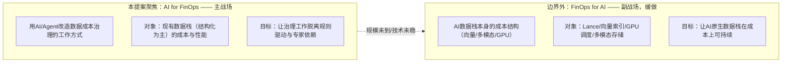
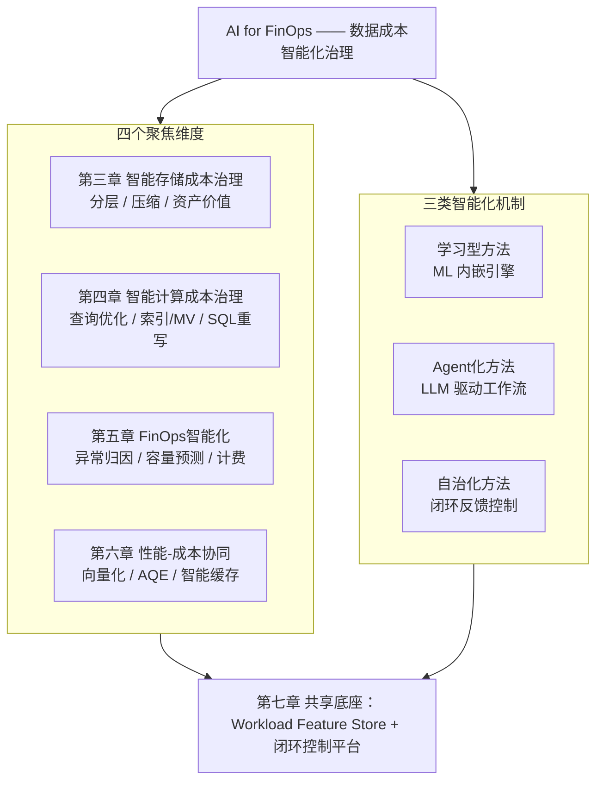
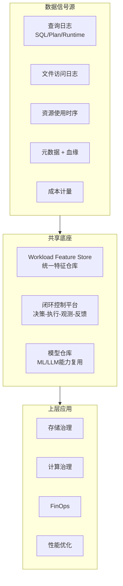
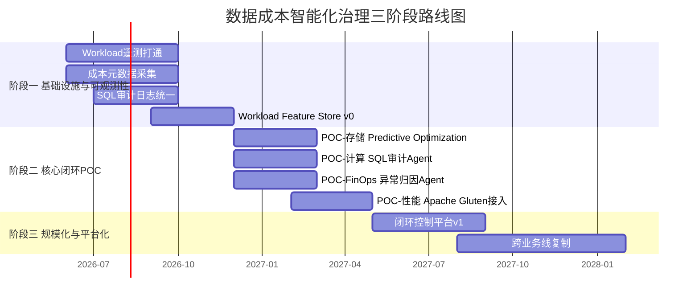

# AI时代数据成本智能化治理——前瞻技术提案V1.0

> **作者**：向春（架构师）
> **日期**：2026年5月
> **受众**：公司大数据技术委员会
> **调研基础**：延续24年9月《数据智能技术分析及规划策略》、25年7月《生成式AI驱动的数据治理范式变革洞察》、26年5月《从Data Agent商用元年到知识驱动的范式跃迁》三轮调研成果，并与同期完成的《AI时代的数据智能技术变革——深度调研》形成姊妹篇
> **定位**：从"成本治理与性能优化"这一独立角度切入数据治理智能化命题，给出1-2年可落地的前瞻技术储备建议、商用Reference与POC路线图

---

## 写在前面：这份提案要回答什么

前期的三轮调研与培训材料，主线一直是**Data for AI**（基础设施为AI而变）和**AI for Data**（工作方式为AI而变）。这两条线很重要，但它们不能直接回答大数据技术委员会面临的另一个迫切问题——

> **数据规模继续指数级膨胀、AI负载新增吃掉大量算力、治理人力却始终线性增长的局面下，我们的数据基础设施如何在不牺牲可用性的前提下持续降本增效？**

这份提案不重复多模态AI数据湖、Data Agent应用建设这两条已经被深度覆盖的赛道，而是**把同一个"AI驱动"的方法论投射到成本治理与性能优化这一独立的工程命题上**——研究问题是：

1. AI/Agent技术如何系统性地改造数据成本治理工作的范式？
2. 哪些前瞻技术已经达到1-2年可落地的商用门槛？依据是什么？
3. 这些技术的差异化竞争力来自哪里？我们的护城河是什么？
4. 在工程实践上应该按什么节奏推进？

提案严格遵循三条信息密度约束：
- 每一项前瞻技术必须同时给出 **Know-why（值不值得做）+ Know-how（核心机制）+ Reference（已有商用/学术案例）+ 适用性边界**
- 凡涉及量化收益必须**注明数据来源**，不杜撰
- 对每项技术给出**严格的边界条件**（什么场景适用、什么场景不适用），避免"银弹"叙事

---

## 目录

- [第一章：背景——AI时代数据成本治理的双重压力](#第一章背景ai时代数据成本治理的双重压力)
- [第二章：分析框架——双层结构与四维×三机制矩阵](#第二章分析框架双层结构与四维三机制矩阵)
- [第三章：维度一——智能存储成本治理](#第三章维度一智能存储成本治理)
- [第四章：维度二——智能计算成本治理](#第四章维度二智能计算成本治理)
- [第五章：维度三——FinOps智能化](#第五章维度三finops智能化)
- [第六章：维度四——性能-成本协同的智能化优化](#第六章维度四性能-成本协同的智能化优化)
- [第七章：协同效应与共享底座](#第七章协同效应与共享底座)
- [第八章：差异化竞争力分析](#第八章差异化竞争力分析)
- [第九章：推进节奏建议](#第九章推进节奏建议)
- [结语：成本竞争力 = AI竞争力](#结语成本竞争力--ai竞争力)
- [附录：参考资料汇总](#附录参考资料汇总)

---

## 第一章：背景——AI时代数据成本治理的双重压力

### 1.1 双重压力下的成本结构演变

AI时代数据基础设施的成本结构正在被**两股力量**同时拉变形——一股来自数据侧（数据"长得不一样了"），一股来自算力侧（算力"用得不一样了"）。这两股力量叠加，造成传统数据成本治理范式的失效。

**变形一：数据规模与构成的双重爆发**

| 数据类型 | AI时代之前 | AI时代之后 | 成本含义 |
|---------|-----------|-----------|---------|
| 结构化业务数据 | 主体；线性增长 | 仍为主体；增速大体不变 | 存储/计算成本基线 |
| 非结构化数据 | 几乎不被消费的"暗数据"；存着也用不上 | 第一次可被规模化利用，进入主消费链路 | 存储成本快速放大 |
| 向量/Embedding数据 | 不存在 | 模型迭代驱动反复重写；维度高、可压缩性差 | 全新的成本科目 |
| 模型/训练中间制品 | 不存在 | Checkpoint、特征文件、试错数据 | 占据可观存储 |

非结构化数据从"暗数据"转为"核心资产"是好事，但它带来的是**单位数据的存储/索引成本量级提升**——一张2MB的现场照片折算的存储费用可以等于一千条结构化记录；一个1536维Embedding的存储成本与索引开销在向量库场景中可以达到原始文本的数倍。

**变形二：算力结构的CPU↔GPU重构**

| 维度 | 传统批处理时代 | AI混合负载时代 |
|------|--------------|--------------|
| 计算单元 | CPU为绝对主体 | CPU/GPU/异构加速器并存 |
| 负载特征 | 批量为主、潮汐明显（夜间ETL高峰） | 批/流/推理三类负载交融，推理常驻 |
| 资源利用率 | 通过潮汐调度可达较高水平 | 三类负载难以错峰，静态资源池利用率持续下行 |
| 单位算力成本 | 摩尔定律持续下降 | 单价继续下降，但**总支出加速上升**（用量爆炸） |

GPU与AI推理的引入打破了传统批处理潮汐调度的前提——在线推理负载在白天高峰、批量ETL在夜间高峰、模型训练对GPU的尖峰需求随时插入，三类负载叠加后**总体资源水位长期偏低，但峰值需求仍然持续被刷新**。这是一种最坏的成本组合：**用量爬坡、利用率下行、采购计划失准**。

**变形三：治理"剪刀差"——资产指数增长 vs 治理人力线性增长**

| 时间 | 数据资产规模 | 治理人力 | 缺口 |
|------|-----------|---------|------|
| 五年前 | T1 | H1 | 单人覆盖 ~ T1/H1 |
| 现在 | T1 × ~10 | H1 × ~1.5（人力线性扩） | 单人覆盖恶化为 T1×10 / H1×1.5 ≈ 6.7倍 |
| 未来三年 | T1 × ~30（含多模态/向量） | H1 × ~2 | 单人覆盖恶化为 ~10倍 |

这个剪刀差意味着——**人均能管理的资产正在以每年20%-30%的速度恶化**。继续依靠扩编工程师团队来管理治理工作，在数学上不可持续。

### 1.2 传统成本治理范式的三重局限

面对上述压力，传统成本治理范式（以静态规则、报表驱动、专家经验为核心）的局限正在被放大：

| 局限 | 表现 | 为什么AI时代被放大 |
|------|------|----------------|
| **静态规则驱动** | 固定保留天数、固定分层阈值、固定压缩格式、固定分区策略 | 数据负载特征漂移加剧，"上线时配置正确，半年后配置过时"成为普遍现象 |
| **工具碎片化** | 监控、计量、归因、调优分属不同系统；跨格式（Iceberg/Hive/Parquet/向量库）的统一视图缺失 | AI数据栈引入新格式（Lance）、新引擎（Ray）后，工具碎片化指数级加剧 |
| **专家经验依赖** | 资深DBA/数据架构师的经验是优化的核心驱动；新人难以复制 | 数据资产复杂度突破任何单个专家的认知带宽；专家的判断成为整个组织的瓶颈 |

这三重局限叠加的实际表现是：成本数据每月生成一次报表，问题被发现时已滞后4-6周；归因到"某个项目"就停下来，无法下钻到"某个查询/某张表"；优化建议依赖DBA经验输出，输出速度跟不上业务变化速度。

### 1.3 范式拐点：成本治理从"规则驱动"到"智能驱动"

这是一个与[深度调研](AI时代的数据智能技术变革——深度调研.md)中"瓶颈翻转"论证**结构同构**的判断——只是把瓶颈从"知识"换成了"工作方式"，把约束变量从"模型/工具能力"换成了"成本治理范式"。

借用调研中的边际收益模型，把数据成本治理的有效性$E$表达为：

```
E = f(规则覆盖度, 工具完备度, 智能化程度)
```

| 阶段 | 主导约束 | 边际收益最高的投入方向 |
|------|--------|-------------------|
| 五年前 | 工具不完备 | 投资监控/计量/可视化基础设施 |
| 三年前 | 规则覆盖不全 | 补齐生命周期/分区/压缩规则 |
| **现在（AI时代）** | **静态规则的边际收益迅速衰减；智能化方法的边际收益陡升** | **投资学习型方法、Agent化方法、自治化方法** |

**这个判断的三个独立证据：**

| 证据 | 含义 |
|------|------|
| **头部厂商的规模化商用**：Databricks Predictive Optimization 2024年6月GA，至今2400+客户采用，累计自动VACUUM 130PB+、自动COMPACT 14PB+，官方宣称50%存储成本节省（来源：Databricks官方Blog与GA公告） | 这不是"前瞻设想"，而是**已被生产规模验证的范式** |
| **学术研究范式收敛**：从Bao（MIT, SIGMOD 2021）到LEO（Microsoft）到OtterTune（CMU），"learned + closed-loop"成为AI4DB主流方向，Bao已开源并被多个商业系统集成 | **学术-工程的迁移路径已经走通**，不存在"研究-落地"鸿沟 |
| **Snowflake/阿里/字节同步落子**：Snowflake Cortex AISQL（2025/6 PrPv，2025/11部分函数GA）、阿里DAS自治索引、字节DataLeap AI Agent均已商用上线 | 不只是单个厂商在做，而是**全行业头部玩家同步动作**——这是技术范式翻转最强的市场信号 |

**翻转的工程含义**——成本治理的投入排序需要根本性调整：

| 投入方向 | 五年前的边际收益 | 现在的边际收益 |
|---------|-------------|-------------|
| 完善规则覆盖 | 高 | **低**（规则空间已饱和，新增规则边际收益接近零） |
| 完善监控/可视化 | 高 | 中（基础设施已就绪，缺的是"基础设施之上做什么"） |
| **学习型/Agent化/自治化方法** | 低（彼时技术不可用） | **高**（技术达到商用门槛，且每多一份历史数据就多一份模型精度） |

这就是为什么这份提案的标题是"**智能化**治理"——不是"再加几条规则"，而是范式跃迁。

---

## 第二章：分析框架——双层结构与四维×三机制矩阵

### 2.1 双层结构定位：AI for FinOps vs FinOps for AI

借用调研报告中"Data for AI / AI for Data"的对仗结构，可以把"成本治理 + AI"这个命题清晰地拆为**双层**：



**为什么把"AI for FinOps"列为主战场，把"FinOps for AI"列为副战场？**

| 判断维度 | AI for FinOps（主） | FinOps for AI（副） |
|---------|------------------|------------------|
| 当下成本规模 | 主体（传统数据栈仍占95%+成本） | 增长中但占比仍小 |
| 技术成熟度 | 头部厂商已规模化商用（PO/Liquid Clustering/Photon） | 仍在快速演进，标准未稳（Lance v2.2刚GA） |
| 落地ROI | 高（直接作用于现有成本基线） | 中（场景规模仍在扩张） |
| 1-2年可商用性 | 强 | 部分技术尚需验证 |

**这个取舍与[深度调研第六章](AI时代的数据智能技术变革——深度调研.md)的"基于边际收益的投入优先级"原则完全一致**——把资源放在边际收益最高的方向上，AI原生栈本身的成本治理留待规模到达时再启动。

### 2.2 四维 × 三机制矩阵：本提案的论证骨架

把"AI for FinOps"主战场进一步拆解为**四个聚焦维度 × 三类智能化机制**的矩阵——这是后续四章的导航：



**三类机制的边界定义（避免概念模糊）：**

| 机制类型 | 核心特征 | 代表技术 | 信任边界 |
|---------|--------|---------|---------|
| **学习型方法** | ML/统计模型嵌入引擎内部，替代或辅助原有的启发式规则 | 学习型查询优化器（Bao）、神经基数估计、预测性Compaction | **可autonomous**——决策被引擎执行验证；模型出错时可fallback |
| **Agent化方法** | LLM驱动的工作流，引入自然语言交互、归因、建议 | SQL审计/重写Agent、成本归因Agent、数据资产价值评估Agent | **建议+人工审核**——回扣[深度调研](AI时代的数据智能技术变革——深度调研.md)L2/L3边界，autonomous仍不可靠 |
| **自治化方法** | 闭环反馈控制，"执行-观测-反馈-重训"的自我演化 | Databricks Predictive Optimization、Auto-Clustering、Auto-Indexing | **可autonomous**——但前提是闭环可观测、错误可回滚 |

这个分类的实际意义在于：**判断一项前瞻技术能不能autonomous部署，关键不在"用了多大的模型"，而在它属于哪一类机制**。Agent化方法在当前成熟度下普遍应保留人工审核环节。

### 2.3 商用就绪度评估

借用调研中"功能成熟度 × 生产就绪度"的双坐标，对四维 × 三机制矩阵中的关键交叉点做诚实评估：

| 交叉点 | 代表技术 | 功能成熟度 | 生产就绪度 | 1-2年可落地 |
|-------|--------|----------|----------|-----------|
| 存储 × 自治化 | Predictive Optimization | ★★★★★ | ★★★★☆ | **可** |
| 存储 × 自治化 | Liquid Clustering / Auto-Clustering | ★★★★★ | ★★★★☆ | **可** |
| 存储 × Agent化 | 数据资产价值评估Agent | ★★★☆☆ | ★★★☆☆ | **可（建议+人工审核模式）** |
| 计算 × 学习型 | Learned Query Optimizer | ★★★★☆ | ★★★☆☆ | **可（限定场景）** |
| 计算 × 自治化 | 自动索引/物化视图 | ★★★★★ | ★★★★☆ | **可** |
| 计算 × Agent化 | SQL审计/重写Agent | ★★★★☆ | ★★★☆☆ | **可（建议模式）** |
| FinOps × 学习型 | 异常检测/容量预测 | ★★★★☆ | ★★★★☆ | **可** |
| FinOps × Agent化 | 成本归因Agent | ★★★★☆ | ★★★☆☆ | **可（建议模式）** |
| 性能 × 学习型 | 向量化执行（Photon/Velox/Gluten） | ★★★★★ | ★★★★☆ | **可** |
| 性能 × 学习型 | AQE/智能缓存 | ★★★★★ | ★★★★★ | **已成熟** |

**总体判断**：四维各自都至少有2-3项前瞻技术达到"1-2年可落地"门槛，且头部厂商已经规模化商用——这意味着**现在不是"是否做"的问题，而是"按什么节奏做、从哪里切入"的问题**。

---

## 第三章：维度一——智能存储成本治理

### 3.1 痛点拆解

存储成本看似"单价低"，但在数据规模爆发的背景下，**总存储支出的增速通常是单价下降速度的3-5倍**。规则驱动的存储治理在AI时代失效的具体表现是：

| 痛点 | 表现 | 规则驱动失效的原因 |
|------|------|----------------|
| **冷热失衡** | 大量冷数据停留在热存储；个别热数据被错误降冷 | 访问模式频繁漂移，固定阈值跟不上 |
| **压缩策略固化** | 全表统一一种压缩格式（如snappy） | 不同分区、不同列、不同workload的最优压缩格式不同 |
| **小文件膨胀** | 流写/Spark分区写产生大量小文件，metadata膨胀，扫描成本剧增 | 合并时机靠定时任务，要么过频（开销）要么过疏（积累） |
| **数据布局衰退** | 一次性Z-ORDER/分区设计随业务变化失效 | 重排成本高，难以增量调整 |
| **跨表数据冗余** | 多个业务线建相似宽表，相同事实数据被多次落地 | 跨表的语义比对超出规则覆盖能力 |

### 3.2 前瞻技术1：Predictive Optimization——数据生命周期智能化

**Know-why——为什么从规则驱动迁移到学习型预测**

数据生命周期治理的核心动作有三类：**OPTIMIZE（小文件合并/聚簇）、VACUUM（清理过期版本）、ANALYZE（统计信息更新）**。这三类动作的执行时机与执行强度都在求解一个问题——"什么时候做、做多深，使长期总成本（执行成本 + 后续查询成本）最低"。

规则驱动方案（"每天凌晨2点合并所有分区"）的本质是**忽略了"每张表、每个分区、每种workload"的差异化最优解**。学习型方案则把决策建模为：

```
最优执行时机 = argmin_t [ E(执行成本 | t) + ∫ E(后续查询成本 | t, τ) dτ ]
```

把每张表/每个分区作为一个"个体"，用ML模型学习它的特征到最优时机的映射，**这就是Predictive Optimization的数学本质**。

**Know-how——核心机制**

| 组件 | 实现 |
|------|------|
| 特征工程 | 表/分区的访问频率、查询模式（点查/扫描/聚合）、文件大小分布、版本演化速度、列基数等 |
| 预测模型 | 通常采用GBDT/XGBoost类树模型（特征解释性好、训练快、对标签噪声鲁棒），或针对特定动作的专用回归模型 |
| 调度执行 | 模型输出"下一次执行的时机与强度"，调度系统按serverless/弹性方式触发实际操作 |
| 反馈闭环 | 每次执行的"成本-收益"被纳入训练集，模型按周/月重训 |
| 安全护栏 | 对决策施加上下界（不会过频也不会过疏）、回滚机制（执行后效果不达预期则降级到规则） |

**Reference——已有商用案例**

| 厂商/产品 | 状态 | 关键数据 |
|---------|------|--------|
| **Databricks Predictive Optimization** | **2024年6月GA**（Unity Catalog Managed Tables） | 2400+客户采用；累计自动VACUUM 130PB+、自动COMPACT 14PB+；官方宣称50%存储成本节省、2x平均查询性能提升、20x尾延迟降低、68%大表扫描提升（来源：Databricks官方Blog） |
| **Snowflake Auto-Clustering / Search Optimization** | 已GA多年 | 商用稳定，数据规模与商业价值已被市场验证 |
| **AWS S3 Intelligent-Tiering** | 已GA | 朴素版的自治化分层（仅基于访问模式），可作为"AI for FinOps"在云对象存储层的最低门槛基线 |

**适用边界**

- ✅ **适用**：托管表/Catalog体系下的Iceberg、Delta、Hudi等开放格式
- ✅ **适用**：访问日志、查询日志可观测的场景
- ⚠️ **谨慎**：纯Hive Catalog + 自建文件管理的场景，需要先补齐遥测基础
- ❌ **不适用**：完全离线、无访问日志、无统一Catalog的遗留系统

### 3.3 前瞻技术2：自适应数据布局（Liquid Clustering / Auto-Clustering）

**Know-why——为什么传统Z-ORDER在AI时代不够用**

传统的数据布局优化（分区、Z-ORDER）有三个根本局限：

| 局限 | 含义 |
|------|------|
| **非增量** | Z-ORDER需要对全数据重写，每次OPTIMIZE是O(数据量)级别的开销 |
| **键固定** | 一旦选定Z-ORDER键，业务变化后无法平滑调整，只能重做 |
| **局部最优** | 文件级Z-ORDER不保证全局最优，分布偏斜场景下退化严重 |

这三个局限叠加，造成"建得动但维护不动"——大表的Z-ORDER维护成本可能超过它带来的查询收益。

**Know-how——Liquid Clustering的设计选择**

| 设计点 | 实现 |
|------|------|
| **增量重组** | 写入时即按聚簇键放置；不需要全量重写 |
| **键可变更** | 聚簇键可以在不重写历史数据的情况下重新定义，让数据布局跟随业务演化 |
| **全局优化** | 不再是"每个文件内部Z-ORDER"，而是跨文件的全局聚簇 |
| **与Predictive Optimization集成** | 自治化触发，不需要人工OPTIMIZE |

**Reference**

| 厂商/产品 | 状态 | 关键数据 |
|---------|------|--------|
| **Databricks Liquid Clustering** | **2024 GA**（DBR 15.2+） | 1000+客户已采用；累计写入100PB+、读出20EB+；vs 传统分区+Z-ORDER实现2-12x查询加速（来源：Databricks官方Blog） |
| **Snowflake Auto-Clustering** | 已GA | 自治化触发，无需手动OPTIMIZE |
| **Apache Iceberg社区** | 提案/演进中 | 类Liquid Clustering的开源化方向，开放格式生态正在跟进 |

**适用边界**

- ✅ **适用**：高频写入 + 多列查询过滤的大表（如事实表、行为日志表、特征表）
- ⚠️ **谨慎**：纯追加 + 单一时间维度查询的简单场景，传统分区可能仍然更直观
- ❌ **不适用**：尚未支持Liquid Clustering的开源格式版本（需关注Iceberg社区演进）

### 3.4 前瞻技术3：数据资产价值评估Agent——治理工作的Agent化

**Know-why——为什么这是Agent化方法（而非学习型方法）**

"哪些数据可以归档/降冷/删除"这一判断需要综合：
- 技术信号（访问频率、最后访问时间、文件大小）
- 元数据（Owner、业务域、敏感级别）
- 血缘（被多少下游消费、是否在审计/合规链路中）
- **业务知识**（这张表对应什么业务场景，对应客户/合规要求是什么）

前三类是结构化的，传统ML可以处理；**第四类是非结构化的业务知识，必须靠LLM理解**。这就是为什么这是Agent化方法——它的核心价值不是"决策更准"，而是"能把第四类信号纳入决策"。

**Know-how——核心架构**

```
查询日志 + 元数据 + 血缘 + 业务术语表
                    │
                    ▼
        ┌─────────────────────────┐
        │  数据资产价值评估Agent   │
        │  - 检索：MCP连接到Catalog│
        │  - 推理：LLM做综合判断   │
        │  - 输出：归档/降冷/删除建议│
        └─────────────────────────┘
                    │
                    ▼
            人工审核 → 执行/否决
                    │
                    ▼
         反馈进入Agent的Skill库
```

**严格边界——回扣L2/L3的判断**

借用[深度调研](AI时代的数据智能技术变革——深度调研.md)对Data Agent自治分级的分析，**数据资产价值评估Agent当前应严格停留在L2（建议+人工审核）**——不能autonomous删除生产数据。原因是：

> Agent对"这张表能不能删"的判断属于层面三业务知识范畴，当前知识完备度下端到端可靠性约48.8%（来自调研中的乘法公式估算）。在数据删除这种**不可逆**操作上，48.8%的可靠性意味着**每两次决策有一次错**——损害远大于收益。

**Reference**

| 厂商/产品 | 状态 |
|---------|------|
| **Atlan AI Agent / Alation Aurora** | 商用产品；定位为"数据治理副驾"，提供归档/降冷建议 |
| **字节DataLeap AI** | 集成在DataLeap元数据管理中的智能治理建议 |
| **Snowflake Cortex AISQL** | 2025/11部分函数GA；可基于自然语言对元数据/血缘做查询与归因 |

**适用边界**

- ✅ **适用**：有完整Catalog + 血缘 + 查询日志的环境，可以提供丰富上下文
- ⚠️ **谨慎**：业务知识体系尚未形成的环境（Agent输出会"自信地犯错"）
- ❌ **不适用**：autonomous执行——必须保留人工审核

### 3.5 公司视角的差异化考量

| 考量点 | 内容 |
|------|------|
| **多业务线统一价值评估** | 不同业务线对"价值"的定义不同（研发/运维/合规口径不同），需要建立统一的资产价值评估Schema |
| **混合架构兼容** | 现有数据栈通常包含Hadoop/Hive/MPP等多代基础设施，Predictive Optimization类技术依赖统一Catalog；落地路径需要先建Catalog统一层（参考调研报告中REST Catalog的判断），再叠加Predictive Optimization |
| **自主可控** | Liquid Clustering等核心技术的开源化趋势（Iceberg社区跟进）为自主可控提供了路径——不应锁定在单一商业厂商 |
| **数据合规/出境** | 资产价值评估Agent涉及LLM对元数据的处理；公司内场景需采用本地部署的开源模型（如Qwen/DeepSeek/Llama系），避免敏感元数据外流 |

### 3.6 POC建议

| POC项 | 切入点 | 预期周期 | 量化指标 |
|------|------|--------|--------|
| **POC-1**：Predictive Optimization能力闭环 | 选择1张高价值热表（建议事实表/行为日志，TB级以上） | 2-3个月 | 存储成本节省比例、查询p50/p99延迟变化 |
| **POC-2**：Liquid Clustering对比验证 | 同一张表的Z-ORDER vs Liquid Clustering A/B | 1-2个月 | OPTIMIZE开销、查询过滤性能、数据漂移后的衰退速度 |
| **POC-3**：资产价值评估Agent建议模式 | 选择1个业务线的非生产环境，做"建议+人工评审" | 2-3个月 | 建议接受率、人工评审耗时、归档存储节省（人工执行） |

---

## 第四章：维度二——智能计算成本治理

### 4.1 痛点拆解

计算成本是数据栈中**变化最剧烈、最容易出现"突发性失控"**的科目。它的痛点结构与存储成本完全不同：

| 痛点 | 表现 | 量化范围 |
|------|------|--------|
| **查询计划次优** | 优化器选错Join顺序/Join算法/聚合策略 | 单查询成本可能膨胀10x-100x |
| **索引/物化视图依赖DBA** | DBA手工建索引/MV，速度跟不上业务变化；旧索引不淘汰造成存储+维护成本 | 物化视图选择是NP问题，专家经验难以扩展 |
| **SQL质量参差** | 业务SQL中存在大量反模式（笛卡尔积、不必要的Distinct/Order By、多次扫描同表） | 头部20%的低效SQL通常占用60%-80%的总计算资源 |
| **资源调度静态** | 批/流/AI推理三类负载共池但调度策略各自独立 | 利用率长期低于30%-40% |

这四个痛点的共同特征是——**问题的发现速度慢于问题的产生速度**。一条次优SQL写入生产可能在一周内造成数百万元的额外算力账单，而传统监控通常按周或按月才能发现。

### 4.2 前瞻技术1：学习型查询优化器（Learned Query Optimizer）

**Know-why——为什么传统CBO在AI时代不够用**

传统Cost-Based Optimizer（CBO）的核心约束是**统计信息驱动的代价估计**。它的失败模式有三个：

| 失败模式 | 含义 |
|------|------|
| **基数估计偏差累积** | 多表Join中每一步基数估计的小偏差被指数级放大；典型现象是"估计1万行实际1亿行"，造成Plan选择系统性错误 |
| **启发式规则刻板** | "小表广播大表"等启发式规则在数据分布偏斜时失效 |
| **无法从历史中学习** | 即使同一条SQL连续执行了1万次都很慢，CBO下次还会选同样的Plan |

学习型查询优化器的核心命题——**"从执行历史中学习，让优化器越用越准"**。

**Know-how——以Bao为代表的核心机制**

| 组件 | Bao（MIT, SIGMOD 2021）的实现 |
|------|---------------------------|
| **不替换、只增强** | Bao不替换传统CBO，而是为CBO提供**Plan提示（hint set）**，引导CBO在多个候选Plan之间做出更好的选择 |
| **Tree Convolutional Neural Network** | 用树形CNN建模查询Plan的拓扑结构，预测每个候选Plan的执行成本 |
| **Thompson Sampling** | 用强化学习的Thompson Sampling在"探索新Plan"和"利用已知好Plan"之间做平衡 |
| **解决冷启动** | 通过hint-based机制，在模型未训练完成时fallback到CBO原始决策 |
| **解决workload漂移** | online learning机制，新的执行结果持续更新模型 |

> Bao的论文标题"Making Learned Query Optimization Practical"本身就是宣言——之前的learned optimizer研究在工程上不可用（需要数月训练数据、无法适应变化、尾延迟差），Bao的贡献是把这三个问题同时解决。

**Reference**

| 系统/产品 | 状态 |
|---------|------|
| **Bao** | MIT开源，PostgreSQL集成；论文SIGMOD 2021 |
| **Microsoft LEO** | SQL Server的学习型优化器，已集成到SQL Server 2022 |
| **阿里PolarDB-X智能优化器** | 商用的learned optimizer实现 |
| **华为openGauss AI4DB** | 内嵌学习型优化、自动索引、参数自调优 |
| **PingCAP TiDB自动统计** | TiDB AutoStats自动收集与更新统计信息 |

**适用边界**

- ✅ **适用**：复杂查询比例高、workload相对稳定（学习有材料）的OLAP场景
- ⚠️ **谨慎**：数据分布每天大幅漂移的场景，模型需要更激进的online learning
- ❌ **不适用**：临时性、一次性、无重复模式的查询（无学习材料）

### 4.3 前瞻技术2：自动索引与物化视图推荐

**Know-why——为什么这是经典NP问题但仍值得做**

物化视图选择问题（Materialized View Selection）是一个**有限资源下的最大覆盖问题**：在给定存储/维护预算下，选择哪些物化视图能最大化workload的总加速。这是经典NP-hard问题。

但NP-hard不等于不能做——**workload的极不均匀分布（头部20%的查询占80%的计算资源）使得"近似最优解"已经能贡献绝大部分价值**。AI时代的新机会是：

| 维度 | 传统方法 | AI时代方法 |
|------|--------|----------|
| 候选生成 | DBA手工列举 | 基于workload日志自动挖掘 |
| 价值评估 | 启发式公式 | ML模型预测命中率与收益 |
| 决策求解 | 依赖DBA经验 | ILP/启发式搜索自动求解 |
| 淘汰机制 | 极少做 | 持续观测使用率，自动下线无价值MV |

**Know-how——闭环结构**

```
workload日志 → 候选挖掘 → ML预测命中/收益 → ILP求解 → 部署 → 观测 → 淘汰反馈
                                                                       ↑
                                                                       │
                                                                  反馈到模型
```

**Reference**

| 系统/产品 | 状态 |
|---------|------|
| **Snowflake Search Optimization Service** | 商用GA；自动维护查询加速结构 |
| **SQL Server Database Tuning Advisor + Auto-Tuning** | 演进版本提供持续推荐与自动应用 |
| **阿里DAS自治索引** | 商用；自动推荐+自动创建+自动淘汰索引 |
| **AWS Redshift Auto-MV** | 商用；自动物化视图 |

**适用边界**

- ✅ **适用**：稳定的BI/报表workload（重复查询多）
- ⚠️ **谨慎**：探索式分析为主的场景（命中率难以预测）

### 4.4 前瞻技术3：LLM驱动的SQL审计与重写Agent

**Know-why——为什么LLM能做传统规则审计做不到的事**

传统SQL审计（如阿里SQL Lint、各家SQLFluff）基于**预定义的规则集**——能识别"显式笛卡尔积""显式SELECT *"等明确反模式，但无法识别**"语义上低效但语法上看起来合理"**的写法，例如：

```sql
-- 传统规则：合法。LLM能识别：低效。
-- 用COUNT(DISTINCT) 而本可用GROUP BY预聚合后SUM
SELECT region, COUNT(DISTINCT user_id) FROM events GROUP BY region;

-- 传统规则：合法。LLM能识别：可用窗口函数避免自连接。
SELECT a.user_id FROM users a, users b WHERE a.signup_date < b.signup_date AND a.region = b.region;
```

LLM对SQL的"语义理解"使得识别这类反模式成为可能。

**Know-how——Agent闭环**

| 步骤 | 实现 |
|------|------|
| **AST分析** | 先用确定性的SQL Parser把SQL解析为AST，提供结构化输入 |
| **LLM识别反模式** | 在Prompt中注入反模式知识库，LLM对AST做语义分析 |
| **等价改写** | LLM生成候选改写；多个候选 |
| **优化器验证** | 把候选改写交给执行引擎的EXPLAIN，比较预估代价 |
| **A/B测试（可选）** | 在影子流量上实测改写后的性能 |
| **建议输出** | 给开发者/DBA展示改写建议，**保留人工confirm** |
| **反馈学习** | 接受/拒绝结果纳入Skill库 |

**严格边界——回扣L2/L3的判断**

SQL改写涉及**语义等价性的判断**——错改可能造成数据错误（远比性能下降严重）。当前阶段：

- ✅ **可autonomous**：传统规则+LLM组合的"反模式识别与告警"
- ✅ **建议+人工审核**：LLM生成的等价改写候选
- ❌ **不可autonomous**：直接改写生产SQL

**Reference**

| 系统/产品 | 状态 |
|---------|------|
| **Snowflake Cortex AISQL** | 2025/6 PrPv，2025/11部分函数GA（AI_FILTER/AI_CLASSIFY/AI_AGG等）；为分析师提供AI能力的SQL接口；filter/join场景最高60%成本节省（来源：Snowflake官方Summit 2025公告） |
| **阿里DAS SQL优化建议** | 商用；规则+ML综合的SQL优化建议 |
| **字节SQL治理Agent** | 内部产品化使用 |
| **Microsoft Copilot in SQL Server** | 集成在SQL Server的Copilot能力 |

**适用边界**

- ✅ **适用**：有大量人工SQL输入的BI/数据开发场景
- ⚠️ **谨慎**：SQL Parser对自家方言的兼容度（很多生产SQL用了非标准方言扩展）
- ❌ **不适用**：autonomous改写——必须保留人工审核

### 4.5 前瞻技术4：Workload-aware资源调度

**Know-why——为什么静态调度在AI时代失效**

当批处理、流处理、AI推理三类负载共享一个资源池时，三类负载的资源画像完全不同：

| 负载 | 资源画像 |
|------|--------|
| 批处理 | 夜间高峰、对延迟不敏感、可被抢占 |
| 流处理 | 全天稳定、对延迟中等敏感、不可抢占 |
| AI推理 | 白天高峰、对延迟极敏感、不可抢占 |
| 模型训练 | 不定时高峰、可中断 |

静态资源池只能按"最坏情况"采购，造成长期低水位。Workload-aware调度的目标是**通过预测+动态分配把利用率从30%-40%提升到60%-70%**。

**Know-how**

| 组件 | 实现 |
|------|------|
| **负载预测** | 时序模型（DeepAR/Temporal Fusion Transformer/Prophet）预测未来N小时的各类负载需求 |
| **调度决策** | Tetris思想（多维bin packing）+ ML predictor，在多维资源（CPU/GPU/Memory/IO）上做多目标优化 |
| **抢占与回填** | 高优先级负载到来时抢占低优先级；回填可被中断的训练任务 |
| **反馈** | 实际运行数据用于持续校准预测模型 |

**Reference**

| 系统/产品 | 状态 |
|---------|------|
| **Google Borg** | 论文公开；ML预测+动态分配，资源利用率行业领先 |
| **阿里伏羲** | 商用调度器，支持混部 |
| **K8s VPA/HPA + ML predictor** | 开源生态正在演进，KEDA/Karpenter等扩展件提供predictor接口 |

**适用边界**

- ✅ **适用**：多类负载共享资源池的环境
- ⚠️ **谨慎**：单一负载类型为主的场景，价值不明显

### 4.6 POC建议

| POC项 | 切入点 | 预期周期 | 量化指标 |
|------|------|--------|--------|
| **POC-1**：SQL审计Agent | 选择1个业务线的SQL审计模式（不autonomous重写） | 2-3个月 | 反模式识别召回率/精确率、人工接受改写比例、加速比 |
| **POC-2**：自动MV/索引推荐 | 选择1张高频BI表，启用自动MV推荐 | 2-3个月 | 推荐MV的命中率、净收益（节省的查询成本-MV存储维护成本） |
| **POC-3**：学习型优化器试点 | 选择PostgreSQL或Spark上的1个限定workload，对接Bao类方案 | 3-4个月 | Plan质量、尾延迟、模型训练数据需求量 |

**优先级建议**：在三个POC中，**POC-1（SQL审计Agent）作为首选**——独立部署、不入侵执行链路、风险可控、可量化收益最快。

---

## 第五章：维度三——FinOps智能化

### 5.1 痛点拆解

如果说存储和计算成本治理是"工程问题"，那么FinOps（财务运营）则是"工程 × 业务 × 财务"的交叉问题——技术上能优化，但**只有让成本透明、可归因、可预测、可下沉到业务部门**，才能形成持续的优化激励。FinOps的传统痛点：

| 痛点 | 表现 |
|------|------|
| **成本不透明** | 总账单可见，但"哪个项目/作业/SQL花了多少钱"不清楚 |
| **归因滞后** | 成本异常按月度报表反馈，发现问题已晚4-6周 |
| **容量规划凭经验** | 资深架构师拍脑袋估算，业务突增/AI负载新增时频繁失准 |
| **缺乏Showback机制** | 成本不下沉到业务部门，没有节约激励 |

### 5.2 前瞻技术1：成本异常检测与归因Agent

**Know-why——为什么传统月度报表归因不够**

传统的成本归因依赖"技术团队跑SQL → Excel透视 → 周/月会议讨论"的人工流程。在AI时代这套流程失效的原因：

- 数据规模爆发后，**异常的频次、维度、量级都在上升**——人工审视跟不上
- 多维度归因（用户/项目/作业/SQL/存储/计算）的组合空间巨大，人工下钻只能停在前1-2级
- 归因结论需要业务上下文（"为什么这个项目突然涨了"），技术团队往往不掌握

**Know-how——双引擎方法**

| 引擎 | 职责 |
|------|------|
| **时序异常检测引擎（学习型）** | 用Prophet/孤立森林/STL分解等方法，对每一个维度的成本时序做异常检测；输出"哪些维度在哪个时间窗发生异常" |
| **归因Agent（Agent化）** | 拿到异常事件后，下钻到具体作业/SQL/用户，结合元数据/血缘/业务术语生成自然语言归因报告 |

```
成本时序数据 → 异常检测引擎（ML） → 异常事件
                                          │
                                          ▼
                            归因Agent（LLM + MCP）
                                          │
                                          ▼
                            自然语言归因报告 + 优化建议
                                          │
                                          ▼
                            人工审核 → 反馈到Agent
```

**Reference**

| 系统/产品 | 状态 |
|---------|------|
| **Databricks System Tables + AI Insights** | System Tables提供细粒度成本数据，AI Insights做异常分析 |
| **CloudHealth by VMware** | 公有云FinOps平台，AI驱动的成本异常分析 |
| **华为CCE FinOps** | 容器场景的成本治理 |
| **字节Cost Lens** | 字节内部FinOps工具 |

**适用边界**

- ✅ **适用**：有作业级、SQL级元数据采集的环境
- ⚠️ **谨慎**：元数据缺失/计费颗粒度粗的环境，需要先补齐遥测基础

### 5.3 前瞻技术2：预测性容量规划

**Know-why——为什么静态采购计划在AI时代失败率高**

传统采购计划基于历史增长率外推。AI时代的失败模式：

| 失败模式 | 含义 |
|------|------|
| 业务侧突变 | AI产品上线带来流量阶跃，外推模型失效 |
| 算力结构突变 | GPU需求新增，CPU vs GPU比例需要重新评估 |
| 单价波动 | GPU/AI芯片市场波动剧烈，单价假设不再稳定 |

**Know-how**

| 组件 | 实现 |
|------|------|
| **多维时序预测** | DeepAR/Temporal Fusion Transformer/Prophet对各类资源（CPU/GPU/Storage/IO）独立建模 |
| **业务事件嵌入** | 已知的业务事件（产品上线/促销/AI模型升级）作为外生变量输入预测模型 |
| **蒙特卡洛仿真** | 在预测分布上做仿真，输出容量需求的置信区间（不是单点估计） |
| **采购优化** | 基于置信区间求解"在SLA约束下的最低采购成本"决策 |

**Reference**

| 系统/产品 | 状态 |
|---------|------|
| **Google Borg资源预测** | 论文公开 |
| **阿里资源画像** | 商用 |
| **AWS Compute Optimizer** | 公有云的资源预测与推荐 |

**适用边界**

- ✅ **适用**：有6个月以上历史数据的环境
- ⚠️ **谨慎**：历史数据不足或负载结构剧烈变化的早期阶段

### 5.4 前瞻技术3：精细化计费与Showback自动化

**Know-why——为什么必须把成本下沉到业务**

成本治理的"激励-行为-结果"链条只有在**成本下沉到业务部门预算**时才能闭环——否则技术团队"看到成本但没有调整动力"，业务团队"使用成本但没有节约动力"。Showback（成本展示）/ Chargeback（成本归账）是这个闭环的关键。

但精细化计费在工程上很难做对，原因是：
- 共享资源（计算池、存储池）需要按使用量分摊
- 多租户环境下需要区分"实际占用"和"预留份额"
- 跨业务线的依赖（A业务消费B业务的数据）需要合理摊销

**Know-how**

| 组件 | 实现 |
|------|------|
| **作业级元数据采集** | 每个作业/查询的owner、project、cost_center、资源消耗指标全采集 |
| **成本算子映射** | 把资源消耗指标（CPU·秒、GPU·秒、Storage·月、IO字节数）映射到金额 |
| **共享资源分摊** | 按"实际消耗权重"分摊；同时考虑预留承诺的固定成本 |
| **Showback门户** | 业务团队可看到自己的成本、变化趋势、热点作业 |
| **Agent辅助归集与异议处理** | 业务团队对账单有异议时，Agent辅助回答"这笔费用怎么来的" |

**Reference**

| 系统/产品 | 状态 |
|---------|------|
| **阿里DataWorks成本治理** | 商用，提供作业级成本下钻 |
| **字节Cost Lens** | 内部产品 |
| **Apptio Cloudability** | 公有云Showback/Chargeback老牌产品 |

### 5.5 公司视角差异化

| 考量点 | 内容 |
|------|------|
| **多业务线租户化** | 内部场景下，研发/运维/测试/项目各有自己的预算线，需要建立租户化的成本管理 |
| **与SAP/财务系统对接** | Showback要真正下沉，需要与公司财务系统的预算单元打通；这是工程上不可绕过的对接工作 |
| **研发效能场景的特殊性** | 研发场景下"实验性消耗"和"生产性消耗"应区分核算，避免对研发创新的过度抑制 |
| **跨域计费的合规性** | 不同业务部门间的数据交换涉及财务结算，需要审计可追溯 |

### 5.6 POC建议

| POC项 | 切入点 | 预期周期 | 量化指标 |
|------|------|--------|--------|
| **POC-1**：成本异常归因Agent | 已有FinOps报表的基础上叠加Agent | 2-3个月 | 异常发现时滞从月度→小时级；归因建议人工接受率 |
| **POC-2**：业务线Showback门户 | 选择2-3个业务线试点 | 3-4个月 | 业务团队看账单频率、节约行动数 |
| **POC-3**：容量预测试点 | 选择1类资源（如Spark Executor）做季度预测 | 3-6个月 | 预测准确率、采购计划修正幅度 |

**优先级建议**：**POC-1（异常归因Agent）作为首选**——已有FinOps数据基础，Agent作为增量层叠加，风险最小、收益最快。

---

## 第六章：维度四——性能-成本协同的智能化优化

### 6.1 论点：性能与成本是同一优化目标的两面

这一章从一个看似简单的论点开始：

> **每次查询的"绝对计算量"由数据布局 + 执行计划共同决定。绝对计算量同时决定了延迟（性能）和资源消耗（成本）。**

这意味着——**几乎所有性能优化技术，本质上同时也是成本优化技术**。把性能优化单独列为一章，不是"再凑一个维度"，而是因为这个领域的前瞻技术（向量化执行、AQE演进、智能缓存）的特殊性：

- 它们作用于执行引擎层，**收益不依赖业务侧改造**
- 它们是"按比例放大现有workload价值"的杠杆——存量workload越大，收益越大
- 它们对公司自主可控有特殊意义——关键技术（Velox/Gluten）已经开源化

### 6.2 前瞻技术1：向量化执行引擎（Photon / Velox / Apache Gluten）

**Know-why——为什么向量化是"几乎免费的几倍提速"**

传统Spark的执行引擎是基于JVM的row-by-row处理，每行触发函数调用、对象创建、装箱拆箱。向量化执行的核心机制：

| 维度 | 传统JVM执行 | 向量化执行 |
|------|-----------|----------|
| 处理粒度 | 一行一次（Volcano模型） | 一批（典型1024行/批） |
| 内存模型 | JVM对象 | 列式紧凑布局 |
| CPU指令 | 标量 | SIMD（AVX/AVX-512/NEON） |
| 函数调用开销 | 每行一次 | 每批一次 |
| Branch prediction | 差 | 好（大量分支可预测） |

数学上，向量化的提速来自三个独立的乘数：
- 函数调用开销摊薄：~10x
- SIMD指令并行：~4-8x（取决于数据类型）
- Cache locality提升：~2x

实测综合下来3-12倍是普遍范围。

**Know-how**

| 路径 | 实现 |
|------|------|
| **Photon（Databricks自有）** | C++编写的native引擎，深度集成到Databricks Runtime；不开源 |
| **Velox（Meta开源）** | C++统一执行引擎，作为library可被多个上层引擎共享 |
| **Apache Gluten** | 把Velox（或Clickhouse）作为native backend接入Spark；Spark Catalyst做plan，Gluten做执行 |

**Reference——量化数据**

| 系统/产品 | 状态 | 关键数据 |
|---------|------|--------|
| **Databricks Photon** | 已GA多年 | 单点最高12x speedup，单点最高80% TCO节省；平均3-8x speedup，平均30% TCO节省；平均VM compute hours下降50%（来源：Databricks Photon GA Blog与官网） |
| **Apache Gluten + Velox** | 持续演进 | 2024年TPC-H SF2000测试中达到约92%基线性能（部分查询达108%）；支持Spark 3.2-3.5；x86/ARM双架构（来源：Apache Gluten 1.4-1.5官方文档） |
| **字节ByConity** | 商用 | Clickhouse fork基础上的向量化引擎 |

**适用边界**

- ✅ **适用**：批处理workload中以SELECT/JOIN/AGG为主体的场景
- ⚠️ **谨慎**：大量UDF/Python UDF的场景，向量化覆盖度受限（需要逐步替换为native UDF）
- ⚠️ **谨慎**：Gluten目前对Spark方言的覆盖度并非100%，不支持算子会fallback到JVM，需要测量fallback比例
- ❌ **不适用**：纯流处理低延迟场景（向量化的批粒度引入延迟）

### 6.3 前瞻技术2：Adaptive Query Execution的演进

**Know-why——为什么runtime统计比静态优化器更可信**

静态优化器在编译期决策，依赖"统计信息+启发式"做估计。AQE的核心思想是——**让查询在执行过程中，根据真实的runtime统计调整后续Plan**。例如：

- 真实shuffle数据量大于预期 → 动态合并shuffle分区
- 某个Join的build side小于预期 → 动态切换为Broadcast Join
- 数据倾斜检测到 → 动态切分倾斜分区

**Know-how——演进的层级**

| 演进阶段 | 调整范围 |
|---------|--------|
| Spark AQE（2020 Spark 3.0） | 有限：分区合并、Join策略切换、倾斜处理 |
| Photon AQE | 扩展：基于native runtime统计的更激进重写 |
| 引擎间Plan Cache + 反馈学习 | 跨查询：常见query pattern的Plan被缓存，下次直接使用并持续校准 |

**Reference**

| 系统/产品 | 状态 |
|---------|------|
| **Spark AQE** | Spark 3.0+ 默认启用 |
| **Photon AQE** | Databricks商用 |
| **阿里EMR AQE+** | 阿里云EMR的AQE增强版 |
| **PrestoDB / Trino RE** | runtime重优化的开源实现 |

**适用边界**

- ✅ **适用**：所有Spark/Presto/Trino部署，本质上"应该开就开"
- ⚠️ **谨慎**：极低延迟场景，AQE引入的runtime决策开销需要权衡

### 6.4 前瞻技术3：智能缓存与预热

**Know-why——为什么"重复计算"是计算成本的主要泄漏**

实测中，BI/报表场景的查询有显著的重复性——同一份数据被反复加载、同一个聚合被反复计算。重复计算的浪费可以达到总计算成本的30%-50%。智能缓存的目标：

| 层级 | 机制 |
|------|------|
| **结果缓存** | 完全相同的查询直接返回结果 |
| **中间结果缓存** | 子表达式/中间结果的缓存（涉及Common Subexpression优化） |
| **磁盘缓存（数据缓存）** | 远端数据本地化缓存 |
| **预热缓存** | 基于负载预测主动预加载未来高概率被查询的数据 |

**Know-how**

| 组件 | 实现 |
|------|------|
| **结果缓存** | 查询签名匹配 + 数据版本一致性检查 |
| **数据缓存** | LRU/LFU + 工作负载感知（高频表优先驻留） |
| **预热预测** | 基于查询时序模式 + 业务事件，预测未来查询热点；主动加载 |

**Reference**

| 系统/产品 | 状态 |
|---------|------|
| **Snowflake Result Cache** | 商用GA |
| **Databricks Disk Cache** | 商用GA |
| **BigQuery BI Engine** | 商用GA |
| **Alluxio** | 开源；统一的数据加速层 |

### 6.5 前瞻技术4（探索性）：基于Embedding的相似查询识别

**Know-why——SQL文本不同但语义相同的"隐性重复"**

传统的查询签名匹配（基于hash或AST）只能识别**语法相同**的查询。生产环境中存在大量**语法不同但语义相似**的查询：

```sql
-- 这两条SQL语义完全相同，但hash不同、AST不同
SELECT region, COUNT(*) FROM events WHERE date = '2026-05-01' GROUP BY region;
SELECT COUNT(1), region FROM events WHERE date='2026-05-01' GROUP BY 2;
```

**Know-how**

```
所有历史SQL → SQL Embedding模型 → 向量空间
                                      │
                                      ▼
                              聚类（HDBSCAN等）
                                      │
                                      ▼
                       "语义相似簇"——物化视图候选
                                      │
                                      ▼
                          重复计算预警 / MV建议
```

**严格标注：探索性**

- 缺乏完整商用Reference（学术界有相关研究但工程化产品稀少）
- 建议作为**研究型POC**，不进入近期商用规划
- 长期价值方向：与LLM驱动的SQL治理Agent融合

**适用边界**

- ✅ **可POC**：有大量SQL历史日志的环境，作为研究投入
- ❌ **不适用**：作为商用产品决策依据

### 6.6 POC建议

| POC项 | 切入点 | 预期周期 | 量化指标 |
|------|------|--------|--------|
| **POC-1**：Apache Gluten接入Spark | 选择1个非生产Spark集群，接入Gluten+Velox | 3-4个月 | 加速比、fallback比例、稳定性 |
| **POC-2**：智能缓存评估 | 在BI网关层加结果缓存层 | 1-2个月 | 缓存命中率、查询延迟、计算资源节省 |
| **POC-3**（探索性）：SQL Embedding | 离线分析6个月SQL日志 | 2-3个月 | 隐性重复识别比例、MV候选质量 |

**优先级建议**：**POC-1（Apache Gluten）作为首选**——开源可控、收益直接、与现有Spark栈兼容；是性能-成本协同维度最具杠杆性的投入。

---

## 第七章：协同效应与共享底座

### 7.1 核心论点：四维不是孤立的

第三到第六章列出的前瞻技术看起来分布在四个独立维度，但**仔细观察会发现它们共享同一组数据信号**：

| 数据信号 | 被哪些技术消费 |
|---------|------------|
| 查询日志（SQL文本 + 执行计划 + runtime统计） | 学习型优化器、自动MV、SQL审计Agent、AQE反馈、相似查询识别、智能缓存 |
| 文件级访问日志（哪些文件何时被读取） | Predictive Optimization、Liquid Clustering、智能缓存预热、资产价值评估 |
| 资源使用时序（CPU/GPU/Storage/IO逐时） | Workload-aware调度、容量预测、异常检测 |
| 元数据 + 血缘 + 业务术语 | 资产价值评估Agent、归因Agent、SQL审计Agent |
| 成本计量（作业级、SQL级、存储级） | FinOps Agent、Showback、调优建议 |

这些信号**应该共享同一份采集与存储**——这就是"共享底座"的工程必要性。

### 7.2 共享底座的设计



**Workload Feature Store的关键属性：**

| 属性 | 含义 |
|------|------|
| **统一Schema** | 所有信号按统一规范存储，避免多套数据模型 |
| **特征复用** | 一个特征（如"表的访问热度"）可被多个上层应用消费 |
| **时间序列原生** | 所有特征带时间戳，支持时序查询 |
| **可观测性** | Feature Store本身的健康度可观测（数据完整性、新鲜度） |

**闭环控制平台的关键属性：**

| 属性 | 含义 |
|------|------|
| **统一的决策-执行-观测协议** | 不论是Predictive Optimization、SQL重写、还是资源调度，都在统一框架下记录决策与结果 |
| **回滚机制** | 任何autonomous动作都可回滚 |
| **AB框架** | 新模型上线先做A/B测试再放量 |
| **审计可追溯** | 每个autonomous决策都可追溯到具体的模型版本 + 输入特征 |

### 7.3 为什么这是真正的差异化护城河

单点工具买不来这个底座，因为它的价值不在工具本身，而在**长期积累的数据资产 + 持续校准的模型**。这是一个典型的"数据飞轮"：

```
更多遥测 → 更准的模型 → 更好的决策 → 更多被信任的autonomous → 更多遥测
```

类比[深度调研](AI时代的数据智能技术变革——深度调研.md)中关于知识飞轮的判断——**飞轮转过的圈数才是壁垒，技术选型本身可以被复制**。

---

## 第八章：差异化竞争力分析

### 8.1 与传统数据治理工具的差异化

| 维度 | 传统工具（监控/规则/报表） | AI驱动的智能化治理 |
|------|---------------------|----------------|
| 决策模式 | 开环（生成报表→人工解读→人工执行） | 闭环（采集→预测→执行→观测→反馈） |
| 知识依赖 | 规则库（写死） | 模型 + 规则 + 业务知识 |
| 适应性 | 差（规则需要人工更新） | 好（持续从数据中学习） |
| 可扩展性 | 线性（增加资产规模需要增加人力） | 亚线性（共享模型与底座） |
| 跨域能力 | 弱（每个工具管一类问题） | 强（共享底座支撑多场景） |

### 8.2 与公有云原生方案的差异化

公有云厂商（AWS/Azure/GCP/阿里云/华为云）已经把上述前瞻技术中的相当一部分包装为商用服务。问题是：

| 公有云方案的局限 | 含义 |
|--------------|------|
| **绑定特定栈** | Databricks PO只对Unity Catalog Managed Tables有效；Snowflake的能力只对Snowflake表有效 |
| **黑盒** | 决策逻辑不开放，无法定制；模型版本变化难以审计 |
| **数据出域** | LLM类Agent涉及元数据/SQL文本传输到云端，对内部敏感场景不适用 |
| **议价能力弱** | 关键能力锁定在单一供应商手中，长期议价风险 |

**公司视角下的自主可控价值：**

- **核心能力开源化**：Liquid Clustering虽不开源，但Iceberg社区在跟进；Velox/Gluten完全开源；Bao开源；这意味着**自主可控的技术路径已经存在**
- **元数据/SQL不出域**：使用本地部署的开源大模型（Qwen/DeepSeek/Llama系）做Agent化能力，敏感数据不出公司
- **闭环控制平台自建**：这是"买不到"的能力，必须自建——但同时也是最大的差异化

### 8.3 关键护城河

把上述分析收敛为三层护城河：

| 层级 | 内容 | 复制难度 |
|------|------|--------|
| 第一层：技术选型 | 选择哪些前瞻技术（PO/Liquid Clustering/Photon/Bao等） | **低**（开源 + 商业方案都有） |
| 第二层：工程实现 | 把这些技术接入现有栈、调通端到端 | **中**（需要工程投入但可在12-18个月内完成） |
| 第三层：数据飞轮 | Workload Feature Store积累 + 闭环控制平台运行 + 模型持续校准 | **高**（年为单位的积累，无法跳跃） |

**结论：第一、二层是"门票"，第三层是"门票之后的赛跑"。** 这与[深度调研](AI时代的数据智能技术变革——深度调研.md)中"技术差距可以用6-12个月弥平，知识/数据差距需要年为单位积累"的判断完全一致。

---

## 第九章：推进节奏建议

### 9.1 总体策略：先AI for FinOps，缓FinOps for AI

| 战线 | 投入优先级 | 理由 |
|------|---------|------|
| **AI for FinOps（主战场）** | **P0** | 现有数据栈占95%+成本规模；技术达到商用门槛；ROI明确 |
| **FinOps for AI（副战场）** | **P3** | AI数据栈占比仍小；技术演进未稳；待规模到达时启动 |

注意这里的优先级判断与本提案的整体定位完全一致——**不试图同时打两线作战，而是把资源集中在边际收益最高的方向上**。

### 9.2 三阶段路线图



#### 阶段一（0-6个月）：基础设施与可观测性

> **核心信条：没有数据就没有AI。**

| 任务 | 目标 |
|------|------|
| Workload遥测打通 | 所有计算引擎的执行日志统一采集（Spark/Hive/Presto/MPP） |
| 成本元数据采集 | 作业级、SQL级、文件级的成本计量统一 |
| SQL审计日志统一 | 全量SQL（含失败/被kill的）入库 |
| Workload Feature Store v0 | 上述信号汇入统一特征仓库；为阶段二做准备 |

**这一阶段不要试图做任何"AI闭环"——先把数据基础打牢。** 这是经验教训——许多"AI for FinOps"项目失败的根因是数据不全/不准/不及时，模型再好也救不了。

#### 阶段二（6-12个月）：核心闭环POC

> **核心信条：选择maximum impact的少数POC，量化收益验证。**

四个维度各选1个高ROI POC：

| 维度 | 推荐POC | 选择依据 |
|------|--------|--------|
| 存储 | **Predictive Optimization闭环** | 头部厂商验证最充分；存储节省直接可量化 |
| 计算 | **SQL审计/重写Agent（建议模式）** | 不入侵执行链路；风险最小；价值可量化 |
| FinOps | **异常归因Agent** | 已有FinOps数据基础；增量叠加 |
| 性能 | **Apache Gluten接入Spark** | 开源可控；与现有栈兼容 |

每个POC严格执行"基线测量 → 启用方案 → 对比测量 → 量化收益"四步法。**不允许只输出"感觉变好了"，必须有量化数字。**

#### 阶段三（12-18个月）：规模化与平台化

> **核心信条：把闭环控制能力沉淀为平台，横向复制到更多业务线。**

| 任务 | 目标 |
|------|------|
| 闭环控制平台v1 | 统一的决策-执行-观测-反馈框架，所有上层应用接入 |
| 跨业务线复制 | 把阶段二验证过的POC能力，规模化到更多业务线 |
| Showback门户上线 | 把成本下沉到业务部门，形成激励闭环 |
| 知识沉淀 | 把人工审核形成的判断（接受/拒绝Agent建议）反馈到Skill库 |

### 9.3 必须避免的三个反模式

借用[深度调研第六章](AI时代的数据智能技术变革——深度调研.md)的写法风格——这三个反模式都是"看起来合理但实际有害"的决策：

**反模式一：单点AI模型部署后无运维**

> 工程师部署了一个学习型优化器/异常检测模型，然后就转去做下一个项目。

模型的本质是"在训练数据分布下成立的近似"，**workload漂移会让模型越用越差**。没有持续校准机制的AI系统，三个月后准确率会衰减到不可用。**任何autonomous动作都必须有持续运维责任人。**

**反模式二：只追求"AI"概念忽略基线打通**

> "我们要做AI驱动的成本治理！"——但workload遥测都没打通。

阶段一的不性感工作（数据采集/统一/可观测）才是阶段二/三能成立的前提。**跳过阶段一直接做POC，结果一定是模型在脏数据上得出错误结论，反而损害对AI能力的信任。**

**反模式三：忽视组织变革——成本治理涉及考核机制改变**

> "我们建好了Showback门户，业务部门应该会自己优化。"——但业务部门的KPI不包含成本指标。

成本治理的"激励-行为-结果"链条只有在考核机制配套时才闭环。Showback的真正价值不是技术性的"展示成本"，而是**在组织层面把成本变成业务部门关心的指标**。这一项的难度往往超过技术实现本身——**架构师必须主动推动这个变革，而不是把它视为"非技术问题"**。

---

## 结语：成本竞争力 = AI竞争力

回到本提案的起点——AI时代数据基础设施的双重压力（数据规模爆发 + 算力结构重构 + 治理"剪刀差"）正在让传统的成本治理范式逐步失效。这是问题的一面。

但同样的AI技术，**也是治理这些成本的全新工具**。这是问题的另一面，也是这份提案的核心命题。

借用[深度调研](AI时代的数据智能技术变革——深度调研.md)中的乘法公式做收尾论证：

```
数据基础设施的有效成本 = 单位资源单价 × 资源用量 × (1 - 智能化优化系数)

→ 单位单价：行业级下降，公司无差异化
→ 资源用量：业务驱动，难以压缩
→ 智能化优化系数：当前公司间方差极大；做得好的组织和做得差的组织之间，差距已是数量级的
```

26年的判断与调研报告完全一致——**变量不在前两项，而在第三项**。谁先建立"AI驱动的成本治理飞轮"，谁就在数据基础设施层确立了**长期、不可被简单复制的成本竞争力**。

而这个竞争力的本质，与[深度调研](AI时代的数据智能技术变革——深度调研.md)中"知识飞轮"的判断同构——**飞轮转过的圈数才是真正的壁垒，技术选型本身可以被复制**。

技术差距可以用6-12个月弥平。架构差距可以用12-18个月弥平。但工作负载特征仓库的积累、闭环控制模型的校准、自治化决策的信任度建设——这些需要年为单位的持续投入，且积累的速度取决于组织的执行力，不取决于技术方案。

**这就是26年最值得做的事——不是再多买几个监控工具，也不是再多写几条治理规则，而是开始建设那个"越用越准"的飞轮。**

---

## 附录：参考资料汇总

本附录按"商用产品与厂商技术文档 / 开源项目 / 学术论文与研究 / 内部调研材料"四类组织，覆盖正文九章中提及的全部 Reference。每条目均标注其在本提案中的引用位置与角色。

### 附录 A：商用产品与厂商技术文档

#### A.1 存储维度（对应第三章）

| 产品 / 链接 | 厂商 | 引用位置 | 在本提案中的角色 |
|----------|------|---------|--------------|
| [Predictive Optimization GA 公告](https://www.databricks.com/blog/announcing-general-availability-predictive-optimization) | Databricks | §3.2 | 自治化数据生命周期管理的代表案例（2024年6月GA） |
| [Predictive Optimization 性能与TCO Blog](https://www.databricks.com/blog/predictive-optimization-automatically-delivers-faster-queries-and-lower-tco) | Databricks | §3.2 | 量化收益数据来源（50%存储节省、2x查询性能、20x尾延迟） |
| [Predictive Optimization 官方文档](https://docs.databricks.com/aws/en/optimizations/predictive-optimization) | Databricks | §3.2 | 工程实现细节参考 |
| [Liquid Clustering GA 公告](https://www.databricks.com/blog/announcing-general-availability-liquid-clustering) | Databricks | §3.3 | 自适应数据布局（2024 GA，2-12x查询加速数据来源） |
| [Liquid Clustering 官方文档](https://docs.databricks.com/en/delta/clustering.html) | Databricks | §3.3 | 与Z-ORDER的工程对比 |
| [Automatic Clustering 文档](https://docs.snowflake.com/en/user-guide/tables-auto-reclustering) | Snowflake | §3.3 | 商用稳定的自治化聚簇方案 |
| [Search Optimization Service 文档](https://docs.snowflake.com/en/user-guide/search-optimization-service) | Snowflake | §3.2 / §4.3 | 自治化加速结构维护 |
| [S3 Intelligent-Tiering 文档](https://docs.aws.amazon.com/AmazonS3/latest/userguide/intelligent-tiering.html) | AWS | §3.2 | 公有云对象存储层的最低门槛自治化分层基线 |
| [Apache Iceberg 官网](https://iceberg.apache.org/) | Apache Software Foundation | §3.2 / §3.3 | 开放表格式标准；开源化前瞻路径 |
| [Context Agents Studio 文档](https://docs.atlan.com/product/capabilities/governance/context-agents-studio) | Atlan | §3.4 | 数据资产治理 Agent 化的代表产品 |
| [Atlan AI 总览](https://docs.atlan.com/product/capabilities/atlan-ai) | Atlan | §3.4 | 元数据/治理场景的 LLM Agent 应用 |
| [Alation 平台官网](https://www.alation.com/) | Alation | §3.4 | 智能数据目录与治理副驾产品 |
| [DataLeap 官方文档](https://www.volcengine.com/docs/6260) | 字节火山引擎 | §3.4 | 国内厂商在元数据治理 + AI 集成的产品化案例 |

#### A.2 计算维度（对应第四章）

| 产品 / 链接 | 厂商 | 引用位置 | 在本提案中的角色 |
|----------|------|---------|--------------|
| [Cardinality Estimation Feedback Blog](https://www.microsoft.com/en-us/sql-server/blog/2022/12/01/cardinality-estimation-feedback-in-sql-server-2022/) | Microsoft | §4.2 | SQL Server 2022 中学习型优化器思路（LEO 路线）的产品化 |
| [Cardinality Estimation Feedback 官方文档](https://learn.microsoft.com/en-us/sql/relational-databases/performance/intelligent-query-processing-cardinality-estimation-feedback) | Microsoft | §4.2 | Intelligent Query Processing 系列特性 |
| [自动SQL优化 - DAS 官方文档](https://help.aliyun.com/zh/das/user-guide/automatic-sql-optimization) | 阿里云 | §4.3 / §4.4 | 自治索引推荐+创建+淘汰、SQL 优化建议 |
| [DAS 自治中心](https://www.alibabacloud.com/help/zh/polardb/polardb-for-mysql/user-guide/autonomy-center) | 阿里云 | §4.3 | 自治化数据库管理代表产品 |
| [PolarDB-X 产品文档](https://www.alibabacloud.com/help/en/polardb/polardb-for-xscale) | 阿里云 | §4.2 | 商用 learned optimizer 的国内代表 |
| [openGauss 官网](https://opengauss.org/) | 华为 | §4.2 | AI4DB 内嵌学习型优化、自动索引、参数自调优 |
| [TiDB AutoStats 文档](https://docs.pingcap.com/tidb/stable/statistics) | PingCAP | §4.2 | 自动统计信息收集 |
| [Cortex AI Functions 文档](https://docs.snowflake.com/en/user-guide/snowflake-cortex/aisql) | Snowflake | §3.4 / §4.4 | LLM 驱动的 SQL 接口（filter/join 60% 成本节省） |
| [Cortex AISQL 公告](https://www.snowflake.com/en/news/press-releases/snowflake-introduces-cortex-aisql-and-snowconvert-ai-analytics-rebuilt-for-the-ai-era) | Snowflake | §1.3 / §4.4 | 范式拐点信号；2025/6 PrPv，2025/11部分函数GA |
| [Database Tuning Advisor 与 Auto-Tuning 文档](https://learn.microsoft.com/en-us/sql/relational-databases/performance/intelligent-query-processing) | Microsoft | §4.3 | DTA 演进版的持续推荐能力 |
| [Redshift Auto-MV 文档](https://docs.aws.amazon.com/redshift/latest/dg/materialized-view-overview.html) | AWS | §4.3 | 自动物化视图商用案例 |
| [Copilot in SQL Server 介绍](https://learn.microsoft.com/en-us/sql/copilot/copilot-sql-server) | Microsoft | §4.4 | LLM 集成进 SQL 引擎的产品化路径 |

#### A.3 FinOps 维度（对应第五章）

| 产品 / 链接 | 厂商 | 引用位置 | 在本提案中的角色 |
|----------|------|---------|--------------|
| [Databricks System Tables 文档](https://docs.databricks.com/aws/en/admin/system-tables/) | Databricks | §5.2 | 细粒度成本数据采集基础设施 |
| [CloudHealth by VMware](https://cloudhealth.vmware.com/) | Broadcom / VMware | §5.2 | 公有云 FinOps 平台老牌产品 |
| [华为 CCE FinOps 文档](https://support.huaweicloud.com/usermanual-cce/cce_finops_overview.html) | 华为云 | §5.2 | 容器场景的成本治理参考 |
| [Apptio Cloudability](https://www.apptio.com/products/cloudability/) | IBM / Apptio | §5.4 | Showback / Chargeback 老牌产品 |
| [DataWorks 成本治理文档](https://help.aliyun.com/zh/dataworks/user-guide/cost-governance) | 阿里云 | §5.4 | 商用作业级成本下钻 |
| [AWS Compute Optimizer](https://aws.amazon.com/compute-optimizer/) | AWS | §5.3 | 公有云资源预测与推荐 |

#### A.4 性能-成本协同维度（对应第六章）

| 产品 / 链接 | 厂商 | 引用位置 | 在本提案中的角色 |
|----------|------|---------|--------------|
| [Photon 产品页](https://www.databricks.com/product/photon) | Databricks | §6.2 | 向量化执行引擎的代表（12x peak speedup / 80% peak TCO） |
| [Photon GA 公告 Blog](https://www.databricks.com/blog/2022/08/03/announcing-photon-engine-general-availability-on-the-databricks-lakehouse-platform.html) | Databricks | §6.2 | 量化收益数据来源（30%平均TCO节省、50%平均VM compute hours下降） |
| [Result Cache 文档](https://docs.snowflake.com/en/user-guide/querying-persisted-results) | Snowflake | §6.4 | 结果缓存代表产品 |
| [Disk Cache 文档](https://docs.databricks.com/aws/en/optimizations/disk-cache) | Databricks | §6.4 | 数据缓存代表产品 |
| [BigQuery BI Engine 文档](https://cloud.google.com/bigquery/docs/bi-engine-intro) | Google Cloud | §6.4 | 内存加速代表产品 |
| [EMR Spark / AQE 增强](https://help.aliyun.com/zh/emr/) | 阿里云 | §6.3 | EMR AQE+ 增强能力 |

### 附录 B：开源项目

| 项目 / 链接 | 主要贡献者 | 引用位置 | 在本提案中的角色 |
|----------|---------|---------|--------------|
| [Apache Iceberg](https://github.com/apache/iceberg) | Apache | §3.2 / §3.3 | 开放表格式；自主可控前瞻路径的承载 |
| [Apache Gluten 仓库](https://github.com/apache/incubator-gluten) | Apache（Intel 等贡献） | §6.2 | 把 Velox 接入 Spark 的关键中间层 |
| [Apache Gluten 文档站](https://gluten.apache.org/) | Apache | §6.2 | 部署文档与基准测试参考 |
| [Meta Velox](https://github.com/facebookincubator/velox) | Meta（多厂商共建） | §6.2 | 统一向量化执行引擎；TPC-H SF2000 ~92% 基线性能 |
| [ByConity](https://github.com/ByConity/ByConity) | 字节跳动 | §6.2 | 国内开源的云原生数据仓库（Clickhouse fork + 向量化） |
| [ByConity 官网](https://byconity.github.io/) | 字节跳动 | §6.2 | 架构与特性介绍 |
| [Apache Spark AQE 文档](https://spark.apache.org/docs/latest/sql-performance-tuning.html#adaptive-query-execution) | Apache | §6.3 | runtime 重优化的开源实现 |
| [Trino 官网](https://trino.io/) / [PrestoDB](https://prestodb.io/) | Trino / Meta | §6.3 | runtime 重优化的开源实现 |
| [Alluxio](https://www.alluxio.io/) | Alluxio | §6.4 | 统一数据加速层 |
| [Bao for PostgreSQL 文档](https://rmarcus.info/bao_docs/) | MIT | §4.2 | 开源的学习型优化器实现，可直接评估 |
| [Bao GitHub 仓库](https://github.com/learnedsystems/BaoForPostgreSQL) | MIT | §4.2 | PostgreSQL 集成代码 |
| [Prophet](https://github.com/facebook/prophet) | Meta | §5.2 / §5.3 | 时序异常检测与容量预测候选模型 |
| [Kubernetes VPA](https://github.com/kubernetes/autoscaler/tree/master/vertical-pod-autoscaler) / [HPA](https://kubernetes.io/docs/tasks/run-application/horizontal-pod-autoscale/) | Kubernetes | §4.5 | 资源调度的开源基础 |
| [Karpenter](https://karpenter.sh/) | AWS / Kubernetes | §4.5 | K8s 节点弹性扩缩开源方案 |
| [KEDA](https://keda.sh/) | CNCF | §4.5 | 事件驱动弹性扩缩开源方案 |

### 附录 C：学术论文与研究

| 论文 / 链接 | 作者 | 出处 | 引用位置 | 在本提案中的角色 |
|----------|------|------|---------|--------------|
| [Bao: Making Learned Query Optimization Practical](https://dl.acm.org/doi/10.1145/3448016.3452838) | Marcus, Negi, Mao, Tatbul, Alizadeh, Kraska | SIGMOD 2021 | §1.3 / §4.2 | 学习型查询优化器的标志性工作；解决冷启动 / 适应性 / 尾延迟三大挑战 |
| [Bao SIGMOD Record 摘要](https://sigmodrecord.org/2022/05/02/bao-making-learned-query-optimization-practical/) | 同上 | SIGMOD Record | §4.2 | 论文核心思想精要 |
| [Bao NSF Public Access PDF](https://par.nsf.gov/biblio/10347331-bao-making-learned-query-optimization-practical) | 同上 | NSF 仓储 | §4.2 | 全文开放访问 |
| [Large-scale Cluster Management at Google with Borg](https://research.google/pubs/large-scale-cluster-management-at-google-with-borg/) | Verma, Pedrosa, Korupolu, Oppenheimer, Tune, Wilkes | EuroSys 2015 | §4.5 / §5.3 | 大规模集群管理 + 资源预测的奠基性论文 |
| [Borg PDF（research.google）](https://static.googleusercontent.com/media/research.google.com/en/us/pubs/archive/43438.pdf) | 同上 | 同上 | §4.5 / §5.3 | 全文 PDF |
| [Velox: Meta's Unified Execution Engine（VLDB 2022）](https://vldb.org/pvldb/vol15/p3372-pedreira.pdf) | Pedreira et al. | VLDB 2022 | §6.2 | 向量化执行引擎设计的论文级阐述 |
| [Introducing Velox（Meta Engineering Blog）](https://engineering.fb.com/2023/03/09/open-source/velox-open-source-execution-engine/) | Meta Engineering | 2023/3 | §6.2 | 开源化历程与设计哲学 |
| [DeepAR: Probabilistic Forecasting with Autoregressive Recurrent Networks](https://arxiv.org/abs/1704.04110) | Salinas, Flunkert, Gasthaus | International Journal of Forecasting | §5.3 | 时序预测代表方法 |
| [Temporal Fusion Transformers for Interpretable Multi-horizon Time Series Forecasting](https://arxiv.org/abs/1912.09363) | Lim, Arik, Loeff, Pfister | IJoF 2021 | §5.3 | 多变量时序预测代表方法 |

### 附录 D：内部调研材料（姊妹文档）

| 文档 | 时间 | 在本提案中的角色 |
|------|------|--------------|
| [AI时代的数据智能技术变革——深度调研](AI时代的数据智能技术变革——深度调研.md) | 2026/5 | 提案的姊妹篇；提供"瓶颈翻转""乘法公式""L0-L5自治分级""知识飞轮"等论证工具 |
| [AI时代的数据智能技术变革——培训V4.0](AI时代的数据智能技术变革——培训V4.0.md) | 2026/5 | 同期的培训交付物；建立 Data for AI / AI for Data 双方向框架 |
| 《数据智能技术分析及规划策略》 | 2024/9 | 第一轮调研：选什么技术栈 |
| 《生成式AI驱动的数据治理范式变革洞察》 | 2025/7 | 第二轮调研：怎么设计架构 |
| 《从Data Agent商用元年到知识驱动的范式跃迁》 | 2026/5 | 第三轮调研：什么才是真正重要的 |

### 附录 E：未公开但被引用的内部产品（备注用）

以下产品在正文中作为行业案例出现，但**没有完整公开技术文档**——列出仅供识别厂商动作方向，不作为可追溯参考：

| 产品 | 厂商 | 引用位置 | 备注 |
|------|------|---------|------|
| 字节 SQL 治理 Agent | 字节跳动 | §4.4 | 内部产品化使用，未独立开源/公开文档 |
| 字节 Cost Lens | 字节跳动 | §5.2 / §5.4 | 内部 FinOps 工具 |
| 阿里 伏羲（Fuxi） | 阿里巴巴 | §4.5 | 内部调度器，仅有论文级公开材料 |
| AI Insights（Databricks） | Databricks | §5.2 | System Tables 上的 AI 分析能力，能力组合在演进中 |

> **附录数据汇总原则**：链接均指向厂商官方域名 / Apache 项目 / 学术出版商 / arXiv 等可信源；不引用第三方解读类博客作为权威依据。如某条目链接失效，可在"在本提案中的角色"列定位用途后通过厂商官网检索获取最新文档。

---

> **提案版本**：V1.0
> **整理时间**：2026年5月
> **姊妹文档**：[AI时代的数据智能技术变革——深度调研](AI时代的数据智能技术变革——深度调研.md)、[AI时代的数据智能技术变革——培训V4.0](AI时代的数据智能技术变革——培训V4.0.md)
> **数据来源**：所有量化数据均来自厂商官方Blog/技术白皮书、学术论文、官方文档；详细链接见[附录：参考资料汇总](#附录参考资料汇总)

