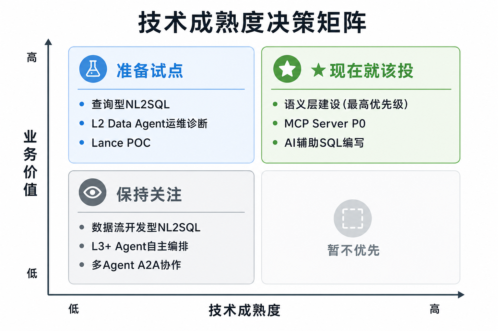

# AI时代的数据智能技术变革

> **培训时长**：4小时（含课间休息）  
> **适用对象**：浙江电信无线中心技术人员  
> **日期**：2026年5月  
> **作者**：向春（架构师）  
> **调研基础**：延续24年9月《数据智能技术分析及规划策略》、25年7月《生成式AI驱动的数据治理范式变革洞察》、26年5月《从Data Agent商用元年到知识驱动的范式跃迁》三轮调研成果  
> **版本**：V1.1（图文版）

---

## 目录

- [第一部分：开篇——Data for AI 与 AI for Data（20分钟）](#第一部分开篇data-for-ai-与-ai-for-data)
- [第二部分：Data for AI——非结构化数据驱动的基础设施升级（70分钟）](#第二部分data-for-ai非结构化数据驱动的基础设施升级)
- [课间休息（15分钟）](#课间休息一)
- [第三部分：AI for Data——当 Agent 商用后，知识成为唯一瓶颈（80分钟）](#第三部分ai-for-data当-agent-商用后知识成为唯一瓶颈)
- [课间休息（10分钟）](#课间休息二)
- [第四部分：行动指南——明天早上你能做什么（30分钟）](#第四部分行动指南明天早上你能做什么)
- [第五部分：总结与交流（15分钟）](#第五部分总结与交流)

---

## 第一部分：开篇——Data for AI 与 AI for Data

### 1.1 AI 时代数据领域正在发生两件事

**核心观点：AI时代数据技术的所有变化，最终都收敛到两个方向——一个改变"数据"本身的处理方式，一个改变"数据工作"本身的做法。理解这两个方向的对称结构，是理解后面所有具体技术的钥匙。**

```
┌──────────────────────────────────────────────────────────────────┐
│                                                                  │
│        Data for AI                       AI for Data             │
│        ───────────                       ───────────             │
│        AI 在改变"数据"本身                AI 在改变"数据工作"      │
│                                                                  │
│        改变什么：                         改变什么：              │
│        • 数据的形态（向量/多模态）        • 谁来做（人 vs Agent）  │
│        • 数据的访问方式（语义检索）       • 怎么做（SQL vs 自然语言）│
│        • 数据的处理流程（GPU/流式）       • 做到什么程度（描述→分析）│
│                                                                  │
│        要回答的核心问题：                  要回答的核心问题：       │
│        AI 来消费数据时，                  有了 Agent，                │
│        基础设施跟得上吗？                  数据工作能往什么方向演进？ │
│                                                                  │
│        本次培训第二部分讨论                本次培训第三部分讨论    │
│                                                                  │
└──────────────────────────────────────────────────────────────────┘
```


**为什么是这两个方向，而不是别的？**

数据领域的角色只有两类——**数据的消费方**和**数据工作的执行方**。AI在这两个角色上同时发生了变化：

- 在**数据的消费方**这一侧：过去消费数据的是人（通过SQL/BI工具），现在新增了一类消费者——AI模型。**新消费者带来新需求**——传统数据栈是为人类分析师设计的，无法满足AI的访问模式（向量检索、流式推理、多模态读取）。这就是 **Data for AI** 要解决的问题
- 在**数据工作的执行方**这一侧：过去执行数据工作的是工程师和分析师，现在新增了一类执行者——Data Agent。**新执行者改变工作方式**——但Agent不是"换个皮肤的SQL编辑器"，它需要的不是更好的语法支持，而是对业务的真正理解。这就是 **AI for Data** 要解决的问题

**两个方向的关系——独立但必须并行**：

| | Data for AI | AI for Data |
|--|------------|------------|
| 关注点 | 基础设施层（存储、计算、处理） | 应用与方法层（治理、分析、决策） |
| 主体 | 数据工程团队 | 数据团队 + 业务团队 |
| 建设节奏 | 渐进式加层（不是推倒重来） | 长期沉淀（知识体系建设） |
| 技术成熟度 | 较高（Ray/Lance/Daft已生产可用） | 中等偏低（L2可用，L3在探索） |

**为什么必须并行？** 基础设施再先进，没有AI来消费就是浪费；AI能力再强，基础设施跟不上就消费不到数据。但它们的建设节奏、技术路径、组织挑战完全不同——所以本次培训分两部分讲。

---

### 1.2 这两件事在24-26年的演进脉络

**核心观点：过去两年半，我们持续跟踪这两个方向的技术演进。每一年都在回答同一个问题的更深版本——26年最大的变化不是又出现了什么新技术，而是Agent能力已越过商用门槛后，"知识"成为决定AI在数据领域能走多远的唯一瓶颈。**


| 年份 | Data for AI 的命题 | AI for Data 的命题 | 行业阶段 |
|------|-------------------|-------------------|---------|
| **2024** | 湖仓底座怎么选？（Iceberg确立、多模态存储需求浮现） | Text2SQL能做吗？（工程化路线确认） | **趋势确认期** |
| **2025** | AI原生层怎么加？（Lance/Ray/Daft框架就位） | Agent架构怎么建？（MCP发布、Agentic治理设计） | **架构设计期** |
| **2026** | 技术栈互操作成熟了吗？（REST Catalog统一、向量搜索下推） | 知识够了吗？（Agent商用后知识成瓶颈） | **商用落地期** |

**26年的拐点特征——三个独立信号同时亮起：**

| 信号 | 内涵 | 与无线中心的关联 |
|------|------|---------------|
| 非结构化数据处理技术成熟 | Lance v2.2 GA、Daft+Lance+Ray闭环打通 | 基站照片、告警文本、投诉语音——不再只是"存档" |
| Agent能力实质性商用 | Databricks Genie/Snowflake Cortex/字节Data Agent正式收费 | Data Agent不是空中楼阁——前提条件已成立 |
| 协议生态标准化 | MCP月下载9700万次、A2A协议发布、Linux基金会AAIF成立 | Agent与工具连接有了标准化路径 |

> **对无线中心意味着什么？** 不需要等待——能落地的技术已经存在。但也不能盲目跟进——具体哪些是"现在就该做"、哪些是"准备试点"、哪些是"保持关注"，需要清晰的判断框架。第四部分会给出。

---

### 1.3 本次培训的路线图

整个培训沿着Data for AI和AI for Data两条主线展开，最后汇聚到具体的行动选择：

```
第一部分（本部分，20分钟）：开篇——两个方向的框架与演进脉络
                                ↓
第二部分（70分钟）：Data for AI——非结构化数据驱动的基础设施升级
                  关键词：AI 数据湖、Ray、Lance、Daft、加层不替换
                                ↓
第三部分（80分钟）：AI for Data——Agent 商用后，知识成为唯一瓶颈
                  关键词：三层知识、Data Agent、NL2SQL、L2→L3 跃迁、MCP+A2A
                                ↓
第四部分（30分钟）：行动指南——明天早上你能做什么
                  关键词：技术成熟度矩阵、三步落地路径、三个必须警惕的风险
                                ↓
第五部分（15分钟）：总结与交流
```

**两条主线的关系**：第二部分讲"基础设施怎么变"，第三部分讲"工作方式怎么变"——它们是AI时代数据变革的两个独立侧面。第四部分把两条线汇聚到具体的行动选择上。

---

## 第二部分：Data for AI——非结构化数据驱动的基础设施升级

### 2.1 切入点：不是"数据变多了"，是"数据的性质变了"

**核心观点：AI时代最大的数据变化不是量变，是质变。传统数据栈的架构哲学是为结构化数据设计的——当80%的数据是非结构化的，这个哲学需要升级，而不是替换。**

先看一组数据：

| 指标 | 数据 | 来源 |
|------|------|------|
| 全球数据中非结构化占比 | **80%** | IDC 2025 |
| 非结构化数据年增长率 | **55%** | IDC |
| 企业数据中结构化数据仅占 | **~10%** | Box 创始人 Aaron Levie |
| 近1/3企业非结构化数据贡献了 | **>50% 年数据增量** | CSA 2026 报告 |

**AI时代之前**：非结构化数据是"存着但不用的黑暗数据"——没有技术手段能让计算机理解它们。

**大模型时代**：这个前提被推翻了。LLM能读懂告警文本，多模态模型能分析现场照片，语音识别+情感分析能处理用户投诉录音——非结构化数据从"沉没成本"变成了"可挖掘的资产"。

**这对基础设施意味着什么？**

| 维度 | 传统数据栈的设计假设 | AI时代的实际需求 |
|------|-------------------|------------------|
| 数据类型 | 标量、嵌套结构——行列式表格 | 向量（1536维 embedding）、张量、图像、音频、长文本 |
| 访问模式 | 顺序扫描 + 列投影——适合聚合分析 | 随机访问 + 近似近邻检索（ANN）——适合语义搜索 |
| 更新模式 | 追加写入（Append Only）——数据不可变 | 行级更新——模型迭代需要频繁修正数据 |
| 计算模式 | CPU、批量、无状态——MapReduce哲学 | GPU、流式、有状态——AI训练/推理需要 |
| 消费方 | 人——通过SQL/BI工具查询 | AI——通过向量检索、张量加载、批量推理消费 |

**无线中心的非结构化数据——从"沉睡资产"到"可挖掘金矿"**：

| 数据类型 | AI时代之前 | AI时代之后 | 基础设施要求 |
|---------|-----------|-----------|------------|
| 基站告警文本 | 人工查看、经验判断 | Agent自动分析、关联历史模式、秒级定位 | 文本存储+语义检索 |
| 现场勘查照片 | 存档在文件服务器 | 多模态模型自动识别异常、相似故障检索 | 图像存储+向量索引 |
| 路测日志 | 专业工具解析、离线分析 | AI自动生成趋势分析和异常定位 | 时序数据+流式处理 |
| 用户投诉语音 | 人工接听记录、抽样分析 | 语音识别+情感分析+自动分类+全量分析 | 音频存储+模型推理管道 |
| 设备手册PDF | 按需查阅 | Agent自主检索+关联故障代码+推荐方案 | 文档解析+语义索引 |

**这一节的结论**：基础设施需要升级，但不是推倒重来。升级的方向是——在 Spark + Iceberg 的成熟基座上，为AI工作负载增加新的能力层。

---

### 2.2 AI 数据湖架构：加层，不是替换

**核心观点：AI数据湖是在 Spark + Iceberg 基座之上，为AI工作负载增加一套原生的"处理→计算→存储"栈。两套栈各有分工，通过统一的存储层和元数据层共存。**

**三年调研的视角**：
- 24年我们判断"云原生湖仓一体是新兴架构"——Iceberg被选为湖仓底座
- 25年我们判断"多模态湖仓面向AI时代增强"——Lance/Ray/Daft加入视野
- 26年验证——**技术栈互操作成熟，从蓝图走向工程实践**

```
┌─────────────────────────────────────────────────────────────────┐
│                       应用层                                      │
│           BI 分析  │  ML 训练  │  实时推理  │  Data Agent         │
├─────────────────────────────────────────────────────────────────┤
│                       处理层                                      │
│     Spark（批量 ETL）           │    Daft（多模态 AI 数据处理）       │
│     为人类分析师准备数据          │    为 AI 工作负载准备数据           │
│                                 │    ★26年：REST Catalog统一访问     │
│                                 │    ★26年：向量搜索下推              │
├─────────────────────────────────────────────────────────────────┤
│                       计算引擎层                                   │
│     Spark（批量计算）           │    Ray（AI 任务调度 + 异构计算）     │
│     粗粒度、无状态、CPU           │    细粒度、有状态、GPU              │
├─────────────────────────────────────────────────────────────────┤
│                       表格式层                                     │
│     Apache Iceberg（结构化标准）│  Lance v2.2（AI 多模态数据）        │
│     ACID、时间旅行、分区演进     │    ★Blob V2四种自适应存储模式       │
│     Iceberg 1.10→1.11 稳定期   │    ★ANN索引内置、50%+存储压缩提升   │
├─────────────────────────────────────────────────────────────────┤
│                    ★统一元数据层                                   │
│          Apache Gravitino / Unity Catalog                         │
│          REST Catalog标准 → Daft/Spark/Flink/Ray统一访问          │
│          ★26年关键突破：Iceberg和Lance都可通过REST Catalog统一管理 │
├─────────────────────────────────────────────────────────────────┤
│                       存储层                                       │
│               对象存储（S3 / HDFS / GCS）                          │
└─────────────────────────────────────────────────────────────────┘
```


**26年最关键的工程突破——REST Catalog统一Iceberg和Lance：**

25年的一个核心痛点是"Daft读写Lance需要直连本地路径，无法走统一的Catalog管理"。26年Daft新增REST Namespace Catalog支持后，Iceberg和Lance都可以通过Gravitino/Unity Catalog统一管理——这意味着同一个Catalog中既管理结构化表（Iceberg），也管理AI多模态数据（Lance），上层的Spark/Flink/Ray/Daft都可以通过同一套REST接口访问。

```
25年的状态：
  Iceberg表 → Gravitino Catalog管理 ✓
  Lance数据 → 直连本地路径，无Catalog ✗
  → 两套数据无法统一发现和管理

26年的状态：
  Iceberg表 → REST Catalog ✓
  Lance数据 → REST Catalog（rest://namespace/table） ✓
  → 统一的数据发现接口，Agent可感知全量数据资产
```

**一张对照表理清"谁做什么"**：

| 场景 | 传统栈（Spark+Iceberg） | AI原生层（Ray+Lance+Daft） |
|------|----------------------|--------------------------|
| 基站工参批量ETL | ✓ 每天凌晨跑，Spark最擅长 | — |
| 结构化报表查询 | ✓ Iceberg + Spark SQL | — |
| 基站照片相似故障检索 | — | ✓ Lance ANN索引 + Daft分布式处理 |
| 实时异常检测模型推理 | — | ✓ Ray GPU调度 + Daft流式处理 |
| 维修记录语义搜索 | — | ✓ Lance向量检索 |
| 历史数据时间旅行 | ✓ Iceberg时间旅行 | ✓ Lance版本管理 |

**这一节的结论**：AI数据湖不是"更好的数据仓库"，而是让同一份基础设施既能服务人类分析师（通过 Spark + Iceberg），也能服务AI工作负载（通过 Ray + Lance + Daft）。26年的统一元数据层突破，让这两套栈真正成为一个整体。

---

### 2.3 存储格式的进化：Parquet vs Lance——不同消费者的不同选择

**核心观点：Parquet是为"列式分析"设计的——服务于人类查询。Lance是为"AI消费数据"设计的——服务于模型检索和训练。设计目标不同，不是谁取代谁。**

**Parquet的三个哲学假设在AI场景中的破裂**：

| Parquet的假设 | AI场景的现实 | 为什么破裂 |
|:------------|:------------|:----------|
| 消费者是人，访问模式是列扫描 | 消费者是模型，访问模式是"给我找和这张照片最相似的10个基站现场" | 向量相似度检索（ANN），不是列扫描。Parquet没有ANN索引 |
| 数据是行列式的 | 一个基站的完整数据 = 工参（结构化）+ 现场照片（JPEG）+ 维修记录（文本）+ embedding（向量） | 多模态数据，把2MB图片存成Parquet的BLOB列读取效率极低 |
| 写入后不改，Append Only | 模型迭代要频繁更新embedding、修正标签、回填预测结果 | Parquet的文件级不可变性意味着每次更新要重写整个文件 |

**Lance在列式存储基础上增加的三项原生能力（26年 v2.2 GA状态）：**

```
┌─────────────────────────────────────────────────────────────┐
│                    Lance v2.2 的三项原生能力                    │
├─────────────────────────────────────────────────────────────┤
│                                                             │
│  能力一：向量原生——ANN索引内置于存储格式中                      │
│  • 不需要单独的向量数据库（Milvus/Qdrant）                      │
│  • embedding列和结构化列在同一行，一次查询同时返回               │
│  • 26年：全文搜索性能提升3-8倍，分页搜索支持                    │
│                                                             │
│  能力二：多模态存储——Blob V2 四种自适应存储策略                  │
│  • Inline（<64KB小对象直接存列内）                              │
│  • Packed（中等对象打包存储）                                   │
│  • Dedicated（大对象独立文件）                                  │
│  • External（超大对象外部引用）                                 │
│  • 自动选择策略——不让人来决定"这个照片该存哪"                    │
│  • 26年：存储压缩比提升50%+                                    │
│                                                             │
│  能力三：零拷贝更新 + 版本管理                                   │
│  • 行级更新不重写整个文件                                       │
│  • 每次更新自动创建版本——embedding生成时间可追溯                │
│  • 26年：流式大规模Insert/Merge操作支持                         │
│                                                             │
└─────────────────────────────────────────────────────────────┘
```

**工程决策指南——什么场景用什么：**

| 场景 | 用什么 | 为什么 |
|------|--------|--------|
| 基站工参表（cell_id, longitude, latitude...） | Iceberg + Parquet | 纯结构化、列式查询、需要ACID |
| 基站性能时序数据（rsrp, sinr, timestamp） | Iceberg + Parquet | 列式扫描聚合、分区演进 |
| 基站现场照片+维修记录（需要"找相似故障"） | Lance | 向量检索、多模态存储、照片和embedding同处一行 |
| AI模型训练数据集（特征向量+标签+原始数据引用） | Lance | 随机访问、版本管理、频繁更新embedding |
| 跨表关联查询（"统计每个区域的故障基站数量"） | Iceberg | SQL分析、需要JOIN |

**格式选择的原则：看数据的消费者是谁。** 人消费的数据用Parquet/Iceberg，AI消费的数据用Lance。同一个数据湖中两套格式共存，通过统一的REST Catalog管理。

---

### 2.4 计算引擎的进化：Ray和Spark，各管一摊

**核心观点：Spark和Ray的设计哲学服务于不同场景。Spark是货运火车——运量大、稳定、路线固定；Ray是无人机群——灵活、实时、可适应异构硬件。**


**架构哲学的根本差异**：

| 维度 | Spark（2014，MapReduce基因） | Ray（2017，AI工作负载基因） |
|------|-------|-----|
| **任务粒度** | 粗粒度（秒~分钟） | 细粒度（毫秒级） |
| **状态管理** | 无状态 | Actor模型原生有状态 |
| **GPU调度** | 有限 | 原生——GPU作为一等资源 |
| **吞吐能力** | 万级任务/秒 | 百万级任务/秒 |
| **适用场景** | 大规模批量ETL、SQL分析 | AI全流程（训练→调优→推理） |

**25年调研结论**：Ray AI计算平台与Spark和Flink形成互补，构建完整的计算生态体系。26年这个判断完全验证——Ray生态持续成熟，与Spark/Flink的互补格局稳固。

**无线中心的实际工作流——它们怎么分工：**

```
凌晨 2:00 — Spark 的工作时间                    全天 — Ray 的工作时间
──────────────────────────                     ──────────────────────
1. 读入昨日所有基站性能数据（TB级）               1. 加载异常检测模型到GPU
2. 清洗：过滤异常值、补齐缺失                      2. 接收实时性能数据流
3. 关联合并：cell_info + perf_data + alarm_log   3. 逐条推理：正常波动还是异常？
4. 聚合计算：按区域/时间窗口统计指标                4. 发现异常→关联天气+维护记录
5. 写入Iceberg表（供第二天查询）                 5. 生成告警+推荐根因
                                                   ↓
                                             结果写回Iceberg/Lance
                                             （供Spark第二天批量分析）
```

**边界标注**：Ray不取代Spark做批量ETL。Spark不取代Ray做AI任务调度。两者通过共享的存储层交换数据。

---

### 2.5 处理框架Daft：打通结构化与非结构化的"胶水"

**核心观点：Daft在Ray上运行，可以读Iceberg表也可以写Lance格式，用同一套DataFrame API同时处理结构化和非结构化数据。**

**DataFrame框架进化路线的深层逻辑：**

```
Pandas (2008)        Polars (2021)        Daft (2023→2026)
单机 / 内存限制       单机 / 高性能          分布式 / 多模态
Python 原生           Rust 内核             Rust内核 + Ray集成
                                           ★26年：REST Catalog统一
                                           ★26年：向量搜索下推
────────────────────────────────────────────────────────────▶
           解决性能问题              解决"规模 × 多模态"问题
```

**26年的关键突破——向量搜索下推：**

```
25年的流程：
  Daft读取Lance全量数据 → 在应用层做向量搜索 → 低效

26年的流程：
  Daft发起带向量查询的读取请求 → Lance ANN索引在存储层完成检索
  → 只返回Top-K结果 → 高效
```

**无线中心具体场景——Daft + Ray + Lance闭环：**

```
任务："找出和基站 A 现场环境最相似的 5 个基站"

1. Daft加载基站A的现场照片 → 解码、缩放
2. Daft调用Ray上的GPU → CLIP模型生成embedding
3. Daft将embedding写入Lance表"site_embeddings"
4. ★26年新增：Daft直接发起带向量查询的读取
   → Lance的ANN索引在存储层完成检索 → 秒级返回Top-5
5. Daft关联站点工参（从Iceberg表）→ 输出完整结果：
   "相似站点B（距离3.2km，海拔相似，去年同样出现过天线腐蚀问题）"
```

**边界标注**：Daft不替代现有ETL管道。Spark ETL作业继续用Spark跑。Daft处理的是新增的AI数据处理需求。

---

### 2.6 业界大厂动态：从"数据平台"到"AI原生数据平台"

**核心观点：26年国际三大云数据平台的竞争焦点发生了根本性转移——从24年的"谁的湖仓更好"（存储和计算），到25年的"谁的AI集成更深"（AI原生能力），到26年的"谁能让Agent理解更多的业务上下文"（知识）。**

**国际厂商26年关键动态：**

| 厂商 | 核心战略 | Agent产品 | 知识/Catalog | 与AI数据湖架构的对应 |
|------|---------|-----------|-------------|---------------------|
| **Databricks** | AI原生数据智能平台 | ★Genie Agent Mode（规划→测试→迭代→报告）；★Genie Code（自主处理Pipeline） | Unity Catalog AI增强 | 最接近"加层不替换"思路 |
| **Snowflake** | Agentic Enterprise控制平面 | ★Snowflake Intelligence（个人工作Agent）；★Cortex Code（理解整个数据栈） | Horizon Catalog + MCP连接器 | 偏"AI for Data"——Agent驱动分析 |
| **Google BigQuery** | Agentic Data Cloud | ★Conversational Analytics；★BigQuery MCP Server | ★**Knowledge Catalog**（通用上下文引擎，为Agent提供业务含义） | 偏一站式——模型+数据合一 |

**26年三巨头的共同趋势：**
1. **Agent Mode成为产品核心功能**——不再是"加分项"而是"必须有"
2. **MCP成为通用标准**——三家全部支持MCP，Agent-工具连接标准化
3. **知识/上下文成为竞争维度**——Google提出Knowledge Catalog概念，不只是元数据目录，是"为Agent提供业务上下文的知识引擎"

**国内厂商26年关键动态：**

| 厂商 | 25年 | 26年 | 核心变化 |
|------|------|------|---------|
| **阿里DataWorks** | Copilot辅助 | Agent全链路商业化（4月起收费），覆盖开发/集成/治理/运维/分析 | Agent从"增值功能"→"独立计费产品线" |
| **华为** | DataArts AI4Data | ★AgentArts独立智能体平台上线，MCP支持OAuth2.0鉴权 | Agent平台独立运营 |
| **字节火山引擎** | Data Agent概念发布 | ★Data Agent正式商用，升级到3.0版本；发布国内首个Data Agent评测体系 | **有实际案例数据**：分析效率提升50%~100倍 |

> **这一节的结论**：技术已经不是瓶颈（三家的Agent执行能力都足够强），**知识才是差异化的核心竞争力**。这个洞察将在第三部分展开。

---

## 课间休息一

> 休息15分钟

---

## 第三部分：AI for Data——当 Agent 商用后，知识成为唯一瓶颈

### 3.1 一个被严重低估的问题：Agent能干 ≠ 能干对

**核心观点：26年，Data Agent已经全面商用——阿里/华为/字节都已正式收费。但商用后暴露出一个被严重低估的问题：Agent的"执行力"不是瓶颈，"知不知道该怎么干"才是。**

**调研证据链：**

| 证据来源 | 证明了什么 |
|---------|-----------|
| Spider 2.0 基准（2026年） | GPT-4o直连数据库仅5.68%→~10%准确率，工程化Agent达96.70%——**差距来自知识约束，不是模型能力** |
| 字节Data Agent商用效果 | 效率提升100倍的前提是"Agent被灌入了充足的业务知识和分析模板"——**没有知识的Agent只是快速生成错误** |
| Google Knowledge Catalog | 三巨头的产品创新从"存储/计算"转向"为Agent提供业务上下文"——**知识是新的竞争维度** |

想象你让一个非常聪明但第一天上班的新同事做这件事——"分析为什么上月华东基站性能下降"：

```
Agent 能做到的（执行力）✓：         Agent 做不到的（需要知识）✗：

写对SQL语法                       查哪些表？perf_data 还是 cell_config？
按格式输出结果                     "性能下降"用什么指标衡量？RSRP低于多少算下降？
多步骤编排——先查数据，再分析       "华东"是什么意思？region_info怎么关联？
工具调用——读表、写报告            分析策略——先查固件变更还是先查天气？
                                  结论判断——"台风导致退服率上升3%"
                                           是故障还是正常现象？
```

**Agent写对了SQL但查的是错的表、用的是错的口径、得出的是错的结论——这不是能力问题，是知识问题。**

---

### 3.2 数据工作需要的三层知识——从第一性原理推导

**核心观点：数据工作需要的知识天然分三层。这个分层从"Agent做数据工作缺失什么"反向推导而来，也与26年竞情分析中各厂商的建设重点精确对应。**


```
┌─────────────────────────────────────────────────────────────┐
│            Agent 做数据工作需要什么知识？                        │
├─────────────────────────────────────────────────────────────┤
│                                                             │
│  ┌─────────────────────┐  ← 层面一：技术元数据                  │
│  │ Schema、字段类型、    │    "数据库里有什么、长什么样"           │
│  │ 表结构、主外键        │    数据库自带，Agent可直接读取          │
│  └─────────────────────┘    对应产品：Catalog/Metastore          │
│           ▲ 必要但不充分                                      │
│                                                             │
│  ┌─────────────────────┐  ← 层面二：业务元数据                  │
│  │ 指标定义、维度、       │    "数据代表什么业务含义"             │
│  │ 业务术语、口径规则     │    需要人定义，是当前业界建设重点       │
│  └─────────────────────┘    对应产品：dbt Semantic Layer/Cube   │
│           ▲ 解决"能查对"，但解决不了"能分析对"                    │
│                                                             │
│  ┌─────────────────────┐  ← 层面三：业务知识                   │
│  │ 领域经验、因果逻辑、    │    "数据背后的故事——为什么是这样、      │
│  │ 组织知识、决策上下文、  │     应该怎么想、什么更重要"            │
│  │ 历史案例与模式         │    最厚重，最难沉淀，最有价值           │
│  └─────────────────────┘    对应产品：Google Knowledge Catalog  │
│           ▲ 不止服务Data Agent，业务Agent同样依赖              │
│                                                             │
└─────────────────────────────────────────────────────────────┘
```

#### 层面一：技术元数据——"数据库里有什么"

数据库自带，Agent可以通过introspection自动获取。

```
cell_info 表：
  cell_id     VARCHAR(32)   -- 基站标识
  site_name   VARCHAR(128)  -- 站点名称
  longitude   FLOAT         -- 经度
  latitude    FLOAT         -- 纬度
  region_id   INT           -- 区域ID

perf_data 表：
  cell_id     VARCHAR(32)   -- 外键关联 cell_info
  rsrp        FLOAT         -- 参考信号接收功率 (范围: -140~-44 dBm)
  sinr        FLOAT         -- 信号与干扰加噪声比
  timestamp   TIMESTAMP     -- 采集时间
```

只有层面一的Agent："能连上数据库但不知道查什么的查询机器"——你必须告诉它精确的表名、字段名。

#### 层面二：业务元数据——"数据代表什么"

这一层需要人来定义。24年调研中华为DataArts的"数据湖→知识湖"探索、25年调研中定义的"语义层"概念——都在建设层面二。

```
指标定义：
  基站可用率 = SUM(available_duration) / SUM(total_duration)
  → 忙时可用率（8:00-22:00）：用于运维考核
  → 全天可用率（0:00-24:00）：用于统计报表
  → 不同场景用不同口径——不是"哪个对"，是"哪个适用"

业务术语映射：
  "覆盖质量" 在不同部门的含义：
  → 网优中心：RSRP + SINR（技术指标）
  → 市场部：综合评分（含用户投诉权重）
  → 同一个词，不同部门的Agent需要不同的查询逻辑

维度关系：
  "华东区域" = region_info.region_name = '华东' 
    → 通过 cell_info.region_id 关联
    → 包含6个省、3127个基站
```

有了前两层的Agent："能准确取数但不懂业务的工具"——给你一个准确数字（"可用率99.87%"），但不会告诉你"下降趋势持续了3个月，值得关注"。

#### 层面三：业务知识——"数据背后的故事"

**这是最厚重、最难形式化、也最有价值的一层。** 26年的调研结论是：**这一层是Agent从L2走向L3的决定性因素，也是长期竞争壁垒。**

```
领域经验（从未被文档化）：
  "基站性能下降，排查顺序不是随机的——
   先查固件版本变更（最常见根因，占80%）；
   排除固件后，再查天气因素（台风/暴雨）；
   最后才怀疑设备故障。
   这个顺序本身就是一个决策模型。"

因果知识（区分"相关"和"因果"）：
  "台风季节沿海基站退服率上升3-5%是正常现象，不代表设备问题——
   但如果内陆基站同时出现退服率上升，那就是异常。"

组织知识（理解为什么规则是这样的）：
  "华东区域可用率目标99.95%而西南99.8%——
   因为华东有金融客户SLA对赌条款。
   Agent在做优化建议时，必须知道这个优先级差异。"

决策上下文（历史案例的模式匹配）：
  "去年8月出现过同样的RSRP异常模式——
   凌晨2:00-4:00突降10dBm，15分钟后自动恢复。
   当时是v3.2.1固件bug，回滚后恢复。
   如果这次波形模式相同，优先检查近期固件升级窗口。"
```

**当前行业状态——与调研结论精确对应：**

| 知识层 | 当前状态 | 建设难度 | 26年调研判断 |
|--------|---------|---------|------------|
| 层面一 | 天然可得 | 低 | 所有L2+产品已自动获取 |
| 层面二 | 工具链成熟但建设不足 | 中 | 语义层已从"可选项"变成"必选项"（见3.5节） |
| **层面三** | **几乎空白** | **极高** | **26年最值得投入的方向——长期竞争壁垒** |

**关键洞察——层面三不止服务Data Agent**：

所有类型的Agent都需要同一份"业务知识"——它不是Data Agent的专属资产，而是企业的通用知识基础设施。这意味着层面三的建设投入可以被多个Agent场景复用。

---

### 3.3 六级自治体系与26年行业位置

**核心观点：Data Agent的L0→L5分类（清华&港科广，2026）本质上是"Agent能自主获取和使用哪层知识"的递进。26年最大的变化是——L2已成行业入门门槛，Proto-L3在限定场景可用。**


| 等级 | 名称 | 本质：能自主获取什么知识？ | **26年产品化状态** |
|------|------|--------------------------|-----------------|
| L0 | 无自治 | 无——所有知识都在人脑子里 | 遗留系统 |
| L1 | 辅助 | 训练数据中的通用知识 | **已成标配**（所有数据平台都有AI SQL助手） |
| L2 | 部分自治 | **层面一可自动获取**——能读Schema | **主流产品均达到**（Genie/Cortex/DataWorks Agent） |
| Proto-L3 | 条件自治 | **层面二已结构化**——可检索指标定义 | **少数场景可用**（需完备语义层+限定主题域） |
| L4 | 高度自治 | **层面三已部分形式化**——能识别异常 | 研究阶段 |
| L5 | 完全自治 | 超越现有知识体系 | 远期愿景 |

**L2→L3：26年最重要的跃迁节点**

```
L2（当前主流）：                    Proto-L3（26年部分场景可达）：
人："你先查perf_data表，            人："分析华东基站性能下降原因"
    过滤3月华东数据，                     ↓
    计算RSRP均值……"                Agent自主决定：
    ↓                              → 查哪些表？
Agent逐步执行                       → 用什么指标衡量"性能下降"？
任务主导权在人                       → 分析路径怎么设计？
                                    → 怎么验证结论？
                                    任务主导权在Agent

L2→L3的前提：层面二（业务元数据）必须结构化
```

**26年Proto-L3可行的场景特征：**

| 条件 | 要求 |
|------|------|
| 主题域范围 | **限定**（如仅覆盖"基站性能"和"告警统计"两个域） |
| 层面二完备度 | **高**（核心指标定义、维度映射、口径规则全部结构化） |
| 分析路径 | **已文档化**（分析SOP已从老工程师脑中提取并形式化） |
| 人工审核 | **保留**（Agent输出结论需人工确认，不直接触发操作） |

> **结论**：L2→L3的跃迁不是技术问题，是知识准备问题。

---

### 3.4 NL2SQL检验场：26年的精确量化验证

**核心观点：NL2SQL不是一件事，是两件难度完全不同的事——查询型和数据流开发型。Spider 2.0基准在26年给出了精确的量化验证。**


**24年→25年→26年的NL2SQL演进：**

| 年份 | 判断 | 验证 |
|------|------|------|
| 24年 | "Text2SQL是大模型操控结构化数据的主要途径"，以工程化提升准确率 | 方向正确 |
| 25年 | "查询型接近实用门槛；数据流开发型远未成熟" | 需更新——25年最高~75% |
| **26年** | **查询型"毕业"（96.70%）；数据流开发型在快速追赶但差距仍大** | Spider 2.0最新排行榜 |

**Spider 2.0 2026年最新排行榜——工程化Agent显著进步：**

| 轨道 | 25年最高 | 26年最高 | 含义 |
|------|--------|--------|------|
| **Snow（单库查询型）** | ~75% | **96.70%**（Genloop Sentinel Agent v2 Pro） | **查询型NL2SQL已够商用** |
| **Lite（多库）** | ~72% | ~80%+ | 跨库场景在快速改善 |
| **DBT（项目级代码Agent）** | 58.82% | Databao Agent登顶（有提升但仍挑战） | **数据工程仍是最难场景** |
| **GPT-4o基线** | 5.68% | ~10% | 纯模型提升极有限——**工程化方法是关键** |

**核心洞察——不是模型不够强，是知识不够多：**

GPT-4o基线从5.68%→~10%（不到2倍），工程化Agent从~75%→96.70%——两者的差距核心来自知识约束（语义层、指标定义、方言规则）。论文尝试给模型提供Oracle函数文档，准确率仅从5.68%提升到5.85%——**模型不缺语法知识，缺的是"什么时候该用什么"的业务判断力。**

**务实策略——不同成熟度的不同应对：**

| 场景 | 当前可用性 | 建议 |
|------|-----------|------|
| 查询型NL2SQL | **已成熟**（有语义层可达96.70%） | 在层面一+二完备的场景可以试点。80%+已能大幅降低查数人力成本 |
| 数据流开发型（单库） | 工程化Agent可达70%+（Lite轨） | 限定场景 + 层面二约束 + 人工审核——可辅助，不能替代 |
| 数据流开发型（项目级） | 不可靠 | 保持关注。层面三的缺失是根本性的 |

---

### 3.5 语义层——从"可选项"变成"必选项"

**核心观点：24年调研中语义层尚未作为独立项，25年判断为"大模型理解结构化数据的桥梁"，26年判断更加坚定——语义层是Agent产品可靠性的决定性因素，没有它一切都是空中楼阁。**

**证据链——为什么26年语义层是"必选项"：**

| 证据 | 指向 |
|------|------|
| Spider 2.0 Snow轨在有语义约束时96.70%，无约束时GPT-4o仅10% | 语义层是NL2SQL从"玩具"到"商用"的分界线 |
| Google推出Knowledge Catalog | 云厂商开始将语义层产品化 |
| 字节Data Agent效率提升100倍的前提是业务知识充分灌注 | 商用效果强依赖知识完备度 |
| 三巨头Agent Mode均要求"业务元数据高度完备"才能使用 | Agent产品本身就是语义层的消费者 |

**语义层建设的三步走路径（25年提出的架构，26年有了明确的工具链）：**

| 步骤 | 内容 | 工具 | 产出 |
|------|------|------|------|
| **Step 1：统一指标平台** | 梳理核心指标定义（最高频使用的20-50个） | dbt Semantic Layer / Cube | 指标目录 + 口径文档 |
| **Step 2：维度映射** | 明确业务术语与技术字段的映射关系 | 元数据管理工具 | 术语表 + 关联关系图 |
| **Step 3：业务知识沉淀** | 将老工程师的经验、分析SOP形式化 | RAG知识库 + 结构化模板 | 知识库 + 分析模板 |

**25年调研对语义层的架构描述——26年仍然适用：**

```
语义模型（输入）：                      语义模型（核心）：
• 数据源（技术元数据）                   • Dimension（维度）
• 文档（知识）                          • Fact（事实）
• 资产管理系统（业务元数据）              • Metric（指标）
                                        • Relationship（关系）
        ↓                               • Verified Query（验证查询）
                                        • Custom Instruction（自定义指令）
语义增强：                              
• 描述推断（LLM辅助补全）               数据应用（输出）：
• 关系推断                              • ChatBI
• 类型推断                              • AI Agent
                                        • Application
```

> **结论**：26年，任何想要部署Data Agent（L2级及以上）的组织，语义层建设都是前置条件。Spider 2.0的数据充分证明：**在没有语义层的情况下让LLM直连数据库，等于在沙地上盖楼。**

---

### 3.6 MCP + A2A：Agent协议生态——数据平台的"新基建"

**核心观点：25年MCP是"新事物"，26年MCP+A2A已成为"事实标准"。数据平台的MCP化不再是"要不要做"的问题，而是"优先级怎么排"的问题。**


**25年→26年的质变：**

| 维度 | 25年状态 | 26年现状 |
|------|--------|--------|
| **MCP采用率** | Anthropic刚发布、少数先行者试用 | **月SDK下载9700万次**，OpenAI/Google/Microsoft/Amazon全部采用 |
| **A2A协议** | 尚未发布 | Google 2025年4月发布，2400+仓库，Salesforce/SAP等50+合作伙伴 |
| **治理框架** | 无 | **Linux基金会成立AAIF**，MCP/A2A/ACP统一纳入治理 |

**MCP + A2A双层协议栈——解决25年架构设计中的工程落地问题：**

```
┌─────────────────────────────────────────────────────────────────┐
│                    A2A（Agent-to-Agent）                          │
│         水平层：Agent间发现、协商、协作、委托任务                       │
│     例：设计Agent将"建表任务"委托给开发Agent                        │
├─────────────────────────────────────────────────────────────────┤
│                    MCP（Model Context Protocol）                  │
│          垂直层：Agent连接外部工具、API、数据库、数据源                  │
│     例：开发Agent通过MCP Server操作Spark/Flink/数据库                │
└─────────────────────────────────────────────────────────────────┘
```

**对数据平台的直接影响——25年的"多Agent协同"有了标准化落地路径：**

| 25年设想 | 26年实现路径 |
|--------|----------|
| 设计Agent ↔ 开发Agent ↔ 运维Agent需要自建通信机制 | **A2A协议标准化Agent间任务协商** |
| Agent操作数据库/ETL工具需要定制化集成 | **MCP Server标准化Agent-工具连接**（Snowflake/BigQuery已发布官方MCP Server） |
| 多Agent协同缺乏统一安全审计模型 | **AAIF治理框架提供统一认证、路由、可观测性规范** |

**数据平台MCP化的优先级排序：**

| 优先级 | MCP Server | 覆盖能力 | 复杂度 |
|--------|-----------|---------|--------|
| **P0（立即）** | 数据库MCP Server（查询/Schema获取） | 替代Agent直连数据库的定制化集成 | 低 |
| **P1（3个月内）** | 元数据/Catalog MCP Server | Agent获取业务元数据和血缘信息 | 中 |
| **P2（6个月内）** | ETL/数据集成MCP Server | Agent编排数据Pipeline | 中-高 |
| **P3（探索）** | 多Agent A2A协作 | 跨角色Agent协同 | 高 |

---

### 3.7 智能数据治理：从规则驱动到知识驱动

**核心观点：传统数据治理用规则补偿知识的缺失——因为机器不理解业务含义，必须靠人写规则。AI驱动的治理把逻辑反过来——用知识替代规则。**

**24年→25年→26年的治理范式演进：**

| 年份 | 范式 | 代表做法 |
|------|------|---------|
| 24年 | 规则驱动 + AI辅助 | 传统治理体系 + Text2SQL初步辅助 |
| 25年 | Agent辅助治理 | 多Agent协同设计（设计Agent↔开发Agent↔运维Agent） |
| **26年** | **知识驱动的自治治理** | Agent基于三层知识持续理解数据，实时监控+自动诊断 |

```
传统方式：规则驱动                    AI驱动：知识驱动
──────────────                      ──────────────
"我不知道什么是'好的数据'，            "我理解数据代表什么，
 所以你必须告诉我规则"                   所以我能自己判断"

人工编写校验规则（几百条）             Agent用三层知识持续理解数据
→ 定时巡检（每天/每周扫一遍）          → 实时监控（数据写入即检查）
→ 发现问题（已经过了15-30天）          → 秒级发现（写入时拦截）
→ 人工排查（数小时定位根因）           → 自动定位根因 + 推荐修复
→ 手动修复（改数据/改规则）            → 从源头修复（改认知）
```

**各层知识在治理中的具体作用：**

| 知识层 | 能发现的问题 | 例子 |
|--------|------------|------|
| 层面一 | Schema漂移、类型不一致、空值率异常 | `rsrp`字段突然从FLOAT变成VARCHAR |
| 层面二 | 指标口径冲突、维度不一致 | 市场部和网优中心的"覆盖质量"用不同字段组合 |
| 层面三 | **数据合规但业务逻辑不对——规则永远发现不了** | 台风期间沿海基站退服率5%——数值超标但业务正常 |

**25年调研中的Agentic数据治理架构——26年通过MCP+A2A有了标准化落地路径：**

```
┌─────────────────────────────────────────────────────────────┐
│                    交互层                                      │
│     自然语言交互  │  进度可视化  │  执行确认与修正              │
├─────────────────────────────────────────────────────────────┤
│                    智能体层（按数据全生命周期）                    │
│  设计Agent ←A2A→ 开发Agent ←A2A→ 运维Agent ←A2A→ 分析Agent   │
├─────────────────────────────────────────────────────────────┤
│                    语义层                                      │
│  语义采集 → 语义存储 → 语义评估 → 语义增强 → 知识库             │
├─────────────────────────────────────────────────────────────┤
│                    数据应用基座                                  │
│  MCP Server（任务调度/NL2SQL/数据集成/开发/资产管理/数据服务）    │
├─────────────────────────────────────────────────────────────┤
│                    多模态湖仓                                   │
│  Spark + Flink + Ray │ Iceberg + Lance │ 统一元数据             │
└─────────────────────────────────────────────────────────────┘
```

> **结论**：数据治理的终局不是"规则越来越多"，而是"规则越来越少，知识越来越厚"。当Agent真正理解数据的业务含义时，大部分"校验规则"就变成了冗余。

---

### 3.8 电信场景贯穿：完整根因分析中三层知识的递进贡献

```
任务："分析上月华东区域基站性能下降的根因，输出影响因素排序"

Agent 的执行流程与知识依赖：

Step 1: 确定查什么表
  → 层面一：知道需要 perf_data、maintenance_log、weather_data三张表
  → 层面一：知道通过 cell_id + timestamp 关联

Step 2: 确定"性能下降"的度量标准
  → 层面二："性能下降" = RSRP < -110dBm 持续15分钟
  → 层面二：影响范围 > 3个基站才算"区域性问题"

Step 3: 设计分析路径
  → 层面三：先查固件版本变更——80%的概率是根因
  → 层面三：再查天气——排除沿海基站台风影响
  → 层面三：最后查设备故障——单站逐一排查

Step 4: 判断结论
  → 层面三：发现3月12日批量固件升级后RSRP波动增大
  → 层面三：模式与去年8月v3.2.1的bug高度相似（波形匹配）
  → 层面三：排除天气——同期沿海基站未出现类似波动

结论：根因→固件升级（v4.1.0），影响17个基站，建议回滚或等热修复
```

**没有层面三的Agent输出**："3月华东区域有23个基站出现RSRP异常波动，其中17个与固件升级时间窗口重叠，6个与台风天气相关。"——这是"数据汇总"。

**有了层面三的Agent输出**："根因是3月12日的v4.1.0固件升级，影响17个基站。判断依据：波动模式与去年8月v3.2.1已知bug高度一致；排除天气因素后剩余17个基站均在同一批次升级范围内。建议回滚至v4.0.2或等厂商发布热修复。"——这是"可行动的诊断"。

**两者的区别，就是层面三的价值。**

---

## 课间休息二

> 休息10分钟

---

## 第四部分：行动指南——明天早上你能做什么

**本部分从三个角度回答行动问题：**
- **4.1 技术成熟度决策矩阵**——回答"哪些值得做"（横向选择）
- **4.2 三步落地路径**——回答"按什么顺序做"（纵向时序）
- **4.3 三个必须警惕的风险**——回答"哪里容易翻车"（避坑指南）

---

### 4.1 技术成熟度决策矩阵

**核心观点：分清三个类别——"现在就该做"、"准备试点"、"保持关注"——分界线是技术成熟度 × 业务价值。**



```
                        业务价值高
                            │
         ┌──────────────────┼──────────────────┐
         │                  │                  │
         │ 准备试点          │  ★现在就该投       │
         │                  │                  │
         │ • 查询型NL2SQL    │ • 语义层建设       │
         │   限定域试点      │   （最高优先级）    │
         │ • L2 Data Agent  │ • MCP Server     │
         │   运维诊断试点    │   P0级立即建设     │
         │ • Lance POC      │ • AI辅助SQL编写    │
         │                  │   （L1已成标配）    │
技术成熟 ──┼──────────────────┼──────────────────┼── 技术成熟
度中等    │                  │                  │   度高
         │ 保持关注          │                  │
         │                  │                  │
         │ • 数据流开发型    │                  │
         │   NL2SQL         │                  │
         │ • L3+ Agent      │                  │
         │   自主编排        │                  │
         │ • 多Agent A2A    │                  │
         │   协作           │                  │
         └──────────────────┼──────────────────┘
                            │
                        业务价值
```

#### 第一象限：现在就该投

| 方向 | 具体行动 | 预期收益 | 调研支撑 |
|------|---------|---------|---------|
| **语义层建设** | dbt/Cube统一核心指标定义（层面二），同步开始层面三知识沉淀 | Agent可靠性的基石——没有它一切NL2SQL和Agent都是空中楼阁 | Spider 2.0：有语义层96.70% vs 无语义层10% |
| **MCP Server P0** | 数据库查询/Schema获取MCP Server | Agent触达数据的标准化基础——复杂度低且价值明确 | 26年MCP月下载9700万次，已成事实标准 |
| **AI辅助SQL编写** | 引入AI SQL助手，在现有环境中提升日常取数效率 | 立竿见影——L1能力已成熟，不部署即落后 | 所有主流数据平台已标配L1 |

#### 第二象限：准备试点

| 方向 | 前提条件 | 试点场景 | 调研支撑 |
|------|---------|---------|---------|
| 查询型NL2SQL | 层面一+二基本完备 | 日常指标查询、固定报表自动生成 | Snow轨96.70%已证明商用可行 |
| Data Agent L2辅助诊断 | 明确分析流程已文档化 | 基站性能异常自动诊断（限定场景） | 字节Data Agent商用验证：效率提升50%~100倍 |
| Lance POC | 有多模态数据管理需求 | 基站照片+维修记录语义检索 | Lance v2.2 GA，Daft REST Catalog统一已完成 |

#### 第三象限：保持关注

| 方向 | 为什么还不成熟 | 26年调研判断 |
|------|--------------|-------------|
| 数据流开发型NL2SQL | DBT轨在快速追赶但仍远低于Snow轨 | 从"远未成熟"修正为"在快速追赶但差距仍大" |
| Data Agent L3+自主编排 | 层面三缺失是根本瓶颈 | 需先完成层面二建设 + 层面三部分形式化 |
| 多Agent A2A协作 | A2A生态仍在早期 | 协议已有但工程实践不足 |

---

### 4.2 三步落地路径——从"立竿见影"到"深度智能"

**核心原则：从能立刻见效的开始，每一步都为下一步铺路。**


```
Step 1（立刻开始，1-3个月）              Step 2（建基础，3-6个月）              Step 3（深度应用，6-12个月）
─────────────────────────────            ─────────────────────────              ──────────────────────────
见效快，风险低                              基础设施层面                              Agent 能力层面

★ MCP Server P0级建设                   ★ 语义层Step1+2完成                    ★ 查询型NL2SQL试点
  （数据库查询/Schema获取MCP）              （核心指标统一定义                        （限定2-3个主题域，
                                            + 维度映射完成）                        在语义层约束下试点）

★ AI辅助SQL编写全面推广                  ★ 元数据MCP Server建设                  ★ L2级Data Agent试点
  （L1能力已成标配，                        （Agent可发现和理解                       （运维诊断、性能分析
   不部署即落后）                            完整的数据资产）                          等有明确SOP的场景）

★ 层面三知识沉淀启动                     ★ Lance+Daft POC                        ★ Proto-L3评估
  （老工程师经验→                           （选1-2个多模态场景，                     （在Step2语义层完备的
   结构化知识库+RAG）                        验证AI数据湖架构）                       限定域，评估L3可行性）

★ 非结构化数据资产盘点                   ★ AI数据质量监控                         ★ 多Agent协作方案评估
  （搞清楚有什么数据、                       （用层面一+二知识替代                      （A2A协议成熟度评估
   在哪、多少、能做什么）                     部分人工巡检规则）                        + 多Agent试点规划）
```

**每一步的依赖关系：**

- Step 1是独立的——不需要其他步骤就可以开始，产出的知识库直接服务Step 2
- Step 2依赖Step 1的知识盘点——没法统一语义层如果不知道有哪些数据
- Step 3强依赖Step 2——**没有语义层，查询型NL2SQL就是空中楼阁**

---

### 4.3 三个必须警惕的风险——以及为什么每个都很贵

**一、语义层止步于层面二，遗漏层面三**

层面二让Agent"能查对数据"，但不能让Agent"能分析对"。花6个月建了完美的指标定义体系，然后发现Agent能做的只是"自动生成正确但无用的报表"——而竞对在层面三建设上领先了你6个月。

**26年调研验证**：字节Data Agent效率提升100倍的前提是层面三知识的充分灌入。只有层面二，效率提升可能只有5-10倍——差距是数量级的。

**二、把查询型NL2SQL的Demo效果等同于数据流开发型也能做**

每个NL2SQL产品的Demo展示的都是查询型——"帮我查上月基站可用率"。但真正有价值的是数据流开发型——"帮我分析性能下降根因"。Spider 2.0的数据：Snow轨96.70% ≠ DBT轨也能达到。

**有多贵**：买了NL2SQL产品，Demo效果惊艳，上线后发现真正需要AI的分析场景一个都搞不定。团队对方向的信心被透支——"AI数据分析？我们试过了，不行。"

**三、Agent商用后"知识不足"导致的信任危机**

26年Agent全面商用，用户付费后的期望值远高于免费试用期。如果Agent因为层面二/三知识不足而频繁输出"看起来合理但实际错误"的分析——用户信任一旦被破坏，要重建极其困难。

**26年调研结论**：**先建语义层和知识库，再开放Agent——这个顺序不是"最好这么做"，是"只能这么做"。**

---

## 第五部分：总结与交流

### 核心要点回顾

```
┌──────────────────────────────────────────────────────────────────┐
│                    本次培训四句话                                      │
├──────────────────────────────────────────────────────────────────┤
│                                                                  │
│  1. 三年调研的核心结论：从"技术选型"到"知识竞赛"                          │
│     24年选技术（Iceberg/湖仓）→ 25年建架构（Agent/MCP）                 │
│     → 26年的真正瓶颈：知识体系                                         │
│                                                                  │
│  2. 数据的性质变了，基础设施需要加层                                      │
│     80%的企业数据是非结构化的，AI第一次让它们"活过来"                       │
│     不是推倒Spark+Iceberg，是在基座上增加Ray+Lance+Daft                  │
│     26年：技术栈互操作已成熟（REST Catalog统一、向量搜索下推）               │
│                                                                  │
│  3. Agent已商用，但知识决定上限                                         │
│     能力不是瓶颈，知识才是——三层知识模型决定Agent能走多远                    │
│     Spider 2.0验证：有语义层96.70% vs 无语义层10%                        │
│     MCP+A2A协议栈为Agent生态提供了标准化的工程基础                         │
│                                                                  │
│  4. 现在最值得做两件事                                                │
│     • 建好三层知识体系——从统一指标定义开始，向业务知识沉淀演进                │
│     • MCP Server P0级建设——让Agent能标准化地触达数据                      │
│                                                                  │
└──────────────────────────────────────────────────────────────────┘
```

### 如果只带走一句话

> **24年的命题是"Data+AI融合趋势确立"，25年的命题是"Agent架构如何设计"，26年的命题已经转变为——**
>
> **Agent能力已经不是瓶颈，知识才是。**
>
> 基础设施可以追赶（Iceberg/Lance/Ray的技术差距可以用6-12个月弥平），
> 但知识体系不能（层面三的沉淀需要组织级的持续投入，是真正的长期竞争壁垒）。
>
> **26年最值得做的一件事：在部署任何Agent产品之前，先把语义层和业务知识库建起来。**

---

### 推荐阅读与参考

| 类别 | 资源 | 说明 |
|------|------|------|
| 综述论文 | A Survey of Data Agents (2026) | 清华/港科广团队，Data Agent L0-L5分类体系 |
| 基准论文 | Spider 2.0 (ICLR 2025 Oral) | 企业级Text-to-SQL基准，632个真实工作流问题 |
| 技术文档 | Ray Documentation v2.50 | Ray分布式计算框架官方文档 |
| 技术文档 | LanceDB Documentation | Lance格式与LanceDB向量数据库 |
| 技术文档 | Daft Documentation | Daft分布式DataFrame框架 |
| 产品报告 | Databricks State of Data+AI 2026 | 行业趋势与产品方向 |
| 协议文档 | MCP Specification / A2A Protocol | Agent协议生态 |
| 技术博客 | dbt Semantic Layer Blog | 语义层建设最佳实践 |
| 内部调研 | 24年9月《数据智能技术分析及规划策略》 | Data+AI融合趋势分析与策略 |
| 内部调研 | 25年7月《生成式AI驱动的数据治理范式变革洞察》 | Agentic AI与多模态湖仓架构 |
| 内部调研 | 26年5月《从Data Agent商用元年到知识驱动的范式跃迁》 | 知识驱动范式与Agent协议生态 |

---

## 附录：术语表

| 术语 | 英文 | 简要解释 |
|------|------|---------|
| 数据湖仓 | Lakehouse | 结合数据湖灵活性与数据仓库ACID特性的统一架构 |
| 语义层 | Semantic Layer | 三层知识体系：技术元数据 + 业务元数据 + 业务知识 |
| 数据智能体 | Data Agent | LLM驱动的自治数据处理系统，能感知数据环境并自主执行任务 |
| 向量检索 | Vector Search / ANN | 基于语义相似度的高维向量近似最近邻检索 |
| NL2SQL | Natural Language to SQL | 自然语言转SQL——分查询型和数据流开发型两个层次 |
| 多模态 | Multimodal | 同时处理文本、图像、音频、视频等多种数据类型 |
| RAG | Retrieval Augmented Generation | 检索增强生成——从外部知识库检索信息增强AI回答 |
| MCP | Model Context Protocol | 模型上下文协议——Agent连接外部工具和数据源的标准 |
| A2A | Agent-to-Agent Protocol | Agent间协作协议——Agent发现、协商、委托任务的标准 |
| ETL | Extract-Transform-Load | 数据抽取-转换-加载的传统批处理流程 |
| REST Catalog | RESTful Catalog API | 统一元数据访问的REST接口标准（Iceberg/Lance共用） |

---

> **讲师备注**：本材料以24-26年三轮调研的演进脉络为主线，采用"调研结论先行→第一性原理推导→电信场景贯穿"的结构。第一部分增加了三年调研框架和政策/行业背景，帮助学员建立全局视角。第三部分新增了MCP+A2A协议生态和国内外厂商商用动态，强化"26年Agent已商用"的时代感。建议根据现场受众的接受程度灵活调整：技术基础弱的团队可以略讲2.3-2.5的技术细节，重点放在架构图和场景化说明；管理层参加时可以加重第一部分和第四部分的比重。
