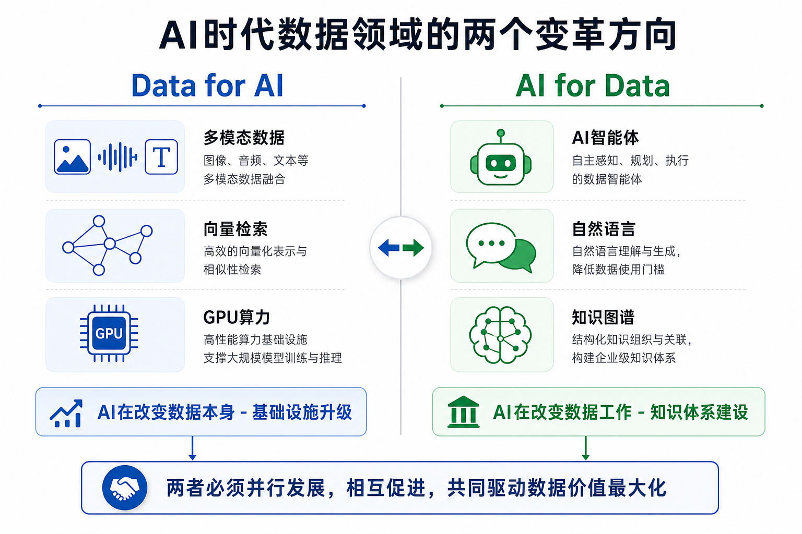
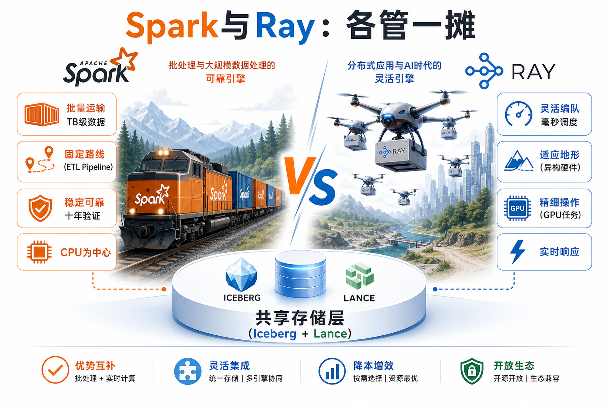
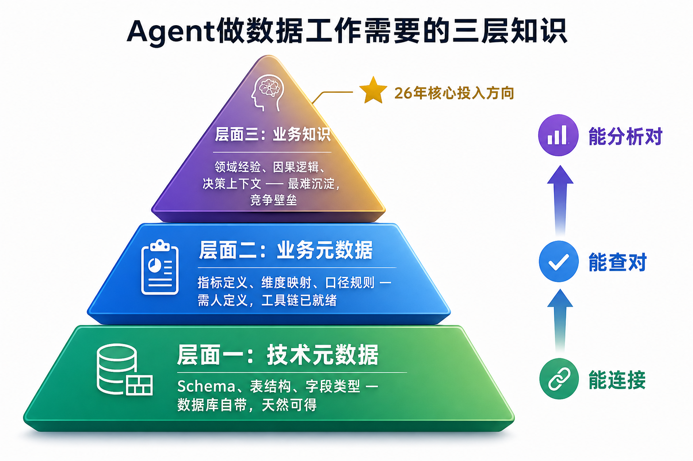
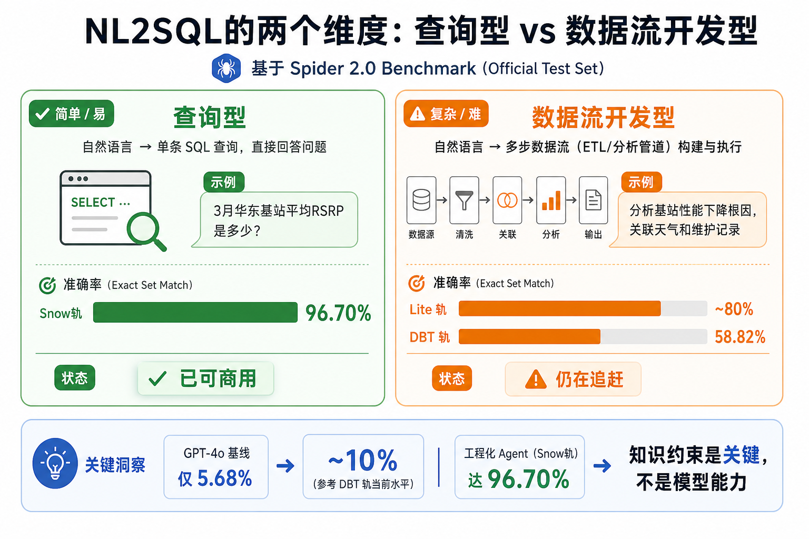
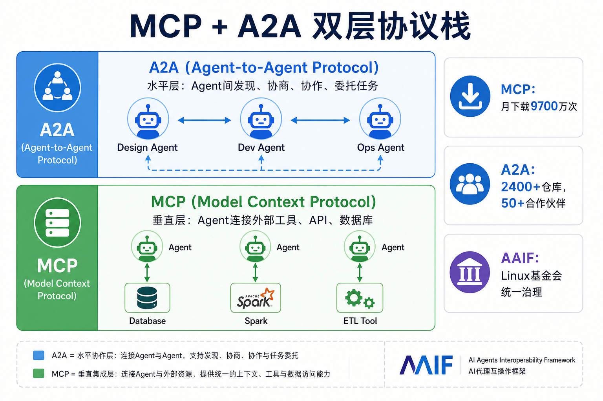
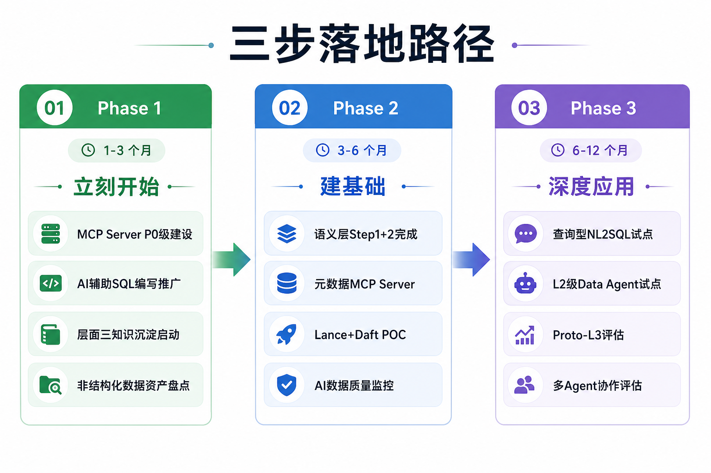

# AI时代的数据智能技术变革（V2.0）

> **适用对象**：浙江电信无线中心技术人员及架构师
> **日期**：2026年5月
> **作者**：向春（架构师）
> **调研基础**：延续24年9月《数据智能技术分析及规划策略》、25年7月《生成式AI驱动的数据治理范式变革洞察》、26年5月《从Data Agent商用元年到知识驱动的范式跃迁》三轮调研成果
> **版本**：V2.0（深度扩展版）

---

## 目录

- [第一部分：AI时代数据技术变革的底层逻辑](#第一部分ai时代数据技术变革的底层逻辑)
- [第二部分：Data for AI——非结构化数据驱动的基础设施范式转移](#第二部分data-for-ai非结构化数据驱动的基础设施范式转移)
- [第三部分：AI for Data——知识成为系统能力的决定性变量](#第三部分ai-for-data知识成为系统能力的决定性变量)
- [第四部分：六个非共识性技术判断](#第四部分六个非共识性技术判断)
- [第五部分：技术路线终局推演](#第五部分技术路线终局推演)
- [第六部分：行动框架](#第六部分行动框架)
- [附录：术语表](#附录术语表)

---

## 第一部分：AI时代数据技术变革的底层逻辑

### 1.1 双向框架的第一性原理推导

AI时代数据领域的所有变化，最终收敛到两个方向：**Data for AI**（AI改变数据本身的处理方式）和 **AI for Data**（AI改变数据工作的做法）。这个划分不是"方便的分类"，而是从系统结构必然推导出的结论。

任何数据系统都只存在两个基本角色——**数据的消费者**和**数据工作的执行者**。AI对数据系统的影响，本质上是在这两个角色上各引入了一个在能力特征上完全不同的新参与者：

| 角色 | 传统参与者 | AI时代新增参与者 | 推导出的变化方向 |
|------|-----------|----------------|----------------|
| 数据消费者 | 人（通过SQL/BI/报表） | AI模型（通过向量检索/张量加载/批量推理） | 新消费者的需求特征与旧消费者在架构层面完全不同 → 基础设施需要适配 → **Data for AI** |
| 数据工作执行者 | 工程师/分析师 | Data Agent | 新执行者的能力特征与旧执行者完全不同 → 工作方式需要重塑 → **AI for Data** |

这个推导揭示了两个结论：

**第一，两个方向的独立性不是人为划分，而是因为它们作用于系统的不同角色。** 基础设施层的变化（存储格式、计算引擎、元数据管理）由新消费者的需求驱动；工作方式层的变化（Agent、NL2SQL、智能治理）由新执行者的能力特征驱动。两者的技术栈、建设节奏、组织挑战几乎没有交集。

**第二，两个方向的并行性不是"建议"，而是系统约束。** 单独推进Data for AI（建了向量检索但没有Agent用它），或单独推进AI for Data（Agent写SQL但数据存不下AI需要的向量），都会陷入"木桶效应"——系统的有效能力由短板决定：

```
数据智能系统的有效能力 = min(基础设施能力, 知识完备度) × Agent执行能力
```

任一项为零或极低，系统能力趋于零。两个方向的投入顺序不是"先A后B"，而是"并行推进，根据短板动态调整权重"。



两个方向的对比如下：

| | Data for AI | AI for Data |
|--|------------|------------|
| 关注点 | 基础设施层（存储、计算、处理） | 应用与方法层（治理、分析、决策） |
| 主体 | 数据工程团队 | 数据团队 + 业务团队 |
| 建设节奏 | 渐进式加层（不是推倒重来） | 长期沉淀（知识体系建设） |
| 技术成熟度 | 较高（Ray/Lance/Daft已生产可用） | 中等偏低（L2可用，L3在探索） |

---

### 1.2 26年的核心拐点：约束条件的翻转

26年被定义为"商用落地期"，背后的精确机制是——**系统的瓶颈从"执行能力"翻转到了"知识"**。

这个翻转可以用一个简化模型描述：

```
Data Agent 的输出质量 = f(模型推理能力 M, 工具调用能力 T, 知识完备度 K)

24年：M << 商用门槛 → ∂Q/∂M 极大 → 瓶颈在模型 → 关注"模型选型"
25年：T 未标准化   → ∂Q/∂T 极大 → 瓶颈在工具生态 → 关注"MCP/Agent框架"
26年：M ≥ 商用门槛，T ≈ 标准化
     → ∂Q/∂K >> ∂Q/∂M 和 ∂Q/∂T
     → 知识完备度成为边际收益最高的投入方向
```

验证这一翻转的三个独立证据：

| 证据 | 本质含义 |
|------|---------|
| Spider 2.0：GPT-4o基线5.68%→~10%，工程化Agent~75%→96.70% | 模型能力提升不到2倍，工程化方法（本质是注入知识约束）提升了29倍。边际收益已从"更强的模型"转移到"更好的知识" |
| MCP月下载9700万次，三巨头全部采用 | 工具连接标准化已完成。这个约束已经基本解除 |
| Google推出Knowledge Catalog，Snowflake推出Intelligence Skills | 竞争焦点从"存储/计算"转向"知识/上下文"。当领先者开始在某个方向上集中投入，说明他们已认定前面的约束已经解除 |

**翻转的实践意义**：24-25年，在模型和工具生态上投入1元的收益 > 在知识上投入1元的收益。26年反过来了。这意味着组织的资源配置策略需要根本性调整——不是"也关注一下知识建设"，而是"知识建设应该拿到最大份额的投入"。

---

### 1.3 三年调研的元规律

回顾三轮调研，技术扩散呈现典型的S曲线行为：

| 年份 | Data for AI 的命题 | AI for Data 的命题 | 行业阶段 | 知识积累特征 |
|------|-------------------|-------------------|---------|------------|
| 2024 | 湖仓底座怎么选？（Iceberg确立、多模态存储需求浮现） | Text2SQL能做吗？（工程化路线确认） | 趋势确认期 | 大量新概念密集出现 |
| 2025 | AI原生层怎么加？（Lance/Ray/Daft框架就位） | Agent架构怎么建？（MCP发布、Agentic治理设计） | 架构设计期 | 已知技术的互联加深 |
| 2026 | 技术栈互操作成熟了吗？（REST Catalog统一、向量搜索下推） | 知识够了吗？（Agent商用后知识成瓶颈） | 商用落地期 | 已有技术的成熟与互操作 |

**26年的含义**：不要再等"下一个突破性技术"——该出现的技术都已经出现了。现在的竞争不是"谁先发现新技术"，而是"谁先在已有技术栈上积累足够的知识"。知识积累是一个不可跳跃的线性过程——这是它成为长期壁垒的根本原因。


---

## 第二部分：Data for AI——非结构化数据驱动的基础设施范式转移

### 2.1 范式转移的本质：从"单消费者"到"双消费者"服务

传统数据栈的设计哲学有一个从未被显式表述的前提假设：**唯一的数据消费者是人**。所有设计决策都由此推导：Parquet的列式存储（因为人的分析需要列式聚合）、SQL（因为人用声明式语言表达查询意图）、批处理（因为人不需要毫秒级响应）。

AI作为新的数据消费者，其需求特征与人类在架构层面完全不同：

| 消费者特征 | 人类分析师 | AI模型 | 推导出的基础设施差异 |
|-----------|-----------|-------|-------------------|
| **访问模式** | 列扫描——"给我某列的聚合值" | 向量检索——"给我语义上最接近的K条记录" | Parquet无ANN索引 → 需要向量原生存储格式 |
| **数据粒度** | 行级——"给我这条记录的详情" | 批量张量——"给我1000条记录的embedding矩阵" | 逐行读取效率极低 → 需要批量随机访问优化 |
| **数据类型** | 标量——数值、字符串 | 高维向量（1536维embedding）、图像张量、音频波形 | 列式存储无法高效处理 → 需要多模态原生存储 |
| **更新模式** | 追加写入——历史不可变 | 行级更新——模型迭代需要频繁修正embedding和标签 | Parquet的Append Only → 需要行级可变存储 |
| **计算模式** | CPU批处理——无状态MapReduce | GPU流式推理——有状态Actor模型 | Spark的粗粒度无状态 → 需要细粒度有状态调度 |
| **响应时效** | 分钟级——人能等 | 毫秒级——实时推理不能等 | 批量ETL → 需要流式处理管道 |

这个分析的关键含义：**每一行都不是"AI需要更好的X"，而是"AI需要一种在设计哲学上完全不同的X"。** 因此，不能简单地"优化现有栈"——需要的不是更快的Parquet，而是基于不同设计公理的存储格式。

同时，人类分析师不会消失——他们的需求仍然由Spark+Iceberg+Parquet最好地满足。**这就是"加层不替换"策略的第一性原理依据：不是因为替换太贵（虽然确实很贵），而是因为两类消费者的需求在架构层面就是不同的，不存在一个单一栈能同时最优地服务两者。**

全球数据组成的背景数据：

| 指标 | 数据 | 来源 |
|------|------|------|
| 全球数据中非结构化占比 | 80% | IDC 2025 |
| 非结构化数据年增长率 | 55% | IDC |
| 企业数据中结构化数据仅占 | ~10% | Box创始人Aaron Levie |
| 近1/3企业非结构化数据贡献了 | >50%年数据增量 | CSA 2026报告 |

无线中心的非结构化数据资产在AI时代的价值重估：

| 数据类型 | AI时代之前 | AI时代之后 | 基础设施要求 |
|---------|-----------|-----------|------------|
| 基站告警文本 | 人工查看、经验判断 | Agent自动分析、关联历史模式、秒级定位 | 文本存储 + 语义检索 |
| 现场勘查照片 | 存档在文件服务器 | 多模态模型自动识别异常、相似故障检索 | 图像存储 + 向量索引 |
| 路测日志 | 专业工具解析、离线分析 | AI自动生成趋势分析和异常定位 | 时序数据 + 流式处理 |
| 用户投诉语音 | 人工接听记录、抽样分析 | 语音识别 + 情感分析 + 自动分类 + 全量分析 | 音频存储 + 模型推理管道 |
| 设备手册PDF | 按需查阅 | Agent自主检索 + 关联故障代码 + 推荐方案 | 文档解析 + 语义索引 |

---

### 2.2 AI数据湖架构：加层不替换

AI数据湖是在Spark + Iceberg基座之上，为AI工作负载增加一套原生的"处理→计算→存储"栈。两套栈各有分工，通过统一的存储层和元数据层共存。


分层结构与职责划分：

| 架构层 | 传统栈（人类分析师） | AI原生层（AI工作负载） | 26年关键变化 |
|--------|-------------------|---------------------|------------|
| **处理层** | Spark（批量ETL） | Daft（多模态AI数据处理） | REST Catalog统一访问、向量搜索下推 |
| **计算引擎层** | Spark（批量计算，粗粒度、无状态、CPU） | Ray（AI任务调度，细粒度、有状态、GPU） | Ray生态持续成熟，互补格局稳固 |
| **表格式层** | Apache Iceberg（结构化标准，ACID、时间旅行） | Lance v2.2（AI多模态，Blob V2、ANN内置） | Lance GA，26年存储压缩比提升50%+ |
| **元数据层** | — | Apache Gravitino / Unity Catalog（统一REST Catalog） | Iceberg和Lance首次可通过同一Catalog统一管理 |
| **存储层** | 对象存储（S3 / HDFS / GCS） | 共享 | — |

26年最关键的工程突破是REST Catalog统一：

```
25年状态：
  Iceberg表 → Gravitino Catalog管理 ✓
  Lance数据 → 直连本地路径，无Catalog ✗
  两套数据无法统一发现和管理

26年状态：
  Iceberg表 → REST Catalog（iceberg://namespace/table） ✓
  Lance数据 → REST Catalog（rest://namespace/table）    ✓
  统一的数据发现接口，Agent可感知全量数据资产
```

**统一 Catalog 对 Agent 的意义**：Agent 通过一个 Catalog 就能"看到"所有数据资产，无论它们是结构化的 Iceberg 表还是多模态的 Lance 数据集。在此之前，Lance 数据游离在 Catalog 管理体系之外，对 Agent 而言是不可见的。

两套栈的分工边界：

| 场景 | 传统栈（Spark+Iceberg） | AI原生层（Ray+Lance+Daft） |
|------|----------------------|--------------------------|
| 基站工参批量ETL | ✓ 每天凌晨跑，Spark最擅长 | — |
| 结构化报表查询 | ✓ Iceberg + Spark SQL | — |
| 基站照片相似故障检索 | — | ✓ Lance ANN索引 + Daft分布式处理 |
| 实时异常检测模型推理 | — | ✓ Ray GPU调度 + Daft流式处理 |
| 维修记录语义搜索 | — | ✓ Lance向量检索 |
| 历史数据时间旅行 | ✓ Iceberg时间旅行 | ✓ Lance版本管理 |

---

### 2.3 存储格式深度分析：Parquet与Lance的设计哲学

#### Parquet的三个设计公理与AI场景下的破裂

Parquet的设计建立在三个公理之上。这些公理在传统分析场景中完全成立，但在AI消费场景中逐一破裂：

**公理一：数据是行列式的标量。**

Parquet假设每个cell是一个标量值（数值、字符串、布尔值），最复杂不超过嵌套结构。但AI场景中，一个"数据点"可能是：

```
基站A的完整表征 = {
  cell_id: "BTS-001",              // 标量 — Parquet擅长
  rsrp: -98.5,                     // 标量 — Parquet擅长
  embedding: [0.23, -0.17, ..., 0.89],  // 1536维向量 — Parquet可存但无法索引
  site_photo: <2MB JPEG>,          // 二进制大对象 — Parquet存储效率极低
  maintenance_log: <10KB文本>      // 长文本 — Parquet可存但无法语义检索
}
```

把2MB的JPEG存成Parquet的BLOB列在技术上可行，但会彻底破坏Parquet的列式存储优势——BLOB列会让行组（Row Group）膨胀到GB级，而查询结构化字段时仍然需要读取整个行组的元数据。

**公理二：访问模式是列扫描+聚合。**

Parquet的列式存储假设消费者的典型操作是"扫描某列的所有值，执行聚合"——`SELECT AVG(rsrp) FROM perf_data WHERE region='华东'`。这种操作只需要读取rsrp列和region列，其他列完全跳过——这是列式存储的核心优势。

但AI的典型操作是ANN（近似最近邻）检索，需要的不是列扫描而是向量索引。Parquet没有内置ANN索引。外挂一个向量数据库（如Milvus、Qdrant）可以解决检索问题，但引入了数据同步、一致性维护、额外的运维成本——而且"向量"和"结构化属性"分存两处，每次查询都需要跨系统JOIN。

**公理三：写入后不可变（Append Only）。**

Parquet文件一旦写入就不能修改——要更新一条记录，必须重写包含该记录的整个文件。AI场景中，更新是高频操作：

- 模型版本迭代后，所有记录的embedding需要重新计算和写回
- 人工标注修正后，训练数据的标签需要更新
- RAG场景中，文档更新后对应的向量需要同步更新

Parquet的Append Only意味着每次更新都是一次完整的文件重写——对于包含数十万embedding的数据集，这个成本不可接受。

#### Lance的设计选择：基于不同设计公理

Lance v2.2的三项核心能力（向量原生、多模态存储、零拷贝更新）不是对Parquet的改良，而是基于完全不同的设计公理：

**公理一（Lance）：一个数据点是多模态的。**

Lance的Blob V2引入四种自适应存储策略，核心洞察是——不同大小的对象应该用不同的物理布局存储，但在逻辑上它们都是同一行的列：

| 对象大小 | 存储策略 | 典型数据类型 |
|---------|---------|------------|
| < 64KB | Inline（直接存列内） | cell_id、标量属性 |
| 64KB ~ 1MB | Packed（打包存储） | 维修记录文本 |
| 1MB ~ 100MB | Dedicated（独立文件） | 现场照片JPEG |
| > 100MB | External（外部引用） | 4K巡检视频 |

自适应策略由存储层自动选择，无需人工干预。一次查询可以同时返回"cell_id"（标量）、"embedding"（向量）和"site_photo"（图像）——它们在同一行，不需要跨系统JOIN。

**公理二（Lance）：检索模式是语义的。**

ANN索引内置于存储格式本身，不需要外挂向量数据库。26年v2.2的全文搜索性能提升3-8倍，进一步补齐了文本检索能力。

从架构整洁性的角度对比：

| 维度 | Parquet方案 | Lance方案 |
|------|-----------|----------|
| 结构化数据存储 | Parquet/Iceberg | Lance |
| 向量数据存储 | Milvus/Qdrant（需同步维护一致性） | Lance（同处一行） |
| 图像数据存储 | 对象存储（需外部引用管理） | Lance |
| 系统数量 | 三个系统，三套运维，三次JOIN | 一个系统，一套运维，零次JOIN |

**公理三（Lance）：数据是可变的。**

零拷贝更新——行级更新不重写整个文件，每次更新自动创建版本。对AI场景的意义：embedding更新只修改embedding列对应的数据片段，不动结构化列；版本管理让"这条记录的embedding是什么时候、用什么模型版本生成的"可追溯；26年新增的流式大规模Insert/Merge操作支持了批量模型重训的写回需求。

#### 工程决策原则：看消费者，不看数据

**选格式的依据不是"数据长什么样"，而是"谁来消费这份数据、怎么消费"。**

同一份"基站工参表"：
- 如果消费者是BI报表——用Iceberg+Parquet（列式聚合最优）
- 如果消费者是Data Agent的语义检索——把工参表的关键字段embedding化后存入Lance（向量检索最优）

同一份数据，因为消费者不同，最优的存储方案不同。这不是冗余，而是"按消费者优化"的必然结果。

无线中心场景的存储格式决策指南：

| 场景 | 推荐格式 | 决策依据 |
|------|---------|---------|
| 基站工参表（cell_id, longitude, latitude） | Iceberg + Parquet | 纯结构化、列式查询、需要ACID |
| 基站性能时序数据（rsrp, sinr, timestamp） | Iceberg + Parquet | 列式扫描聚合、分区演进 |
| 基站现场照片 + 维修记录（需要"找相似故障"） | Lance | 向量检索、多模态存储、照片和embedding同处一行 |
| AI模型训练数据集（特征向量+标签+原始数据引用） | Lance | 随机访问、版本管理、频繁更新embedding |
| 跨表关联查询（统计区域故障基站数量） | Iceberg | SQL分析、需要JOIN |

---

### 2.4 计算引擎深度分析：Spark与Ray的正交关系

Spark和Ray的设计哲学差异远比"互补"所暗示的更深——它们是**正交**的。正交的含义是：它们解决的问题空间几乎没有交集。把Spark用在Ray的场景中不是"不够好"，而是"设计上就不适合"；反之亦然。



| 设计维度 | Spark（MapReduce哲学，2014） | Ray（AI工作负载哲学，2017） |
|---------|--------------------------|--------------------------|
| **任务模型** | BSP（批量同步并行）——所有任务在同一阶段完成后才进入下一阶段 | Actor模型——独立的有状态实体异步交互 |
| **状态管理** | 无状态——每个任务不持有跨迭代的状态（RDD是不可变的） | 有状态——Actor在整个生命周期中持有和更新状态 |
| **资源抽象** | CPU为一等公民——GPU支持后来添加但非原生 | 异构资源为一等公民——CPU/GPU/TPU/自定义加速器统一调度 |
| **任务粒度** | 粗粒度——一个任务处理一个分区（通常MB~GB级数据块） | 细粒度——一个任务可以小到一次函数调用（微秒级） |
| **延迟特征** | 高吞吐、高延迟——优化目标是单位时间处理的数据量 | 低延迟、可弹性——优化目标是单个请求的响应时间 |
| **故障恢复** | 基于血缘（Lineage）重算——无状态设计使得任何任务都可以从头重算 | 基于对象存储+checkpointing——有状态设计使恢复更快但重算成本更高 |
| **吞吐上限** | 万级任务/秒 | 百万级任务/秒 |

**Spark不适合AI工作负载的根本原因不是"不够快"，而是BSP模型与AI工作负载的特征存在结构性冲突：**

1. **AI训练需要有状态迭代。** 梯度下降的每一步都依赖上一步的模型参数（状态）。Spark的无状态设计意味着每次迭代都需要将模型参数从Driver广播到所有Executor——对于数十亿参数的模型，这个广播成本不可接受。Ray的Actor模型天然持有状态，模型参数就在Actor的内存中，不需要广播。

2. **AI推理需要细粒度调度。** 一个实时推理请求需要在毫秒内完成GPU推理并返回结果。Spark的粗粒度调度（秒~分钟级）无法满足这个要求。Ray的细粒度调度可以在微秒级启动一个任务。

3. **AI工作负载需要GPU作为一等资源。** Spark的GPU支持是后来添加的，资源管理模型仍然以CPU为中心——GPU被视为"附属资源"而非独立的调度单元。Ray从设计之初就将GPU/TPU作为与CPU平等的资源类型，调度器原生理解异构资源。

**Ray同样不适合传统批量ETL：**

1. **批量ETL需要粗粒度调度减少调度开销。** 处理TB级数据时，每个任务处理一个GB级分区是合理的。Ray的微秒级调度在这个场景中反而引入了不必要的调度开销。

2. **批量ETL的容错受益于无状态设计。** Spark的血缘重算在批量ETL场景中非常优雅——任何任务失败只需要根据血缘重算那个分区，不影响其他分区。Ray的有状态设计在这个场景中反而增加了容错的复杂度。

3. **批量ETL的优化空间在查询优化器。** SQL语义的批量处理受益于成熟的查询优化器（谓词下推、列裁剪、分区剪枝），Spark的Catalyst在这个方向上有十年的积累。

无线中心典型工作流中两者的分工：

| 时间段 | 执行引擎 | 工作内容 |
|--------|---------|---------|
| 凌晨批处理窗口 | **Spark** | 读入昨日所有基站性能数据（TB级）→ 清洗过滤 → 关联合并（cell_info + perf_data + alarm_log）→ 聚合计算（区域/时间窗口统计）→ 写入Iceberg表 |
| 全天实时 | **Ray** | 加载异常检测模型到GPU → 接收实时性能数据流 → 逐条推理（正常波动/异常）→ 发现异常时关联天气+维护记录 → 生成告警+推荐根因 → 结果写回Iceberg/Lance |

---

### 2.5 处理框架Daft：AI数据湖的统一处理接口

"胶水"一词严重低估了Daft在AI数据湖架构中的价值。**Daft的真正定位是：AI数据湖的统一处理接口——它是唯一一个能同时读Iceberg和写Lance、在Ray上运行、用DataFrame API处理多模态数据的框架。**

主流DataFrame框架能力对比：

| 能力维度 | Spark | Polars | Pandas | Daft |
|---------|-------|--------|--------|------|
| 分布式 | ✓ | ✗ | ✗ | ✓ |
| 多模态列类型 | ✗ | ✗ | ✗ | ✓ |
| Ray原生运行 | ✗ | ✗ | ✗ | ✓ |
| Iceberg读写 | ✓ | 有限 | ✗ | ✓ |
| Lance读写 | ✗ | ✗ | ✗ | ✓ |
| REST Catalog | ✓ | ✗ | ✗ | ✓（★26年新增） |
| 向量搜索下推 | ✗ | ✗ | ✗ | ✓（★26年新增） |

26年的两个关键突破使Daft的架构价值从"可选"变为"必须"：

**突破一：REST Catalog统一。** 26年Daft支持REST Namespace Catalog后，Iceberg和Lance都可以通过Gravitino/Unity Catalog统一管理。同一个Catalog中既管理结构化表（Iceberg），也管理AI多模态数据（Lance），上层的Spark/Flink/Ray/Daft都可以通过同一套REST接口访问。

**突破二：向量搜索下推。** 这不是一个单纯的"性能优化"——它改变了系统的可扩展性特征：

| 版本 | 搜索方式 | 数据量×10时的影响 |
|------|---------|----------------|
| 25年 | 读取全量数据 → 应用层ANN | 搜索时间×10（线性扩展） |
| 26年 | 向量搜索下推到Lance存储层 → 返回Top-K | 搜索时间≈不变（常数级，索引检索） |

无线中心具体场景——Daft + Ray + Lance端到端闭环：

```
任务："找出和基站A现场环境最相似的5个基站"

1. Daft加载基站A的现场照片 → 解码、缩放
2. Daft调用Ray上的GPU → CLIP模型生成embedding
3. Daft将embedding写入Lance表"site_embeddings"
4. ★26年新增：Daft直接发起带向量查询的读取请求
   → Lance的ANN索引在存储层完成检索 → 秒级返回Top-5
5. Daft关联站点工参（从Iceberg表）→ 输出完整结果：
   "相似站点B（距离3.2km，海拔相似，去年同样出现过天线腐蚀问题）"
```

---

### 2.6 业界大厂动态：竞争焦点的结构性转移

26年国际三大云数据平台的竞争焦点发生了根本性转移——从"谁的湖仓更好"（存储和计算），到"谁的AI集成更深"（AI原生能力），再到"谁能让Agent理解更多的业务上下文"（知识）。

**国际厂商26年关键动态：**

| 厂商 | 核心战略 | Agent产品 | 知识/Catalog方向 |
|------|---------|-----------|-----------------|
| **Databricks** | AI原生数据智能平台 | Genie Agent Mode（规划→测试→迭代→报告）；Genie Code（自主处理Pipeline） | Unity Catalog AI增强 |
| **Snowflake** | Agentic Enterprise控制平面 | Snowflake Intelligence（个人工作Agent）；Cortex Code（理解整个数据栈） | Horizon Catalog + MCP连接器 |
| **Google BigQuery** | Agentic Data Cloud | Conversational Analytics；BigQuery MCP Server | **Knowledge Catalog**（通用上下文引擎，为Agent提供业务含义） |

三巨头的共同趋势：Agent Mode从"加分项"成为产品核心功能；MCP成为通用标准（三家全部支持）；知识/上下文成为竞争维度。

**国内厂商26年关键动态：**

| 厂商 | 26年进展 | 核心变化 |
|------|---------|---------|
| **阿里DataWorks** | Agent全链路商业化（4月起收费），覆盖开发/集成/治理/运维/分析 | Agent从"增值功能"→"独立计费产品线" |
| **华为** | AgentArts独立智能体平台上线，MCP支持OAuth2.0鉴权 | Agent平台独立运营 |
| **字节火山引擎** | Data Agent正式商用，升级到3.0版本；发布国内首个Data Agent评测体系 | 有实际案例数据：分析效率提升50%~100倍 |

**核心洞察**：技术已经不是瓶颈（三家的Agent执行能力都足够强），**知识才是差异化的核心竞争力**。这一判断在第三部分展开。

---

## 第三部分：AI for Data——知识成为系统能力的决定性变量

### 3.1 执行力与知识的本质分离

26年，Data Agent已经全面商用——阿里/华为/字节都已正式收费。但商用后暴露出一个被系统性低估的问题：**Agent的"执行力"不是瓶颈，"知不知道该怎么干"才是。**

Spider 2.0的数据给出了精确的量化验证：GPT-4o直连数据库仅5.68%→~10%准确率，工程化Agent（核心是注入知识约束）达到96.70%——差距来自知识约束，不是模型能力。字节Data Agent效率提升100倍的前提是"Agent被灌入了充足的业务知识和分析模板"。

对于一个完整的数据分析任务"分析为什么上月华东基站性能下降"，Agent的执行能力边界如下：

| Agent能做到的（执行力） | Agent做不到的（需要知识） |
|----------------------|------------------------|
| 写对SQL语法 | 查哪些表？perf_data还是cell_config？ |
| 按格式输出结果 | "性能下降"用什么指标衡量？RSRP低于多少算下降？ |
| 多步骤编排——先查数据，再分析 | "华东"是什么意思？region_info怎么关联？ |
| 工具调用——读表、写报告 | 分析策略——先查固件变更还是先查天气？ |
| | 结论判断——"台风导致退服率上升3%"是故障还是正常现象？ |

Agent写对了SQL但查的是错的表、用的是错的口径、得出的是错的结论——这不是能力问题，是知识问题。

---

### 3.2 三层知识模型：完备性推导

培训材料将数据工作所需的知识分为三层。从第一性原理推导可以验证它的完备性——**从"Agent执行一个完整的数据分析任务需要做什么决策"反向推导"它需要什么知识"**。

以"分析华东基站性能下降原因"为例，Agent需要做的决策链：

```
决策1：查什么数据源？
  → 需要知道有哪些表、各表的schema和关联关系
  → 这就是 层面一：技术元数据

决策2：怎么定义"性能下降"？
  → 需要知道用什么指标、什么口径、什么阈值
  → "华东"对应哪个字段的什么值？"性能"包含哪些维度？
  → 这就是 层面二：业务元数据

决策3：从哪个方向开始分析？
  → 需要知道"80%的性能下降根因是固件变更"这样的领域经验
  → 需要知道"台风季沿海基站退服率上升3-5%是正常现象"这样的因果知识
  → 需要知道"去年8月v3.2.1的bug波形与这次相似"这样的历史案例
  → 这就是 层面三：业务知识
```



三层知识的详细对比：

| 知识层 | 内容范围 | 获取方式 | 当前状态 | 建设难度 |
|--------|---------|---------|---------|---------|
| **层面一：技术元数据** | Schema、字段类型、表结构、主外键、数据血缘 | 数据库introspection自动获取 | 天然可得 | 低 |
| **层面二：业务元数据** | 指标定义、维度映射、业务术语、口径规则 | 需要人定义，工具链成熟 | 建设不足 | 中 |
| **层面三：业务知识** | 领域经验、因果逻辑、组织知识、决策上下文、历史案例与模式 | 需要人提取和形式化，极难自动化 | 几乎空白 | 极高 |

**完备性验证**：在"Agent执行数据分析任务所需的领域知识"范围内，三层分类是完备的——每一个领域知识点都可以归入且仅归入三层之一。"Agent应该以什么格式输出"属于系统配置；"超时设置"属于运维参数——这些都不属于领域知识。

#### 层面一：技术元数据

数据库自带，Agent可以通过introspection自动获取：

```sql
-- 层面一的典型内容（自动获取）
cell_info 表：
  cell_id     VARCHAR(32)   -- 基站标识
  site_name   VARCHAR(128)  -- 站点名称
  longitude   FLOAT         -- 经度
  latitude    FLOAT         -- 纬度
  region_id   INT           -- 区域ID（外键）

perf_data 表：
  cell_id     VARCHAR(32)   -- 外键关联 cell_info
  rsrp        FLOAT         -- 参考信号接收功率 (范围: -140~-44 dBm)
  sinr        FLOAT         -- 信号与干扰加噪声比
  timestamp   TIMESTAMP     -- 采集时间
```

只有层面一的Agent，必须被告知精确的表名、字段名才能执行查询，无法理解"华东"这个业务术语对应的是哪个字段。

#### 层面二：业务元数据

这一层需要人来定义。dbt Semantic Layer、Cube等工具已经成熟，但建设工作在大多数组织中仍然严重滞后：

```
指标定义（层面二的核心内容）：
  基站可用率 = SUM(available_duration) / SUM(total_duration)
    → 忙时可用率（8:00-22:00）：用于运维考核
    → 全天可用率（0:00-24:00）：用于统计报表
    → 不同场景用不同口径——两种口径都是"正确的"，区别在于适用场景

业务术语映射：
  "覆盖质量"在不同部门的含义：
    → 网优中心：RSRP + SINR（技术指标）
    → 市场部：综合评分（含用户投诉权重）
    → 同一个词，不同部门的Agent需要不同的查询逻辑

维度关系：
  "华东区域" = region_info.region_name = '华东'
    → 通过 cell_info.region_id 关联
    → 包含6个省、3127个基站
```

有层面一+二的Agent能准确取数，但不会告诉你"下降趋势持续了3个月，值得关注"。

#### 层面三：业务知识

这是建设难度量级完全不同的一层，也是26年竞争壁垒的核心所在：

```
领域经验（从未被文档化）：
  "基站性能下降，排查顺序不是随机的——
   先查固件版本变更（最常见根因，占80%）；
   排除固件后，再查天气因素（台风/暴雨）；
   最后才怀疑设备故障。"

因果知识（区分"相关"和"因果"）：
  "台风季节沿海基站退服率上升3-5%是正常现象，不代表设备问题——
   但如果内陆基站同时出现退服率上升，那就是异常。"

组织知识（理解为什么规则是这样的）：
  "华东区域可用率目标99.95%而西南99.8%——
   因为华东有金融客户SLA对赌条款。
   Agent在做优化建议时，必须知道这个优先级差异。"

决策上下文（历史案例的模式匹配）：
  "去年8月出现过同样的RSRP异常模式——
   凌晨2:00-4:00突降10dBm，15分钟后自动恢复。
   当时是v3.2.1固件bug，回滚后恢复。
   如果这次波形模式相同，优先检查近期固件升级窗口。"
```

---

### 3.3 层面三知识的特殊困难

三层知识的建设难度呈指数级递增。层面三有三个根本性困难：

**困难一：大量是隐性知识（Tacit Knowledge）**

迈克尔·波兰尼的知识管理理论区分了显性知识（Explicit Knowledge）和隐性知识（Tacit Knowledge）。层面一和层面二本质上是显性知识——schema可以从数据库introspection自动获取，指标定义可以由人写成文档。

但层面三的核心知识是隐性的："基站性能下降，排查顺序先查固件"——这个顺序是组织十几年的故障处理经验沉淀出来的，已经内化为老工程师的直觉，不再经过显式推理。

将隐性知识显性化（Externalization）需要：识别知识持有者（通常是即将退休的老工程师）→ 通过结构化访谈提取他们的直觉规则 → 将规则形式化为Agent可检索和应用的格式 → 验证形式化后的规则是否保留了原始判断力。每一步都有实质性困难，且不可自动化。

**困难二：上下文相关（Context-Dependent）**

"台风季沿海基站退服率上升3-5%是正常现象"——这个知识在"华东沿海"上下文中成立，但在"西北内陆"的上下文中就变成了"退服率上升3%是严重异常信号"。

层面三的知识不是"全局真理"，而是"在特定上下文中成立的判断"。Agent要正确使用这些知识，不仅需要检索到知识本身，还需要判断当前的上下文是否适用——这本身又需要另一层知识（元知识）。

**困难三：动态变化（Dynamic）**

层面一几乎不变（schema变更有版本控制），层面二缓慢变化（指标定义的修订频率是月或季度级），但层面三持续变化：

```
"v4.1.0固件有性能回退bug"——这个知识在厂商发布热修复后就过期了
"排查顺序先查固件"——如果某种新型天线故障变得更频繁，这个优先级就需要调整
"华东可用率目标99.95%"——如果金融客户的SLA条款变更，这个知识就需要更新
```

层面三知识的维护不是"建一次就好"，而是需要持续的更新机制。

---

### 3.4 Data Agent六级自治体系

基于清华/港科广2026年学术调研（A Survey of Data Agents），Data Agent的自治能力可分为六级。**这个分级的本质是"Agent能自主获取和使用哪层知识"的递进。**

| 等级 | 名称 | 本质：能自主获取什么知识？ | 26年产品化状态 |
|------|------|--------------------------|--------------|
| L0 | 无自治 | 无——所有知识都在人脑子里 | 遗留系统 |
| L1 | 辅助 | 训练数据中的通用知识 | 已成标配（所有数据平台都有AI SQL助手） |
| L2 | 部分自治 | **层面一可自动获取**——能读Schema | 主流产品均达到（Genie/Cortex/DataWorks Agent） |
| Proto-L3 | 条件自治 | **层面二已结构化**——可检索指标定义 | 少数场景可用（需完备语义层+限定主题域） |
| L4 | 高度自治 | **层面三已部分形式化**——能识别异常 | 研究阶段 |
| L5 | 完全自治 | 超越现有知识体系 | 远期愿景 |

**L2与L3的本质差异不在执行能力，在决策权归属：**

```
L2（当前主流）：
  人：「你先查perf_data表，过滤3月华东数据，计算RSRP均值……」
  Agent：逐步执行
  任务主导权在人

Proto-L3（26年部分场景可达）：
  人：「分析华东基站性能下降原因」
  Agent自主决定：查哪些表 → 用什么指标衡量"性能下降" → 分析路径怎么设计 → 怎么验证结论
  任务主导权在Agent，人做审核
```

26年Proto-L3可行的场景必须同时满足以下所有条件：

| 条件 | 具体要求 |
|------|---------|
| 主题域范围 | 极度限定（如仅覆盖"基站性能异常排查"这一个子域，而非"基站运维"整体） |
| 层面二完备度 | 100%（核心指标定义、维度映射、口径规则全部结构化） |
| 分析路径 | 至少核心SOP（排查顺序、正常范围、典型模式）已文档化 |
| 人工审核 | 保留（Agent输出结论后，人工确认才执行） |

**任一条件不满足，L3就不应尝试。**

---

### 3.5 L2→L3跃迁的严格条件：乘法公式分析

设Data Agent的输出质量Q为：

```
Q = f(模型推理能力 M, 工具生态成熟度 T, 知识完备度 K)

当前点上各变量的偏导关系：
∂Q/∂M 较小（M已越过商用门槛）
∂Q/∂T 较小（MCP标准化后T已基本解除约束）
∂Q/∂K 很大（K当前普遍不足）

→ 在当前的(M₀, T₀, K₀)点上，增加ΔK的收益 >> 增加ΔM或ΔT的收益
```

对L2→L3跃迁的决策链进行逐环节量化分析：

| 决策环节 | 依赖的知识层 | 无知识时正确率 | 有知识时正确率 |
|---------|------------|-------------|-------------|
| 选表 | 层面一 | ~80%（可猜对） | ~99%（Schema确定） |
| 选指标/口径 | 层面二 | ~30%（口径歧义极多） | ~95%（定义明确） |
| 选分析路径 | 层面三 | ~20%（需要领域经验） | ~80%（SOP形式化） |
| 执行查询 | 模型能力 | ~90%（语法问题） | ~95%（有验证查询） |
| 解释结果 | 层面二+三 | ~40%（缺业务判断力） | ~85%（有因果知识） |
| 验证结论 | 层面三 | ~30%（不知道什么算正常） | ~80%（有基准和案例） |

端到端成功率（各环节正确率相乘）：

```
无知识：                          0.80 × 0.30 × 0.20 × 0.90 × 0.40 × 0.30 = 0.52%
有层面一+二：                     0.99 × 0.95 × 0.20 × 0.95 × 0.40 × 0.30 = 2.16%
有层面一+二+三（部分，Proto-L3）： 0.99 × 0.95 × 0.80 × 0.95 × 0.85 × 0.80 = 48.8%
```

**48.8%的端到端成功率意味着：Agent大约每两次分析中只有一次是可靠的。** Proto-L3保留人工审核，不是出于谨慎，而是当前知识完备度下的数学必然。

---

### 3.6 NL2SQL的两个世界

Spider 2.0的数据揭示了NL2SQL领域一个被广泛忽视的结构性事实：**查询型和数据流开发型是两个完全不同的问题，不能用同一个基准衡量。**



| 维度 | 查询型（Snow轨） | 数据流开发型（DBT轨） |
|------|----------------|-------------------|
| 任务本质 | 将自然语言翻译为单条SQL | 在项目上下文中构建完整的数据工程管道 |
| 知识需求 | 层面一+二 | 层面一+二+三 |
| 推理深度 | 浅——理解意图→映射到表和字段→生成SQL | 深——理解业务需求→设计模型→编排依赖→处理边界条件→生成代码 |
| 上下文范围 | 窄——单个数据库的schema | 宽——整个项目的代码库、配置、文档、上下游依赖 |
| 错误容忍度 | 中——查询错了可以重新查 | 低——ETL管道错了影响下游所有消费者 |
| **26年最高准确率** | **96.70%（Genloop Sentinel Agent v2 Pro）** | 远低于Snow轨 |

Spider 2.0 2026年最新排行榜：

| 轨道 | 25年最高 | 26年最高 | 含义 |
|------|--------|--------|------|
| **Snow（单库查询型）** | ~75% | **96.70%** | 查询型NL2SQL已够商用 |
| **Lite（多库）** | ~72% | ~80%+ | 跨库场景在快速改善 |
| **DBT（项目级代码Agent）** | 58.82% | 有提升但仍挑战 | 数据工程仍是最难场景 |
| **GPT-4o基线** | 5.68% | ~10% | 纯模型提升极有限——工程化方法是关键 |

**查询型NL2SQL决策空间有界的原因**：给定一个schema和一个自然语言问题，正确答案就是一条SQL，决策路径是"意图理解→表选择→列选择→条件构造→聚合逻辑"，每一步的选项空间是有限的。在语义层约束下，这个决策空间被进一步压缩——很多"歧义"被消除了。

**数据流开发型决策空间开放的原因**：给定一个业务需求，可能有多种合理的数据模型设计，每种设计对应不同的ETL逻辑，每个ETL步骤又涉及性能优化、错误处理、增量策略等多个维度的决策。这是一个组合爆炸的决策空间，而且很多决策需要层面三知识。

不同成熟度场景的策略建议：

| 场景 | 当前可用性 | 建议 |
|------|-----------|------|
| 查询型NL2SQL（有语义层） | 成熟 | 在层面一+二完备的场景可以试点，80%+已能大幅降低查数人力成本 |
| 数据流开发型（单库） | 工程化Agent可达70%+ | 限定场景 + 层面二约束 + 人工审核——可辅助，不能替代 |
| 数据流开发型（项目级） | 不可靠 | 层面三的缺失是根本性的，目前不适合试点 |

---

### 3.7 语义层的不可绕过性：消歧而非推理

语义层从"可选项"变为"必选项"——在26年已无争议。**关键问题是：为什么语义层是不可绕过的？能不能用更强的模型代替语义层？**

**语义层解决的核心问题是消歧，而不是推理**。以"查一下华东的基站可用率"为例：

```
歧义一："华东" = region_info.region_name = '华东'？还是 = region_id IN (3,5,7,8,12,15)？
歧义二："可用率" = SUM(available_duration)/SUM(total_duration)？
        还是 = COUNT(status='正常')/COUNT(*)？
歧义三：时间范围？最近一天？一周？一月？
歧义四：忙时可用率（8:00-22:00）还是全天可用率（0:00-24:00）？
歧义五：包含计划停机吗？
```

更强的模型不能解决消歧问题——因为消歧需要的不是"更好的推理"，而是"确定性的定义"。一个语义歧义有两个可能的解读，模型推理再强也只是在两个解读中"猜"一个。

**语义层的价值不是"帮助模型推理"，而是"消除推理中的不确定性"。** 推理时计算提升的是"想得深不深"，语义层提升的是"知道不知道"——两者正交。没有语义层的更强模型 = "不知道但想得很深" = 在错误的方向上深入思考。

Spider 2.0的数据精确验证了这一点：GPT-4o从5.68%→~10%（模型更强，但消歧能力没有提升）；工程化Agent从~75%→96.70%（核心是通过语义约束消除了歧义）。

语义层建设的三步走路径：

| 步骤 | 内容 | 工具 | 产出 |
|------|------|------|------|
| **Step 1：统一指标平台** | 梳理核心指标定义（最高频使用的20-50个） | dbt Semantic Layer / Cube | 指标目录 + 口径文档 |
| **Step 2：维度映射** | 明确业务术语与技术字段的映射关系 | 元数据管理工具 | 术语表 + 关联关系图 |
| **Step 3：业务知识沉淀** | 将老工程师的经验、分析SOP形式化 | RAG知识库 + 结构化模板 | 知识库 + 分析模板 |

**"先建语义层，再开放Agent"的顺序约束**：在语义层不完备的情况下开放Agent，造成的损害可能大于收益。Agent的信任是一种脆性资产——建立需要长期的正向体验，但破坏只需要几次错误输出。更危险的是"看起来合理但实际错误"的静默错误——两种口径都能给出一个看起来合理的数字，用户可能不会发现错误，直接基于错误数据做了决策。

严格的顺序约束：
1. 在语义层覆盖≥80%的高频查询场景之前，不开放NL2SQL Agent给终端用户
2. 开放前先经过"影子模式"验证——Agent的输出与人工结果对比至少1个月，准确率达标后才开放
3. 开放初期保留"人工复核"标注——让用户知道"这个结果可能需要确认"

---

### 3.8 MCP + A2A：Agent的感知边界与协议生态

**MCP的战略价值远超"工具连接"——它本质上是Agent的感知边界。** MCP Server覆盖了多少数据资产，Agent就能"看到"多少数据资产。数据库没有MCP Server = Agent对这个数据库"失明"。

```
Agent的能力上限 = min(推理能力, 知识, 可感知的数据资产)

可感知的数据资产 = 通过MCP Server暴露的数据库 + Schema + 业务元数据

→ MCP Server的覆盖范围直接决定Agent的能力上限
→ 每多建一个MCP Server，Agent的能力上限就提升一级
```

这意味着MCP Server不是一个"一次性建设项目"，而是一个**持续扩展Agent感知边界的长期工程**。

25年→26年MCP/A2A生态的质变：

| 维度 | 25年状态 | 26年现状 |
|------|--------|--------|
| **MCP采用率** | Anthropic刚发布、少数先行者试用 | 月SDK下载9700万次，OpenAI/Google/Microsoft/Amazon全部采用 |
| **A2A协议** | 尚未发布 | Google 2025年4月发布，2400+仓库，Salesforce/SAP等50+合作伙伴 |
| **治理框架** | 无 | Linux基金会成立AAIF，MCP/A2A/ACP统一纳入治理 |



MCP与A2A的职责分工：

| 协议 | 层次 | 解决的问题 | 典型场景 |
|------|------|---------|---------|
| **MCP** | 垂直层 | Agent连接外部工具、API、数据库、数据源 | 开发Agent通过MCP Server操作Spark/Flink/数据库 |
| **A2A** | 水平层 | Agent间发现、协商、协作、委托任务 | 设计Agent将"建表任务"委托给开发Agent |

数据平台MCP化的优先级排序：

| 优先级 | MCP Server | 覆盖能力 | 复杂度 |
|--------|-----------|---------|--------|
| **P0（立即）** | 数据库MCP Server（查询/Schema获取） | Agent从"无法感知数据"到"能访问数据" | 低 |
| **P1（3个月内）** | 元数据/Catalog MCP Server | Agent获取业务元数据和血缘信息 | 中 |
| **P2（6个月内）** | ETL/数据集成MCP Server | Agent编排数据Pipeline | 中-高 |
| **P3（探索）** | 多Agent A2A协作 | 跨角色Agent协同 | 高 |

---

### 3.9 智能数据治理：从规则驱动到知识驱动

传统数据治理用规则补偿知识的缺失——因为机器不理解业务含义，必须靠人写规则。AI驱动的治理把逻辑反过来——用知识替代规则。

| 维度 | 规则驱动（传统） | 知识驱动（AI） |
|------|---------------|--------------|
| 错误检测时机 | 定时巡检（每天/每周扫一遍） | 实时监控（数据写入即检查） |
| 发现问题的延迟 | 已经过了15-30天 | 秒级发现（写入时拦截） |
| 根因定位 | 人工排查（数小时定位） | 自动定位根因 + 推荐修复 |
| 修复方式 | 手动修复（改数据/改规则） | 从源头修复（改认知） |

三层知识在治理中能发现的问题类型各不相同：

| 知识层 | 能发现的问题 | 典型例子 |
|--------|------------|---------|
| 层面一 | Schema漂移、类型不一致、空值率异常 | `rsrp`字段突然从FLOAT变成VARCHAR |
| 层面二 | 指标口径冲突、维度不一致 | 市场部和网优中心的"覆盖质量"用不同字段组合 |
| **层面三** | **数据合规但业务逻辑不对——规则永远发现不了** | 台风期间沿海基站退服率5%——数值超标但业务正常 |

层面三的意义：只有当Agent理解了"台风季沿海基站退服率上升3-5%是正常现象"这个因果知识，才能避免把正常现象误判为告警——这是任何规则体系都做不到的。

26年通过MCP+A2A协议有了标准化的落地路径，治理架构如下：

| 架构层 | 组成 | 功能 |
|--------|------|------|
| 交互层 | 自然语言交互 / 进度可视化 / 执行确认与修正 | 人机协同界面 |
| 智能体层 | 设计Agent ↔(A2A)↔ 开发Agent ↔(A2A)↔ 运维Agent ↔(A2A)↔ 分析Agent | 按数据全生命周期分工 |
| 语义层 | 语义采集 → 语义存储 → 语义评估 → 语义增强 → 知识库 | 知识积累与服务 |
| 数据应用基座 | MCP Server（任务调度/NL2SQL/数据集成/开发/资产管理/数据服务） | 标准化能力暴露 |
| 多模态湖仓 | Spark + Flink + Ray / Iceberg + Lance / 统一元数据 | 计算与存储基础 |

---

### 3.10 完整案例：三层知识在根因分析中的递进贡献

**任务**："分析上月华东区域基站性能下降的根因，输出影响因素排序"

Agent的执行流程与知识依赖：

```
Step 1: 确定查什么表（依赖层面一）
  → 需要 perf_data、maintenance_log、weather_data 三张表
  → 通过 cell_id + timestamp 关联

Step 2: 确定"性能下降"的度量标准（依赖层面二）
  → "性能下降" = RSRP < -110dBm 持续15分钟
  → 影响范围 > 3个基站才算"区域性问题"

Step 3: 设计分析路径（依赖层面三）
  → 先查固件版本变更——80%的概率是根因
  → 再查天气——排除沿海基站台风影响
  → 最后查设备故障——单站逐一排查

Step 4: 判断结论（依赖层面三）
  → 发现3月12日批量固件升级后RSRP波动增大
  → 模式与去年8月v3.2.1的bug高度相似（波形匹配）
  → 排除天气——同期沿海基站未出现类似波动

结论：根因→固件升级（v4.1.0），影响17个基站，建议回滚或等热修复
```

**没有层面三的Agent输出**："3月华东区域有23个基站出现RSRP异常波动，其中17个与固件升级时间窗口重叠，6个与台风天气相关。"——这是数据汇总，不是可行动的诊断。

**有层面三的Agent输出**："根因是3月12日的v4.1.0固件升级，影响17个基站。判断依据：波动模式与去年8月v3.2.1已知bug高度一致；排除天气因素后剩余17个基站均在同一批次升级范围内。建议回滚至v4.0.2或等厂商发布热修复。"——这是可行动的诊断。

---

## 第四部分：六个非共识性技术判断

以下判断与业界主流观点存在实质性张力，但均经过第一性原理的严格推导，值得认真考量。

### 判断一：向量数据库是过渡性品类，不是终态

**主流观点**：向量数据库（Milvus、Qdrant、Pinecone等）是AI基础设施的核心组件。

**非共识判断**：向量数据库解决的是"在传统存储格式无法内置向量索引的情况下，通过外挂系统提供ANN检索能力"。当存储格式本身内置了向量索引（如Lance的ANN索引），向量数据库的核心价值就被格式层吸收了。

```
向量数据库的价值 = ANN索引 + 向量存储 + 查询服务

Lance吸收了：ANN索引（内置）+ 向量存储（与结构化数据同处一行）
Daft+LanceDB提供了：查询服务

→ 独立向量数据库的剩余价值 ≈ 大规模在线服务场景的极致性能优化
```

这不是说Milvus/Qdrant会消失——在需要毫秒级在线向量检索的场景中（推荐系统、实时搜索），它们的价值仍然成立。但在数据分析和Agent场景中，"存储与索引合一"的架构比"存储+外挂索引"的架构在工程简洁性上有根本性优势。

**行动含义**：不要在数据分析/Agent场景中投资独立的向量数据库建设。优先评估Lance+LanceDB方案。

---

### 判断二：GraphRAG在数据智能场景被严重高估

**主流观点**：知识图谱+RAG（GraphRAG）是私域知识接入的最佳方案，通过图结构支持多跳推理。

**非共识判断**：GraphRAG恰好踩在大模型最弱的环节上。在数据智能场景中，它的工程成本和实际收益不成比例。

GraphRAG的核心假设是"自动构建的知识图谱能提供比文本RAG更好的知识检索"。这个假设有三个破裂点：

**破裂点一：自动实体抽取和关系抽取的精度不可控。** "基站A的固件版本是v4.1.0"——从维护日志中自动抽取这条关系，需要模型准确识别"基站A"是实体、"固件版本"是属性、"v4.1.0"是值。但维护日志的表述方式千变万化，抽取错误率在生产数据上通常达到15-30%。

**破裂点二：抽取错误会链式传导。** 如果"基站A的固件版本"被错误地抽取为"v4.0.2"，那么基于这条错误关系的所有多跳推理都是错的。知识图谱的结构化反而放大了错误——因为下游推理会"信任"图谱中的关系。

**破裂点三：大部分数据分析场景不需要真正的多跳推理。** "分析华东基站性能下降原因"——这需要的是"在多个数据源中查找相关信息并综合分析"，不是图谱意义上的"从实体A出发，经过关系R1到实体B，再经过关系R2到实体C"。文本RAG配合强推理模型，在大多数分析场景中已经足够。

**替代方案**：用人定义的规则和结构化框架约束模型（Schema-Guided Prompt），而不是让模型自动抽取。具体来说，就是把层面二的指标定义和维度映射以结构化格式直接注入上下文，而不是先构建知识图谱再从图谱中检索。

---

### 判断三：L2做到极致优于追求L3

**主流观点**：L2→L3是Data Agent最重要的跃迁，应该积极推进。

**非共识判断**：在当前知识完备度下追求L3是不明智的——L2做到极致（覆盖更多场景、更高可靠性、更好的用户体验）的投入产出比远高于尝试L3。

前面的乘法公式分析已经证明，Proto-L3在最理想条件下的端到端成功率约48.8%。这意味着用户需要对每次Agent输出进行审核——审核的时间成本可能接近"自己做分析"。如果用户发现Agent的结论频繁不可靠，信任危机会导致Agent被弃用。

相比之下，L2的价值模式是清晰且可累加的：

| L2的价值来源 | 特征 | 积累方式 |
|------------|------|---------|
| 日常取数自动化 | 每个场景的成功率可以做到95%+（决策空间有限） | 高频重复，每天都在产生价值 |
| 报表自动生成 | 用户信任度高（因为可靠性高） | 覆盖面可以持续扩展 |
| SQL编写辅助 | 效率提升立竿见影 | 使用量增长带来更多反馈 |

L2做到极致的正确路径：覆盖更多高频场景（从最高频的20个查询扩展到200个）→ 语义层持续完善（每解决一个歧义，就永久性地提升这类查询的准确率）→ 积累反馈数据（用户纠正是层面三知识的最有价值来源）→ 建立用户信任（可靠性 → 使用量 → 更多反馈 → 更高可靠性的正向飞轮）。

当L2的覆盖面和可靠性达到一个阈值后，层面二和三的知识自然积累到可以支撑L3的水平——这时候L3的尝试才是水到渠成。

---

### 判断四：MCP的战略价值被低估

**主流观点**：MCP是Agent连接外部工具和数据源的标准协议，属于基础设施层。

**非共识判断**：MCP的战略价值远超"工具连接"——它本质上是Agent的感知边界，是Agent能力上限的直接决定因素。

```
Agent的能力上限 = min(推理能力, 知识, 可感知的数据资产)

可感知的数据资产 = 通过MCP Server暴露的数据库 + Schema + 业务元数据

→ MCP Server的覆盖范围直接决定Agent的能力上限
→ 每多建一个MCP Server，Agent的能力上限就提升一级
```

MCP Server不是"一次性建设项目"，而是**持续扩展Agent感知边界的长期工程**。P0（数据库查询）只是起点——元数据/Catalog MCP Server、ETL/数据集成MCP Server、乃至"业务知识MCP Server"（将层面三知识通过MCP接口暴露给Agent）都是这个工程的延伸。

**行动含义**：把MCP Server建设视为"Agent的眼睛和耳朵"，而不是"又一个API适配层"。"元数据/Catalog MCP Server"的优先级应该提升到接近P0，因为它让Agent能"看到"数据资产的全貌。

---

### 判断五：层面三知识的最佳载体是结构化案例库

**主流观点**：层面三知识应该通过知识图谱或RAG知识库（长文本文档）沉淀。

**非共识判断**：层面三知识最有效的载体是**结构化案例库**——以"问题→分析过程→结论→验证"为结构的历史案例集合。

结构化案例的形式：

```json
{
  "问题描述": "2025年8月华东沿海基站凌晨2:00-4:00 RSRP突降10dBm",
  "上下文": {
    "区域": "华东沿海",
    "时间特征": "凌晨，持续2小时",
    "影响范围": "23个基站"
  },
  "分析过程": [
    "首先检查固件变更记录 → 发现v3.2.1在8月5日批量升级",
    "比对升级前后RSRP波形 → 确认波动模式与升级时间窗口一致",
    "排除天气因素 → 同期内陆基站无类似波动"
  ],
  "结论": "根因为v3.2.1固件bug，回滚后恢复",
  "决策依据": "波形模式与已知bug特征匹配度>90%",
  "验证方式": "回滚后48小时内RSRP恢复至升级前水平"
}
```

结构化案例库优于知识图谱的原因：

| 维度 | 知识图谱 | 结构化案例库 |
|------|---------|------------|
| 构建成本 | 高（需要实体抽取、关系定义，自动化精度差） | 低（每次故障处理后，记录处理过程即可） |
| 准确率 | 受自动抽取错误率影响（15-30%错误率） | 高（人工记录或Agent辅助+人工审核，无抽取错误） |
| Agent使用方式 | 需要推理"从实体A经过关系R到实体B"（复杂） | 检索到案例后直接参考分析路径（直接） |
| 积累方式 | 需要专门的建设投入 | 每处理一个新案例，知识库自然增长一条 |

---

### 判断六：语义层建设的顺序约束极为严格

**主流观点**：语义层建设和Agent部署可以并行推进——边建边用。

**非共识判断**：这个顺序约束比"建议"要严格得多——在语义层不完备的情况下开放Agent，造成的损害可能大于收益。

```
场景：在层面二不完备的情况下开放NL2SQL Agent

用户："查一下华东上月的基站可用率"
Agent：（"可用率"有两种口径，Agent不知道用哪个 → 随机选了一个）→ 输出 99.87%
用户：（发现这个数字与自己手工算的99.92%不一致）
     → 产生怀疑 → 验证后发现Agent用了错误的口径
     → 结论："这个Agent不靠谱"

一旦这个结论在团队中形成，重建信任的成本 >> 不开放Agent的成本
```

更危险的是"静默错误"——两种口径都能给出一个看起来合理的数字，用户可能不会发现错误，直接基于错误数据做了决策。这种损害远大于用户能发现的错误。

**严格的顺序约束**：

1. 在语义层覆盖≥80%的高频查询场景之前，不开放NL2SQL Agent给终端用户
2. 开放前先经过"影子模式"验证——Agent的输出与人工结果对比至少1个月，准确率达标后才开放
3. 开放初期保留"人工复核"标注

---

## 第五部分：技术路线终局推演

### 5.1 AI数据湖的终态

当前"加层不替换"策略是务实的过渡方案，但不是终态。企业长期维护两套处理栈有三个工程成本：两套栈的运维开销；数据在两套格式间的同步；人才的双线投入。

基于技术融合的历史规律（Hadoop生态从MapReduce、Hive、Pig三套栈到Spark统一，花了约5年），推演如下：

| 时间段 | 架构状态 | 关键变化 |
|--------|---------|---------|
| 短期（1-3年） | 两套栈并行（加层不替换） | 当前正确策略 |
| 中期（3-5年） | 统一处理框架出现 | Daft或类似框架成为唯一的DataFrame API，底层根据负载类型自动选择Spark或Ray |
| 长期（5-10年） | 存储格式融合 | Iceberg和Lance的核心能力合并为一种"既支持列式分析又支持向量检索和多模态"的统一格式 |

这个推演不影响当前的行动选择——在融合发生之前，"加层不替换"仍然是正确策略。

**26年的工程成熟度诚实评估**：

| 组件 | 功能成熟度 | 生产就绪度 | 风险点 |
|------|-----------|-----------|--------|
| Iceberg | ★★★★★ | ★★★★★ | 无显著风险。已进入稳定期（1.10→1.11），生态完整 |
| Spark | ★★★★★ | ★★★★★ | 无显著风险。传统批量ETL的事实标准 |
| Ray | ★★★★☆ | ★★★★☆ | 生态成熟但与Spark的集成仍需工程投入 |
| Lance v2.2 | ★★★★☆ | ★★★☆☆ | **格式层GA但生态层仍在早期。** 社区规模远小于Parquet/Iceberg，边缘情况可参考案例少 |
| LanceDB | ★★★★☆ | ★★★☆☆ | 向量检索性能已证明，但大规模生产部署的运维经验积累不足 |
| Daft | ★★★☆☆ | ★★★☆☆ | **26年关键突破刚完成，REST Catalog和向量搜索下推的生产稳定性需要验证** |
| REST Catalog统一 | ★★★☆☆ | ★★☆☆☆ | **最大的风险点。** 管理Lance是26年新增能力，互操作的边界条件尚不清晰 |

**总体判断**：这套架构的每个组件单独看都已达到"可试点"水平，但端到端的互操作成熟度仍然不足以支撑生产级大规模部署。26年正确的策略是选择1-2个限定场景做闭环验证（POC），积累工程经验，而不是全面铺开。

---

### 5.2 Data Agent的终态：飞轮而非等级

L0→L5的分级体系暗示了一条线性的进化路径——从无自治到完全自治。但这个线性叙事可能误导了注意力的分配。

**Data Agent的"终态"不是某个等级（L5完全自治），而是一个持续运转的正向飞轮：**

| 飞轮环节 | 机制 |
|---------|------|
| Agent使用 | 用户提出数据分析请求，Agent执行 |
| 用户反馈 | 纠正、确认、补充——每一次纠正都是一条知识 |
| 知识沉淀 | 结构化案例、指标修正、新SOP进入知识库 |
| Agent能力提升 | 能检索到更多、更准确的知识 |
| 更多Agent使用 | 能力提升 → 信任提升 → 使用量增加 → 回到第一环 |

**飞轮转了多少圈，才是真正的竞争壁垒。** 这个壁垒不是某个技术选型，而是知识积累的深度。每转一圈，知识库就厚一层，Agent就可靠一分，竞争对手要复制你的优势就多一步。

技术差距可以用6-12个月弥平（Iceberg/Lance/Ray都是开源的），架构差距可以用12-18个月弥平（设计模式可以学习），但知识差距需要年为单位的持续积累——而且积累的速度取决于组织的执行力，不取决于技术方案。

---

### 5.3 知识工程的终态：知识即服务

层面三知识当前的定位是"Data Agent的专属资产"——但这个定位太窄了。**层面三知识不只服务Data Agent——所有需要理解业务的AI应用都依赖同一套知识。** 运维Agent需要知道"排查顺序先查固件"，客服Agent需要知道"华东可用率标准是99.95%"，规划Agent需要知道"金融客户SLA对赌条款"。

**终态推演**：层面三知识应该以"知识即服务"（Knowledge as a Service）的方式暴露——通过MCP Server或类似的标准接口，让所有类型的Agent都可以检索和使用同一套业务知识库。

这改变了知识建设的ROI计算——不再是"为Data Agent投入的知识建设成本"，而是"为所有Agent投入的知识基础设施成本"。每多一个Agent消费同一套知识，边际成本为零，边际收益为正——这是典型的基础设施经济学模型：

| 阶段 | 服务的消费者 | 知识建设投入的ROI |
|------|-----------|----------------|
| 当前 | Data Agent | 投入成本/Data Agent收益 |
| 终态 | Data Agent + 运维Agent + 客服Agent + 规划Agent + ... | 投入成本/（N个Agent的总收益） |

---

## 第六部分：行动框架

### 6.1 基于边际收益的投入优先级

基于全文分析，重新排序投入优先级：

| 优先级 | 方向 | 为什么排这么高 | 预期边际收益 |
|--------|------|-------------|------------|
| **P0** | 层面二语义层建设（核心20-50个指标的统一定义） | 所有Agent能力的基石。没有它，NL2SQL准确率从96.70%跌到10% | 极高——一次投入，所有Agent场景永久受益 |
| **P0** | MCP Server P0级建设（数据库查询/Schema获取） | 扩展Agent的感知边界。复杂度低，价值明确 | 高——Agent从"对数据失明"变为"能感知数据" |
| **P1** | 层面三知识沉淀启动（结构化案例库） | 长期竞争壁垒的起点。越早启动，飞轮转的圈数越多 | 中-高——短期见效有限，长期价值极高 |
| **P1** | L2 Agent覆盖面扩展（从5个高频场景到50个） | L2做到极致的投入产出比远高于尝试L3 | 高——每新增一个场景就节省一份人力 |
| **P2** | 元数据/Catalog MCP Server | Agent能发现和理解完整的数据资产 | 中——为Proto-L3铺路 |
| **P2** | Lance+Daft POC（1-2个多模态场景） | 验证AI数据湖架构的工程可行性 | 中——积累工程经验，为中期决策提供依据 |
| **P3** | 查询型NL2SQL限定场景试点 | 在语义层完备的场景中，准确率已够商用 | 中——取决于语义层完备度 |
| **P4** | Proto-L3评估 | 严格条件满足后再尝试 | 低（当前）→ 高（条件成熟后） |

---

### 6.2 三步落地路径



| 阶段 | 时间 | 目标 | 具体行动 | 依赖条件 |
|------|------|------|---------|---------|
| **Step 1：立竿见影** | 1-3个月 | 建立基础能力 | MCP Server P0级建设（数据库查询/Schema获取）；AI辅助SQL编写全面推广；层面三知识沉淀启动（老工程师经验→结构化知识库+RAG）；非结构化数据资产盘点 | 无前置依赖 |
| **Step 2：建设基础** | 3-6个月 | 完善基础设施层 | 语义层Step1+2完成（核心指标统一定义+维度映射完成）；元数据MCP Server建设；Lance+Daft POC（选1-2个多模态场景）；AI数据质量监控（用层面一+二知识替代部分人工巡检规则） | 依赖Step 1的知识盘点 |
| **Step 3：深度应用** | 6-12个月 | 构建深度智能能力 | 查询型NL2SQL试点（限定2-3个主题域，在语义层约束下）；L2级Data Agent试点（运维诊断、性能分析等有明确SOP的场景）；Proto-L3评估（在Step2语义层完备的限定域）；多Agent协作方案评估 | 强依赖Step 2语义层完备度 |

**关键依赖关系**：Step 3强依赖Step 2——没有语义层，查询型NL2SQL就是空中楼阁。Step 2依赖Step 1的知识盘点——没法统一语义层如果不知道有哪些数据。Step 1是独立的，可以立即开始。

---

### 6.3 三个必须警惕的风险

**风险一：语义层止步于层面二，遗漏层面三**

层面二让Agent"能查对数据"，但不能让Agent"能分析对"。花6个月建了完美的指标定义体系，然后发现Agent能做的只是"自动生成正确但无用的报表"——而竞争对手在层面三建设上领先了6个月。

字节Data Agent效率提升100倍的前提是层面三知识的充分灌入。只有层面二，效率提升可能只有5-10倍——差距是数量级的。

**风险二：把查询型NL2SQL的Demo效果等同于数据流开发型也能做**

每个NL2SQL产品的Demo展示的都是查询型——"帮我查上月基站可用率"。但真正有价值的是数据流开发型——"帮我分析性能下降根因"。Spider 2.0的数据：Snow轨96.70% ≠ DBT轨也能达到。

买了NL2SQL产品，Demo效果惊艳，上线后发现真正需要AI的分析场景一个都搞不定，团队对整个方向的信心被透支——这个损害不只是预算损失，还包括"AI数据分析，我们试过了，不行"的组织判断固化。

**风险三：Agent商用后"知识不足"导致的信任危机**

26年Agent全面商用，用户付费后的期望值远高于免费试用期。如果Agent因为层面二/三知识不足而频繁输出"看起来合理但实际错误"的分析，用户信任一旦被破坏，要重建极其困难。

**先建语义层和知识库，再开放Agent——这个顺序不是"最好这么做"，是"只能这么做"。**

---

### 6.4 必须避免的三个决策陷阱

**陷阱一："买一个NL2SQL产品就能解决数据分析问题"**

Spider 2.0的数据已经证明：NL2SQL的准确率从10%到96.70%，差距来自知识约束而非产品能力。买产品不建语义层 = 花钱买了一个准确率10%的工具。

**陷阱二："同时推进L2和L3，两条腿走路"**

L2需要"扩大覆盖面"（更多场景、更多用户），L3需要"深度知识建设"（层面三形式化、分析SOP提取）。同时推进会导致两边都做不好。正确策略是先把L2做到极致，在这个过程中自然积累L3所需的知识。

**陷阱三："等技术更成熟了再开始知识建设"**

知识积累是不可跳跃的线性过程——在技术成熟的那一天，无法突然拥有三年的知识积累。等待的每一天，都是竞争对手拉开知识差距的一天。技术可以追赶（开源方案6-12个月就能弥平差距），知识不能。

---

### 6.5 为什么知识建设最终还是要靠人

整篇调研反复强调知识的重要性，同时必须承认一个事实：**层面三知识的建设，在可预见的未来，仍然是一个以人为核心的过程。**

AI可以辅助（自动生成案例模板、辅助整理文档、发现知识缺口），但核心判断——"排查顺序先查固件，因为80%的概率是根因"——这个"80%"不是从数据中统计出来的，是老工程师在十几年的实践中形成的直觉。这种直觉的提取和形式化，需要人与人之间的对话、追问、验证。

**知识建设的投入主要不是技术投入，而是组织投入：**

1. 安排专人（或专门的时间）做知识提取
2. 在故障处理流程中增加"案例记录"环节
3. 建立知识审核和更新机制
4. 激励机制——让"分享知识"和"处理故障"一样被认可

技术只是载体，人才是知识的源头。知识建设是"真正的长期竞争壁垒"——它不是买一套软件就能解决的，而是需要组织级的持续投入。

---

## 结语

三轮调研走到26年，最深刻的认识是：**数据智能的竞争正在从技术竞争转向知识竞争。**

回到系统能力的乘法公式：

```
Data Agent 价值 = 模型能力 × 工具质量 × 数据资产 × 知识完备度 × 人机协同
```

26年，模型能力、工具质量、数据资产这三项的"行业均值"都已达到可用水平。**知识完备度成为唯一一个"方差极大"的变量——做得好的组织和做得差的组织之间，差距是数量级的。**

**在部署任何Agent产品之前，先把语义层和业务知识库建起来。不是因为这是"最佳实践"——而是因为不这么做，所有其他投入的乘积都趋向于零。**

---

## 推荐阅读与参考

| 类别 | 资源 | 说明 |
|------|------|------|
| 综述论文 | A Survey of Data Agents (2026) | 清华/港科广团队，Data Agent L0-L5分类体系 |
| 基准论文 | Spider 2.0 (ICLR 2025 Oral) | 企业级Text-to-SQL基准，632个真实工作流问题 |
| 技术文档 | Ray Documentation v2.50 | Ray分布式计算框架官方文档 |
| 技术文档 | LanceDB Documentation | Lance格式与LanceDB向量数据库 |
| 技术文档 | Daft Documentation | Daft分布式DataFrame框架 |
| 产品报告 | Databricks State of Data+AI 2026 | 行业趋势与产品方向 |
| 协议文档 | MCP Specification / A2A Protocol | Agent协议生态 |
| 技术博客 | dbt Semantic Layer Blog | 语义层建设最佳实践 |
| 内部调研 | 24年9月《数据智能技术分析及规划策略》 | Data+AI融合趋势分析与策略 |
| 内部调研 | 25年7月《生成式AI驱动的数据治理范式变革洞察》 | Agentic AI与多模态湖仓架构 |
| 内部调研 | 26年5月《从Data Agent商用元年到知识驱动的范式跃迁》 | 知识驱动范式与Agent协议生态 |

---

## 附录：术语表

| 术语 | 英文 | 简要解释 |
|------|------|---------|
| 数据湖仓 | Lakehouse | 结合数据湖灵活性与数据仓库ACID特性的统一架构 |
| 语义层 | Semantic Layer | 在技术元数据之上，定义业务术语、指标口径、维度关系的知识层 |
| 数据智能体 | Data Agent | LLM驱动的自治数据处理系统，能感知数据环境并自主执行任务 |
| 向量检索 | Vector Search / ANN | 基于语义相似度的高维向量近似最近邻检索 |
| NL2SQL | Natural Language to SQL | 自然语言转SQL——分查询型和数据流开发型两个层次 |
| 多模态 | Multimodal | 同时处理文本、图像、音频、视频等多种数据类型 |
| RAG | Retrieval Augmented Generation | 检索增强生成——从外部知识库检索信息增强AI回答 |
| MCP | Model Context Protocol | 模型上下文协议——Agent连接外部工具和数据源的标准 |
| A2A | Agent-to-Agent Protocol | Agent间协作协议——Agent发现、协商、委托任务的标准 |
| ETL | Extract-Transform-Load | 数据抽取-转换-加载的传统批处理流程 |
| REST Catalog | RESTful Catalog API | 统一元数据访问的REST接口标准（Iceberg/Lance共用） |
| BSP | Bulk Synchronous Parallel | 批量同步并行——Spark的任务调度模型 |
| Actor模型 | Actor Model | 基于独立有状态实体异步交互的并发计算模型——Ray的核心 |
| 隐性知识 | Tacit Knowledge | 内化为直觉、难以显式表述和文档化的知识 |
| 知识即服务 | Knowledge as a Service (KaaS) | 将业务知识库通过标准接口暴露，供所有类型Agent消费的架构模式 |
| GraphRAG | Graph-based RAG | 知识图谱+检索增强生成——通过图结构支持多跳推理的知识检索方案 |
| 乘法衰减 | Multiplicative Decay | 多步骤任务中，端到端成功率等于各步骤正确率之积，随步骤数指数下降 |
| 影子模式 | Shadow Mode | 新系统与旧系统并行运行但新系统不对外暴露结果，用于验证准确性 |

