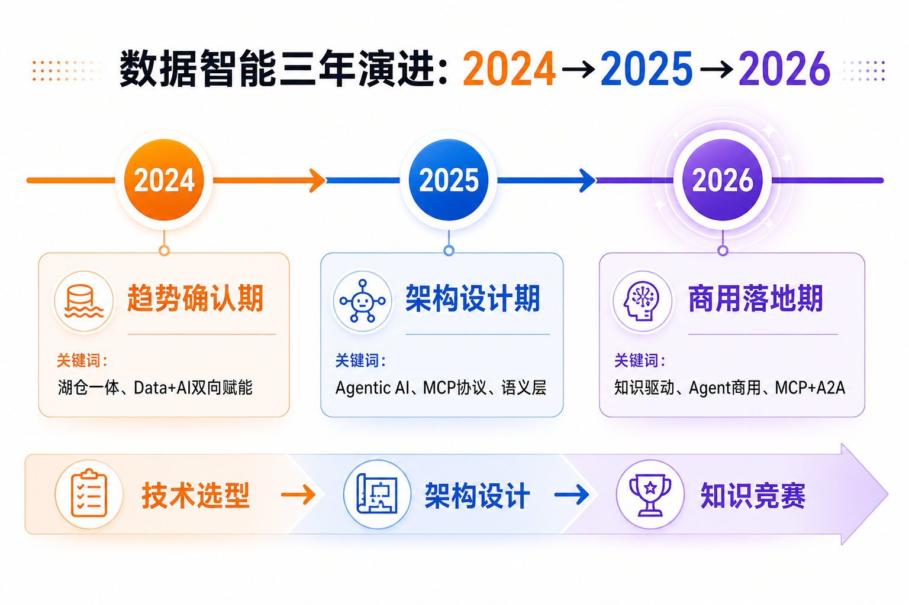
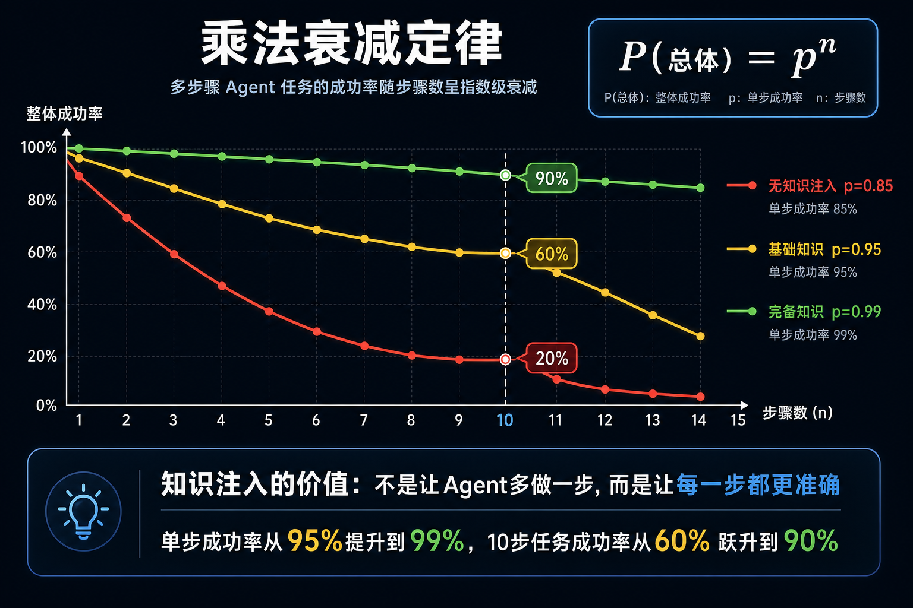
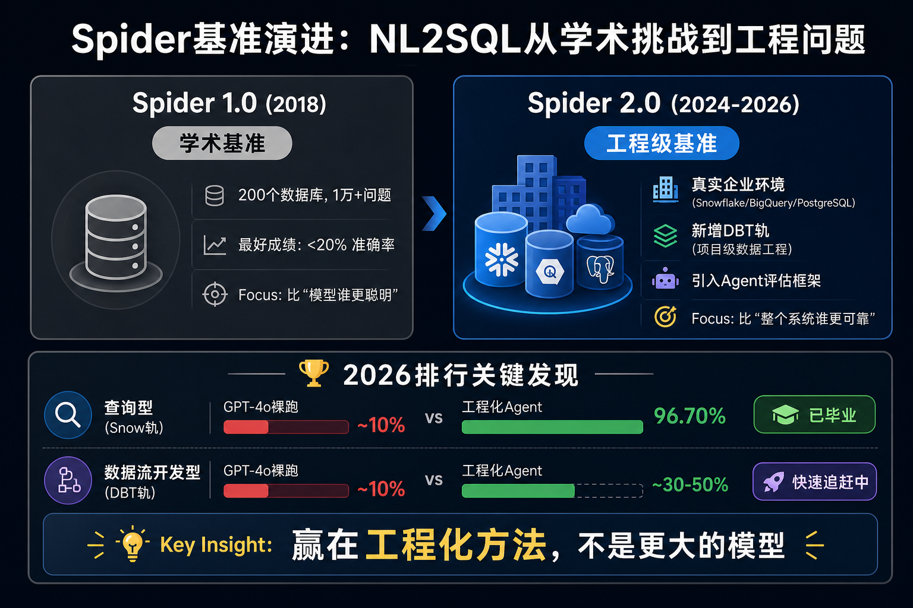
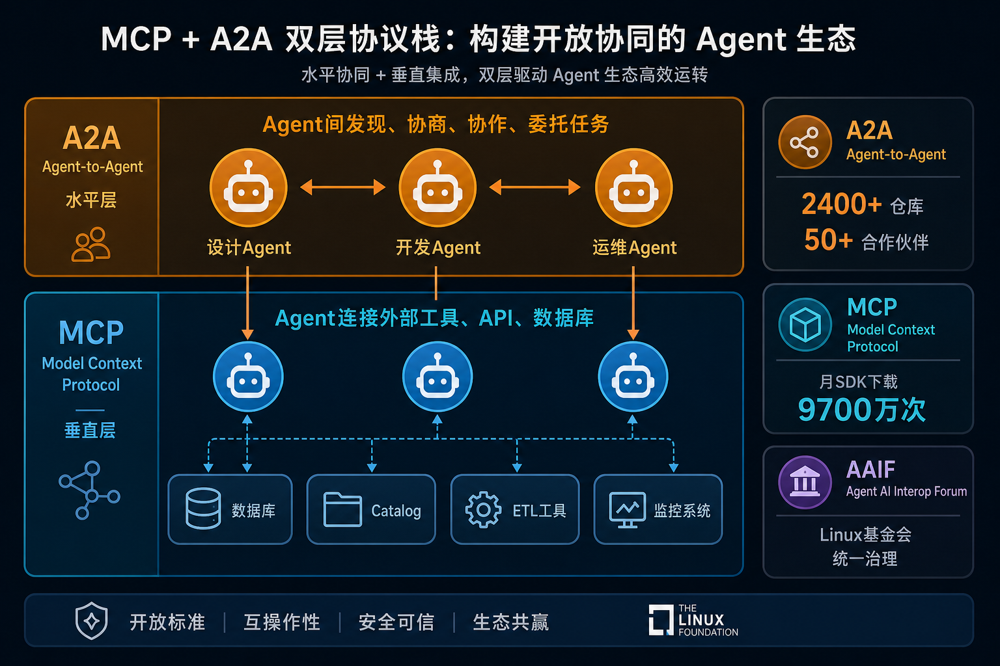
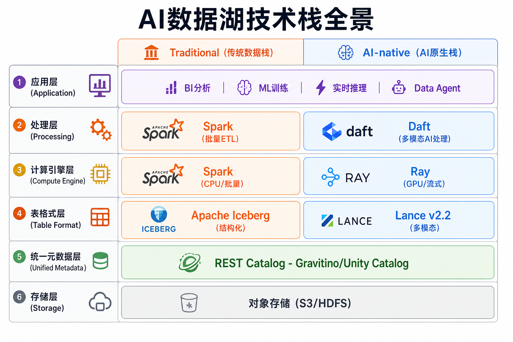
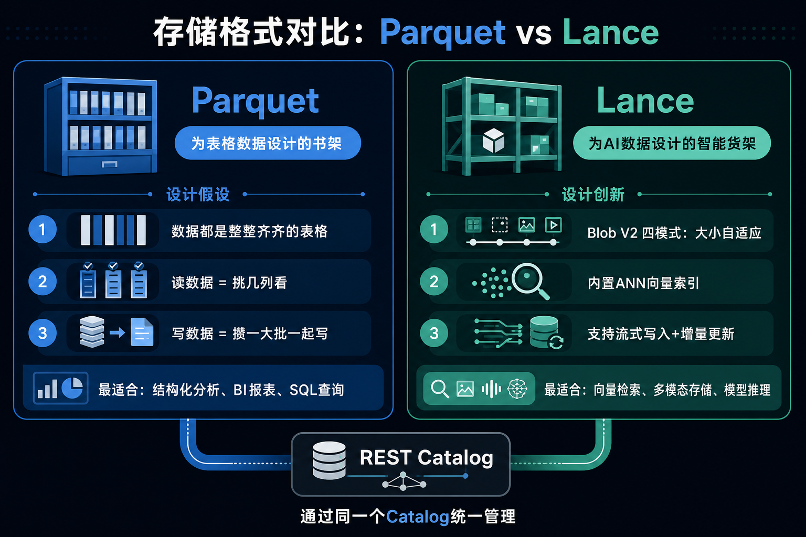
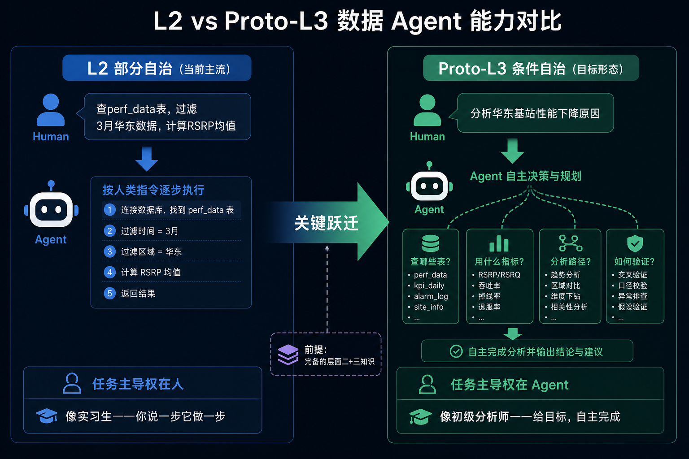
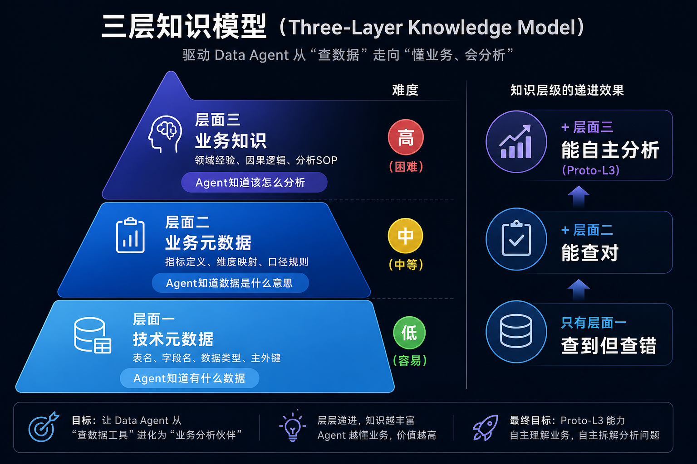
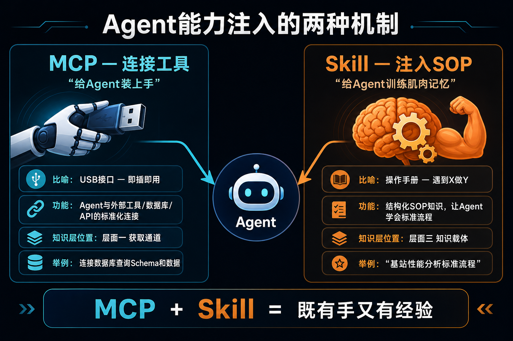

# AI时代的数据智能技术变革

> **适用对象**：浙江电信无线中心技术人员  
> **日期**：2026年5月  
> **作者**：向春（架构师）  
> **调研基础**：延续24年9月《数据智能技术分析及规划策略》、25年7月《生成式AI驱动的数据治理范式变革洞察》、26年5月《从Data Agent商用元年到知识驱动的范式跃迁》三轮调研成果  
> **版本**：V4.0  
> **总时长**：约4小时（引子15min + 第一部分1h + 第二部分1h + 第三部分2h）

---

## 目录

- [引子：织布机又来了](#引子织布机又来了)
- [第一部分：AI时代的数据智能技术趋势分析](#第一部分ai时代的数据智能技术趋势分析)
- [第二部分：AI催生的数据基础设施变革](#第二部分ai催生的数据基础设施变革)
- [第三部分：Data Agent——数据治理与消费的新范式](#第三部分data-agent数据治理与消费的新范式)

---

## 引子：织布机又来了

*（15分钟）*

> *"任何足够先进的技术，都与魔法无异。"* — Arthur C. Clarke

### 从纺纱机到提花织布机：一次被低估的革命

1764年，詹姆斯·哈格里夫斯发明珍妮纺纱机，让一个工人能同时操作8个纱锭——效率倍增，但本质还是"人更快地纺纱"。

1804年，约瑟夫·雅卡尔发明提花织布机。它的关键不是更快，而是引入了**打孔卡片**——一个没有任何纺织经验的工人，只要把打孔卡片装进织布机，就能织出只有大师才能完成的复杂花纹。

**这才是真正的革命。不是"机器更快"，而是"技能门槛的坍塌"。** 结果是什么？棉布价格在半个世纪内暴跌了90%以上。

### 完全相同的剧本正在软件行业上演

2026年，我们正在经历完全相同的故事：

- **Software 3.0**：Andrej Karpathy（前特斯拉AI总监）提出——软件开发从"人写代码"演进到"自然语言即编程"
- **Vibe Coding**：编程不再需要逐行编写，而是通过自然语言描述意图，AI实时生成代码
- **Claude Code**：Anthropic推出的AI编程工具，已经能独立完成从需求理解到代码交付的全流程

本质完全相同：**将昂贵的、高度依赖个人技艺的手工劳动，转变为可规模化、低门槛的工业化生产。** 提花织布机用打孔卡片替代了织工的技艺，AI用自然语言替代了程序员的编码技能。

### 卢德运动的启示：砸机器是徒劳的

1811年，英格兰的织工们组成"卢德派"，砸毁了成百上千台织布机。历史证明，这是徒劳的。

但故事的另一面更值得深思：**织布机消灭了"织工"这个角色，却创造了"纺织工程师""花纹设计师""机械维修工"等一系列全新的、更高价值的角色。** 理解变革本质的人，最先站到了新时代的价值高地。

核心启示：**每一次工业革命都不是简单的"替代"，而是"重组"——旧角色消亡，新角色诞生。**

### 数据领域的织布机时刻

2026年，Agent开始自主操作数据——**Data Agent已进入商用元年**。所有主流数据平台厂商的Agent产品均已正式商用收费，NL2SQL（让AI把自然语言翻译成数据库查询语句）准确率已达96.70%。

数据工程师面临的问题与1811年的织工一模一样：**当织布机来临时，织工去何从？**

答案不是"被替代"，而是**"从操作者重组为知识提供者"**——你脑中的业务知识、指标口径、分析经验，恰恰是Agent最缺乏的东西。在今天的培训中，你会看到：Agent的能力已经足够强大，但决定它能走多远的，是你能给它喂多少知识。

### 行业三年走过三个阶段，变革已至



| 年份 | 阶段 | 核心命题 | 焦点 |
|------|------|---------|------|
| **2024** | 趋势确认期 | "Data+AI要不要融合？" | Databricks、Snowflake、阿里、华为全部明确Data+AI战略，行业共识形成。讨论的是**选什么技术栈** |
| **2025** | 架构设计期 | "Agent能不能用在数据领域？" | MCP协议发布、Agent产品涌现、多模态湖仓架构蓝图成型。讨论的是**怎么设计架构** |
| **2026** | 商用落地期 | "Agent已经能用了，但真正的瓶颈是什么？" | 所有厂商Agent产品正式商用收费，NL2SQL达96.70%。技术不再是瓶颈，**知识才是** |

**今天的培训围绕2026年的核心命题展开：**

- **第一部分**：看清发生了什么——从技术趋势、权威机构、学术界、企业界四个视角认清变革
- **第二部分**：理解底层在怎么变——数据基础设施如何从服务"人"扩展到同时服务"人+LLM+Agent"
- **第三部分**：动手体验Data Agent——理解知识为什么是关键，并在Claude Code上亲自构建一个Data Agent

---

## 第一部分：AI时代的数据智能技术趋势分析

*（1小时）*

---

### 1.1 从AI技术发展趋势看

#### 1.1.1 大模型能力的指数级跃迁

大模型从"聪明的文本生成器"到"能操作外部世界的推理引擎"的质变，直接催生了数据领域的Agent化浪潮。这个质变体现在三个维度：

**维度一：推理能力的跃迁**

早期大模型只能做简单的文本续写和问答。2024年开始，以GPT-4o、Claude 3.5 Sonnet为代表的前沿模型展现出了多步推理、复杂任务分解、可执行代码生成的能力。

背后的关键机制是**推理时计算（Test-time Compute）**——不是模型的参数更多了，而是模型学会了"想久一点再回答"。传统模型不管问题多复杂都"脱口而出"，推理时计算让模型在遇到难题时能进行内部推演——类似人类"多想一会儿再作答"。这是Agent可靠性的关键乘数。

**维度二：上下文窗口的爆发式增长**

| 时间 | 上下文窗口 | 含义 |
|------|---------|------|
| 2023 | 4K token | 只能看到几段文字 |
| 2024 | 128K token | 能看到一本书的内容 |
| 2025-2026 | 1M+ token | 能一次性看到整个数据库Schema、几十张表的元数据、历史查询记录 |

对数据领域的直接影响：长上下文使NL2SQL从"凭猜测"变为"有据可查"——模型不再是看到一个问题就猜答案，而是能看到完整的数据库结构和业务规则后再生成SQL。

**维度三：工具调用（Function Calling）的标准化**

模型从"只能输出文字"进化到"能调用外部API、数据库、工具"。这看似简单，却是Agent能"动手操作数据"的技术基础——模型不再只是"说"，还能"做"。

**三个维度叠加的结论：推理够强 + 看得够多 + 能动手操作 = Agent在数据领域具备了商用可能性。**

---

#### 1.1.2 Agent技术的成熟曲线——从概念到商用元年

Agent沿着清晰的成熟曲线演进。2026年的关键拐点是——从"技术可行"跨过了"商业可行"门槛。

**先理解一个关键概念：乘法衰减定律**

Agent执行任务不是一步完成的，而是分多步进行。如果每一步的成功率是p，执行n步后整体成功率就是p的n次方（p^n）。



这个看似简单的公式揭示了Agent的根本挑战：

| 单步成功率 | 10步任务成功率 | 含义 |
|-----------|-------------|------|
| 85% | 20% | 5次里只成功1次——用户无法信任 |
| 95% | 60% | 勉强可用，但需要频繁人工干预 |
| 99% | 90% | 商用门槛——用户体验可接受 |

**这条定律贯穿整个培训：**

- 1.1.1的推理时计算回应它——提升了每一步的成功率p
- 第三部分的"知识驱动"回应它——知识注入既提升p（每步更准），又降低n（减少不必要的步骤）
- 实操环节会直接演示——无知识vs有知识，衰减曲线完全不同

**再看行业如何逐步克服衰减：**

**阶段一（2023-2024）：概念验证期**

AutoGPT、BabyAGI引发全球热潮——"AI能自主完成任务了！"但冷静下来发现，p^n衰减导致可靠性极低，大部分演示只是精心挑选的"黄金路径"，换个问法就失败。

**阶段二（2025）：框架成型期**

两个关键突破：
- **MCP（Model Context Protocol）**解决了Agent与工具连接的标准化问题——Agent终于有了标准的"手脚"
- ReAct、Reflection等Agent设计模式成熟——Agent学会了"做完一步检查一下结果再决定下一步"

**阶段三（2026）：商用落地期**

三个标志性事件宣告Agent跨过商用门槛：
1. **国内外所有主流数据平台厂商的Agent产品全面正式收费**——商业模式验证
2. **Spider 2.0查询型NL2SQL达到96.70%**——核心能力验证
3. **MCP月SDK下载9700万次**——生态成熟度验证

**结论：Agent已经"够用了"，问题转向了"给Agent喂什么知识才能让它真正好用"。**

---

### 1.2 从权威机构看

1.1从技术趋势判断"Agent来了"，1.2用第三方权威机构的判断来"背书"——不是我们自己说Agent来了，是全球最权威的分析机构都在说同一件事。

#### 1.2.1 Gartner：三大趋势，两个强证据，一个需要批判

Gartner 2026年战略技术趋势中，三个与数据智能高度相关：

| 趋势 | Gartner判断 | 我们的评价 |
|------|-----------|---------|
| **多智能体系统** | 数据治理从单Agent辅助走向多Agent协同 | **强证据支撑** — 与行业实践完全一致 |
| **AI原生开发平台** | 数据平台开发范式从人编写ETL代码演进为Agent编排数据流水线 | **强证据支撑** — Databricks Genie Code、Snowflake Cortex Code都是例证 |
| **领域专用语言模型** | 企业将大规模采用小型专用模型 | **需要批判性看待** — 见下文分析 |

**为什么"领域专用模型"需要批判？**

Gartner预测企业将大规模采用领域专用的小型模型，认为它们比通用大模型更可靠、成本更低。但高价值数据场景的证据恰恰指向相反方向：

- **Spider 2.0排行榜**：裸GPT-4o约10%，工程化Agent（通用模型+知识约束）96.70%——差距靠的是工程化方法，不是专用模型
- **Claude Opus颠覆金融分析**：用通用前沿模型+完善的金融知识体系，超越了所有金融专用模型
- **Claude Code颠覆软件开发**：通用模型+代码领域知识，不需要"编程专用模型"

赢家都是**"通用前沿模型 + 知识工程"**，不是专用小模型。这反而印证了核心判断：**模型不是瓶颈，知识才是。**

#### 1.2.2 IDC：钱在往哪流，趋势就在哪

Gartner告诉你"方向在哪"，IDC告诉你"钱在往哪走"。

> *"数据和分析正在进入一个由Agentic AI、去中心化架构和实时智能塑造的新时代。"* — IDC 2026

- 全球AI IT支出以**32% CAGR**增长（未来五年），第一驱动力是Agentic AI
- **Agentic AI、去中心化架构、实时智能** — IDC定义的数据分析新时代三要素

**投资方向的信号比技术预测更可靠——资本已经做出了选择。**

#### 1.2.3 中国信通院：2026深度观察

信通院从技术演进视角给出三个与数据智能直接相关的判断：

| 信通院判断 | 含义 | 对应后续内容 |
|---------|------|----------|
| **智能体成为AI落地的核心载体** | Agent不是辅助工具，而是AI落地的主要形态 | 第三部分全面展开 |
| **从"AI嵌入"到"AI原生"** | 数据平台不是"旧系统加个AI功能"，需要重新设计为AI原生架构 | 第二部分基础设施变革 |
| **算力全栈升级** | 10-100倍性能提升为Agent大规模部署扫清算力瓶颈 | 2.4计算引擎 |

---

### 1.3 从学术界看

1.1讲技术趋势，1.2讲权威机构怎么看。但"Agent操作数据到底靠不靠谱"这个问题，需要学术界的基准测试来回答。学术界给出了两把量化的尺子。

#### 1.3.1 Spider基准：NL2SQL从"学术挑战"到"工程问题"

Spider系列基准的演进本身就是一部NL2SQL（让AI把自然语言翻译成SQL）从"能不能做"到"怎么做好"的编年史。



**Spider 1.0（2018）— 定义问题**

2018年耶鲁大学发布Spider 1.0，这是最早的跨数据库NL2SQL基准：200个数据库、1万多个问题。当时最好的模型准确率不到20%——AI连简单的"查一下某某表"都经常出错。

Spider 1.0回答的核心问题是："让AI把自然语言翻译成SQL，到底有多难？"答案是——非常难。

**Spider 2.0（2024发布，持续更新）— 升级为工程级基准**

Spider 2.0做了三个根本性升级：

| 维度 | Spider 1.0 | Spider 2.0 |
|------|-----------|-----------|
| 环境 | 200个独立小数据库 | 真实企业级环境（Snowflake/BigQuery/PostgreSQL） |
| 任务范围 | 单条SQL翻译 | 新增DBT轨——项目级数据工程（整个数据Pipeline） |
| 评估对象 | 模型本身 | 整个Agent系统（模型+知识+工具+编排） |

从1.0到2.0的核心转变：1.0比"模型谁更聪明"，2.0比"整个系统谁更可靠"。NL2SQL已从学术挑战变成工程问题。

**2026年最新排行揭示"两个世界"：**

| 赛道 | GPT-4o裸跑 | 工程化Agent | 差距 | 状态 |
|------|---------|----------|------|------|
| 查询型（Snow轨） | ~10% | **96.70%** | 近10倍 | **已"毕业"** |
| 数据流开发型（DBT轨） | ~10% | ~30-50% | 快速追赶中 | 差距仍大 |

关键洞察：同样的GPT-4o模型，裸跑约10%，加上工程化方法（Agent编排+知识约束）达到96.70%，差距近10倍。**赢在工程化方法，不是更大的模型。**

Spider的数据在第三部分会被反复引用——它是"语义层为什么不可绕过"的最硬证据。

#### 1.3.2 Data Agent综述：六级自治体系

Spider回答了"能力到了什么水平"，接下来的问题是——怎么对Agent自治程度做分级？

2024年，清华大学和港科广联合发表Data Agent综述论文，提出**L0-L5六级自治体系**。到2026年，这套体系已从学术论文走向行业共识，成为厂商对标自身产品的通用标尺。

| 等级 | 名称 | 一句话描述 | 26年产品状态 |
|------|------|-----------|-----------|
| L0 | 无自治 | 纯人工操作 | 遗留系统 |
| L1 | 辅助 | AI补全代码、提示语法 | 已成标配（每个IDE都有） |
| L2 | 部分自治 | AI按人的指令逐步执行 | 行业入门门槛 |
| L3 | 条件自治 | AI自主规划分析路径 | **限定场景可尝试（Proto-L3）** |
| L4 | 高度自治 | AI跨域协调、自主决策 | 研究阶段 |
| L5 | 完全自治 | AI完全替代人类数据工作者 | 远期愿景 |

**关键洞察：L2→L3是最重要的跃迁节点。** Agent从"按指令执行"变为"自主编排"——前提不是更强的模型，而是更完备的知识。

只需记住一个坐标：**当前主流在L2，目标是Proto-L3，钥匙是知识。** 第三部分会展开精讲。

---

### 1.4 从企业界看

1.1-1.3从技术、机构、学术画了趋势轮廓。1.4看企业界——他们在用产品和真金白银下注。企业界的动作是趋势最诚实的验证。

#### 1.4.1 国际三巨头：双赛道竞争

Databricks、Snowflake、Google不只在做Agent产品，同时在重建底层基础设施。两条赛道在2026年同时白热化。

**基础设施赛道：**

| 厂商 | 关键动作 | 信号 |
|------|--------|------|
| Google | Managed Iceberg GA + 跨云Lakehouse | 全面拥抱开放格式 |
| Databricks | Unity Catalog开源 + Delta UniForm双向兼容Iceberg | 统一元数据成为竞争武器 |
| Snowflake | Polaris Catalog + Apache Iceberg原生支持 | 从封闭走向开放 |
| **共识** | **Iceberg成为三家共识的湖仓标准，REST Catalog统一成为元数据层事实标准** | |

Google还推出了**Knowledge Catalog**——不只管理表和字段的技术元数据，而是为Agent提供业务上下文的知识引擎。这是"知识竞赛"的信号弹。

**Agent赛道：**

竞争焦点从"谁的AI功能多"转向"谁能让Agent理解更多业务上下文"：

- **Databricks Genie Agent Mode**：从SQL助手进化为自主分析Agent
- **Snowflake Intelligence**：语义层+Agent的深度整合
- **Google Conversational Analytics**：Knowledge Catalog驱动的对话式分析

**结论：基础设施决定Agent能"碰到"什么数据，知识决定Agent能"理解"什么数据。缺一不可。**

#### 1.4.2 国内厂商：Agent商用化与基础设施并进

国内三家主要数据平台厂商同样双线并行：

**Agent线：** 阿里DataWorks、华为DataArts、字节火山引擎——三家共性是从Copilot辅助模式升级为独立计费的Agent产品线，覆盖数据开发、治理、分析全生命周期。Agent不再是"附赠功能"，而是"独立收费产品"。

**基础设施线：** 字节推出**LAS（AI数据湖服务）**——从大模型训练场景反向定义数据湖架构，支持多模态元数据统一管理。这是国内首个从AI训练场景反向定义数据湖架构的产品。

**结论：Agent收费倒逼知识建设，AI数据湖服务说明基础设施也在同步变革。**

#### 1.4.3 开源生态：AI数据湖技术栈走向成熟

支撑基础设施变革的开源技术栈在2026年从"各自独立"走向"互操作成熟"——这是第二部分要展开讲的技术基础。

| 技术 | 2026年状态 | 意义 |
|------|---------|------|
| **Lance v2.2 GA** | Blob V2四模式、存储压缩50%+ | AI多模态存储格式趋于生产就绪 |
| **Daft** | REST Catalog统一 + 向量搜索下推 | AI数据处理框架关键能力补齐 |
| **Iceberg 1.10→1.11** | 稳定期 | 结构化数据存储标准成熟 |
| **Ray** | AI任务调度生态持续成熟 | 与Spark的互补格局稳固 |
| **关键突破** | **REST Catalog统一：Iceberg和Lance都可通过同一套REST接口管理** | 两套栈"一个屋檐下"成为可能 |

这里不展开技术细节（第二部分的事），只需知道——**支撑变革的技术积木已经就位。**

#### 1.4.4 MCP+A2A双层协议栈

MCP+A2A是连接基础设施与Agent的"接口层"——MCP让Agent触达数据工具和基础设施，A2A让Agent之间协作。



| 协议 | 功能 | 2026年生态 |
|------|------|---------|
| **MCP**（垂直层） | Agent连接外部工具、API、数据库 | 月SDK下载9700万次，18000+社区服务器，OpenAI/Google/Microsoft/Amazon全部采用 |
| **A2A**（水平层） | Agent之间发现、协商、委托任务 | Google发布，2400+仓库，50+合作伙伴 |
| **AAIF** | 统一治理框架 | Linux基金会成立，MCP/A2A/ACP统一纳入 |

**MCP是基础设施与Agent之间的桥梁——没有MCP，Agent看不见数据；没有基础设施，MCP连接的是空气。**

#### 1.4.5 企业界的核心信号

汇总双赛道信号：

- **基础设施就绪**：开源技术栈互操作成熟 + Iceberg统一 + REST Catalog标准化
- **Agent商用**：国际三巨头+国内三家全面产品化收费
- **协议层成型**：MCP+A2A连接两者

**一句话：地基打好了，工具也到位了，现在决定盖出什么楼的是——你有多少知识可以喂给Agent。**

承上启下：基础设施怎么变 → 第二部分展开；Agent怎么用 → 第三部分展开。

---

### 1.5 趋势总结

把1.1-1.4所有信号收束为四个可记忆的趋势判断：

#### 趋势一：软件架构的范式转变——Agent as a Service

数据平台的交互范式发生根本性转变：

| | 传统模式 | Agent模式 |
|--|--------|---------|
| 交互链路 | 人 → SQL/ETL代码 → 数据系统 | 人 → 自然语言 → Agent → MCP → 数据系统 |
| 门槛 | 需要SQL/Python技能 | 需要清晰的自然语言表达 |
| 本质 | 人是执行者 | Agent是执行者，人是指挥者 |

不是功能升级，是架构范式转变。回扣1.4.4（MCP+A2A）和1.4.1（三巨头Agent产品）。

#### 趋势二：人与AI的共生关系深刻改变数据生态

不是"AI替代人"，是"人提供知识，Agent提供执行力"的共生模式。回扣引子——织工从"操作织布机"变成了"设计花纹"：

- 数据工程师的**旧角色**：写SQL、调ETL、做报表——操作者
- 数据工程师的**新角色**：定义指标口径、梳理分析SOP、沉淀业务知识——知识提供者

回扣1.1.2（乘法衰减定律）——人提供知识是提升p、降低n的最有效手段。

#### 趋势三：非结构化数据从"暗数据"变为"核心资产"

企业80%以上数据是非结构化的——基站照片、告警文本、维修工单、用户投诉语音。过去，这些数据只能"存着不用"，是"暗数据"。

LLM+向量检索使这些数据第一次可被规模化利用：

| 非结构化数据 | AI时代之前 | AI时代之后 |
|-----------|---------|---------|
| 基站告警文本 | 人工查看、经验判断 | Agent自动分析、关联历史模式 |
| 现场勘查照片 | 存档在文件服务器 | 多模态模型自动识别异常 |
| 用户投诉语音 | 人工接听、抽样分析 | 语音识别+情感分析+全量分析 |
| 设备手册PDF | 按需查阅 | Agent自主检索+关联故障代码 |

这些"暗数据金矿"对应第二部分的多模态数据湖、Lance存储格式。

#### 趋势四：知识驱动——Agent能力已不是瓶颈，知识才是

**整个培训核心命题的最终落点。** 前三个趋势讲"变化方向"，趋势四讲"决定胜负的关键变量"。

证据链汇总：

| 证据 | 说明 |
|------|------|
| Spider 2.0 | 同一模型，10% vs 96.70%，差别在知识注入 |
| Google Knowledge Catalog | 专门为Agent提供业务知识的产品 |
| 字节Data Agent | 商用效果直接取决于知识完备度 |
| Gartner"专用模型"预测的反面 | 通用模型+知识 > 专用模型 |

**Agent能力已过商用门槛，知识是决定它能走多远的唯一变量。**

---

## 第二部分：AI催生的数据基础设施变革

*（1小时）*

第一部分讲完"发生了什么"，第二部分回答"底层为什么要变"。

---

### 2.1 范式转移的本质

#### 2.1.1 从"单消费者"到"多消费者"：数据的消费者从人扩展到人+LLM+Agent

过去所有数据基础设施围绕一个消费者设计——**人**。所有设计决策都由此推导：Parquet的列式存储（人的分析需要列式聚合）、SQL（人用声明式语言表达意图）、BI仪表盘（人用视觉理解数据）。

现在消费者变成三类，每类需求特征完全不同：

| 消费者 | 消费方式 | 对数据的要求 |
|--------|---------|------------|
| **人** | SQL查询、BI报表、手工分析 | 结构化、可视化、汇总聚合 |
| **LLM** | 向量检索、批量推理、训练/微调/RAG | 多模态、高吞吐、向量索引、非结构化 |
| **Agent** | 自主查询、工具调用、多步编排 | 元数据可发现、语义可理解、API可调用 |

三类消费者对存储格式、访问接口、元数据的要求几乎没有交集。现有数据栈是围绕"人"这个单一消费者设计的——**这是基础设施必须变革的根本原因。**

#### 2.1.2 不拆旧楼，加盖新层——渐进式架构演进的第一性原理

面对三类消费者，正确策略不是推翻现有栈，而是在现有栈之上加层。这不是保守，是第一性原理的推导：

**为什么不能替换？**

- 现有栈服务"人"已经很好——Spark+Iceberg+SQL/BI依然是结构化分析的最优解
- 迁移成本极高、风险极大
- "人"不会消失，AI是新增消费者

**加什么层？**

| 为谁加 | 加什么 | 对应技术 |
|--------|-------|---------|
| 为LLM加 | 多模态存储层 + 向量检索层 + AI处理层 | Lance + LanceDB + Daft + Ray |
| 为Agent加 | 标准化接口层 + 语义/知识层 | MCP + 语义层 |
| 为统一管理加 | 统一元数据层 | REST Catalog（Gravitino / Unity Catalog） |

**这个"加层"策略就是2.2-2.5的逻辑框架——每一节讲的都是"加了什么层、为什么、怎么加"。**

---

### 2.2 AI数据湖架构：多模态数据湖

2.1讲了"为什么要加层"，2.2展示"加完层后的全景是什么样"——先给一张完整架构图，再在2.3-2.5逐层深入。

#### 2.2.1 分层架构全景

AI数据湖不是一个新产品，而是在现有湖仓之上叠加AI能力层后形成的六层架构：



| 层次 | 传统栈（"旧楼"） | AI栈（"新层"） |
|------|-----------|---------|
| **应用层** | BI分析、ML训练 | 实时推理、Data Agent |
| **处理层** | Spark（批量ETL） | Daft（多模态AI数据处理） |
| **计算引擎层** | Spark（批量/CPU）、Flink（实时流处理） | Ray（AI任务调度/GPU） |
| **表格式层** | Iceberg（结构化数据） | Lance（多模态AI数据） |
| **统一元数据** | REST Catalog（Gravitino / Unity Catalog） | |
| **存储层** | 对象存储（S3 / HDFS / GCS） | |

- **左半边是"旧楼"**（Spark/Flink/Iceberg——服务人的传统栈）
- **右半边是"新层"**（Daft/Ray/Lance——服务LLM和Agent的AI栈）
- **中间的REST Catalog让两套栈共存于同一屋檐下**

这张图是2.3-2.5的导航地图——接下来逐层讲解。

#### 2.2.2 统一非结构化与结构化的元数据管理

工作负载和存储格式可以按数据类型分为两套栈，但**元数据管理必须统一**——否则Agent只能看到半个世界。

**为什么必须统一？**

- Agent需要一个统一入口发现和查询数据资产——不能"结构化数据问Iceberg Catalog，非结构化数据问另一个系统"
- 数据血缘、权限控制、生命周期管理都需要跨格式的统一视图
- 如果元数据分裂，Agent需要学会"去两个地方问"，额外增加了步骤（还记得p^n衰减吗？）

**统一的机制——REST Catalog标准：**

Apache Gravitino和Unity Catalog早已支持通过REST Catalog标准管理Iceberg表。2026年的收敛点是**Daft新增REST Namespace Catalog支持**，使Lance表也可通过同一套REST接口纳入管理。

通俗说：以前结构化数据有一个"仓库管理员"，非结构化数据没人管或者另有一个"管理员"。现在两套数据共用同一个"仓库管理员"——Agent只需要问一个人就能找到所有数据。

**结论：两套栈共享同一个元数据层——这是"不拆旧楼，加盖新层"能成立的关键前提。**

#### 2.2.3 两套栈的分工边界

两套栈不是竞争关系，而是按数据类型和工作负载各管各的活：

| 维度 | 传统栈（Iceberg + Spark + Flink） | AI栈（Lance + Daft + Ray） |
|------|---------------------------|---------------------|
| 数据类型 | 结构化（表、行、列） | 多模态（向量、图片、文本、Blob） |
| 工作负载 | 批量ETL、实时流处理、SQL分析、BI | 向量检索、模型推理、AI数据处理 |
| 消费者 | 人（分析师、工程师） | LLM、Agent |
| 成熟度 | 生产验证 | 可试点（Lance v2.2 GA） |

关键原则：**不要用AI栈替换传统栈做批量ETL，也不要用传统栈硬做向量检索。** 回扣"不拆旧楼，加盖新层"——两套栈的共存就是这个策略的具体体现。

---

### 2.3 存储格式：从Iceberg到Iceberg+Lance

2.2讲了架构全景，2.3开始逐层深入——先看数据"怎么存"。

#### 2.3.1 Parquet的三个设计假设与AI场景下的"水土不服"

Parquet是当前最主流的列式存储格式，几乎所有大数据工具都支持它。但它的设计是基于三个假设的——这三个假设在AI场景下全部"水土不服"。



把Parquet想象成一个**专门为表格数据设计的书架**——放整整齐齐的书很好用，但你要在上面放照片、视频、模型文件，它就放不下了。

**假设一：数据都是整整齐齐的表格**

Parquet按列存放数据，就像Excel——每列宽度一致、类型统一。但AI数据（图片、音频、向量）大小差异极大——一张照片可能比一千条文本记录还大。往"整齐的格子"里塞"大小不一的东西"，要么浪费空间，要么根本塞不进去。

**假设二：读数据就是"挑几列看"**

Parquet擅长"只看姓名和年龄这两列"——跳过不需要的列，非常高效。但AI要做的是"在几百万个向量中找最相似的10个"——这完全是另一种找法，Parquet没有为此设计索引结构。

**假设三：写数据是"攒一大批一起写"**

Parquet像搬家——攒够一卡车一起拉。但AI场景需要边跑模型边写结果，是"边住边装修"——频繁的小批量写入对Parquet来说效率很低。

**结论：不是Parquet有问题，是AI需求超出了它的"舒适区"——不能怪书架放不下自行车。**

#### 2.3.2 Lance：专门为AI数据设计的"新货架"

Lance不是Parquet的升级版，而是针对AI场景重新设计的——就像仓库里除了书架之外，加了一套能放大件小件各种尺寸的智能货架。

**解决"大小不一"—— Blob V2四种存放方式**

| 模式 | 适用场景 | 类比 |
|------|--------|------|
| 内嵌模式 | 小数据（几十字节） | 快递柜小格子 |
| 打包模式 | 中等数据 | 快递柜中格子 |
| 独立模式 | 大文件（图片、视频） | 快递柜大格子 |
| 引用模式 | 超大文件 | 只存一张"取件码"，东西放在别的地方 |

就像快递柜有大中小格子自动分配——不管来什么尺寸的包裹都能妥善安置。

**解决"找法不同"—— 内置向量索引（ANN）**

在数据存放处直接完成"找最相似的"查询。不需要把数据搬到另一个系统再检索——就地完成。

**解决"边跑边写"—— 流式写入和增量更新**

支持边跑模型边写结果，不用攒一大批。

**2026年成熟度：** v2.2正式发布，存储空间比前一版本节省50%以上。

**结论：Iceberg放"表格数据"（书架），Lance放"AI数据"（智能货架），通过同一个Catalog统一管理（同一个仓库管理员）。**

---

### 2.4 计算引擎：Spark、Flink与Ray的正交关系

2.3讲了数据"怎么存"，2.4讲数据"怎么算"。

#### 2.4.1 为什么是"正交"而非"互补"

Spark、Flink、Ray不是"功能重叠、互相补充"，而是**"各管各的维度、互不替代"的正交关系**——像长、宽、高三个方向，各自独立。

| 引擎 | 管什么 | 类比 |
|------|-------|------|
| **Spark** | 批量处理 | 洗衣机——攒够一桶一起洗 |
| **Flink** | 实时流处理 | 流水线——东西来了立刻处理 |
| **Ray** | AI任务调度 | 工头——管理很多GPU工人做训练/推理/向量计算 |

正交意味着：**不会用洗衣机的标准评价流水线好不好用。** 三者各有各的"维度"，在各自维度上不可替代。

#### 2.4.2 Spark不适合AI工作负载的根本原因

Spark的设计哲学是"大批量、无状态、CPU"——恰好是AI工作负载的反面：

| 维度 | Spark的设计 | AI工作负载需要 |
|------|----------|------------|
| 调度粒度 | Task（无状态，用完即弃） | Actor（有状态，长驻进程，维护模型参数） |
| 数据位置 | 磁盘/对象存储 | GPU显存 |
| 计算模式 | 无状态MapReduce | 有状态（训练/推理需要维护模型权重） |

通俗说：让习惯搬砖的工人去做精密手术——能力不匹配。

#### 2.4.3 Ray同样不适合传统批量ETL

反过来也成立——Ray用来跑传统ETL是大材小用且效率低下：

- 没有原生SQL优化器和列式处理引擎
- 调度器为细粒度AI任务优化，大批量数据扫描不如Spark高效
- 通俗说：让外科医生去搬砖——不是不能做，是浪费且不高效

**结论：三个引擎各司其职——Spark管批量ETL、Flink管实时流处理、Ray管AI任务。** 在无线中心的典型工作流中，传统数据处理继续用Spark+Flink，AI相关任务（模型推理、向量检索、数据增强）用Ray。

---

### 2.5 处理框架Daft：AI数据湖的统一处理接口

2.3讲存储，2.4讲计算引擎，中间缺一个"胶水"——谁把Lance数据读出来、在Ray上处理、再写回去？这就是Daft。

#### 2.5.1 Daft的独特定位

Daft不是Spark的替代品，而是AI数据湖中连接"存储"和"计算"的**胶水层**——唯一同时支持Lance读写、Ray调度、向量查询的处理框架。

| | Spark | Daft |
|--|-------|------|
| 类比 | "传统数据的搬运工" | "AI数据的搬运工" |
| API | Spark DataFrame | 类Pandas DataFrame（更熟悉） |
| 底层引擎 | Spark自身集群 | 跑在Ray上（分布式GPU） |
| 核心价值 | 批量ETL、SQL分析 | 做Spark做不到的事：Lance读写、向量检索、多模态处理 |

#### 2.5.2 2026年两个关键进展

两个进展让"读→处理→检索→写回"的AI数据闭环真正打通：

**进展一：REST Catalog统一**

Daft通过 `rest://namespace/table` 访问Lance表，与Iceberg走同一套Catalog。这是2.2.2统一元数据落地的关键拼图——有了它，Agent通过REST Catalog就能同时发现结构化数据和AI数据。

**进展二：向量搜索下推**

以前："把整个仓库的货搬到办公室，再一件件翻找"——先全量读出数据，再在内存中做向量搜索。

现在："告诉仓库管理员你要什么，他直接送过来"——把搜索请求下推到Lance的ANN索引，只返回最相关的结果。

#### 2.5.3 端到端闭环示例

| 场景 | 流程 |
|------|------|
| **数据写入** | 多模态数据 → Daft处理 → 写入Lance表（通过REST Catalog注册） |
| **数据查询** | 用户/Agent发起向量查询 → Daft下推到Lance ANN索引 → 返回Top-K结果 |
| **数据处理** | Daft读取Lance数据 → 在Ray上分布式处理 → 结果写回Lance |

这个闭环是2.2.1架构全景图右半边（AI栈）的具体工作方式。

---

### 2.6 小结：数据基础设施如何同时服务人、LLM、Agent三类消费者

回扣2.1.1的"三类消费者"，说清每类由哪些组件服务：

| 消费者 | 服务它的技术组件 | 对应章节 |
|--------|---------------|---------|
| **人** | Iceberg + Spark + Flink + SQL/BI | "旧楼"——2.3.1、2.4 |
| **LLM** | Lance + Daft + Ray + 向量检索 | "新层"——2.3.2、2.4、2.5 |
| **Agent** | REST Catalog（发现数据）+ MCP（操作工具）+ 语义层（理解数据） | "桥梁"——2.2.2 + 第三部分 |

注意Agent这一行故意只写了一半——REST Catalog让Agent"看到"数据，但还需要MCP来"操作"、语义层来"理解"。后两者是第三部分的内容。

**承上启下：基础设施解决了"Agent能碰到什么数据"，第三部分解决"Agent能理解什么数据"——后者才是决定Agent能走多远的关键。**

---

## 第三部分：Data Agent——数据治理与消费的新范式

*（2小时：讲授篇约55分钟 + 实操篇约60分钟）*

---

### 【讲授篇：核心框架与关键概念】

---

### 3.1 数据智能体的兴起

第二部分解决了"Agent能碰到什么数据"，第三部分回答"Agent是什么、怎么让它理解数据、怎么用它"。

#### 3.1.1 Data Agent的定义与兴起背景

Data Agent不是"数据平台加了个聊天框"，而是能**自主感知、规划、执行、迭代**的智能体。

| 关键要素 | 含义 | 对应技术 |
|---------|------|---------|
| **感知** | 通过MCP连接数据环境，知道有什么数据、什么工具 | MCP Server |
| **规划** | 分解复杂任务、制定执行路径 | LLM推理能力 + 知识注入 |
| **执行+迭代** | 调用工具执行，根据结果调整策略 | Function Calling + ReAct模式 |

兴起背景快速回扣第一部分：模型能力跨过门槛（1.1.1）、MCP标准化（1.4.4）、厂商全面商用（1.4.2）——**三个前提条件在2026年同时满足。**

#### 3.1.2 Data Agent解决的核心矛盾

Data Agent解决数据领域两个根深蒂固的矛盾：

**矛盾一：数据消费的技术门槛**

数据消费被SQL、Python、BI工具等技术能力绑定——80%的业务人员被挡在数据之外。所有数据需求都要经过"业务需求→工程师理解→编码实现→交付验证"的长链路。需求排队三天，五分钟就能改好的报表等一周。

Agent的价值：**将数据消费门槛从"会写代码"降到"会提问"。**

**矛盾二：数据治理的人力密集型困境**

元数据梳理、指标口径对齐、血缘关系追踪、质量规则维护——每一项都是高度依赖人工的重复性劳动。数据资产规模以指数级膨胀，治理人力以线性增长——缺口只会越来越大。

Agent在治理中的**双重角色**：既**依赖**治理成果才能准确工作（没有好的指标定义，Agent查出来的数就是错的），又能**加速**治理过程（辅助血缘发现、口径推荐、不一致性检测）。

**两个矛盾的交汇：** 降低消费门槛需要完善的治理基础，完善治理又需要Agent辅助——正循环的冷启动问题。这引出了3.1.3的核心转变和3.4的三层知识模型。

#### 3.1.3 从"规则驱动"到"知识驱动"

| | 规则驱动（传统） | 知识驱动（Agent） |
|--|------------|------------|
| 工作方式 | 人把逻辑写成代码（ETL脚本、固定报表模板） | Agent根据被赋予的知识动态决策 |
| 特点 | 确定性高但僵化——需求变一点就要改代码 | 灵活但**知识不够就会"自信地犯错"** |
| 核心转变 | 人写规则 | **人提供知识，Agent生成规则** |

知识驱动的关键风险：Agent不会说"我不知道"——它会根据不完整的知识"自信地"给出错误答案。**知识完备度决定Agent可靠程度。**

这引出后续三个关键环节：
- **3.2** 讲层级——知识决定Agent能到哪级
- **3.4** 讲知识结构——三层知识模型
- **实操篇** 直接验证——无知识vs有知识的对比

---

### 3.2 数据智能体的层次体系

Agent不是非黑即白的"能用/不能用"，而是有不同的自治程度。L0-L5六级自治体系提供了一把标尺。

#### 3.2.1 L0-L5六级自治体系

| 等级 | 名称 | 一句话描述 | 26年产品状态 |
|------|------|-----------|-----------|
| L0 | 无自治 | 纯人工操作，所有步骤手动完成 | 遗留系统 |
| L1 | 辅助 | AI补全代码、提示语法、推荐函数 | 已成标配（IDE插件） |
| L2 | 部分自治 | AI按人的指令逐步执行，人指挥每一步 | **行业入门门槛** |
| L3 | 条件自治 | AI自主规划分析路径，人只给目标 | **限定场景可尝试（Proto-L3）** |
| L4 | 高度自治 | AI跨域协调、自主决策 | 研究阶段 |
| L5 | 完全自治 | AI完全替代人类数据工作者 | 远期愿景 |

**26年的坐标：主流在L2，目标是Proto-L3。**

#### 3.2.2 L2与Proto-L3的本质差异

L2到L3是最重要的跃迁——任务主导权发生根本翻转。



| | L2 部分自治 | Proto-L3 条件自治 |
|--|------------|----------------|
| **人的输入** | "查perf_data表，过滤3月华东数据，计算RSRP均值" | "分析华东基站性能下降原因" |
| **Agent行为** | 按指令一步步执行 | 自主决定查哪些表、用什么指标、怎么分析 |
| **任务主导权** | 在人 | 在Agent |
| **类比** | 像实习生——你说一步它做一步 | 像初级分析师——给目标，自主完成 |
| **实际价值** | "用自然语言代替写SQL"——方便，但没解放工作量 | **真正消除3.1.2中的两个矛盾** |

**L2只是换了一种"输入方式"（从SQL换成自然语言），L3才是真正的范式跃迁。**

#### 3.2.3 Proto-L3可行的严格条件

Proto-L3不是"模型更强就能到"，而是需要满足严格的前提条件：

| 条件 | 要求 | 为什么 |
|------|------|--------|
| 主题域范围 | **必须限定**（如"无线基站性能分析"） | Agent知识不可能覆盖所有领域 |
| 层面二完备度 | 核心指标定义、维度映射、口径规则**必须结构化** | Agent需要知道怎么算、从哪取 |
| 分析路径 | 关键分析SOP**必须文档化** | Agent需要知道标准步骤 |
| 人工审核 | **保留Human-in-the-loop** | Agent输出需人工确认 |

**Proto-L3 = 限定域 + 完备层面二 + 形式化层面三 + 人工审核**

这里反复提到的"层面二""层面三"是什么？3.4正式定义。3.3先讲Agent操作数据的具体机制。

---

### 3.3 NL2SQL：操作数据的手

*（简讲——1.3.1已建立Spider认知，这里做概念收束，细节留给实操。）*

#### 3.3.1 查询型 vs 数据流开发型：两个世界

NL2SQL（自然语言转SQL）实际上有两个完全不同的"世界"，必须区分清楚：

| | 查询型 | 数据流开发型 |
|--|-------|-----------|
| 任务 | "查上月华东基站平均RSRP" | "建一条每天自动汇总的Pipeline" |
| 输出 | 一条SELECT语句 | dbt模型 / ETL代码 / 完整项目 |
| 准确率（26年） | **96.70%——已商用可行** | ~30-50%——差距仍大 |
| 注意事项 | **Demo展示的都是这个** | **用户真正需要的往往是这个** |

关键警示：**Demo效果 ≠ 生产能力。** 看到Agent流畅地回答一个查询不代表它能管理一个完整的数据Pipeline。

#### 3.3.2 96.70%背后的关键

同一个GPT-4o模型：
- **裸跑**（直接给问题，不给任何背景信息）：约10%准确率
- **工程化Agent**（给完整的表结构、指标定义、业务规则）：96.70%准确率

差距近**10倍**，但模型没变——变的是"给了多少背景资料"。

通俗说：**同一个人，不给背景资料直接问 vs 给完整业务手册再问——答案质量天差地别。**

这个"背景资料"就是接下来3.4要讲的三层知识模型。实操篇会直接演示对比效果。

---

### 3.4 三层知识模型与语义层

*（精讲——这是整个培训的核心理论模型。）*

3.3的"10% vs 96.70%"结论是"背景资料"决定Agent表现。3.4正式定义这个"背景资料"的结构。

#### 3.4.1 三层知识模型



| 知识层 | 内容 | 解决什么问题 | 获取难度 |
|--------|------|------------|---------|
| **层面一：技术元数据** | 表名、字段名、数据类型、主外键 | Agent知道"有什么数据" | **低** — 数据库自带，`SHOW TABLES`就能拿到 |
| **层面二：业务元数据** | 指标定义、维度映射、口径规则、业务术语 | Agent知道"数据是什么意思" | **中** — 工具成熟但多数企业未系统建设 |
| **层面三：业务知识** | 领域经验、因果逻辑、分析SOP、历史案例 | Agent知道"该怎么分析" | **高** — 在老工程师脑中，几乎未结构化 |

**递进关系（非常关键）：**

| 知识配备 | Agent能做到 | 类比 |
|---------|----------|------|
| 只有层面一 | 能查到数据，但很可能查错（不知道"RSRP"是什么意思，会把它当普通字符串处理） | 给地图但不给路名 |
| + 层面二 | 能查对（知道RSRP是参考信号接收功率，从perf_data表的rsrp字段取） | 给地图+路名 |
| + 层面三 | **能自主分析（Proto-L3）**——知道"基站性能下降"应该先看RSRP，再交叉对比告警，再排查天馈 | 给地图+路名+当地人的经验 |

实操篇的三个实操分别演示三层的递进贡献——用同一个问题，逐步添加知识，直观看到Agent行为从"瞎猜"到"精准"到"自主分析"的跃迁。

#### 3.4.2 语义层的不可绕过性

**语义层是层面二知识的工程化载体——从"建议建设"升级为"必要条件"。**

证据链：

| 证据 | 说明 |
|------|------|
| Spider 2.0 | 有知识约束96.70% vs 无约束10%——差距10倍 |
| Google Knowledge Catalog | Google专门为Agent建设的知识引擎 |
| Snowflake Intelligence | 语义层是Agent的前置依赖 |
| 字节Data Agent商用 | 商用效果直接取决于语义层完备度 |

**一句话：没有语义层就部署Agent，等于在沙地上盖楼。** 语义层是Agent从"玩具"到"商用"的分界线。

---

### 3.5 Agent的能力注入：MCP连接工具，Skill注入SOP

*（简讲——明确两种能力注入机制的区别。）*

3.4讲了Agent需要什么知识，3.5讲两种能力注入机制——MCP让Agent能动手，Skill让Agent会做事。



#### 3.5.1 MCP：Agent的感知边界——决定Agent能"碰到"什么

MCP标准化了Agent与外部工具、数据库、API的连接。类比：**USB接口——即插即用。**

- 没有MCP，Agent是有脑子但没手脚的"缸中之脑"——再聪明也碰不到数据
- 有了MCP，Agent可以连接数据库查Schema、执行SQL、调用API、触发ETL

数据领域的MCP优先级：

| 优先级 | 连接对象 | 价值 |
|--------|--------|------|
| P0 | 数据库查询/Schema发现 | Agent最基本的能力——看到数据 |
| P1 | 元数据Catalog | Agent理解数据资产全景 |
| P2 | ETL/数据集成工具 | Agent操作数据Pipeline |

#### 3.5.2 Skill：Agent的SOP知识——决定Agent"会做"什么

Skill本质是结构化的SOP知识——**"遇到X情况，按A→B→C步骤做"**。

在三层知识模型中的定位：**层面三知识的载体。**

| | MCP | Skill |
|--|-----|-------|
| 解决什么 | Agent与工具的连接 | Agent对SOP/过程性知识的习得 |
| 类比 | 给Agent装上"手" | 给Agent训练"肌肉记忆" |
| 知识模型定位 | 层面一获取通道 | 层面三知识载体 |
| 例子 | 连接数据库查询数据 | 学会"基站性能分析标准流程" |

**Skill化的本质转变：工具的使用者从人变为Agent。** 过去是人按SOP操作工具；现在是把SOP教给Agent，Agent来操作工具。

**MCP + Skill = 既有手又有经验。** 实操篇中的知识注入本质就是在给Agent训练Skill。

---

### 3.6 多Agent协作与自动编排

*（简讲——A2A生态仍在早期，建立认知即可。）*

3.1-3.5讲的都是单个Agent的能力。但数据工作流往往需要多角色配合——3.6简要介绍多Agent的方向。

#### 3.6.1 从单Agent到多Agent协作

| 角色 | 职责 | 类比 |
|------|------|------|
| 设计Agent | 理解需求、设计数据模型 | 架构师 |
| 开发Agent | 编写ETL代码、建表建视图 | 开发工程师 |
| 运维Agent | 监控数据质量、处理告警 | 运维工程师 |

每个Agent有自己的专长和知识域——单个Agent很难覆盖全链路。多Agent协作让不同"专家"分工配合。

**当前状态：价值清晰，工程实现仍在早期。**

#### 3.6.2 MCP+A2A双层架构在数据场景的映射

- **MCP（垂直层）**：每个Agent通过MCP连接各自的工具——设计Agent连接Catalog，开发Agent连接数据库，运维Agent连接监控系统
- **A2A（水平层）**：Agent之间通过A2A协议发现、协商、委托任务——设计Agent将建表任务委托给开发Agent

**结论：多Agent是演进方向，当前应聚焦单Agent做好（L2→Proto-L3）。"知道方向但不急于投入。"**

---

### 3.7 实例与展望

#### 3.7.1 无线中心场景实例：三层知识的递进贡献

以"分析华东区域基站性能下降原因"为例，展示三层知识的递进效果：

**场景一：只有层面一（技术元数据）**

Agent知道有perf_data、alarm_log、site_info三张表，知道字段名和类型。

用户提问："分析华东基站性能下降原因"

Agent的表现：
- 猜测"性能"可能是某个字段，盲目尝试
- 不知道"华东"对应哪个region_code
- 写出的SQL可能语法正确但语义错误
- 结果：**查到了数据，但大概率是错的**

**场景二：+ 层面二（业务元数据）**

新增知识：RSRP = 参考信号接收功率（dBm），从perf_data.rsrp取；"华东" = region_code IN ('SH', 'ZJ', 'JS', 'AH')；性能下降 = RSRP同比下降超过3dB。

Agent的表现：
- 准确定位到正确的表和字段
- 正确应用过滤条件和计算逻辑
- 生成的SQL语义正确
- 结果：**能查对**

**场景三：+ 层面三（业务知识/分析SOP）**

新增知识：基站性能分析标准流程——第一步看整体RSRP趋势，第二步交叉对比告警类型分布，第三步定位到问题站点并检查天馈状态，第四步给出改善建议。

Agent的表现：
- 自主按SOP步骤分析
- 发现RSRP下降集中在特定站点
- 关联告警数据发现天馈告警频发
- 输出完整分析报告和改善建议
- 结果：**能自主分析（Proto-L3）**

**从场景一到场景三，模型没变——变的是知识。这就是"知识驱动"的直观含义。**

#### 3.7.2 技术路线终局推演

| 时间 | 预判 | 关键动作 |
|------|------|---------|
| **近期（26-27）** | L2普及，Proto-L3在限定域试点 | 聚焦语义层建设，选一个主题域试点Data Agent |
| **中期（27-28）** | L3在更多场景成熟，多Agent协作起步 | 扩展知识覆盖范围，试点多Agent协作 |
| **远期（29+）** | L4在限定领域出现 | 全面知识体系 + AI原生数据平台 |

#### 3.7.3 行动框架

基于以上分析，为无线中心建议的行动框架：

**第一步：摸清家底（1-2个月）**

- 盘点现有数据资产的三层知识完备度
- 选定一个试点主题域（建议：基站性能分析）
- 评估现有指标口径结构化程度

**第二步：建设语义层（3-6个月）**

- 在试点域完成层面二（指标定义、维度映射、口径规则）的系统化建设
- 试点部署L2 Data Agent，验证查询准确率
- 开始沉淀层面三（分析SOP）

**第三步：试点Proto-L3（6-12个月）**

- 在层面二完备的主题域试点Proto-L3
- 建立Human-in-the-loop审核机制
- 积累经验后扩展到更多主题域

**核心原则：知识建设是线性过程，不可跳跃。** 每一步都在为下一步积累不可替代的壁垒——这也是为什么"知识竞赛"越早开始越好。

---

### 【实操篇：在Claude Code上构建Data Agent ≈60min】

> *演示定位：不用无线网络业务，改用更通用的"零售订单经营分析"场景。听众不需要提前懂行业细节，只要理解订单、商品、门店、会员、库存这些通用概念，就能把重点放在"知识如何改变Agent表现"上。*

#### 3.8.1 实操总目标：从"会查库"到"会做数据工作"

本实操不追求搭建复杂平台，而是用Claude Code在本地工作区快速重构一个最小可运行的数据Agent原型：

1. **搭建一个小型零售数据域**：SQLite数据库 + 少量CSV种子数据，覆盖订单、商品、门店、会员、库存五类表。
2. **重打造语义层**：按"LLM Wiki"方式，把语义层拆成两层Markdown，让Agent像查业务手册一样理解数据。
3. **重打造Skill**：把"经营分析SOP"和"数据开发SOP"写成可被Claude Code调用的Skill，让Agent不只是生成SQL，还能按流程完成任务。
4. **演示两类操作**：一类是简单数据查询，一类是简单数据开发，分别对应NL2SQL和DBT轨的能力差异。

最终希望听众看到一个关键事实：**同一个Claude Code，同一个数据库，只有表结构时只能"猜着查"；补齐语义层和Skill后，才开始像初级数据工程师一样工作。**

#### 3.8.2 Demo场景选择：零售订单经营分析

选择零售场景的原因：

| 维度 | 说明 |
|------|------|
| 通用性 | 订单、商品、门店、会员、库存是大多数人都能理解的业务对象 |
| 指标典型 | GMV、客单价、复购率、毛利率、库存周转等指标天然需要业务口径 |
| 易于造数 | 可以用几十到几百行模拟数据支撑完整演示 |
| 可同时覆盖查询和开发 | 既能问"上周哪个品类增长最快"，也能让Agent开发"每日门店经营汇总表" |

**建议数据表：**

| 表名 | 作用 | 关键字段 |
|------|------|---------|
| `orders` | 订单事实表 | `order_id`, `order_date`, `store_id`, `member_id`, `sku_id`, `quantity`, `pay_amount`, `refund_amount`, `channel` |
| `products` | 商品维表 | `sku_id`, `sku_name`, `category_l1`, `category_l2`, `list_price`, `cost_price` |
| `stores` | 门店维表 | `store_id`, `store_name`, `city`, `region`, `store_type`, `open_date` |
| `members` | 会员维表 | `member_id`, `join_date`, `member_level`, `city` |
| `inventory_snapshot` | 库存快照表 | `snapshot_date`, `store_id`, `sku_id`, `on_hand_qty`, `available_qty` |

**演示问题主线：**

> "最近7天华东区域销售额下降了吗？如果下降，主要是哪些品类、门店和渠道造成的？请给出可复查的SQL和结论。"

这个问题故意设计成不能只靠表名回答：它需要理解"销售额"口径、"最近7天"窗口、"华东"区域映射、退款是否扣减、渠道如何分组，以及下降原因的拆解路径。

#### 3.8.3 项目结构：让Claude Code有地方放知识

建议现场从一个空目录开始，让Claude Code生成如下结构：

```text
retail-data-agent-demo/
├── data/
│   ├── seed/
│   │   ├── orders.csv
│   │   ├── products.csv
│   │   ├── stores.csv
│   │   ├── members.csv
│   │   └── inventory_snapshot.csv
│   └── retail.db
├── scripts/
│   ├── init_db.py
│   ├── run_query.py
│   └── validate_sql.py
├── semantic_layer/
│   ├── index.md
│   ├── business_wiki/
│   │   ├── metrics.md
│   │   ├── dimensions.md
│   │   └── terms.md
│   └── physical_wiki/
│       ├── tables.md
│       ├── columns.md
│       └── joins.md
├── skills/
│   ├── retail-analysis-skill.md
│   └── data-development-skill.md
├── marts/
│   └── README.md
└── README.md
```

这里的重点不是目录本身，而是把知识分成三类：

| 目录 | 对应知识 | 作用 |
|------|---------|------|
| `semantic_layer/physical_wiki` | 层面一：技术元数据 | 告诉Agent有哪些表、字段、连接关系 |
| `semantic_layer/business_wiki` | 层面二：业务元数据 | 告诉Agent指标、维度、口径、术语是什么意思 |
| `skills/` | 层面三：业务知识/SOP | 告诉Agent遇到经营分析或数据开发任务时应该按什么步骤做 |

#### 3.8.4 两层Markdown语义层：按LLM Wiki方式组织

这里的"LLM Wiki"不是做给人看的长篇制度文档，而是做给Agent检索和执行的知识卡片。原则是：**短、小、结构化、可引用、可更新。**

**第一层：业务Wiki（Business Wiki）——回答"业务上是什么意思"**

`semantic_layer/business_wiki/metrics.md`建议结构：

```markdown
# Metrics

## GMV
- 中文名：成交金额
- 业务定义：用户实际支付的商品金额，需扣除退款金额
- SQL口径：SUM(pay_amount - refund_amount)
- 默认时间字段：orders.order_date
- 可分析维度：region, city, store_type, category_l1, category_l2, channel
- 注意事项：取消订单不进入orders；退款按订单行上的refund_amount扣减

## AOV
- 中文名：客单价
- 业务定义：每笔订单平均成交金额
- SQL口径：SUM(pay_amount - refund_amount) / COUNT(DISTINCT order_id)
- 默认时间字段：orders.order_date
```

`semantic_layer/business_wiki/dimensions.md`建议结构：

```markdown
# Dimensions

## region
- 中文名：大区
- 来源字段：stores.region
- 常用取值：华东、华北、华南、西南
- 过滤规则：用户说"华东区域"时，使用 stores.region = '华东'

## channel
- 中文名：销售渠道
- 来源字段：orders.channel
- 常用取值：门店、App、小程序、外卖平台
- 归类规则：线上渠道 = App + 小程序 + 外卖平台
```

`semantic_layer/business_wiki/terms.md`建议结构：

```markdown
# Terms

## 销售额下降
- 判定方式：当前周期GMV低于对比周期GMV
- 默认对比周期：上一等长周期
- 最小输出：当前周期GMV、对比周期GMV、差额、降幅

## 最近7天
- 判定方式：以数据中最大order_date为结束日期，向前取7个自然日
- 原因：演示数据不是实时数据，不能使用系统当天日期
```

**第二层：物理Wiki（Physical Wiki）——回答"数据上在哪里"**

`semantic_layer/physical_wiki/tables.md`建议结构：

```markdown
# Tables

## orders
- 粒度：订单商品行，一笔订单购买多个商品时有多行
- 主键：order_id + sku_id
- 时间字段：order_date
- 主要用途：销售、退款、渠道分析

## inventory_snapshot
- 粒度：日期 + 门店 + 商品
- 主键：snapshot_date + store_id + sku_id
- 时间字段：snapshot_date
- 主要用途：库存、缺货、周转分析
```

`semantic_layer/physical_wiki/joins.md`建议结构：

```markdown
# Joins

## orders -> products
- Join Key：orders.sku_id = products.sku_id
- Join Type：LEFT JOIN
- 用途：补充商品品类、成本价、标价

## orders -> stores
- Join Key：orders.store_id = stores.store_id
- Join Type：LEFT JOIN
- 用途：补充城市、大区、门店类型
```

这两层Markdown合起来，就是最小语义层：

| Wiki层 | Agent获得的能力 |
|--------|----------------|
| Business Wiki | 知道"GMV怎么算、华东怎么筛、下降怎么判定" |
| Physical Wiki | 知道"该查哪张表、怎么Join、字段粒度是什么" |

#### 3.8.5 Skill重打造：把SOP交给Agent

语义层解决"查什么、怎么算"，Skill解决"按什么流程做"。建议现场重打造两个Skill。

**Skill一：`retail-analysis-skill.md`——经营分析SOP**

核心内容：

```markdown
# Retail Analysis Skill

## When to use
当用户提出销售额、品类、门店、渠道、会员、库存相关的经营分析问题时使用。

## Procedure
1. 先读取 semantic_layer/index.md，确定需要引用哪些Business Wiki和Physical Wiki。
2. 明确分析目标、时间窗口、对比基准和核心指标。
3. 生成第一条SQL，只回答"是否发生变化"。
4. 如果发生下降，按品类 -> 门店 -> 渠道三个维度依次拆解贡献。
5. 每一步都输出SQL、结果摘要和下一步判断。
6. 最终结论必须包含：变化幅度、主要贡献因素、可复查SQL、风险提示。

## Guardrails
- 不允许直接使用字段名猜指标口径，必须引用Business Wiki中的指标定义。
- 不允许用系统当前日期推断最近7天，必须使用数据中最大业务日期。
- SQL执行失败时，先检查Physical Wiki，再修改SQL。
```

**Skill二：`data-development-skill.md`——数据开发SOP**

核心内容：

```markdown
# Data Development Skill

## When to use
当用户要求新增汇总表、开发指标宽表、生成ETL脚本、校验数据质量时使用。

## Procedure
1. 读取业务指标定义，确认目标表粒度和字段口径。
2. 设计目标表Schema，写入 marts/README.md。
3. 编写可重复执行的SQL或Python脚本。
4. 增加最小数据质量检查：主键唯一、核心指标非空、金额不为负。
5. 运行脚本并展示样例结果。
6. 输出开发说明：输入表、输出表、调度建议、质量规则。

## Guardrails
- 生成的派生表字段必须能追溯到语义层定义。
- 不允许只给伪代码，必须生成可运行脚本。
- 对金额类指标必须说明是否扣减退款。
```

重打造Skill时，要强调一个变化：**Skill不是写给人看的操作手册，而是写给Agent执行的任务协议。** 好Skill必须有触发条件、步骤、约束和验收标准。

#### 3.8.6 实操流程设计：四轮递进演示

| 轮次 | 时间 | 操作 | 目的 |
|------|------|------|------|
| 0 | 10min | 让Claude Code创建数据库、脚本和种子数据 | 准备一个可运行环境 |
| 1 | 10min | 只给表结构，直接提问经营分析问题 | 展示"只有层面一"时的猜测和不稳定 |
| 2 | 15min | 生成两层Markdown语义层，再提同一问题 | 展示"层面二"如何提升查询准确性 |
| 3 | 15min | 引入经营分析Skill，让Agent按SOP拆解原因 | 展示"层面三"如何让Agent自主分析 |
| 4 | 10min | 引入数据开发Skill，生成每日门店经营汇总表 | 展示从查询型任务扩展到数据开发任务 |

**第0轮：环境初始化Prompt**

```text
请在当前目录创建一个retail-data-agent-demo项目。
使用SQLite和Python生成一个零售订单演示数据库，包含orders、products、stores、members、inventory_snapshot五张表。
请生成CSV种子数据、init_db.py、run_query.py，并在README.md说明如何初始化和查询。
数据需要覆盖至少30天、4个区域、20个商品、8家门店，并刻意制造最近7天华东区域GMV下降的现象。
```

验收点：
- `python scripts/init_db.py` 能生成 `data/retail.db`
- `python scripts/run_query.py "SELECT COUNT(*) FROM orders"` 能返回结果
- 数据中确实存在"最近7天华东GMV下降"的可观察现象

**第1轮：无语义层查询Prompt**

```text
请分析最近7天华东区域销售额是否下降。
如果下降，请说明主要由哪些品类、门店和渠道造成。
```

预期现象：
- Agent可能不知道"销售额"是否要扣减退款
- Agent可能误用系统日期，而不是数据最大日期
- Agent可能不知道"华东"在哪张表
- SQL可能能跑，但业务语义不稳定

现场讲解点：**层面一只能让Agent"找到字段"，不能保证它"理解口径"。**

**第2轮：构建两层Markdown语义层Prompt**

```text
请基于当前SQLite表结构和README，创建semantic_layer目录。
按照LLM Wiki方式拆成两层Markdown：
1. business_wiki：metrics.md、dimensions.md、terms.md，描述GMV、订单数、客单价、毛利额、复购会员数等指标和常用业务术语；
2. physical_wiki：tables.md、columns.md、joins.md，描述表粒度、字段含义、主键、Join关系和默认时间字段。
再创建semantic_layer/index.md，说明遇到不同问题时应该优先阅读哪些Wiki文件。
要求内容短小、结构化、可被Claude Code引用。
```

然后重复同一问题：

```text
请先阅读semantic_layer/index.md，再分析最近7天华东区域销售额是否下降。
如果下降，请说明主要由哪些品类、门店和渠道造成。所有SQL必须引用语义层中的口径。
```

验收点：
- SQL使用 `SUM(pay_amount - refund_amount)` 计算GMV
- 华东过滤来自 `stores.region = '华东'`
- 最近7天基于 `MAX(order_date)` 推导
- 输出包含当前周期、对比周期、差额、降幅

现场讲解点：**语义层不是装饰文档，而是Agent生成正确SQL的约束系统。**

**第3轮：引入经营分析Skill Prompt**

```text
请创建skills/retail-analysis-skill.md。
这个Skill用于零售经营分析，要求Agent按以下流程工作：
1. 先确认指标、时间窗口、对比基准；
2. 再判断整体是否下降；
3. 如果下降，按品类、门店、渠道逐层拆解贡献；
4. 每一步都输出SQL、结果摘要、下一步判断；
5. 最终输出结论、风险提示和可复查SQL清单。
创建完成后，请使用该Skill重新分析最近7天华东区域销售额下降原因。
```

验收点：
- Agent不再一次性给结论，而是分步骤执行
- 每个步骤都能解释"为什么下一步查这个维度"
- 结论中能区分"主要贡献因素"和"伴随现象"

现场讲解点：**Skill让Agent从L2的"按问题生成SQL"，走向Proto-L3的"按SOP自主拆解任务"。**

**第4轮：引入数据开发Skill Prompt**

```text
请创建skills/data-development-skill.md。
这个Skill用于小型数据开发任务，要求Agent能设计目标表、生成脚本、运行校验并输出开发说明。
然后请基于语义层，开发一张每日门店经营汇总表 daily_store_sales。
字段至少包含：biz_date、store_id、store_name、region、gmv、order_count、aov、gross_profit、refund_amount。
要求生成可重复执行的SQL或Python脚本，写入marts目录，并运行数据质量检查。
```

验收点：
- 生成 `marts/build_daily_store_sales.sql` 或同等脚本
- 输出表粒度清晰：日期 + 门店
- GMV、AOV、毛利等字段遵循 `metrics.md`
- 有最小质量检查：主键唯一、核心指标非空、金额类指标合理

现场讲解点：**查询型NL2SQL已经接近可用，数据开发型任务仍需要更强的Skill、测试和人工审核。**

#### 3.8.7 演示中的对比话术

为了让听众直观看到三层知识的价值，建议用同一个问题做三次对比：

| 状态 | Claude Code表现 | 讲解结论 |
|------|-----------------|---------|
| 只有数据库 | 能写SQL，但口径容易猜错 | 技术元数据只解决"能查" |
| 加两层Markdown语义层 | SQL口径稳定，字段和Join更准确 | 业务元数据解决"查对" |
| 再加Skill | 能按SOP拆解、迭代、产出报告 | 业务知识解决"会分析" |

一句话收束：

> **语义层是Agent的业务地图，Skill是Agent的工作方法。没有地图会走错路，没有方法只能原地问答。**

#### 3.8.8 讲师准备清单

| 准备项 | 最低要求 |
|--------|----------|
| Claude Code环境 | 能在本地目录读写文件、运行Python脚本 |
| Python | 3.10+，仅依赖标准库即可完成SQLite演示 |
| 数据规模 | 几百行即可，关键是要有可解释的业务现象 |
| 网络依赖 | 尽量不要依赖外部API，避免现场不可控 |
| 备份材料 | 预先准备一份完整项目压缩包，防止现场生成数据耗时 |

**现场风险与兜底：**

| 风险 | 兜底方式 |
|------|---------|
| Claude Code生成数据不稳定 | 使用预生成CSV替换 |
| SQL第一次执行失败 | 把失败作为演示点：让Agent读取Physical Wiki后自我修复 |
| 结论不够明显 | 在种子数据中提前放大华东下降幅度 |
| 时间不够 | 保留第2轮和第3轮，第4轮数据开发可作为扩展演示 |

#### 3.8.9 实操输出物

培训结束时，应该留下四类可复用资产：

1. **一个最小数据Agent项目**：`retail-data-agent-demo/`
2. **一套两层Markdown语义层**：`business_wiki + physical_wiki`
3. **两个可迁移Skill模板**：经营分析Skill、数据开发Skill
4. **一组演示Prompt**：从无知识到有语义层、再到Skill驱动的完整对比链路

这些输出物可以直接迁移到其他行业：把零售的指标、维度和SOP替换为政务、金融、制造、客服等领域知识，整体方法不变。

---

> **全文完**
>
> 本文档基于2024年9月至2026年5月的三轮持续调研编写，所有趋势判断均有独立证据链支撑。
> 核心命题：**Agent能力已过商用门槛，知识是决定它能走多远的唯一变量。**
