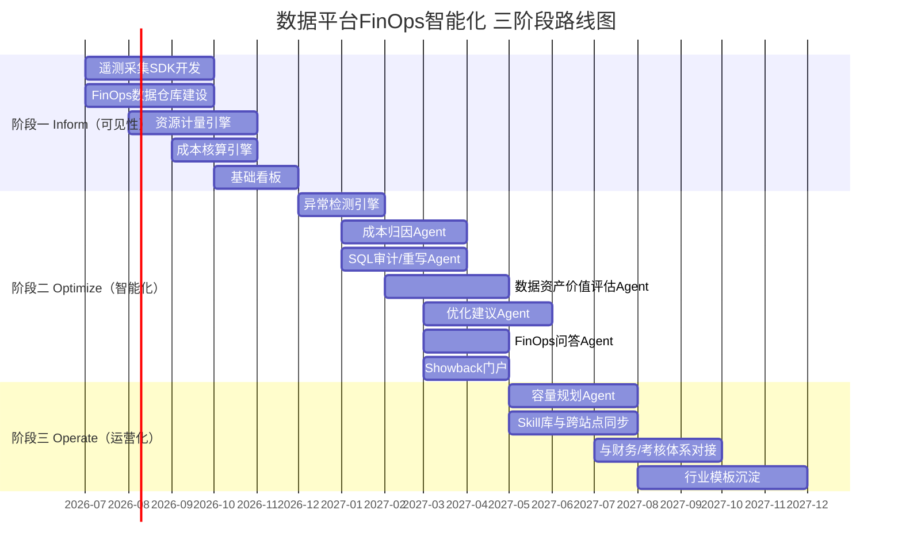

# 数据平台FinOps智能化——成本智能治理技术提案V2.0

> **作者**：向春（架构师）
> **日期**：2026年5月
> **受众**：公司大数据技术委员会
> **前序**：本提案是《AI时代数据成本智能化治理——前瞻技术提案V1.0》的收敛与深化版本。V1.0覆盖了四维度×三机制的全景分析；V2.0在此基础上**以FinOps为框架、以FinOps平台层+智能体层为实现载体**，给出面向**本地部署数据平台产品**的成本智能治理落地方案
> **定位**：不是技术调研，而是**产品技术方案**——回答"我们的数据平台产品如何内建FinOps能力，并通过Agent技术实现智能化"
> **场景规模**：数据平台产品在全球有**100+布点**，单点优化的技术方案可通过产品化复制到全部节点，成本治理的杠杆效应极大

---

## 写在前面：从V1.0到V2.0——为什么收敛、怎样深化

V1.0提案做了一件正确的事——**把成本智能治理的技术全景铺开**，让决策者看到四个维度（存储/计算/FinOps/性能）×三类机制（学习型/Agent化/自治化）的完整版图。但全景地图不是行军路线。V2.0要做的是：**选定一条可落地的主路线，给出产品级的技术方案，同时保持技术深度。**

**收敛的三个判断：**

| 判断 | 依据 |
|------|------|
| **聚焦FinOps框架** | 成本治理不是纯技术问题，而是"技术×业务×财务"的交叉问题。FinOps作为业界成熟的框架，提供了从"可见→可归因→可优化→可运营"的完整方法论 |
| **聚焦FinOps平台层 + 智能体层** | V1.0的实现层归属分析表明：这两层是"最安全的起步点"——旁路部署、不入侵计算引擎、不修改存储格式、风险最低、独立交付 |
| **聚焦本地部署** | 数据平台产品是本地部署交付，不涉及公有云。本地部署场景下的成本结构、计量方式、优化手段与公有云FinOps有本质差异 |

**深化的三个方向：**

| 深化方向 | 从V1.0继承并深化的内容 |
|---------|-------------------|
| **数据资产价值评估** | V1.0 §3.4 的完整Agent化方案——四类信号、五步工作流、决策矩阵、Skill库反馈。这是存储成本优化的关键支撑 |
| **SQL审计/重写 + 资源调度** | V1.0 §4.4 的LLM驱动SQL审计Agent和 §4.5 的Workload-aware调度。这是计算成本优化不可或缺的两个维度 |
| **FinOps核心技术** | V1.0 §5.2-§5.4 的异常检测、容量预测、精细化计费的完整技术方案。V2.0不简化，而是在V1.0基础上强化本地部署适配 |

**100+布点的规模效应：**

> 数据平台产品在全球有100+布点。这意味着——**任何一项成本优化能力，一旦在产品中实现，将自动在100+站点生效**。如果单站点通过FinOps智能化节省10%的资源成本，100+站点的累计节省将是一个极其可观的数字。这个规模效应使得FinOps产品化的ROI远高于单站点的定制化优化。

---

## 目录

- [第一章：FinOps概念导入——为什么本地部署数据平台需要FinOps](#第一章finops概念导入为什么本地部署数据平台需要finops)
- [第二章：业界深度分析——FinOps智能化的技术演进与竞争格局](#第二章业界深度分析finops智能化的技术演进与竞争格局)
- [第三章：落地架构——数据平台FinOps智能化的产品架构设计](#第三章落地架构数据平台finops智能化的产品架构设计)
- [第四章：关键技术——FinOps平台层核心引擎](#第四章关键技术finops平台层核心引擎)
- [第五章：关键技术——智能体层核心Agent](#第五章关键技术智能体层核心agent)
- [第六章：差异化竞争力分析](#第六章差异化竞争力分析)
- [第七章：落地节奏](#第七章落地节奏)
- [结语](#结语)
- [附录：参考资料](#附录参考资料)

---

## 第一章：FinOps概念导入——为什么本地部署数据平台需要FinOps

### 1.1 FinOps的定义与框架体系

FinOps（Financial Operations）是由FinOps Foundation（Linux Foundation旗下，成立于2019年，截至2025年底已有8,000+成员企业）标准化定义的**云财务管理框架**。其核心理念：

> **让每一个使用技术资源的团队，都对自己消耗的成本可见、可理解、可行动。**

**FinOps框架的完整结构（FinOps Foundation定义）：**

```
┌────────────────────────────────────────────────────────────────┐
│                     FinOps 框架全景                             │
│                                                                │
│  ┌──── 三大原则 ────┐   ┌──── 生命周期 ────┐                   │
│  │ 协作             │   │                  │                   │
│  │ 所有权           │   │ Inform ──→ Optimize ──→ Operate     │
│  │ 可访问性         │   │    ↑                        │        │
│  └─────────────────┘   │    └────────────────────────┘        │
│                         └──────────────────────────────┘       │
│                                                                │
│  ┌──── 六大能力域 ────────────────────────────────────┐        │
│  │ ① 成本可见性与分配（Cost Visibility & Allocation） │        │
│  │ ② 基准测量与KPI（Benchmarking & KPI）             │        │
│  │ ③ 预算与预测（Budgeting & Forecasting）            │        │
│  │ ④ 资源利用率与效率（Utilization & Efficiency）     │        │
│  │ ⑤ 速率优化（Rate Optimization）                   │        │
│  │ ⑥ 组织对齐（Organizational Alignment）            │        │
│  └──────────────────────────────────────────────────┘        │
│                                                                │
│  ┌──── 成熟度模型 ─────┐                                      │
│  │ Crawl → Walk → Run │                                      │
│  │ 爬行    行走    奔跑  │                                      │
│  └────────────────────┘                                       │
└────────────────────────────────────────────────────────────────┘
```

**三大原则详解：**

| 原则 | FinOps Foundation定义 | 对数据平台的映射 |
|------|---------------------|---------------|
| **协作（Collaboration）** | 技术、财务、业务三方共同参与成本决策，打破信息壁垒 | 数据平台的成本不能只由运维"管"，业务部门必须参与——他们是资源的消耗方，也应是成本的责任方 |
| **所有权（Ownership）** | 每个团队对自己使用的资源和产生的成本负责 | 每个数据开发项目/业务线应看到并"拥有"自己的资源账单——这要求作业级的成本归集能力 |
| **可访问性（Accessibility）** | 成本数据应及时、准确、对所有相关方可见 | 成本数据不应锁在运维系统中，应成为数据平台的自助可查产品能力 |

**生命周期——Inform → Optimize → Operate：**

| 阶段 | 核心能力 | 数据平台场景下的具体含义 | FinOps成熟度 |
|------|---------|-------------------|-----------|
| **Inform（可见）** | 成本可见、可分配、可归因 | 每个项目/团队/作业/SQL的资源消耗和成本清晰可见 | Crawl（爬行） |
| **Optimize（可优化）** | 识别浪费、推荐优化、评估ROI | 发现闲置资源、低效SQL、冷数据、过度分配，给出优化建议 | Walk（行走） |
| **Operate（可运营）** | 持续治理、自动化、融入业务流程 | 成本优化不是一次性项目，而是日常运营的一部分，有反馈闭环 | Run（奔跑） |

**六大能力域在本地部署数据平台的适用性分析：**

| 能力域 | 公有云适用度 | 本地部署适用度 | 本地部署的适配要点 |
|-------|-----------|-------------|---------------|
| ① 成本可见性与分配 | ★★★★★ | ★★★★★ | **核心能力**——本地部署最缺的就是这个。需要自建资源计量和成本核算体系 |
| ② 基准测量与KPI | ★★★★★ | ★★★★☆ | 适用，但KPI需要从"花了多少钱"转换为"利用率是多少""单位产出成本是多少" |
| ③ 预算与预测 | ★★★★☆ | ★★★★★ | **极其重要**——本地部署的采购周期长，预测准确性直接影响投资效率 |
| ④ 资源利用率与效率 | ★★★★☆ | ★★★★★ | **本地部署的核心指标**——公有云可以缩容，本地部署不能退还服务器，利用率就是一切 |
| ⑤ 速率优化 | ★★★★★ | ★★☆☆☆ | 公有云的核心杠杆（选型/RI/Spot），本地部署无此概念——但可映射为"采购策略优化" |
| ⑥ 组织对齐 | ★★★★★ | ★★★★★ | 通用——Showback/Chargeback在本地部署同样关键 |

### 1.2 本地部署 vs 公有云：FinOps的本质差异

| 维度 | 公有云FinOps | 本地部署FinOps |
|------|-----------|-------------|
| **成本结构** | 按需付费，变动成本为主 | 一次性采购+运维，固定成本为主 |
| **优化杠杆** | 选择更便宜的实例/区域/付费方式 | **提升利用率**——已采购的硬件闲置是最大浪费 |
| **计费透明度** | 云厂商提供细粒度账单 | **通常不存在细粒度计费**——只知道买了多少服务器，不知道谁用了多少 |
| **弹性** | 随时扩缩容 | 扩容周期长（采购→审批→到货→部署），缩容几乎不可能 |
| **单价趋势** | 长期下降 | **近两年服务器价格大幅上升**（芯片供应链+信创要求） |
| **核心痛点** | "花太多了" | "**花了但不知道谁花的**" + "**花了但没用够**" |
| **核心目标** | **花得更少** | **花得更值** |

### 1.3 为什么"现在"需要FinOps——服务器成本上升与100+布点的乘数效应

**压力端：**

| 压力源 | 表现 | 量化感知 |
|-------|------|---------|
| **服务器价格上涨** | 国产化/信创要求+芯片供应链变化 | 同等算力采购成本较三年前上升30-50% |
| **数据规模膨胀** | 非结构化数据进入消费链路、AI负载新增 | 存储需求年增长率25-40% |
| **采购审批趋严** | IT预算收紧，ROI论证要求越来越高 | "利用率多少？"——回答不出来 |
| **治理人力不增** | 管理资产的团队不增长，资产指数膨胀 | 人均管理资产持续恶化 |

**杠杆端——100+布点的乘数效应：**

数据平台产品在全球有**100+布点**。这个规模赋予FinOps产品化一个独特的杠杆结构：

| 层级 | 单站点收益 | 100+站点收益 | 杠杆倍数 |
|------|----------|-----------|---------|
| **资源利用率提升10%** | 节省N台服务器的等效成本 | 100×N台服务器等效成本 | 100× |
| **冷数据识别与降级** | 节省M TB存储成本 | 100×M TB存储成本 | 100× |
| **SQL优化建议** | 节省K VCore·时/天 | 100×K VCore·时/天 | 100× |
| **采购规划准确性提升** | 避免P万过度采购 | 100×P万过度采购 | 100× |

**关键判断**：在100+布点的场景下，FinOps能力**必须是产品内建的**——不能靠每个站点单独建设。产品化意味着：一次开发，全局部署；一次优化模型训练，全局受益；一次Skill库积累，全局复用。

### 1.4 FinOps在数据平台产品中的定位

```
传统数据平台                          FinOps内建的数据平台
┌──────────────────┐                ┌──────────────────────────┐
│ 数据开发          │                │ 数据开发                  │
│ 数据治理          │                │ 数据治理                  │
│ 数据服务          │                │ 数据服务                  │
│ 运维监控          │                │ 运维监控                  │
│                  │                │ ┌──────────────────────┐ │
│ （成本？不知道）   │    ───→       │ │ FinOps成本智能治理    │ │
│                  │                │ │ · Inform  成本可见    │ │
│                  │                │ │ · Optimize 智能优化   │ │
│                  │                │ │ · Operate  运营闭环   │ │
│                  │                │ └──────────────────────┘ │
└──────────────────┘                └──────────────────────────┘
```

**产品定位**：FinOps不是独立产品，而是数据平台的**内建能力模块**——与数据开发、数据治理、运维监控并列，成为数据平台的第五大核心模块。

---

## 第二章：业界深度分析——FinOps智能化的技术演进与竞争格局

### 2.1 FinOps的三代演进——从报表到Agent

FinOps的发展可划分为三代。每一代的跃迁都伴随着核心瓶颈的翻转：

#### 第一代：报表驱动（2018-2022）

**核心特征**：人工采集→Excel/BI报表→月度会议

**代表实践**：
- 运维团队定期导出云厂商账单，手工汇总到Excel
- BI工具（Tableau/PowerBI）做可视化，按月/季度输出报告
- 成本优化依赖资深架构师/DBA的个人经验

**局限性分析**：

| 局限 | 表现 | 根因 |
|------|------|------|
| **时滞** | 问题发现滞后4-6周 | 数据采集和报表生成的周期决定了响应速度 |
| **粒度粗** | 最多到项目级，无法下钻到作业/SQL | 手工采集无法覆盖细粒度指标 |
| **依赖专家** | 归因和优化完全依赖专家经验 | 没有系统化的分析方法和工具 |
| **无法扩展** | 资产规模翻倍，治理人力无法同比例增长 | 线性人力 vs 指数增长的治理对象 |

**本地部署场景**：绝大多数本地部署的数据平台**至今仍停留在第一代**，甚至"连Excel报表都没有"——因为本地部署场景缺乏公有云那样的原生账单体系。

#### 第二代：平台驱动（2022-2025）

**核心特征**：自动化采集→专用FinOps平台→实时看板→规则告警

**代表产品深度分析**：

| 产品 | 厂商 | 核心能力 | 技术架构 | 局限 |
|------|------|---------|---------|------|
| **Apptio Cloudability** | IBM/Apptio | 多云成本聚合、Showback/Chargeback、预算管理、RI建议 | SaaS平台，对接各云厂商API采集账单数据 | 仅支持公有云；归因停留在资源级（哪个VM花了多少钱），无法下钻到作业/SQL级 |
| **CloudHealth** | Broadcom/VMware | 多云成本管理、资源优化建议、合规审计 | SaaS平台，规则引擎驱动的优化建议 | 建议基于预定义规则（"CPU<10%建议缩容"），无法理解业务上下文 |
| **DataWorks成本治理** | 阿里云 | 作业级成本下钻、资源使用分析、优化建议 | 集成在DataWorks平台中，通过MaxCompute计量数据驱动 | 绑定阿里云MaxCompute引擎；本地部署版功能受限 |
| **Kubecost** | Kubecost/Stackwatch | K8s工作负载成本分配、命名空间级Showback | 开源+商业版，基于Prometheus采集K8s指标 | 仅覆盖K8s场景；无Spark/Flink/Hive等大数据引擎的计量 |
| **CAST AI** | CAST AI | K8s集群成本优化、自动扩缩容、实例选型 | SaaS+Agent架构，ML驱动的实例推荐 | 仅覆盖K8s/容器场景；优化建议限于实例选型和自动扩缩容 |

**第二代的共同局限——"看得见但理解不了"**：

平台提供了实时数据和可视化，但**从数据到洞察的"最后一公里"仍然依赖人工**：

```
第二代FinOps的信息流：

平台展示数据 → 人来看 → 人来分析 → 人来给建议 → 人来跟踪
     ✅           ❌        ❌          ❌          ❌
  (已自动化)    (瓶颈)     (瓶颈)      (瓶颈)      (瓶颈)
```

这四个"人来做"的环节，正是AI/Agent技术要解决的。

#### 第三代：AI/Agent驱动（2025-）

**核心特征**：FinOps平台 + AI异常检测 + LLM归因Agent + 智能优化建议 + 闭环学习

**代表产品深度分析**：

| 产品 | 厂商 | AI/Agent能力 | 技术深度 | 对本地部署的启示 |
|------|------|-----------|---------|-------------|
| **Predictive Optimization + AI Insights** | Databricks | System Tables提供细粒度成本数据；PO自治化执行COMPACT/VACUUM/ANALYZE；AI Insights做异常分析和趋势预警 | ML模型（GBDT/XGBoost）预测最优执行时机；2400+客户、130PB+自动VACUUM | **证明了"自治化闭环"的可行性**——但深度绑定Unity Catalog，无法移植 |
| **Cortex AISQL** | Snowflake | 2025/6 PrPv，2025/11部分函数GA；AI_FILTER/AI_CLASSIFY/AI_AGG等SQL函数；filter/join场景最高60%成本节省 | LLM集成到SQL引擎内部；支持语义过滤和智能聚合 | **证明了LLM可直接参与查询优化**——但仅限Snowflake引擎 |
| **BigQuery Cost Optimization** | Google Cloud | 查询级成本归因、Slot使用分析、自动MV建议、Recommendations API | 基于BigQuery的计量系统和ML模型 | **最完整的查询级归因体系**——但绑定BigQuery |
| **DAS自治服务** | 阿里云 | 自动SQL优化建议、自治索引推荐/创建/淘汰、自动统计信息更新 | 规则+ML综合；闭环反馈 | **证明了"自动索引推荐+淘汰"闭环可行**——技术可借鉴 |
| **openGauss AI4DB** | 华为 | 内嵌学习型优化器、自动索引、参数自调优、智能诊断 | AI能力嵌入数据库内核 | **信创生态下的AI4DB代表**——技术路线可参考 |

**第三代的技术范式转换——Agent替代人工：**

```
第三代FinOps的信息流：

平台展示数据 → Agent主动发现 → Agent分析归因 → Agent给建议 → Agent跟踪反馈
     ✅            ✅              ✅             ✅            ✅
  (已自动化)     (AI驱动)        (LLM驱动)      (LLM驱动)     (闭环学习)
                                                                 ↕
                                                           人工审核（L2）
```

### 2.2 FinOps + AI的全球市场与投资信号

| 信号 | 数据 | 含义 |
|------|------|------|
| **FinOps Foundation成员增长** | 2020年~1,000 → 2025年底8,000+成员企业（来源：FinOps Foundation官网） | FinOps从"新概念"变为"主流实践" |
| **Gartner预测** | "到2027年，60%的企业将采用FinOps实践"（来源：Gartner 2024 Hype Cycle for Cloud Management） | 行业方向确定 |
| **Apptio被IBM收购** | 2023年，IBM以49亿美元收购Apptio | FinOps/IT财务管理的战略价值被顶级厂商认可 |
| **CAST AI融资** | 2024年D轮$76M，估值>$500M | AI驱动的成本优化赛道获资本高度认可 |
| **Databricks PO规模** | 2024 GA至今2400+客户采用，累计130PB+ VACUUM | **自治化成本优化已达到生产规模** |
| **Snowflake Cortex AISQL** | 2025年GA | **LLM与SQL引擎的融合已进入商用阶段** |

### 2.3 本地部署数据平台的FinOps竞品深度扫描

| 产品 | FinOps能力现状 | 详细分析 |
|------|-------------|---------|
| **华为DataArts/FusionInsight** | 有资源监控和作业管理，但缺乏FinOps框架性能力 | DataArts Studio提供作业运维和质量监控，FusionInsight Manager有集群资源监控。但**没有作业级成本归因、没有Showback、没有AI驱动的优化建议**。在信创场景下是主要竞品 |
| **阿里DataWorks（本地版）** | 云版有成本治理模块，本地版（飞天本地化/专有云版）功能受限 | 云版DataWorks的成本治理依赖MaxCompute的计量系统；**本地部署版缺乏等效的计量基础**，成本治理功能大幅缩水 |
| **星环TDH** | 有资源管理（Transwarp Inceptor/Guardian），但无FinOps概念 | Guardian提供资源配额管理和监控，但**停留在"资源管理"层面，没有上升到"成本治理"——没有金额概念、没有归因、没有优化建议** |
| **字节DataLeap（外部版）** | 内部版有Cost Lens，外部版（火山引擎数据开发治理套件）未开放 | 字节内部的Cost Lens是行业标杆级FinOps工具，但**作为内部能力不对外输出**，不构成直接竞争 |
| **腾讯WeData** | 有资源监控和作业运维，缺乏FinOps框架性能力 | 与DataArts类似——有监控但无FinOps |
| **开源方案（Spark+Hive+YARN）** | **完全空白** | 没有作业级计量、没有归因、没有Showback。唯一可用的是YARN的资源统计和Spark UI——但这些是"监控"不是"FinOps" |

**竞争格局总结：**

```
                    FinOps能力成熟度
                    高 ──────────────────────→ 低
                    
公有云产品        │  Databricks     AWS         │
(不可移植)        │  Snowflake      Apptio      │
                  │  Google BQ      阿里云(云版) │
                  ├────────────────────────────│
本地部署产品      │                             │
(竞争空白)        │  ← 产品机会窗口 →            │
                  │                             │
                  │  DataArts  TDH  WeData      │
                  │  (仅监控)  (仅监控) (仅监控)  │
```

**结论：在本地部署的数据平台产品中，"完整FinOps能力+Agent智能化"是一个真实存在的产品空白。**

### 2.4 AI/Agent技术为FinOps带来的范式变化

借用[深度调研](AI时代的数据智能技术变革——深度调研.md)中"瓶颈翻转"的分析框架：

| 阶段 | 主导瓶颈 | 边际收益最高的投入方向 |
|------|---------|------------------|
| 五年前 | 数据采集能力 | 投资监控/计量基础设施 |
| 三年前 | 平台展示能力 | 投资FinOps平台/看板 |
| **现在** | **分析与决策能力** | **投资Agent化方法** |

Agent技术在FinOps生命周期中的价值：

| FinOps阶段 | 传统方式 | Agent化方式 | 100+布点的规模优势 |
|-----------|---------|-----------|----------------|
| **Inform** | 看板展示→人看→人解读 | 看板展示→**Agent主动发现异常并归因** | 每个站点的异常都能被及时发现，不需要每个站点配备专家 |
| **Optimize** | 人发现问题→人分析→人给建议 | Agent持续分析→**Agent生成优化建议** | 一个站点发现的优化模式可以自动推广到其他站点 |
| **Operate** | 人跟踪效果→人决定下一步 | Agent跟踪→**Agent反馈学习→持续校准** | Skill库在100+站点间共享，每个站点的反馈都加速所有站点的学习 |

### 2.5 本地部署FinOps的三个关键差异化方向

| 方向 | 公有云方案做不到的 | 我们应该做到的 |
|------|---------------|-------------|
| **利用率驱动** | 公有云围绕"账单"展开。本地部署没有账单，但有更底层的数据——**硬件利用率** | 以硬件利用率为核心指标，建立"利用率→成本折算→归因→优化"链条 |
| **Agent业务理解** | 公有云的优化建议是规则驱动（"CPU<10%建议缩容"），无法理解业务上下文 | Agent能理解"这个Spark作业在等下游数据，CPU低是正常的" |
| **跨站点知识复制** | 公有云FinOps是单租户方案，知识不跨租户共享 | **100+布点共享Skill库**——A站点的优化经验自动推荐给B站点的相似场景 |

---

## 第三章：落地架构——数据平台FinOps智能化的产品架构设计

### 3.1 总体架构

```
┌──────────────────────────────────────────────────────────────────────┐
│                   数据平台 FinOps 智能化总体架构                       │
│                                                                      │
│  ┌────────────────────────── 用户交互层 ──────────────────────────┐  │
│  │  FinOps看板  │  自然语言对话  │  告警通知  │  审核工作台  │  API │  │
│  └──────────────────────────────────────────────────────────────┘  │
│                               │                                      │
│  ┌────────────────────────── 智能体层 ───────────────────────────┐  │
│  │                                                                │  │
│  │  ┌──────────┐ ┌──────────┐ ┌──────────┐ ┌──────────┐         │  │
│  │  │ 成本归因  │ │ 优化建议  │ │ 容量规划  │ │ 问答对话  │         │  │
│  │  │ Agent    │ │ Agent    │ │ Agent    │ │ Agent    │         │  │
│  │  └──────────┘ └──────────┘ └──────────┘ └──────────┘         │  │
│  │  ┌──────────┐ ┌──────────┐                                    │  │
│  │  │ 资产价值  │ │ SQL审计  │                                    │  │
│  │  │ 评估Agent│ │ 重写Agent│                                    │  │
│  │  └──────────┘ └──────────┘                                    │  │
│  │       │            │            │            │                 │  │
│  │  ┌──────────────────────────────────────────────┐             │  │
│  │  │          Agent共享基础设施                      │             │  │
│  │  │  LLM推理引擎 │ MCP Server │ Skill库 │ 记忆层  │             │  │
│  │  └──────────────────────────────────────────────┘             │  │
│  └────────────────────────────────────────────────────────────────┘  │
│                               │                                      │
│  ┌────────────────────────── FinOps平台层 ───────────────────────┐  │
│  │                                                                │  │
│  │  ┌──────────┐ ┌──────────┐ ┌──────────┐ ┌──────────┐         │  │
│  │  │ 资源计量  │ │ 成本核算  │ │ 异常检测  │ │ 趋势分析  │         │  │
│  │  │ 引擎     │ │ 引擎     │ │ 引擎     │ │ 引擎     │         │  │
│  │  └──────────┘ └──────────┘ └──────────┘ └──────────┘         │  │
│  │       │            │            │            │                 │  │
│  │  ┌──────────────────────────────────────────────┐             │  │
│  │  │          FinOps数据仓库                        │             │  │
│  │  │  资源用量事实表 │ 成本明细表 │ 元数据维度表     │             │  │
│  │  └──────────────────────────────────────────────┘             │  │
│  └────────────────────────────────────────────────────────────────┘  │
│                               │                                      │
│  ┌────────────────────────── 遥测采集层 ─────────────────────────┐  │
│  │  ┌────────┐ ┌────────┐ ┌────────┐ ┌────────┐ ┌────────┐     │  │
│  │  │ Spark  │ │ Flink  │ │ Hive/  │ │ YARN/  │ │ HDFS/  │     │  │
│  │  │Listener│ │Metrics │ │Presto  │ │K8s     │ │对象存储 │     │  │
│  │  └────────┘ └────────┘ └────────┘ └────────┘ └────────┘     │  │
│  └────────────────────────────────────────────────────────────────┘  │
│                                                                      │
│  ┌────────────── 现有数据平台基础设施（不改动）──────────────────┐     │
│  │  Spark │ Flink │ Hive/Presto │ YARN/K8s │ HDFS/对象存储      │     │
│  └──────────────────────────────────────────────────────────────┘     │
└──────────────────────────────────────────────────────────────────────┘
```

### 3.2 四层架构详解

| 层级 | 职责 | 对现有系统的侵入性 | 关键设计原则 |
|------|------|---------------|-----------|
| **遥测采集层** | 从现有引擎/调度/存储系统中采集资源使用数据 | **极低**——通过引擎原生监听接口采集，不修改引擎代码 | 零侵入、全覆盖、秒级/分钟级采集、采集开销<1% |
| **FinOps平台层** | 资源计量、成本核算、异常检测、趋势分析 | **无**——完全独立部署 | 确定性计算、可审计、高可用 |
| **智能体层** | Agent驱动的归因/优化/评估/审计/规划/问答 | **无**——旁路部署的Agent服务 | LLM本地部署、建议+人工审核、Skill库持续学习 |
| **用户交互层** | 看板、对话界面、告警、审核工作台 | **无**——前端新增模块 | 面向不同角色的差异化视图 |

### 3.3 本地部署的关键架构决策

| 决策点 | 选择 | 理由 |
|-------|------|------|
| **LLM部署方式** | 本地部署开源模型（Qwen-72B/DeepSeek-V3/Llama系） | 作业元数据、SQL文本、组织结构等属敏感信息，不能外传 |
| **成本核算基础** | 以硬件资源利用率为基础，折算为"虚拟成本单价" | 本地部署没有真实账单，需要建立内部核算体系 |
| **Agent与平台的通信** | MCP协议（Model Context Protocol） | Agent通过MCP Tool调用平台层的查询API，解耦Agent逻辑和数据查询 |
| **数据存储** | 复用现有数据平台的存储（HDFS/Iceberg/Hive） | FinOps数据仓库本身跑在自家平台上——"吃自己的狗粮" |
| **采集性能影响** | 采集开销控制在整体资源的1%以内 | 异步上报、采样、增量采集控制开销 |
| **跨站点架构** | 每站点独立部署FinOps平台+Agent + **中心化Skill库同步** | 数据不出站（合规），但优化经验跨站共享 |

### 3.4 面向不同角色的产品能力

| 角色 | 核心诉求 | 产品提供的能力 |
|------|---------|-------------|
| **数据开发者** | "我的作业消耗了多少资源？有没有优化空间？" | 作业级资源报告、SQL优化建议、历史成本趋势 |
| **项目负责人** | "我的项目整体资源消耗合理吗？谁是大户？" | 项目级成本看板、Top-N热点作业、同比/环比 |
| **平台运维** | "集群利用率够不够？哪些资源闲置？" | 利用率看板、闲置资源检测、容量规划建议 |
| **管理层** | "大数据平台的总投入产出如何？下一期采购多少？" | 总成本概览、投入产出趋势、采购规划报告 |

---

## 第四章：关键技术——FinOps平台层核心引擎

### 4.1 资源计量引擎——"测得准"

**功能定义**：从各计算引擎和存储系统中采集资源使用量，按作业/SQL/用户/项目维度聚合。

**采集矩阵：**

| 数据源 | 采集接口 | 采集指标 | 采集频率 |
|-------|---------|---------|---------|
| **Spark** | SparkListener（自定义Plugin） | 每个Application/Job/Stage/Task的CPU·秒、Peak Memory、Shuffle Read/Write、Input/Output字节数、GC时间、执行时间 | 作业完成时回调 |
| **Flink** | Metrics Reporter（Prometheus格式） | 每个Job/Task的CPU使用率、Memory用量、Back Pressure比例、Records In/Out、Checkpoint大小与耗时 | 每10秒 |
| **Hive/Presto/Trino** | EventListener / Query Log | 每条SQL的扫描行数/字节数、CPU·秒、Wall时间、分区命中数、Stage数 | 每次查询完成 |
| **YARN** | REST API / Timeline Server v2 | 每个Application的Container数、CPU VCore·秒、Memory MB·秒、队列、用户、AM资源 | 每分钟轮询 |
| **K8s** | cAdvisor / Metrics Server / kube-state-metrics | 每个Pod的CPU/Memory/GPU实际使用量、Request/Limit、节点亲和性 | 每15秒 |
| **HDFS/对象存储** | NameNode API / fsimage分析 / 存储API | 每个目录/表的存储占用、副本数、文件数、块大小分布、小文件比例 | 每天全量 + 增量事件 |

**Owner归集策略（本地部署的关键挑战）：**

| 场景 | 归集方式 | 实现复杂度 |
|------|---------|----------|
| YARN队列已按项目/团队划分 | 按YARN队列直接映射到Owner | 低 |
| Spark作业有spark.app.name/spark.app.tags标签 | 从标签中解析项目/Owner信息 | 低 |
| 统一调度系统（Airflow/DolphinScheduler）提交 | 从调度系统元数据中获取DAG Owner | 中 |
| 手动提交（spark-submit/beeline） | 按提交用户归集 | 低 |
| 共享查询引擎（Thrift Server/Presto） | 从SQL提交信息中提取用户/项目 | 中（需SQL网关层配合） |
| 无标签的历史作业 | 基于元数据启发式推断（用户名→团队映射表） | 中 |

**关键技术：**

| 技术 | 作用 |
|------|------|
| **SparkListener自定义Plugin** | 在Spark Driver中注册监听器，捕获全量Application/Job/Stage/Task事件。通过spark.extraListeners配置注入，零代码改动 |
| **YARN Timeline Server v2** | 提供应用级、容器级的历史资源使用数据。v2相比v1支持更细粒度的查询和更好的扩展性（基于HBase后端） |
| **标签规范化** | 建立统一的标签Schema（project/team/cost_center/env），通过调度系统模板强制注入——这是Owner归集的前提 |

### 4.2 成本核算引擎——"算得对"

**功能定义**：将资源使用量转换为金额——本地部署场景需要自建内部核算体系。

**本地部署成本模型：**

```
硬件资产成本
    │
    ├── 固定成本（采购折旧 + 机房 + 网络 + 运维人力）
    │       └── 按"资源池总容量"均摊 → 各资源类型的单价
    │
    └── 变动成本（电力 + 散热 + 带宽增量）
            └── 按"实际使用量"分摊 → 与固定成本合并得到综合单价
```

**单价计算方法：**

\[
\text{CPU单价(元/VCore·时)} = \frac{\text{CPU相关总成本(元/月)}}{\text{集群总VCore数} \times \text{月有效小时数}} \times (1 + \text{管理费率})
\]

| 成本项 | 计入方式 | 典型占比 |
|-------|---------|---------|
| 服务器折旧（3-5年直线法） | 按CPU/Memory/GPU拆分后分别计入 | 50-60% |
| 机房（电力+空调+租金） | 按机柜/U位数分摊 | 20-25% |
| 网络 | 按端口带宽分摊 | 5-10% |
| 运维人力 | 按管理节点数分摊 | 10-15% |
| 软件许可 | 按节点数/Core数分摊 | 0-10% |

**作业级成本计算：**

对每个作业 \(j\)：

\[
Cost_j = \sum_{r \in \{CPU, Mem, GPU, Storage, IO\}} Usage_{j,r} \times Price_r
\]

**共享资源分摊模型：**

设共享资源池总成本为 \(C_{total}\)，包含固定成本 \(C_{fixed}\) 和变动成本 \(C_{var}\)，租户 \(i\) 的使用量为 \(U_i\)，预留配额为 \(R_i\)：

\[
C_i = \frac{R_i}{\sum_j R_j} \cdot C_{fixed} + \frac{U_i}{\sum_j U_j} \cdot C_{var}
\]

### 4.3 异常检测引擎——"发现得早"

**功能定义**：对各维度的资源使用/成本时序持续监控，自动发现异常并触发告警+归因流程。

借用V1.0 §5.2的双引擎方法，在本地部署场景下强化：

**检测方法矩阵：**

| 方法 | 适用场景 | 实现 | 优势 |
|------|---------|------|------|
| **STL分解（Seasonal-Trend Decomposition using LOESS）** | 有强周期性的时序（日/周周期） | 将时序分解为趋势+季节性+残差；异常定义为残差超出 \(k\sigma\) | 不会把正常周期波动误报为异常 |
| **Prophet** | 多重季节性+假日效应的时序 | Facebook开源模型，天然支持多季节性和假日 | 配置简单、可解释性好 |
| **Isolation Forest** | 多维特征的联合异常检测 | 无监督学习，在高维空间中识别孤立点 | 能发现"CPU升高+IO降低"的组合异常 |
| **滑动窗口统计** | 简单实时告警 | 基于过去N天的均值±kσ | 实现简单、延迟低 |

**异常事件数据结构：**

```json
{
  "event_id": "anomaly-20260518-001",
  "timestamp": "2026-05-18T08:30:00+08:00",
  "dimension": "project_daily_cost",
  "entity": "project_wireless_analysis",
  "metric": "cpu_vcore_hours",
  "expected_value": 12500,
  "actual_value": 38200,
  "deviation_ratio": 2.056,
  "severity": "HIGH",
  "detection_method": "STL_residual",
  "context": {
    "trend_direction": "stable",
    "seasonal_phase": "weekday_normal",
    "last_7d_avg": 13100
  }
}
```

### 4.4 趋势分析引擎——"看得远"

**功能定义**：提供历史趋势、同比环比、利用率分析、容量预测等分析能力。

**核心分析视图（含100+布点的全局视图）：**

| 视图 | 内容 | 刷新频率 |
|------|------|---------|
| **站点级利用率总览** | 100+站点的CPU/Memory/GPU利用率热力图——一眼看出哪些站点利用率低、哪些接近瓶颈 | 每小时 |
| **站点内利用率趋势** | 集群/队列/项目级的CPU/Memory/GPU利用率7天/30天/90天趋势 | 每小时 |
| **成本趋势** | 各项目/团队的成本月度趋势、同比/环比 | 每天 |
| **Top-N排行** | 按成本/资源消耗排行的项目/作业/用户 | 每天 |
| **闲置资源检测** | 持续低利用率的队列/项目 | 每天 |
| **容量预测** | 基于历史趋势和业务计划预测未来3-6个月的资源需求 | 每周 |

**容量预测的核心方法（继承V1.0 §5.3并强化）：**

对不同资源维度选择最适合的预测模型：

| 资源维度 | 推荐模型 | 选择原因 |
|---------|--------|---------|
| **CPU** | TFT（Temporal Fusion Transformer） | 强周期性+多外生变量，TFT的可解释注意力最适合 |
| **Memory** | Prophet + 线性趋势修正 | 内存需求通常呈近似线性增长 |
| **Storage** | Prophet | 存储只增不减，趋势+周期分解足够 |
| **GPU（如有）** | DeepAR（概率预测） | GPU需求波动大，需要概率分布而非单点估计 |

预测输出为概率分布：\(p_{10}\)（乐观）、\(p_{50}\)（基准）、\(p_{90}\)（保守），支持蒙特卡洛仿真和采购决策优化。

---

## 第五章：关键技术——智能体层核心Agent

### 5.1 Agent总览与协作关系

智能体层包含**六个核心Agent**，覆盖FinOps生命周期的Inform/Optimize/Operate全阶段：

| Agent | FinOps阶段 | 职责 | 自治等级 |
|-------|-----------|------|---------|
| **成本归因Agent** | Inform | 异常下钻归因，生成自然语言报告 | L2（建议+人工审核） |
| **数据资产价值评估Agent** | Optimize | 评估数据资产的业务价值，推荐归档/降冷/删除 | L2（建议+人工审核） |
| **SQL审计/重写Agent** | Optimize | 识别低效SQL反模式，生成等价改写建议 | L2（建议+人工审核） |
| **优化建议Agent** | Optimize | 闲置资源回收、超配检测、执行时段优化等综合建议 | L2（建议+人工审核） |
| **容量规划Agent** | Operate | 资源预测、场景仿真、采购建议、ROI论证 | L2（建议+人工审核） |
| **FinOps问答Agent** | 全阶段 | 自然语言查询成本和资源的任何问题 | 直接回答 |

**Agent间协作关系：**

```
异常检测引擎 ──触发──→ 成本归因Agent ──根因识别──→ 优化建议Agent ──建议生成
                                                      ↑
                         数据资产价值评估Agent ─────────┘
                         SQL审计/重写Agent ────────────┘
                                                      │
                                                      ▼
                                              容量规划Agent ──采购建议
                                                      │
                                              FinOps问答Agent ←── 用户提问
```

### 5.2 成本归因Agent——"解释得清"

**功能定义**：当异常检测引擎发现成本异常时，Agent自动下钻分析根因，生成自然语言归因报告。

**L1-L5五级下钻策略（继承V1.0 §5.2并适配本地部署）：**

| 下钻层级 | Agent动作 | MCP Tool调用 |
|---------|---------|-------------|
| **L1: 项目/团队** | 异常归属到哪个项目？多个项目同时异常还是单一项目？ | `query_cost_breakdown(group_by="project")` |
| **L2: 作业类型** | 是批处理涨了？流处理涨了？还是Ad-hoc查询涨了？ | `query_cost_breakdown(group_by="job_type")` |
| **L3: 具体作业** | Top-N成本最高的作业是哪些？它们是新增的还是老作业变贵了？ | `query_job_history(job_name, compare_baseline=True)` |
| **L4: SQL/操作级** | 该作业最贵的SQL是什么？扫描量变了吗？Plan变了吗？ | `query_sql_stats(job_id)` + `query_explain_history(sql_id)` |
| **L5: 根因判定** | 是数据量增长？是Plan退化？是上游变更？是新业务接入？ | `query_table_metadata` + `query_lineage` + LLM综合推理 |

**Agent的MCP Tool集：**

| Tool名称 | 功能 | 返回数据 |
|---------|------|---------|
| `query_cost_breakdown` | 按维度查询成本明细 | 维度分布+占比+环比变化 |
| `query_job_history` | 查询作业历史执行记录 | 时序+基线对比+偏差标注 |
| `query_sql_stats` | 查询SQL模板执行统计 | 扫描量/CPU/时间/频次的时序 |
| `query_explain_history` | 查询SQL的EXPLAIN历史 | Plan变化+基数估计+Join策略 |
| `query_table_metadata` | 查询表的元数据和访问频率 | 大小/行数/访问频率/Owner |
| `query_lineage` | 查询表/作业的血缘关系 | 上下游依赖图+影响范围 |
| `query_cluster_utilization` | 查询集群/队列利用率 | CPU/Memory/GPU利用率时序 |
| `query_storage_analysis` | 查询存储分析 | 小文件比例/冷数据比例/增长趋势 |

**归因报告示例（电信场景）：**

```
## 成本异常归因报告

**异常概要**：项目"无线网络分析"5月18日计算成本38,200 VCore·时，
较近7天均值13,100 VCore·时偏高206%。

**根因分析**：

1. **直接原因**：作业 etl_base_station_daily 执行时间从平均2.1小时延长至7.8小时，
   资源消耗增加272%。

2. **根本原因**：上游表 ods_base_station_raw 5月17日数据量异常——当日新增1.2亿行
   （平均日增3,000万行），数据量增长300%。经血缘追溯，发现源系统在5月17日启用了
   "5G基站秒级性能采集"，数据粒度从分钟级细化到秒级。

3. **影响范围**：下游3个作业（etl_kpi_hourly, etl_alarm_correlation,
   rpt_network_quality）均受影响，预计持续影响。

**建议**：
- 短期：与源系统确认5G秒级采集是否为长期策略
- 中期：对etl_base_station_daily启用增量处理（当前为全量重跑）
- 长期：对ods_base_station_raw按采集粒度分区，秒级数据独立存储

**跨站点提示**：类似的"采集粒度变更导致数据膨胀"在站点#037（广州）也曾出现，
当时的解决方案是分区+增量化处理，可参考Skill库案例 CASE-2026-037-012。
```

**关键技术：**

| 技术 | 作用 |
|------|------|
| **MCP协议** | 统一Tool调用接口，Agent通过MCP访问FinOps数据仓库和元数据系统 |
| **ReAct推理范式** | Agent按"思考→行动→观察"循环逐步下钻，每步Tool调用由前步观察驱动 |
| **Skill库（跨站点共享）** | 历史归因案例作为Few-shot注入，100+站点的经验共享加速归因 |
| **本地部署LLM** | 敏感信息不外传，所有推理在内网完成 |

### 5.3 数据资产价值评估Agent——"评得透"

**功能定义**：综合技术信号、元数据、血缘、业务知识四类信号，评估数据资产的价值，推荐归档/降冷/删除。

本节完整继承V1.0 §3.4的设计，并适配本地部署场景。

**为什么这是Agent化方法（而非规则方法）：**

"哪些数据可以归档/降冷/删除"需要综合四类信号：
- 技术信号（访问频率、最后访问时间）——规则可处理
- 元数据（Owner、业务域、敏感级别）——规则可处理
- 血缘（被多少下游消费）——规则可处理
- **业务知识**（这张表对应什么业务场景）——**必须靠LLM理解**

**具体功能清单：**

| 功能模块 | 具体能力 | 输入 | 输出 | 自治等级 |
|---------|--------|------|------|---------|
| **资产活跃度评估** | 综合技术信号生成每张表/分区的活跃度得分 | 查询日志、文件访问日志 | 活跃度得分（0-100）+ 趋势 | 全自动 |
| **业务价值标注** | LLM理解表的业务语义，判断业务价值等级 | 元数据、业务术语表 | 价值等级（核心/重要/一般/低价值）+ 置信度 | Agent建议+人工审核 |
| **下游影响分析** | 沿血缘图分析归档/删除后的影响范围 | 血缘图 | 影响范围报告 | 全自动 |
| **合规约束检查** | 检查表是否在合规保留范围内 | 合规策略库 | 合规状态 + 最早可操作日期 | 全自动 |
| **综合治理建议** | 综合四类信号生成治理建议 | 上述四项结果 | 治理动作 + 理由 + 预估节省 | Agent建议+人工审核 |
| **批量治理排序** | 按"收益/风险"排序全域资产 | 全域评估结果 | Top-N优先治理清单 | Agent建议+人工审核 |

**核心流程：**

```
资产发现 → 信号采集 → 多维评估 → 建议生成 → 人工审核 → 反馈学习
```

**决策矩阵：**

| 决策矩阵 | 活跃度高 | 活跃度低 |
|---------|---------|---------|
| **业务价值高 + 无合规约束** | 保留，优化存储格式 | 保留，标记"待确认" |
| **业务价值高 + 有合规约束** | 保留 | 保留至合规期满 |
| **业务价值低 + 无合规约束** | 保留（可能即将重新活跃） | **归档/降冷候选** |
| **业务价值低 + 有合规约束** | 保留至合规期满 | 降冷至最低成本层 |

**100+布点的规模收益**：假设每个站点平均有2,000张表，100+站点共20万+张表需要价值评估。人工逐表评估不可能，Agent化是唯一可扩展的方案。

**严格边界（回扣L2/L3判断）**：借用[深度调研](AI时代的数据智能技术变革——深度调研.md)的乘法公式，Agent对"这张表能不能删"的端到端可靠性约48.8%。在数据删除这种**不可逆**操作上，必须保留人工审核。

**关键技术支撑：**

| 关键技术 | 为什么选择 | 如何支撑 |
|---------|----------|---------|
| **MCP协议** | Agent需要访问Catalog、血缘、查询日志等多个异构数据源 | 统一Tool调用，新增数据源只需注册MCP Server |
| **本地部署LLM** | 元数据属敏感信息 | 内网完成所有推理 |
| **RAG（检索增强生成）** | Agent需要理解业务术语表 | 业务术语向量化后存入向量库，推理时检索相关术语 |
| **血缘图数据库** | 下游影响分析需要高效图遍历 | Neo4j/JanusGraph提供毫秒级多跳血缘查询 |
| **Skill库** | 从人工审核反馈中持续学习 | 接受/拒绝案例作为Few-shot注入后续评估 |
| **置信度校准** | LLM自报置信度不准确 | 历史审核数据校准置信度 |

### 5.4 SQL审计/重写Agent——"改得好"

**功能定义**：识别低效SQL反模式（规则级+语义级），生成等价改写建议。

本节完整继承V1.0 §4.4的设计。

**为什么LLM能做传统规则审计做不到的事：**

传统SQL审计（SQLFluff等）基于预定义规则——能识别"显式笛卡尔积""SELECT *"等明确反模式，但无法识别"语义上低效但语法上合理"的写法：

```sql
-- 传统规则：合法。LLM能识别：可用窗口函数避免自连接
SELECT a.user_id FROM users a, users b
WHERE a.signup_date < b.signup_date AND a.region = b.region;

-- 传统规则：合法。LLM能识别：可用预聚合替代COUNT(DISTINCT)
SELECT region, COUNT(DISTINCT user_id) FROM events GROUP BY region;
```

**具体功能清单：**

| 功能模块 | 具体能力 | 自治等级 |
|---------|--------|---------|
| **规则级反模式检测** | 笛卡尔积、SELECT *、隐式类型转换、冗余DISTINCT、不必要ORDER BY、多次扫描同表 | 全自动告警 |
| **语义级反模式检测** | 窗口函数替代自连接、EXISTS替代IN子查询、预聚合替代COUNT(DISTINCT)、CASE WHEN合并多次扫描 | Agent建议 |
| **等价改写生成** | 对每个反模式生成1-3个候选改写SQL | Agent建议+人工审核 |
| **改写正确性验证** | EXPLAIN对比原始和改写SQL的Plan | 全自动 |
| **成本节省估算** | 基于EXPLAIN和历史统计估算改写后的资源节省 | 全自动 |
| **Top-N热点SQL排序** | 按资源消耗降序排列，优先审计成本最高的SQL | 全自动 |
| **批量审计报告** | 对一个项目的全部SQL批量审计 | Agent生成+人工审核 |
| **CI/CD拦截** | 集成到发布流水线，高严重度反模式阻断发布 | 规则级全自动 |

**核心流程：**

```
SQL采集&排序 → AST解析&标准化 → 规则检测(确定性) → LLM语义分析
                                                        │
                                                        ▼
                                              改写生成&验证
                                                        │
                                                        ▼
                                              建议输出 → 人工审核 → 反馈到Skill库
```

**反模式规则库：**

| 反模式类别 | 检测规则 | 严重度 |
|----------|---------|-------|
| 笛卡尔积 | FROM多表无JOIN条件 | 🔴 Critical |
| SELECT * | 全量列投影但下游只用部分列 | 🟡 Warning |
| 隐式类型转换 | WHERE中列类型与常量不匹配 | 🟡 Warning |
| 冗余DISTINCT | DISTINCT应用于已有唯一约束的列 | 🟢 Info |
| 不必要ORDER BY | ORDER BY出现在子查询中 | 🟡 Warning |

**严格边界**：SQL改写涉及语义等价性判断——错改可能造成数据错误。**等价改写必须保留人工审核，不可autonomous直接改写生产SQL。**

**100+布点的规模收益**：SQL反模式库和改写经验在站点间共享——A站点发现的反模式"在电信场景下，可用分区过滤替代全表扫描ods_alarm表"，自动推荐给所有站点的相似SQL。

**关键技术支撑：**

| 关键技术 | 作用 |
|---------|------|
| **sqlglot / Apache Calcite Parser** | 支持多SQL方言，处理生产环境的真实SQL |
| **反模式知识库（Few-shot Prompt）** | DBA经验编码为结构化知识，注入Prompt |
| **EXPLAIN ANALYZE** | 改写验证核心——对比原始和改写SQL的Plan |
| **影子流量环境** | 在不影响生产的前提下验证改写正确性 |

### 5.5 优化建议Agent——"建议得准"

**功能定义**：持续分析资源使用模式，识别优化机会，生成可执行的优化建议。

**优化建议类型（含资源调度优化）：**

| 建议类型 | 识别逻辑 | 建议输出 | 预估节省 |
|---------|---------|---------|---------|
| **闲置资源回收** | 队列/项目配额利用率持续<20% | "项目X配额200 VCores，峰值使用42，建议缩减至80" | 配额差值 × 单价 |
| **作业资源超配** | Executor Memory分配远超实际峰值 | "作业Y分配8GB/Executor，实际峰值2.1GB，建议3GB" | (分配-建议) × Executor数 × 单价 |
| **低效SQL优化** | 联动SQL审计Agent的结果 | 引用SQL审计Agent的改写建议 | 扫描节省量 × 单价 |
| **冷数据降级** | 联动资产价值评估Agent的结果 | 引用评估Agent的归档建议 | 存储量 × (热单价-冷单价) |
| **重复数据治理** | 多项目维护语义相似的宽表 | "项目A和B有85%列重叠，建议统一" | 去重存储+维护节省 |
| **执行时段优化** | 作业可调度到低峰时段 | "作业W SLA为次日9:00，当前调度22:00高峰，建议02:00低谷" | 争抢等待成本 |
| **队列资源再平衡** | 队列间利用率不均（有的90%有的20%） | "队列A持续90%+瓶颈，队列B持续<30%，建议从B调配200 VCores到A" | 消除瓶颈排队成本 |
| **Shuffle优化建议** | 作业Shuffle数据量占比过高 | "作业Z的Shuffle Write占总IO的78%，建议启用Adaptive Shuffle或调整分区策略" | Shuffle IO节省 |

**Agent的业务上下文理解能力：**

与规则驱动的区别——Agent能避免"假阳性"建议：

```
规则驱动：
  IF cpu_utilization < 10% FOR 7 days THEN suggest_downsize

Agent驱动：
  观察：项目X的CPU利用率过去7天<10%
  思考：先查询项目X的作业调度情况
  行动：调用query_job_history
  观察：项目X有一个月度批处理作业，上次执行在5月1日，下次预计6月1日
  结论：CPU低利用率是月度作业间歇期，不是闲置——不建议缩容
         建议：该月度作业改用弹性资源池而非固定配额
```

### 5.6 容量规划Agent——"规划得稳"

**功能定义**：基于历史数据和业务计划，辅助生成资源采购/扩容规划。

**核心能力：**

| 能力 | 实现 |
|------|------|
| **趋势预测** | 预测未来3-6个月各类资源需求（TFT/DeepAR/Prophet） |
| **场景仿真** | 用户输入假设条件，Agent计算对容量的影响 |
| **采购建议** | 综合需求预测、现有余量、硬件价格，生成采购建议 |
| **ROI论证** | 为采购申请生成ROI材料 |
| **跨站点对标** | 对比100+站点间的利用率和效率，识别最佳实践站点 |

**采购决策优化模型（本地部署适配）：**

本地部署的采购决策核心是**在预测不确定性下平衡"采购不足（影响业务）"和"采购过度（浪费投资）"**：

\[
\min \left[ C_{purchase} \cdot Q + C_{penalty} \cdot E[\max(D - Q, 0)] \right]
\]

其中 \(D\) 为需求随机变量（来自TFT/DeepAR预测分布），\(Q\) 为采购量，\(C_{penalty}\) 为不足时的业务影响成本。

### 5.7 FinOps问答Agent——"问得到"

**功能定义**：面向所有用户的自然语言问答入口。

**典型问答场景：**

| 用户角色 | 典型问题 | Agent回答路径 |
|---------|---------|-------------|
| 数据开发 | "etl_kpi_hourly昨天为什么跑了3小时？平时40分钟" | 作业历史→执行计划对比→数据量变化→生成解释 |
| 项目经理 | "我们团队这个月资源消耗比上月增了多少？" | 团队成本明细→环比分析→Top-N变化归因 |
| 运维 | "hadoop_prod队列CPU还有多少余量？" | 队列利用率→剩余配额→结合峰值估算 |
| 管理层 | "全球哪个站点的利用率最低？" | 跨站点利用率对比→排行→改善建议 |

**关键技术：**

| 技术 | 作用 |
|------|------|
| **NL2SQL（受限场景）** | 将自然语言问题转化为FinOps数据仓库的SQL查询——限定在FinOps领域的受控Schema上 |
| **语义层** | 借用[深度调研](AI时代的数据智能技术变革——深度调研.md)中"语义层不可绕过性"的判断——统一"成本""利用率""效率"等概念定义 |
| **对话记忆** | 支持多轮对话（"那把时间范围改成上个季度呢？"） |

### 5.8 Agent共享基础设施

六个Agent共享一组基础设施：

| 基础设施 | 功能 | 技术选型 |
|---------|------|---------|
| **LLM推理引擎** | 所有Agent的LLM推理服务 | 本地部署Qwen-72B/DeepSeek-V3，vLLM/SGLang推理框架 |
| **MCP Server** | 统一Tool注册和调用 | 自研MCP Server，注册FinOps平台层的查询API |
| **Skill库（跨站点共享）** | 历史案例、优化经验、组织偏好 | 结构化存储，按场景分类索引，**中心化同步到100+站点** |
| **记忆层** | 对话记忆、用户偏好 | 短期（会话内）+ 长期（用户偏好/常用查询） |
| **权限控制** | Agent只能访问用户有权限的数据 | 与数据平台权限体系集成 |

---

## 第六章：差异化竞争力分析

### 6.1 与公有云FinOps方案的差异化

| 维度 | 公有云FinOps方案 | 我们的方案 |
|------|--------------|----------|
| **适用场景** | 绑定特定云厂商/引擎 | **异构本地部署栈**——Spark+Flink+Hive+Presto+YARN+K8s |
| **成本模型** | 基于云厂商账单 | **基于硬件利用率的内部核算** |
| **数据安全** | 元数据可能传输到云端 | **全本地部署**——LLM、数据、Agent全在客户内网 |
| **Agent能力** | 厂商黑盒 | **开放Skill库**——客户可注入自己的优化经验 |
| **产品形态** | 独立SaaS | **内建到数据平台**——无缝集成 |
| **规模效应** | 单租户 | **100+布点共享Skill库**——跨站点知识复制 |

### 6.2 与同类本地部署产品的差异化

| 维度 | 竞品现状 | 我们的差异化 |
|------|---------|-----------|
| **FinOps能力** | 基础资源监控，无成本归因 | **完整FinOps框架**——计量→归因→Showback→优化闭环 |
| **智能化程度** | 规则告警 | **六个Agent**——归因/评估/审计/优化/规划/问答 |
| **NL交互** | 无 | **自然语言问答**——任何用户可用自然语言查成本 |
| **数据价值评估** | 无 | **资产价值评估Agent**——四类信号综合评估 |
| **SQL优化** | 无或规则级 | **LLM语义级SQL审计+改写** |
| **闭环学习** | 无 | **Skill库+反馈循环**——越用越准 |
| **跨站点** | 各站点独立 | **100+站点Skill库共享** |

### 6.3 三层护城河

| 层级 | 内容 | 复制难度 |
|------|------|--------|
| **第一层：FinOps产品能力** | 计量/核算/归因/看板 | **中**——工程量可观但无技术壁垒 |
| **第二层：Agent智能化** | 六Agent + MCP + 本地LLM | **中偏高**——需LLM工程+领域知识 |
| **第三层：Skill库积累** | 100+站点的优化经验、归因案例、行业知识 | **高**——时间积累，且与客户业务深度绑定 |

**核心判断**：第一、二层是门票，第三层是壁垒——**飞轮转过的圈数才是真正的护城河**。100+布点意味着飞轮转速是竞品的100倍。

---

## 第七章：落地节奏

### 7.1 三阶段路线图



### 7.2 阶段一：Inform——"先看见"

> **核心目标**：让成本可见——每个项目/团队/作业消耗了多少资源，值多少钱。

| 交付物 | 具体内容 | 验收标准 |
|-------|---------|---------|
| 遥测采集SDK | Spark/Flink/YARN/HDFS的采集插件 | 覆盖主流引擎，采集开销<1% |
| FinOps数据仓库 | 资源用量事实表+成本明细表+维度表 | 支持作业/SQL/用户/项目四级查询 |
| 资源计量引擎 | 从采集到聚合的全链路 | 数据完整性>99%，T+1可查 |
| 成本核算引擎 | 内部单价模型+作业级成本计算 | 核算结果可审计 |
| 基础看板 | 集群利用率、项目成本Top-N、趋势图 | 管理层和项目经理可自助查看 |

**关键成功指标**：当被问到"利用率多少？谁是资源大户？"时，30秒内给出答案。

**这一阶段的核心理念与[深度调研](AI时代的数据智能技术变革——深度调研.md)第六章"先数据后AI"完全一致——没有高质量的遥测数据，Agent智能化就是空中楼阁。**

### 7.3 阶段二：Optimize——"能行动"

> **核心目标**：从"看得见"到"能优化"——六个Agent辅助发现问题和给出建议。

| 交付物 | 验收标准 |
|-------|---------|
| 异常检测引擎 | 发现时滞<1小时，误报率<10% |
| 成本归因Agent | 归因报告人工通过率>70% |
| SQL审计/重写Agent | 反模式识别精确率>85%，改写建议采纳率>50% |
| 数据资产价值评估Agent | 归档建议人工通过率>60% |
| 优化建议Agent | 综合建议采纳率>50% |
| FinOps问答Agent | 问答准确率>80% |
| Showback门户 | 至少3个项目试点使用 |

### 7.4 阶段三：Operate——"可运营"

> **核心目标**：从"一次性优化"到"持续运营"——FinOps成为日常工作的一部分。

| 交付物 | 验收标准 |
|-------|---------|
| 容量规划Agent | 每季度输出1份采购规划建议 |
| Skill库与跨站点同步 | Skill库条目>100条，跨站点同步机制运行稳定 |
| 与财务/考核体系对接 | 至少1个业务部门预算含数据平台成本项 |
| 行业模板 | 可复制到同行业其他客户 |

### 7.5 必须避免的三个反模式

| 反模式 | 表现 | 正确做法 |
|-------|------|---------|
| **"先智能后可见"** | 跳过阶段一直接做Agent——Agent无数据可分析 | **严格按阶段推进**——遥测采集和计量是一切的基础 |
| **"只给技术团队用"** | FinOps看板锁在运维内部 | **Showback必须面向业务**——成本下沉才能形成激励 |
| **"100%准确才上线"** | 追求成本核算100%精确，永远上不了线 | **"80%准确+持续校准"优于"100%准确+永远上不了"** |

---

## 结语

回到核心命题——**100+布点的本地部署数据平台，在服务器成本持续上升的压力下，如何做到"花得更值"？**

答案是**把FinOps框架作为产品能力内建到数据平台中，并用Agent技术让它从"看得见"进化到"能理解、能建议、能运营"**。

三个阶段的逻辑清晰：
- **阶段一**解决"看不见"——让每个项目/团队/作业的成本可见（Inform）
- **阶段二**解决"看见了但不理解"——六个Agent做归因/评估/审计/优化/规划/问答（Optimize）
- **阶段三**解决"优化了但不持续"——让FinOps成为日常运营的一部分（Operate）

100+布点赋予这个方案独特的杠杆结构——**一次产品开发，100+站点受益；一个站点的Skill库积累，100+站点共享**。这种规模效应使得FinOps产品化的ROI远高于单站点方案。

借用[深度调研](AI时代的数据智能技术变革——深度调研.md)的结语：

> **飞轮转过的圈数才是真正的壁垒。技术选型可以被复制，但Skill库中积累的行业知识、客户偏好、归因经验——这些需要时间，无法跳跃。**

100+布点意味着飞轮转速是竞品的100倍。现在开始建设，就是在建立一个加速度为100×的竞争优势。

---

## 附录：参考资料

### 附录A：FinOps框架与标准

| 资料 | 来源 | 在本提案中的角色 |
|------|------|-------------|
| [FinOps Framework](https://www.finops.org/framework/) | FinOps Foundation | 概念导入、生命周期、原则、能力域 |
| [FinOps Principles](https://www.finops.org/framework/principles/) | FinOps Foundation | 三大原则 |
| [State of FinOps Report](https://www.finops.org/insights/state-of-finops/) | FinOps Foundation | 行业成熟度数据 |
| [FinOps Maturity Model](https://www.finops.org/framework/maturity-model/) | FinOps Foundation | Crawl/Walk/Run成熟度模型 |

### 附录B：商用产品参考

| 产品 | 厂商 | 角色 |
|------|------|------|
| [Databricks System Tables](https://docs.databricks.com/aws/en/admin/system-tables/) | Databricks | 成本数据采集架构参考 |
| [Databricks Predictive Optimization](https://docs.databricks.com/aws/en/optimizations/predictive-optimization) | Databricks | 自治化优化的商用标杆 |
| [Snowflake Cortex AISQL](https://docs.snowflake.com/en/user-guide/snowflake-cortex/aisql) | Snowflake | LLM驱动FinOps的代表 |
| [DataWorks成本治理](https://help.aliyun.com/zh/dataworks/user-guide/cost-governance) | 阿里云 | 作业级成本下钻参考 |
| [DAS自动SQL优化](https://help.aliyun.com/zh/das/user-guide/automatic-sql-optimization) | 阿里云 | SQL优化建议参考 |
| [Apptio Cloudability](https://www.apptio.com/products/cloudability/) | IBM/Apptio | Showback/Chargeback参考 |
| [CloudHealth](https://cloudhealth.vmware.com/) | Broadcom/VMware | AI驱动成本分析参考 |
| [Kubecost](https://www.kubecost.com/) | Stackwatch | K8s成本分配参考 |
| [CAST AI](https://cast.ai/) | CAST AI | AI驱动K8s优化参考 |
| [openGauss AI4DB](https://opengauss.org/) | 华为 | 信创生态AI4DB参考 |

### 附录C：开源技术参考

| 项目 | 角色 |
|------|------|
| [Apache Spark - Monitoring](https://spark.apache.org/docs/latest/monitoring.html) | SparkListener资源计量接口 |
| [Prophet](https://github.com/facebook/prophet) | 异常检测和趋势预测 |
| [vLLM](https://github.com/vllm-project/vllm) | 本地LLM推理引擎 |
| [Qwen](https://github.com/QwenLM/Qwen) / [DeepSeek](https://github.com/deepseek-ai/DeepSeek-V3) | 本地部署LLM候选 |
| [Bao for PostgreSQL](https://github.com/learnedsystems/BaoForPostgreSQL) | 学习型查询优化器参考 |
| [sqlglot](https://github.com/tobymao/sqlglot) | 多方言SQL解析 |

### 附录D：内部参考文档

| 文档 | 角色 |
|------|------|
| [AI时代数据成本智能化治理——前瞻技术提案V1.0](AI时代数据成本智能化治理——前瞻技术提案V1.0.md) | V2.0的前序，提供全景分析和详细技术方案 |
| [AI时代的数据智能技术变革——深度调研](AI时代的数据智能技术变革——深度调研.md) | 提供"瓶颈翻转""知识飞轮""L2/L3边界""乘法公式"等论证工具 |
| [AI时代的数据智能技术变革——培训V4.0](AI时代的数据智能技术变革——培训V4.0.md) | 提供数据平台产品的业务上下文 |

---

> **提案版本**：V2.0
> **整理时间**：2026年5月
> **前序文档**：[AI时代数据成本智能化治理——前瞻技术提案V1.0](AI时代数据成本智能化治理——前瞻技术提案V1.0.md)
> **关联文档**：[AI时代的数据智能技术变革——深度调研](AI时代的数据智能技术变革——深度调研.md)
