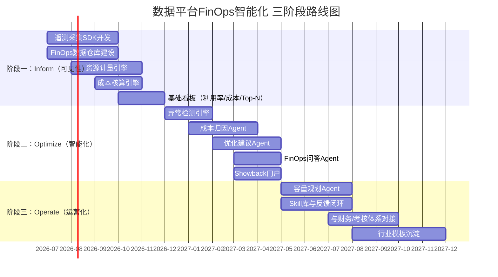

# 数据平台FinOps智能化——成本智能治理技术提案V2.0

> **作者**：向春（架构师）
> **日期**：2026年5月
> **受众**：公司大数据技术委员会
> **前序**：本提案是《AI时代数据成本智能化治理——前瞻技术提案V1.0》的收敛版本。V1.0覆盖了四个维度（存储/计算/FinOps/性能）×三类机制（学习型/Agent化/自治化）的全景分析；V2.0在此基础上**收敛技术范围**，以FinOps为框架、以FinOps平台层+智能体层为实现载体，给出面向**本地部署数据平台产品**的成本智能治理落地方案
> **定位**：不是技术调研，而是**产品技术方案**——回答"我们的数据平台产品如何内建FinOps能力，并通过Agent技术实现智能化"

---

## 写在前面：从V1.0到V2.0——为什么收敛、收敛到哪里

V1.0提案做了一件正确的事——**把成本智能治理的技术全景铺开**，让决策者看到四个维度×三类机制的完整版图。但全景地图不是行军路线。V2.0要做的是：**选定一条可落地的主路线，给出产品级的技术方案。**

**收敛的三个判断：**

| 判断 | 依据 |
|------|------|
| **聚焦FinOps框架** | 成本治理不是纯技术问题，而是"技术 × 业务 × 财务"的交叉问题。FinOps作为业界成熟的框架，提供了从"可见→可归因→可优化→可运营"的完整方法论，不需要另起炉灶 |
| **聚焦FinOps平台层 + 智能体层** | V1.0的实现层归属分析已经表明：这两层是"最安全的起步点"——旁路部署、不入侵计算引擎、不修改存储格式、风险最低、独立交付 |
| **聚焦本地部署** | 我们的数据平台产品是本地部署交付，不涉及公有云。本地部署场景下，成本结构、计量方式、优化手段与公有云FinOps有本质差异——这既是约束，也是差异化机会 |

**V2.0与V1.0的关系：**

```
V1.0（全景）                          V2.0（收敛）
┌─────────────────────────┐          ┌─────────────────────────┐
│ 四维度：存储/计算/FinOps/性能│          │ 一个框架：FinOps          │
│ 三机制：学习型/Agent化/自治化│   ───→   │ 两个实现层：平台层+智能体层  │
│ 六个实现层全覆盖           │          │ 一个交付形态：本地部署产品   │
│ 定位：前瞻技术储备         │          │ 定位：产品技术方案          │
└─────────────────────────┘          └─────────────────────────┘
```

**本提案要回答的核心问题：**

1. FinOps是什么？为什么本地部署的数据平台需要FinOps？
2. 业界在FinOps智能化上走到了哪里？趋势是什么？
3. 我们的数据平台产品应该用什么架构来落地FinOps？
4. 关键技术是什么？Agent如何让FinOps从"看得见"变成"能行动"？
5. 差异化竞争力在哪里？
6. 按什么节奏推进？

---

## 目录

- [第一章：FinOps概念导入——为什么本地部署数据平台需要FinOps](#第一章finops概念导入为什么本地部署数据平台需要finops)
- [第二章：业界趋势分析——FinOps智能化的技术演进](#第二章业界趋势分析finops智能化的技术演进)
- [第三章：落地架构——数据平台FinOps智能化的产品架构设计](#第三章落地架构数据平台finops智能化的产品架构设计)
- [第四章：关键技术——FinOps平台层与智能体层的技术展开](#第四章关键技术finops平台层与智能体层的技术展开)
- [第五章：差异化竞争力分析](#第五章差异化竞争力分析)
- [第六章：落地节奏](#第六章落地节奏)
- [结语](#结语)
- [附录：参考资料](#附录参考资料)

---

## 第一章：FinOps概念导入——为什么本地部署数据平台需要FinOps

### 1.1 FinOps是什么

FinOps（Financial Operations）是一套**将财务责任引入技术决策**的运营框架。它由FinOps Foundation（Linux Foundation旗下）标准化定义，核心理念是：

> **让每一个使用技术资源的团队，都对自己消耗的成本可见、可理解、可行动。**

FinOps不是一个工具，也不是一个平台——它是一套**组织运作模式**，包含原则、阶段和能力域。

**FinOps的三大原则：**

| 原则 | 含义 | 对数据平台的映射 |
|------|------|---------------|
| **协作（Collaboration）** | 技术、财务、业务三方协作决策，而非技术团队单方面"管成本" | 数据平台的成本治理不能只靠DBA/运维，需要业务部门参与 |
| **所有权（Ownership）** | 每个团队对自己使用的资源负责，成本随使用权下沉 | 每个数据开发项目/业务线应看到并"拥有"自己的资源账单 |
| **可访问性（Accessibility）** | 成本数据应及时、准确、对所有相关方可见 | 成本数据不应锁在运维报表里，应成为自助可查的产品能力 |

**FinOps的生命周期——Inform → Optimize → Operate：**

```
┌──────────────────────────────────────────────────────────┐
│                  FinOps 生命周期                          │
│                                                          │
│  ┌──────────┐    ┌──────────┐    ┌──────────┐           │
│  │  Inform   │───→│ Optimize │───→│ Operate  │           │
│  │  可见     │    │  可优化   │    │  可运营   │           │
│  └──────────┘    └──────────┘    └──────────┘           │
│       │                                │                 │
│       └────────────────────────────────┘                 │
│                  持续迭代循环                              │
└──────────────────────────────────────────────────────────┘
```

| 阶段 | 核心能力 | 数据平台场景下的具体含义 |
|------|---------|-------------------|
| **Inform（可见）** | 成本可见、可分配、可归因 | 每个项目/团队/作业/SQL的资源消耗和成本清晰可见 |
| **Optimize（可优化）** | 识别浪费、推荐优化、评估ROI | 发现闲置资源、低效SQL、过度分配的存储，并给出优化建议 |
| **Operate（可运营）** | 持续治理、自动化、融入业务流程 | 成本优化不是一次性项目，而是日常运营的一部分 |

### 1.2 本地部署 vs 公有云：FinOps的差异

FinOps起源于公有云（AWS/Azure/GCP）场景，因为公有云的"按需付费"模式让成本管理变得更紧迫。但**本地部署场景下的成本治理需求同样强烈，且有其独特性**：

| 维度 | 公有云FinOps | 本地部署FinOps |
|------|-----------|-------------|
| **成本结构** | 按需付费，变动成本为主（用多少付多少） | 一次性采购+运维，固定成本为主（买了就在那里） |
| **优化杠杆** | 选择更便宜的实例类型/区域/付费方式（RI/Spot） | **提升利用率**——已采购的硬件闲置是最大的浪费 |
| **计费透明度** | 云厂商提供细粒度账单（按API调用/秒/GB计费） | **通常不存在细粒度计费**——只知道买了多少服务器，不知道谁用了多少 |
| **弹性** | 可随时扩缩容 | 扩容周期长（采购→审批→到货→部署），缩容几乎不可能 |
| **单价趋势** | 长期下降（摩尔定律+竞争） | **近两年服务器价格大幅上升**（芯片供应链+信创要求） |
| **核心痛点** | "花太多了"（按需付费导致失控） | "**花了但不知道谁花的**"（固定成本缺乏归因）+ "**花了但没用够**"（利用率低） |

**本地部署场景下FinOps的核心命题转变：**

> 公有云FinOps的核心是**"花得更少"**（通过选型和弹性控制账单）。
> 本地部署FinOps的核心是**"花得更值"**（通过可见性和利用率让已投入的资产发挥最大价值）。

### 1.3 为什么"现在"需要FinOps——服务器成本上升下的紧迫性

过去几年，本地部署场景面临的成本压力呈现加速恶化趋势：

| 压力源 | 表现 | 量化感知 |
|-------|------|---------|
| **服务器价格上涨** | 国产化/信创要求+芯片供应链变化，x86和ARM服务器单价持续攀升 | 同等算力的采购成本较三年前上升30-50%（体感数据，各企业有差异） |
| **数据规模持续膨胀** | 非结构化数据进入消费链路、AI负载新增（参见V1.0第一章） | 存储需求年增长率25-40% |
| **采购审批趋严** | IT预算收紧，每一轮采购需要更充分的ROI论证 | "为什么还要买？之前买的用了多少？"——这个问题越来越难回答 |
| **治理人力不增** | 管理数据资产的团队规模不增长，但资产规模指数级膨胀 | 人均管理资产恶化（参见V1.0"剪刀差"分析） |

**最直接的矛盾是：**

> 采购审批问"利用率多少"，回答不出来——因为**缺乏按项目/团队/作业的资源计量基础设施**。
> 业务部门问"为什么要降成本，我们用了多少"，也回答不出来——因为**成本从未下沉到业务部门**。

FinOps的Inform阶段（可见性）正是解决这个矛盾的第一步。而Agent技术则把Inform之后的Optimize和Operate阶段从"人工驱动"升级到"智能驱动"。

### 1.4 FinOps在数据平台产品中的定位

我们要做的不是"建一个FinOps团队"，而是**把FinOps能力内建到数据平台产品中**——让数据平台的用户（开发者、分析师、项目经理、管理层）在日常使用数据平台的过程中，自然地看到成本、理解成本、优化成本。

```
传统数据平台                          FinOps内建的数据平台
┌──────────────────┐                ┌──────────────────────────┐
│ 数据开发          │                │ 数据开发                  │
│ 数据治理          │                │ 数据治理                  │
│ 数据服务          │                │ 数据服务                  │
│ 运维监控          │                │ 运维监控                  │
│                  │                │ ┌──────────────────────┐ │
│ （成本？不知道）   │    ───→       │ │ FinOps成本智能治理    │ │
│                  │                │ │ · 成本可见            │ │
│                  │                │ │ · 智能归因            │ │
│                  │                │ │ · 优化建议            │ │
│                  │                │ │ · 运营闭环            │ │
│                  │                │ └──────────────────────┘ │
└──────────────────┘                └──────────────────────────┘
```

**产品定位**：FinOps不是一个独立产品，而是数据平台的**内建能力模块**——与数据开发、数据治理、运维监控并列，成为数据平台的第五大核心模块。

---

## 第二章：业界趋势分析——FinOps智能化的技术演进

### 2.1 FinOps的三代演进

FinOps的发展可以划分为三代：

| 代际 | 时间段 | 核心特征 | 代表产品 | 局限 |
|------|-------|---------|---------|------|
| **第一代：报表驱动** | 2018-2022 | 人工采集→Excel/BI报表→月度会议 | 自建报表、早期Apptio | 滞后（月度）、粒度粗（项目级）、依赖专家解读 |
| **第二代：平台驱动** | 2022-2025 | 自动化采集→专用FinOps平台→实时看板→规则告警 | CloudHealth、Apptio Cloudability、阿里DataWorks成本治理、Databricks System Tables | 能"看到"但不能"理解"——异常归因仍靠人工、优化建议碎片化 |
| **第三代：AI/Agent驱动** | 2025- | FinOps平台 + AI异常检测 + LLM归因Agent + 智能优化建议 | Databricks AI Insights、Snowflake Cortex、各厂商FinOps + Copilot集成 | **正在发生的范式转换**——从"平台展示数据，人来分析决策"到"Agent分析并建议，人来审核确认" |

**我们面对的机会窗口：**

大多数企业的数据平台成本治理仍停留在第一代（报表驱动），少数进入第二代（平台驱动）。第三代（AI/Agent驱动）在公有云厂商侧刚开始商用，在本地部署产品侧**几乎空白**——这是差异化机会。

### 2.2 公有云厂商的FinOps智能化动作

| 厂商 | 动作 | 时间 | 核心能力 |
|------|------|------|---------|
| **Databricks** | System Tables + Predictive Optimization + AI Insights | 2024 GA | 细粒度成本数据 + 自治化优化 + AI异常分析 |
| **Snowflake** | Cortex AISQL + Resource Optimization | 2025 GA | LLM驱动的SQL分析和成本优化 |
| **Google Cloud** | BigQuery Admin Resource Charts + BI Engine + Recommendations | 持续演进 | 查询级成本可见 + 自动优化建议 |
| **AWS** | Cost Explorer + Compute Optimizer + Trusted Advisor | 持续演进 | 多维成本分析 + ML推荐 |
| **阿里云** | DataWorks成本治理 + DAS自治 | 已商用 | 作业级成本下钻 + 自治索引 |
| **华为云** | CCE FinOps + DataArts治理 | 已商用 | 容器场景成本治理 |

**关键观察：公有云厂商的FinOps智能化有两个共同特征——**

1. **计费基础设施完善**：公有云天然有细粒度计费（按秒/按API/按GB），FinOps建立在这个基础之上
2. **与自有引擎深度绑定**：Databricks的PO只对Unity Catalog有效，Snowflake的能力只对Snowflake表有效——这些能力**无法移植到本地部署的异构数据栈**

### 2.3 本地部署数据平台的FinOps空白

| 产品 | FinOps能力现状 |
|------|-------------|
| **华为DataArts/FusionInsight** | 有资源监控，但缺乏按项目/作业的成本归因和Showback |
| **阿里DataWorks（本地版）** | 云版有成本治理，本地版功能有限 |
| **字节DataLeap** | 内部版有Cost Lens，外部版未开放 |
| **腾讯WeData** | 有资源监控，缺乏FinOps框架性能力 |
| **开源方案（Spark + Hive + YARN）** | **完全空白**——没有作业级计量、没有归因、没有Showback |

**这意味着：在本地部署的数据平台产品中，"FinOps能力"是一个真实存在的产品空白——谁先补上，谁就在产品竞争中多一个关键差异化维度。**

### 2.4 AI/Agent技术为FinOps带来的范式变化

借用[深度调研](AI时代的数据智能技术变革——深度调研.md)中"瓶颈翻转"的分析框架——FinOps的瓶颈正在从"工具/平台能力"翻转到"分析与决策能力"：

| 阶段 | 主导瓶颈 | 表现 |
|------|---------|------|
| 五年前 | 数据采集能力 | 连"谁用了多少资源"都看不到 |
| 三年前 | 平台展示能力 | 能看到数据，但展示不够实时、不够细粒度 |
| **现在** | **分析与决策能力** | 数据有了、看板有了，但**"这个异常怎么解释？""应该怎么优化？"仍然依赖专家** |

Agent技术解决的正是这个"分析与决策"瓶颈：

| FinOps阶段 | 传统方式 | Agent化方式 |
|-----------|---------|-----------|
| **Inform** | 看板展示 → 人看 → 人解读 | 看板展示 → **Agent主动发现异常并归因** → 人审核 |
| **Optimize** | 人发现问题 → 人分析根因 → 人给建议 | Agent持续分析 → **Agent生成优化建议** → 人审核执行 |
| **Operate** | 人跟踪优化效果 → 人决定下一步 | Agent跟踪 → **Agent反馈学习** → 持续校准 |

**这不是"锦上添花"，而是"解决根本矛盾"**——在治理人力线性增长、数据资产指数膨胀的剪刀差下，Agent是唯一能让FinOps的Optimize和Operate阶段规模化运转的技术路径。

### 2.5 本地部署FinOps的两个关键差异化方向

基于以上分析，本地部署数据平台的FinOps产品化有两个区别于公有云方案的关键方向：

| 方向 | 公有云方案做不到 | 我们应该做到 |
|------|-------------|-----------|
| **利用率驱动（而非账单驱动）** | 公有云FinOps围绕"账单"展开（因为有细粒度账单）。本地部署没有账单，但有比账单更底层的数据——**硬件利用率**。利用率才是本地部署场景下的"第一性原理" | **以硬件利用率为核心指标**，建立"利用率→成本折算→归因→优化"的链条 |
| **Agent智能化（而非规则驱动）** | 公有云厂商的优化建议多为规则驱动（"这个实例连续7天CPU<10%，建议缩容"）。规则覆盖面窄、维护成本高 | **用Agent理解业务上下文**——不只是"CPU低"，而是"这个Spark作业在等下游数据到达，CPU低是正常的" |

---

## 第三章：落地架构——数据平台FinOps智能化的产品架构设计

### 3.1 总体架构

```
┌──────────────────────────────────────────────────────────────────────┐
│                      数据平台 FinOps 智能化总体架构                    │
│                                                                      │
│  ┌────────────────────────── 用户交互层 ──────────────────────────┐  │
│  │  FinOps看板  │  自然语言对话  │  告警通知  │  审核工作台  │  API │  │
│  └──────────────────────────────────────────────────────────────┘  │
│                               │                                      │
│  ┌────────────────────────── 智能体层 ───────────────────────────┐  │
│  │                                                                │  │
│  │  ┌──────────┐ ┌──────────┐ ┌──────────┐ ┌──────────┐         │  │
│  │  │ 成本归因  │ │ 优化建议  │ │ 容量规划  │ │ 问答对话  │         │  │
│  │  │ Agent    │ │ Agent    │ │ Agent    │ │ Agent    │         │  │
│  │  └──────────┘ └──────────┘ └──────────┘ └──────────┘         │  │
│  │       │            │            │            │                 │  │
│  │  ┌──────────────────────────────────────────────┐             │  │
│  │  │          Agent共享基础设施                      │             │  │
│  │  │  LLM推理引擎 │ MCP Server │ Skill库 │ 记忆层  │             │  │
│  │  └──────────────────────────────────────────────┘             │  │
│  └────────────────────────────────────────────────────────────────┘  │
│                               │                                      │
│  ┌────────────────────────── FinOps平台层 ───────────────────────┐  │
│  │                                                                │  │
│  │  ┌──────────┐ ┌──────────┐ ┌──────────┐ ┌──────────┐         │  │
│  │  │ 资源计量  │ │ 成本核算  │ │ 异常检测  │ │ 趋势分析  │         │  │
│  │  │ 引擎     │ │ 引擎     │ │ 引擎     │ │ 引擎     │         │  │
│  │  └──────────┘ └──────────┘ └──────────┘ └──────────┘         │  │
│  │       │            │            │            │                 │  │
│  │  ┌──────────────────────────────────────────────┐             │  │
│  │  │          FinOps数据仓库                        │             │  │
│  │  │  资源用量事实表 │ 成本明细表 │ 元数据维度表     │             │  │
│  │  └──────────────────────────────────────────────┘             │  │
│  └────────────────────────────────────────────────────────────────┘  │
│                               │                                      │
│  ┌────────────────────────── 遥测采集层 ─────────────────────────┐  │
│  │                                                                │  │
│  │  ┌────────┐ ┌────────┐ ┌────────┐ ┌────────┐ ┌────────┐     │  │
│  │  │ Spark  │ │ Flink  │ │ Hive/  │ │ YARN/  │ │ HDFS/  │     │  │
│  │  │Listener│ │Metrics │ │Presto  │ │K8s     │ │对象存储 │     │  │
│  │  └────────┘ └────────┘ └────────┘ └────────┘ └────────┘     │  │
│  └────────────────────────────────────────────────────────────────┘  │
│                                                                      │
│  ┌────────────── 现有数据平台基础设施（不改动）──────────────────┐     │
│  │  Spark │ Flink │ Hive/Presto │ YARN/K8s │ HDFS/对象存储      │     │
│  └──────────────────────────────────────────────────────────────┘     │
└──────────────────────────────────────────────────────────────────────┘
```

### 3.2 四层架构详解

| 层级 | 职责 | 对现有系统的侵入性 | 关键设计原则 |
|------|------|---------------|-----------|
| **遥测采集层** | 从现有计算引擎、调度系统、存储系统中采集资源使用数据 | **极低**——通过引擎原生的监听接口（SparkListener、Flink Metrics Reporter、YARN REST API）采集，不修改引擎代码 | 零侵入、全覆盖、秒级/分钟级采集 |
| **FinOps平台层** | 资源计量、成本核算、异常检测、趋势分析——这是FinOps的"数据中台" | **无**——完全独立部署的服务，消费遥测数据，不影响任何现有系统 | 确定性计算、可审计、高可用 |
| **智能体层** | Agent驱动的归因分析、优化建议、容量规划、自然语言问答 | **无**——旁路部署的Agent服务，通过MCP/API与平台层交互 | LLM本地部署、建议+人工审核、Skill库持续学习 |
| **用户交互层** | FinOps看板、对话界面、告警、审核工作台 | **无**——数据平台的前端新增模块 | 面向不同角色（技术/业务/管理层）的差异化视图 |

### 3.3 本地部署的关键架构决策

| 决策点 | 选择 | 理由 |
|-------|------|------|
| **LLM部署方式** | 本地部署开源模型（Qwen/DeepSeek/Llama系） | 作业元数据、SQL文本、组织结构等属敏感信息，不能外传 |
| **成本核算基础** | 以硬件资源利用率为基础，折算为"虚拟成本单价" | 本地部署没有真实账单，需要建立内部核算体系 |
| **Agent与平台的通信** | MCP协议 | Agent通过MCP Tool调用平台层的查询接口，解耦Agent逻辑和数据查询 |
| **数据存储** | 复用现有数据平台的存储（HDFS/Iceberg/Hive） | FinOps数据仓库本身也应该跑在自家数据平台上——"吃自己的狗粮" |
| **采集对性能的影响** | 采集开销控制在整体资源的1%以内 | 通过异步上报、采样、增量采集控制开销 |

### 3.4 面向不同角色的产品能力

| 角色 | 核心诉求 | 产品提供的能力 |
|------|---------|-------------|
| **数据开发者** | "我的作业消耗了多少资源？有没有优化空间？" | 作业级资源报告、SQL优化建议、历史成本趋势 |
| **项目负责人** | "我的项目整体资源消耗合理吗？谁是大户？" | 项目级成本看板、Top-N热点作业、同比/环比变化 |
| **平台运维** | "集群利用率够不够？哪些资源闲置？" | 集群利用率看板、闲置资源检测、容量规划建议 |
| **管理层** | "大数据平台的总投入产出如何？下一期需要采购多少？" | 总成本概览、投入产出趋势、采购规划报告 |

---

## 第四章：关键技术——FinOps平台层与智能体层的技术展开

### 4.1 FinOps平台层：四个核心引擎

#### 4.1.1 资源计量引擎——"测得准"

**功能定义**：从各计算引擎和存储系统中采集资源使用量，按作业/SQL/用户/项目维度聚合。

**采集矩阵：**

| 数据源 | 采集接口 | 采集指标 | 采集频率 |
|-------|---------|---------|---------|
| **Spark** | SparkListener | 每个Application/Job/Stage/Task的CPU·秒、Peak Memory、Shuffle Read/Write字节数、Input/Output字节数、执行时间 | 作业完成时回调 |
| **Flink** | Metrics Reporter（Prometheus格式） | 每个Job/Task的CPU使用率、Memory使用量、Back Pressure、Records In/Out | 每10秒 |
| **Hive/Presto/Trino** | EventListener / Query Log | 每条SQL的扫描行数/字节数、CPU·秒、执行时间、分区命中数 | 每次查询完成 |
| **YARN** | REST API / Timeline Server | 每个Application的Container数、CPU VCore·秒、Memory MB·秒、队列、用户 | 每分钟轮询 |
| **K8s** | cAdvisor / Metrics Server / kube-state-metrics | 每个Pod的CPU/Memory/GPU实际使用量、Request/Limit、节点亲和性 | 每15秒 |
| **HDFS/对象存储** | NameNode API / fsimage分析 / 存储API | 每个目录/表的存储占用、副本数、文件数、块大小分布 | 每天全量 + 增量事件 |

**核心流程：**

```
┌────────┐    ┌──────────┐    ┌──────────┐    ┌──────────┐
│ 原始事件 │───→│ 标准化    │───→│ Owner归集│───→│ 写入FinOps│
│ 采集    │    │ & 清洗   │    │ & 标签   │    │ 数据仓库  │
└────────┘    └──────────┘    └──────────┘    └──────────┘
```

**Owner归集策略（本地部署的关键挑战）：**

本地部署场景下，Owner归集比公有云更复杂——因为往往**没有统一的租户/项目标签体系**：

| 场景 | 归集方式 |
|------|---------|
| YARN队列已按项目/团队划分 | 按YARN队列直接映射到Owner |
| Spark作业有spark.app.name标签 | 从标签中解析项目/Owner信息 |
| 统一调度系统（Airflow/DolphinScheduler）提交 | 从调度系统元数据中获取DAG Owner |
| 手动提交（spark-submit/beeline） | 按提交用户归集 |
| 共享服务（Thrift Server/Presto） | 从SQL提交信息中提取用户/项目（需SQL网关层配合） |

**关键技术：**

| 技术 | 作用 |
|------|------|
| **SparkListener Plugin** | 零侵入地在Spark Driver中注册监听器，捕获全量Application/Job/Stage/Task事件 |
| **YARN Timeline Server v2** | 提供应用级、容器级的历史资源使用数据，支持跨应用的时序查询 |
| **标签规范化** | 建立统一的标签Schema（project/team/cost_center/env），推动业务方在提交作业时携带标签 |

#### 4.1.2 成本核算引擎——"算得对"

**功能定义**：将资源使用量转换为金额——在本地部署场景下，这意味着建立**内部核算体系**。

**本地部署成本模型：**

本地部署不存在"云厂商账单"，需要从硬件资产出发自建成本模型：

```
硬件资产成本
    │
    ├── 固定成本（采购折旧 + 机房 + 网络 + 运维人力）
    │       │
    │       └── 按"资源池总容量"均摊到每个资源单元
    │               → CPU VCore·时单价
    │               → Memory GB·时单价
    │               → Storage GB·月单价
    │               → GPU卡·时单价
    │
    └── 变动成本（电力 + 散热 + 带宽增量）
            │
            └── 按"实际使用量"分摊
                    → 与固定成本合并后得到综合单价
```

**单价计算方法：**

\[
\text{CPU单价(元/VCore·时)} = \frac{\text{CPU相关总成本(元/月)}}{\text{集群总VCore数} \times \text{月有效小时数}} \times (1 + \text{管理费率})
\]

| 成本项 | 计入方式 | 典型占比 |
|-------|---------|---------|
| 服务器折旧（3-5年直线法） | 按CPU/Memory/GPU拆分后分别计入 | 50-60% |
| 机房（电力+空调+租金） | 按机柜/U位数分摊 | 20-25% |
| 网络 | 按端口带宽分摊 | 5-10% |
| 运维人力 | 按管理节点数分摊 | 10-15% |
| 软件许可 | 按节点数/Core数分摊 | 0-10% |

**作业级成本计算：**

对每个作业 \(j\)：

\[
Cost_j = \sum_{r \in \{CPU, Mem, GPU, Storage, IO\}} Usage_{j,r} \times Price_r
\]

其中 \(Usage_{j,r}\) 来自资源计量引擎，\(Price_r\) 来自内部单价模型。

**共享资源分摊：**

| 分摊类型 | 计算方式 |
|---------|---------|
| **队列级共享** | 按各项目在队列中的实际使用量加权分摊队列的固定成本份额 |
| **存储共享** | 按各项目的存储占用量比例分摊HDFS集群的存储成本 |
| **公共服务** | Metastore/Presto Coordinator等公共组件的成本按查询量/作业量加权分摊到各项目 |

#### 4.1.3 异常检测引擎——"发现得早"

**功能定义**：对各维度的资源使用/成本时序做持续监控，自动发现异常并触发告警+归因流程。

**检测对象与方法：**

| 检测对象 | 检测维度 | 方法 | 告警阈值 |
|---------|---------|------|---------|
| 项目级日成本 | 每日CPU·时/Memory·GB时/存储量 | STL分解 + 残差检测 | 残差 > 3σ |
| 作业级执行成本 | 单次执行的资源消耗 vs 历史均值 | 滑动窗口统计 | 偏离 > 200% |
| 队列级利用率 | 队列的CPU/Memory分配率和利用率 | 趋势检测（Prophet） | 利用率持续 < 20% 或 > 90% |
| 存储增长 | 项目级存储每日增量 | 趋势外推 | 增长率突变（前7日 vs 前30日斜率差 > 2倍） |
| 集群级总利用率 | 集群整体CPU/Memory/GPU利用率 | 滑动均值 | 周均利用率 < 30%（浪费预警）或 > 85%（瓶颈预警） |

**异常事件的数据结构：**

```json
{
  "event_id": "anomaly-20260518-001",
  "timestamp": "2026-05-18T08:30:00+08:00",
  "dimension": "project_daily_cost",
  "entity": "project_wireless_analysis",
  "metric": "cpu_vcore_hours",
  "expected_value": 12500,
  "actual_value": 38200,
  "deviation_ratio": 2.056,
  "severity": "HIGH",
  "detection_method": "STL_residual",
  "context": {
    "trend_direction": "stable",
    "seasonal_phase": "weekday_normal",
    "last_7d_avg": 13100
  }
}
```

**关键技术：**

| 技术 | 作用 |
|------|------|
| **STL分解（Seasonal-Trend Decomposition using LOESS）** | 将成本时序分解为趋势+季节性+残差，仅在残差上做异常检测，避免把正常周期波动误报为异常 |
| **Prophet** | Facebook开源时序模型，天然支持多重季节性（日/周/月）和假日效应，适合资源使用量的趋势预测 |
| **Isolation Forest** | 无监督异常检测，适合多维特征的联合异常检测（如"CPU升高+IO降低"的组合异常） |

#### 4.1.4 趋势分析引擎——"看得远"

**功能定义**：提供历史趋势、同比环比、利用率分析、容量预测等分析能力。

**核心分析视图：**

| 视图 | 内容 | 刷新频率 |
|------|------|---------|
| **利用率趋势** | 集群/队列/项目级的CPU/Memory/GPU利用率7天/30天/90天趋势 | 每小时 |
| **成本趋势** | 各项目/团队的成本月度趋势、同比/环比变化 | 每天 |
| **Top-N排行** | 按成本/资源消耗排行的项目/作业/用户 | 每天 |
| **闲置资源检测** | 持续低利用率的队列/项目（分配了配额但很少使用） | 每天 |
| **容量预测** | 基于历史趋势和业务计划预测未来3-6个月的资源需求 | 每周 |
| **投入产出仪表盘** | 管理层视角的总成本/总产出/单位成本变化 | 每月 |

### 4.2 智能体层：四个核心Agent

#### 4.2.1 成本归因Agent——"解释得清"

**功能定义**：当异常检测引擎发现成本异常时，Agent自动下钻分析根因，生成自然语言归因报告。

**核心流程：**

```
异常事件 → 接收 → L1下钻(项目/团队) → L2下钻(作业/类型) → L3下钻(SQL/操作)
                                                                    │
                                                                    ▼
                                                          L4根因判定
                                                          (数据量变化?
                                                           Plan退化?
                                                           上游变更?
                                                           新业务接入?)
                                                                    │
                                                                    ▼
                                                          自然语言归因报告
                                                                    │
                                                                    ▼
                                                          推送 → 人工审核 → 反馈
```

**Agent的MCP Tool集：**

| Tool名称 | 功能 | 查询示例 |
|---------|------|---------|
| `query_cost_breakdown` | 按维度（项目/团队/用户/作业类型）查询成本明细 | "查询project_wireless_analysis在5月18日的成本按作业类型分布" |
| `query_job_history` | 查询某个作业的历史执行记录和资源消耗趋势 | "查询etl_base_station过去30天的执行成本变化" |
| `query_sql_stats` | 查询某条SQL/模板的执行统计 | "查询最近7天成本最高的10条SQL模板" |
| `query_table_metadata` | 查询表的元数据、存储量、访问频率 | "查询ods_alarm_detail表的大小和最近访问情况" |
| `query_lineage` | 查询表/作业的血缘关系 | "查询etl_base_station的上游依赖表" |
| `query_cluster_utilization` | 查询集群/队列的资源利用率 | "查询hadoop_prod队列过去7天的CPU利用率" |

**归因报告示例：**

```
## 成本异常归因报告

**异常概要**：项目"无线网络分析"5月18日计算成本38,200 VCore·时，
较近7天均值13,100 VCore·时偏高206%。

**根因分析**：

1. **直接原因**：作业 etl_base_station_daily 执行时间从平均2.1小时
   延长至7.8小时，资源消耗增加272%。

2. **根本原因**：上游表 ods_base_station_raw 5月17日数据量异常——
   当日新增1.2亿行（平均日增3,000万行），数据量增长300%。
   经血缘追溯，发现源系统在5月17日启用了"5G基站秒级性能采集"，
   数据粒度从分钟级细化到秒级。

3. **影响范围**：下游3个作业（etl_kpi_hourly, etl_alarm_correlation,
   rpt_network_quality）均受影响，预计持续影响。

**建议**：
- 短期：与源系统确认5G秒级采集是否为长期策略
- 中期：对etl_base_station_daily启用增量处理（当前为全量重跑）
- 长期：对ods_base_station_raw按采集粒度分区，秒级数据独立存储
```

**关键技术：**

| 技术 | 作用 |
|------|------|
| **MCP协议** | Agent通过标准化的Tool调用访问FinOps数据仓库和元数据系统，无需为每个数据源写专用连接器 |
| **ReAct推理范式** | Agent按"思考→行动→观察"循环逐步下钻，每一步的Tool调用由前一步的观察结果驱动 |
| **Skill库（Few-shot记忆）** | 将历史归因案例（尤其是人工审核修正过的案例）作为Few-shot注入后续归因，提高准确度 |
| **本地部署LLM** | 敏感信息（作业名、SQL、表名、组织结构）不外传，所有LLM推理在内网完成 |

#### 4.2.2 优化建议Agent——"建议得准"

**功能定义**：持续分析资源使用模式，识别优化机会，生成可执行的优化建议。

**优化建议类型：**

| 建议类型 | 识别逻辑 | 建议输出 | 预估节省 |
|---------|---------|---------|---------|
| **闲置资源回收** | 队列/项目配额利用率持续<20%，且无增长趋势 | "项目X的YARN队列配额200 VCores，过去30天峰值使用42 VCores，建议缩减至80 VCores" | 配额差值 × 单价 |
| **作业资源超配** | 作业的Executor Memory分配远超实际使用峰值 | "作业Y分配了8GB/Executor内存，实际峰值使用2.1GB，建议调整为3GB" | (分配-建议) × Executor数 × 单价 |
| **低效SQL识别** | SQL扫描量与输出量比值异常高（全表扫描/笛卡尔积/重复扫描） | "SQL模板Z每日执行15次，每次全表扫描ods_alarm_detail(120GB)，建议添加分区过滤" | 预估扫描节省量 × 单价 |
| **冷数据降级** | 表/分区超过N天未被访问 | "表dwd_traffic_detail的2024年分区（共2.3TB）过去180天无访问，建议迁移至冷存储" | 存储量 × (热单价-冷单价) |
| **重复数据治理** | 多个项目维护语义相似的宽表 | "项目A的dim_base_station和项目B的dim_site_info有85%列重叠，建议统一为共享维度表" | 去重后存储节省 + 维护成本节省 |
| **执行时段优化** | 作业可调度到低峰时段执行（不影响SLA） | "作业W的SLA为次日9:00前完成，当前调度在22:00高峰期，建议调整到02:00低谷期" | 高峰期资源争抢导致的排队等待成本 |

**Agent的核心推理逻辑：**

与规则驱动的优化建议不同，Agent能理解**业务上下文**：

```
规则驱动：
  IF cpu_utilization < 10% FOR 7 days THEN suggest_downsize

Agent驱动：
  观察：项目X的CPU利用率过去7天<10%
  思考：先查询项目X的作业调度情况
  行动：调用query_job_history
  观察：项目X有一个月度批处理作业，上次执行在5月1日，下次预计6月1日
  结论：CPU低利用率是因为月度作业间歇期，不是闲置——不建议缩容
         但建议：该月度作业可以使用弹性资源池而非固定配额
```

#### 4.2.3 容量规划Agent——"规划得稳"

**功能定义**：基于历史数据和业务计划，辅助生成资源采购/扩容规划。

**核心能力：**

| 能力 | 实现 |
|------|------|
| **趋势预测** | 基于FinOps平台层的趋势分析引擎，预测未来3-6个月各类资源需求 |
| **场景仿真** | 用户输入假设条件（如"新增一个AI训练项目，日均需要16张GPU卡"），Agent计算对集群容量的影响 |
| **采购建议** | 综合需求预测、现有余量、硬件价格，生成采购建议（数量/配置/时间） |
| **ROI论证** | 为采购申请生成ROI论证材料——"当前利用率XX%，扩容后预计满足N个月需求，单月新增成本XX元" |

**对话示例：**

```
用户："如果明年上半年要上5G切片分析项目，预计每天需要跑500个Spark作业，
      每个作业平均需要20 VCores和40GB内存，跑2小时，我们现在的集群够不够？"

Agent："基于当前集群状况分析：

当前集群：
- CPU总量：2,000 VCores
- 当前日均利用率：62%（峰值82%）
- 可用余量（按峰值82%计算）：2000 × (1-0.82) = 360 VCores

新增需求：
- 5G切片项目日均需求：500作业 × 20VCores × 2h / 24h ≈ 833 VCores（假设均匀分布）
- 峰值需求（集中在白天12h）：~1,667 VCores

结论：当前余量360 VCores无法满足新增833-1667 VCores的需求。

建议：
1. 扩容方案A（满足p90）：新增1,200 VCores（约30台服务器），一次性投入约XXX万元
2. 扩容方案B（满足p50+弹性）：新增800 VCores + 启用YARN弹性队列，
   一次性投入约XXX万元，部分低优先级作业可能排队
3. 优化方案：在扩容前，先对现有作业做资源优化（当前已识别出约200 VCores的优化空间），
   可部分缓解压力"
```

#### 4.2.4 FinOps问答Agent——"问得到"

**功能定义**：面向所有用户的自然语言问答入口，回答关于成本和资源的任何问题。

**典型问答场景：**

| 用户角色 | 典型问题 | Agent回答路径 |
|---------|---------|-------------|
| 数据开发 | "我的作业etl_kpi_hourly昨天为什么跑了3小时？平时只要40分钟" | 查询作业历史 → 对比执行计划 → 分析数据量变化 → 生成解释 |
| 项目经理 | "我们团队这个月的资源消耗比上个月增长了多少？主要增长在哪里？" | 查询团队成本明细 → 环比分析 → Top-N变化归因 |
| 运维 | "hadoop_prod队列的CPU还有多少余量？能再接多少作业？" | 查询队列利用率 → 计算剩余配额 → 结合历史峰值估算可接纳量 |
| 管理层 | "大数据平台今年的总成本是多少？人均效率是否在提升？" | 查询年度成本汇总 → 计算人均产出指标 → 趋势分析 |

**关键技术：**

| 技术 | 作用 |
|------|------|
| **NL2SQL（受限场景）** | 将自然语言问题转化为对FinOps数据仓库的SQL查询——但限定在FinOps领域的受控Schema上，不做通用NL2SQL |
| **语义层（Semantic Layer）** | 借用[深度调研](AI时代的数据智能技术变革——深度调研.md)中"语义层不可绕过性"的判断——在FinOps数据仓库之上建立语义层，统一"成本""利用率""效率"等概念的定义和口径 |
| **对话记忆** | 支持多轮对话，记住上下文（如"那把时间范围改成上个季度呢？"） |

### 4.3 Agent共享基础设施

四个Agent共享一组基础设施，避免重复建设：

| 基础设施 | 功能 | 技术选型 |
|---------|------|---------|
| **LLM推理引擎** | 为所有Agent提供LLM推理服务 | 本地部署Qwen-72B/DeepSeek-V3（或同等能力的开源模型），vLLM/SGLang推理框架 |
| **MCP Server** | 提供统一的Tool注册和调用接口 | 自研MCP Server，注册FinOps平台层的查询API为MCP Tool |
| **Skill库** | 存储历史案例、优化经验、组织偏好 | 结构化存储（JSON/数据库），按场景分类索引，支持Few-shot检索 |
| **记忆层** | 对话记忆、用户偏好、历史交互 | 短期记忆（会话内上下文）+ 长期记忆（用户偏好/常用查询） |
| **权限控制** | 确保Agent只能访问用户有权限看到的数据 | 与数据平台的权限体系集成——Agent的数据查询受限于用户的数据权限 |

---

## 第五章：差异化竞争力分析

### 5.1 与公有云FinOps方案的差异化

| 维度 | 公有云FinOps方案 | 我们的方案 |
|------|--------------|----------|
| **适用场景** | 绑定特定云厂商/引擎 | **异构本地部署栈**——支持Spark+Flink+Hive+Presto+YARN+K8s的混合架构 |
| **成本模型** | 基于云厂商账单 | **基于硬件利用率的内部核算**——对本地部署客户更有意义 |
| **数据安全** | 元数据/SQL可能传输到云端 | **全本地部署**——LLM、数据、Agent全在客户内网 |
| **Agent能力** | 厂商黑盒，无法定制 | **开放Skill库**——客户可以注入自己的优化经验，Agent越用越准 |
| **产品形态** | 独立SaaS产品 | **内建到数据平台**——与数据开发/治理/运维无缝集成 |

### 5.2 与同类本地部署产品的差异化

| 维度 | 竞品现状 | 我们的差异化 |
|------|---------|-----------|
| **FinOps能力** | 多数产品只有基础资源监控，无作业级归因和Showback | **完整FinOps框架**——从计量到归因到Showback到优化的闭环 |
| **智能化程度** | 规则驱动的告警和建议 | **Agent驱动**——能理解业务上下文，不只是"CPU低建议缩容" |
| **NL交互** | 无 | **自然语言问答**——任何用户都能用自然语言查询成本 |
| **闭环学习** | 无 | **Skill库+反馈循环**——Agent从人工审核中学习，建议质量持续提升 |

### 5.3 三层护城河

借用V1.0中的护城河分析框架：

| 层级 | 内容 | 复制难度 |
|------|------|--------|
| **第一层：FinOps产品能力** | 计量/核算/归因/看板的完整实现 | **中**——工程量可观但不存在技术壁垒 |
| **第二层：Agent智能化** | 四个Agent + MCP + 本地LLM | **中偏高**——需要LLM应用工程能力+领域知识 |
| **第三层：Skill库积累** | 客户特定的优化经验、归因案例、组织偏好 | **高**——需要时间积累，且与客户业务深度绑定，竞品无法复制 |

**核心竞争力判断**：第一、二层是"门票"，第三层是"真正的壁垒"——每多部署一个客户、每多运营一个月，Skill库中积累的行业知识和客户偏好就多一分，这是任何后来者无法跳过的积累。

---

## 第六章：落地节奏

### 6.1 三阶段路线图



### 6.2 阶段一：Inform——"先看见"

> **核心目标**：让成本可见——每个项目/团队/作业消耗了多少资源，值多少钱。

| 交付物 | 具体内容 | 验收标准 |
|-------|---------|---------|
| 遥测采集SDK | Spark/Flink/YARN/HDFS的采集插件 | 覆盖主流引擎的资源计量，采集开销<1% |
| FinOps数据仓库 | 资源用量事实表 + 成本明细表 + 维度表 | 支持作业/SQL/用户/项目四级查询 |
| 资源计量引擎 | 从采集到聚合的全链路 | 数据完整性>99%，T+1可查 |
| 成本核算引擎 | 内部单价模型 + 作业级成本计算 | 核算结果可审计 |
| 基础看板 | 集群利用率、项目成本Top-N、趋势图 | 管理层和项目经理可自助查看 |

**关键成功指标**：部署后，当被问到"大数据平台的利用率是多少？谁是资源大户？"时，能在30秒内给出答案。

**这一阶段的核心理念与[深度调研](AI时代的数据智能技术变革——深度调研.md)第六章"先数据后AI"的判断完全一致——没有高质量的遥测数据，后续的Agent智能化就是空中楼阁。**

### 6.3 阶段二：Optimize——"能行动"

> **核心目标**：从"看得见"到"能优化"——Agent辅助发现问题和给出建议。

| 交付物 | 具体内容 | 验收标准 |
|-------|---------|---------|
| 异常检测引擎 | STL+Prophet+滑动窗口多方法融合 | 异常发现时滞 < 1小时，误报率 < 10% |
| 成本归因Agent | 自动下钻归因 + 自然语言报告 | 归因报告人工审核通过率 > 70% |
| 优化建议Agent | 闲置/超配/低效/冷数据等多类建议 | 建议采纳率 > 50% |
| FinOps问答Agent | 自然语言查询成本和资源 | 问答准确率 > 80% |
| Showback门户 | 面向业务团队的成本展示 | 至少3个项目/团队试点使用 |

### 6.4 阶段三：Operate——"可运营"

> **核心目标**：从"一次性优化"到"持续运营"——FinOps成为日常工作的一部分。

| 交付物 | 具体内容 | 验收标准 |
|-------|---------|---------|
| 容量规划Agent | 场景仿真 + 采购建议 + ROI论证 | 每季度输出1份采购规划建议 |
| Skill库与反馈闭环 | 归因案例/优化经验/审核反馈的积累 | Skill库条目>100条，Agent准确率可量化提升 |
| 与财务/考核体系对接 | Showback数据对接预算管理 | 至少1个业务部门的预算中包含数据平台成本 |
| 行业模板 | 电信行业数据平台的FinOps最佳实践模板 | 可复制到同行业其他客户 |

### 6.5 必须避免的三个反模式

| 反模式 | 表现 | 正确做法 |
|-------|------|---------|
| **"先智能后可见"** | 跳过阶段一直接做Agent——结果Agent在没有数据的情况下只能输出"我无法分析" | **严格按阶段推进**——阶段一的遥测采集和计量是一切的基础 |
| **"只给技术团队用"** | FinOps看板锁在运维团队的内部工具中，业务部门看不到 | **Showback必须面向业务**——成本下沉到业务才能形成优化激励 |
| **"100%准确才上线"** | 追求成本核算的100%精确，导致永远上不了线 | **"80%准确+持续校准"比"100%准确+永远上不了"好一百倍**——先跑起来，在运营中逐步提高精度 |

---

## 结语

回到这份提案的核心命题——**本地部署的数据平台，在服务器成本持续上升的压力下，如何做到"花得更值"？**

答案不是"再买一个监控工具"或"再加几条告警规则"，而是**把FinOps框架作为产品能力内建到数据平台中，并用Agent技术让它从"看得见"进化到"能理解、能建议、能运营"**。

三个阶段的逻辑是清晰的：
- **阶段一**解决"看不见"——让每个项目/团队/作业的成本清晰可见（Inform）
- **阶段二**解决"看见了但不理解"——Agent替人做归因和建议（Optimize）
- **阶段三**解决"优化了但不持续"——让FinOps成为日常运营的一部分（Operate）

这三个阶段的底层逻辑，与[深度调研](AI时代的数据智能技术变革——深度调研.md)中的核心判断完全一致——

> **飞轮转过的圈数才是真正的壁垒。技术选型可以被复制，但Skill库中积累的行业知识、客户偏好、归因经验——这些需要时间，无法跳跃。**

现在开始建设，就是开始转动这个飞轮。

---

## 附录：参考资料

### 附录A：FinOps框架与标准

| 资料 | 来源 | 在本提案中的角色 |
|------|------|-------------|
| [FinOps Framework](https://www.finops.org/framework/) | FinOps Foundation | FinOps概念导入、生命周期、原则定义 |
| [FinOps Principles](https://www.finops.org/framework/principles/) | FinOps Foundation | 三大原则（协作/所有权/可访问性） |
| [State of FinOps Report](https://www.finops.org/insights/state-of-finops/) | FinOps Foundation | 年度行业报告 |

### 附录B：商用产品参考

| 产品 | 厂商 | 在本提案中的角色 |
|------|------|-------------|
| [Databricks System Tables](https://docs.databricks.com/aws/en/admin/system-tables/) | Databricks | 细粒度成本数据采集的参考架构 |
| [Snowflake Cortex AISQL](https://docs.snowflake.com/en/user-guide/snowflake-cortex/aisql) | Snowflake | LLM驱动FinOps的代表案例 |
| [DataWorks成本治理](https://help.aliyun.com/zh/dataworks/user-guide/cost-governance) | 阿里云 | 作业级成本下钻的参考实现 |
| [Apptio Cloudability](https://www.apptio.com/products/cloudability/) | IBM/Apptio | Showback/Chargeback的老牌产品 |
| [CloudHealth](https://cloudhealth.vmware.com/) | Broadcom/VMware | AI驱动的成本异常分析参考 |
| [CCE FinOps](https://support.huaweicloud.com/usermanual-cce/cce_finops_overview.html) | 华为云 | 容器场景FinOps参考 |

### 附录C：开源技术参考

| 项目 | 在本提案中的角色 |
|------|-------------|
| [Apache Spark - SparkListener](https://spark.apache.org/docs/latest/monitoring.html) | 资源计量的核心采集接口 |
| [Prophet](https://github.com/facebook/prophet) | 异常检测和趋势预测的核心模型 |
| [vLLM](https://github.com/vllm-project/vllm) | 本地LLM推理引擎 |
| [Qwen](https://github.com/QwenLM/Qwen) / [DeepSeek](https://github.com/deepseek-ai/DeepSeek-V3) | 本地部署的开源大模型候选 |

### 附录D：内部参考文档

| 文档 | 在本提案中的角色 |
|------|-------------|
| [AI时代数据成本智能化治理——前瞻技术提案V1.0](AI时代数据成本智能化治理——前瞻技术提案V1.0.md) | V2.0的前序，提供四维度×三机制的全景分析 |
| [AI时代的数据智能技术变革——深度调研](AI时代的数据智能技术变革——深度调研.md) | 提供"瓶颈翻转""知识飞轮""L2/L3边界"等论证工具 |
| [AI时代的数据智能技术变革——培训V4.0](AI时代的数据智能技术变革——培训V4.0.md) | 提供数据平台产品的业务上下文 |

---

> **提案版本**：V2.0
> **整理时间**：2026年5月
> **前序文档**：[AI时代数据成本智能化治理——前瞻技术提案V1.0](AI时代数据成本智能化治理——前瞻技术提案V1.0.md)
> **关联文档**：[AI时代的数据智能技术变革——深度调研](AI时代的数据智能技术变革——深度调研.md)
