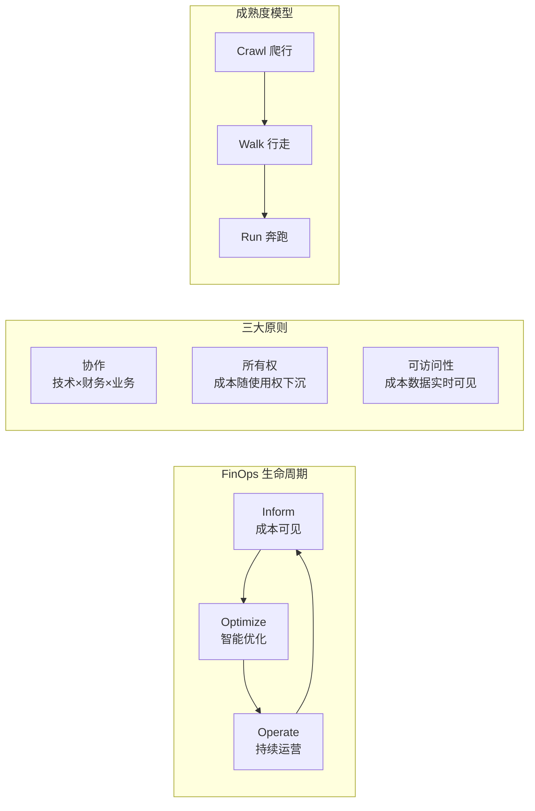
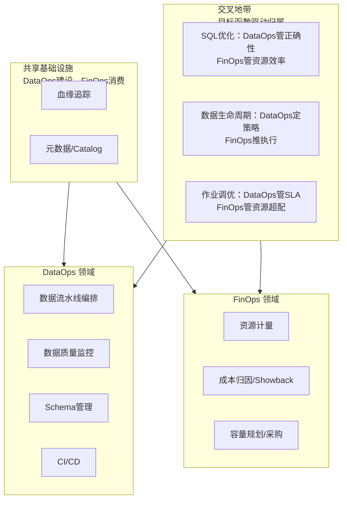
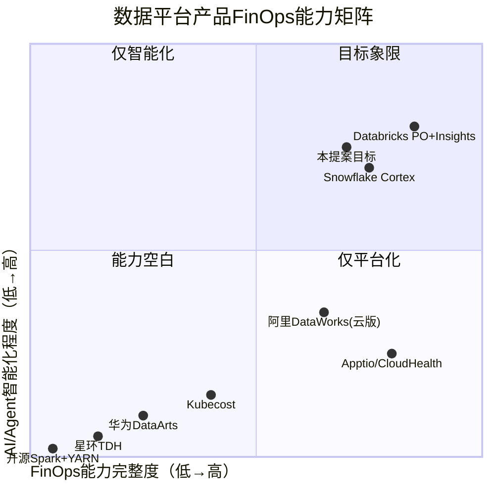
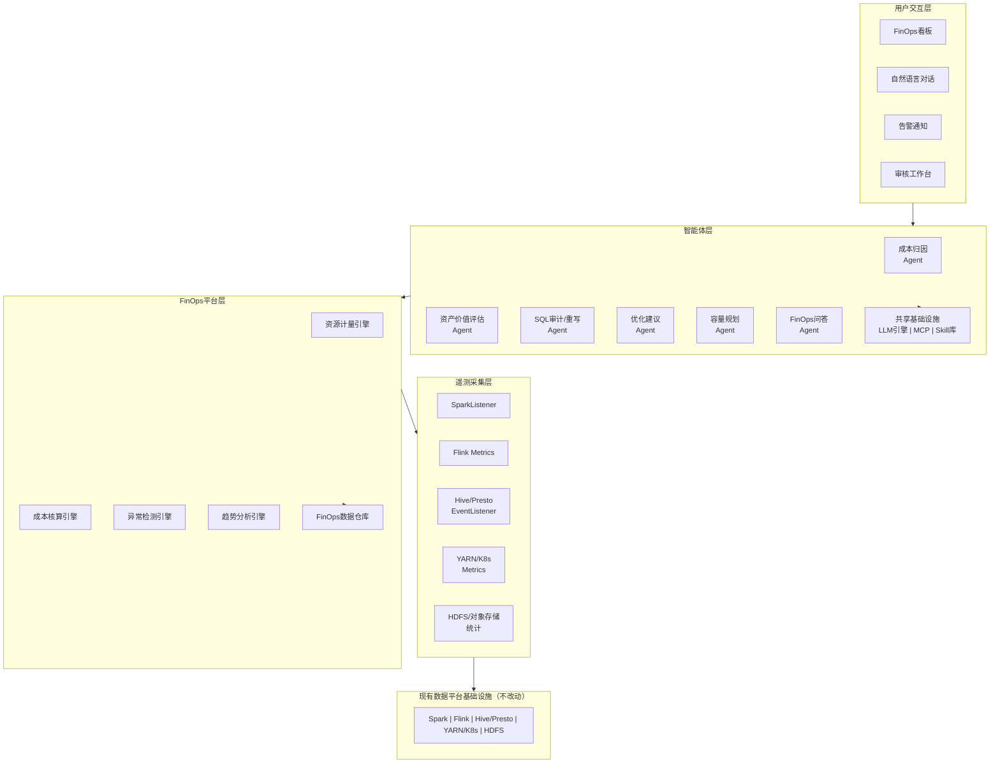
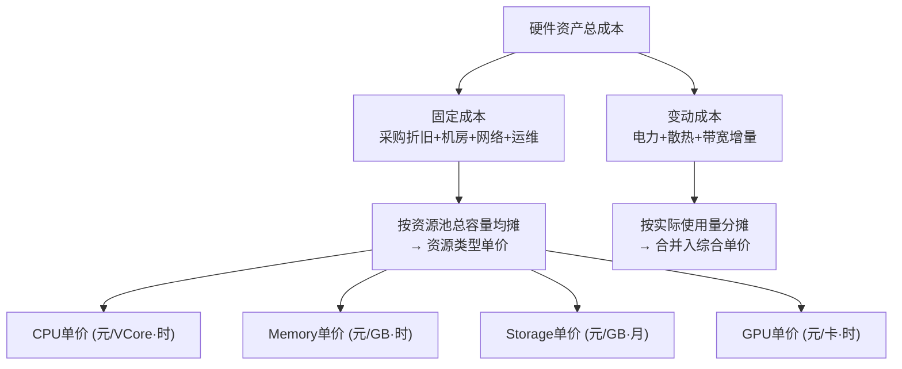
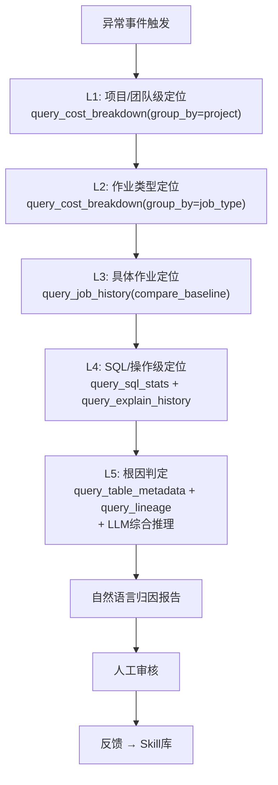
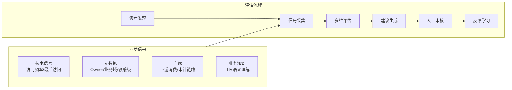
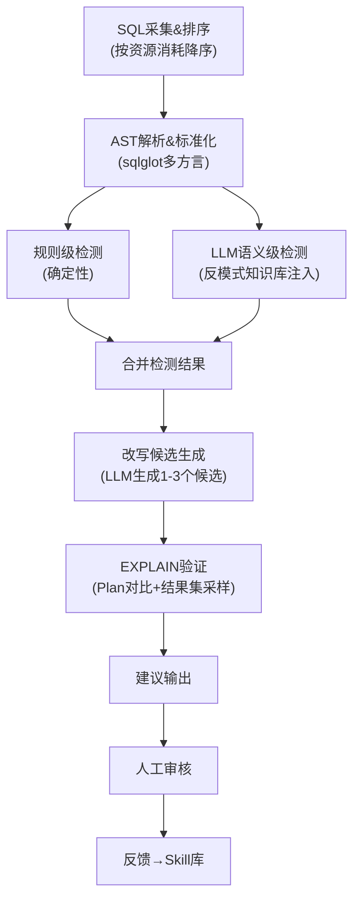
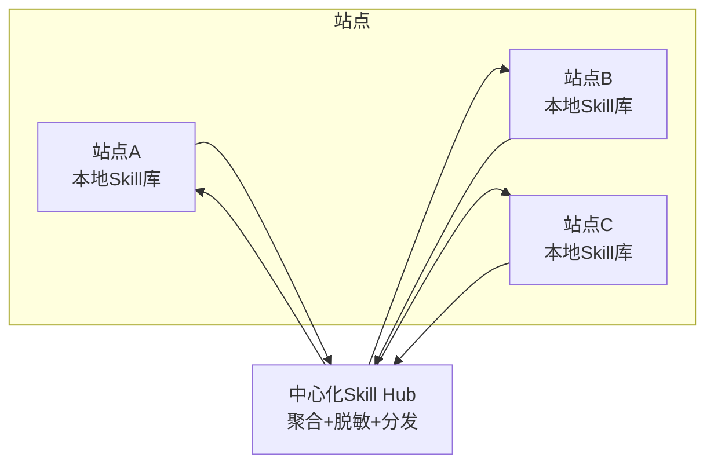
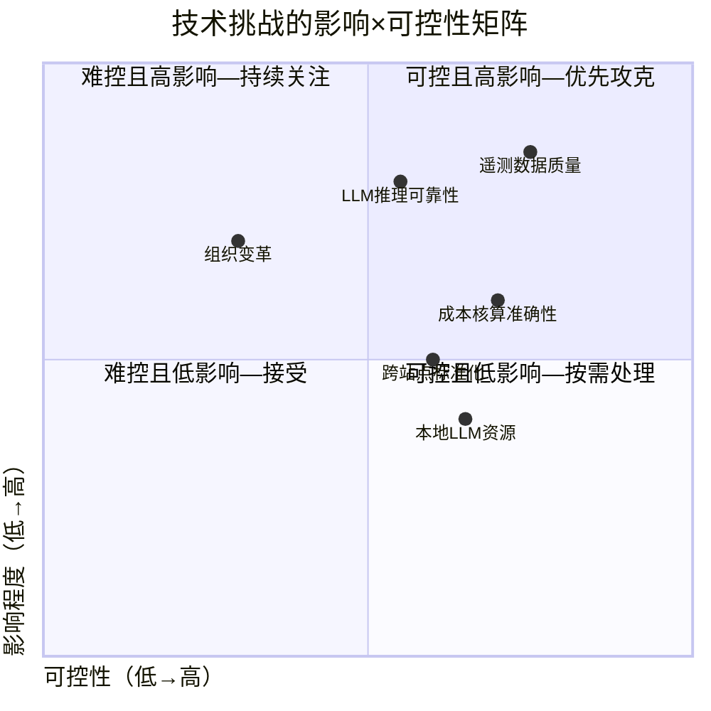

# 数据平台成本智能治理——前瞻技术提案V3.0

> **编号**：TECH-2026-DI-003
> **作者**：向春（架构师）
> **日期**：2026年5月
> **提交对象**：公司技术委员会
> **提案类型**：前瞻技术储备
> **密级**：内部
> **前序文档**：
> - V1.0《AI时代数据成本智能化治理——前瞻技术提案》（2026年5月，全景技术分析）
> - V2.0《数据平台FinOps智能化——成本智能治理技术提案》（2026年5月，产品技术方案）
> **版本说明**：V3.0在V1.0全景分析和V2.0产品方案的基础上，按技术委员会评审标准重构为正式提案，聚焦行业趋势、战略意义、技术原理与工程可行性

---

## 摘要

本提案面向公司数据平台产品（全球100+布点），提出将FinOps框架与Agent智能化技术相结合，构建数据平台内建的成本智能治理能力。提案的核心论点是：在服务器采购成本持续攀升、数据规模指数膨胀、治理人力线性增长的三重压力下，传统基于规则和人工经验的成本治理范式已无法扩展；以FinOps为框架、以LLM Agent为技术载体的智能化方案，已具备1-2年内落地的技术成熟度，且100+布点的产品化规模赋予该方案独特的杠杆效应。

提案按"行业趋势→战略意义→技术现状→技术原理→技术优势→技术挑战"六章结构展开，重点阐述FinOps平台层（资源计量、成本核算、异常检测、趋势分析）与智能体层（成本归因Agent、数据资产价值评估Agent、SQL审计/重写Agent、优化建议Agent、容量规划Agent、FinOps问答Agent）的技术原理、工程实现与商用参考。

---

## 目录

- [第一章 行业趋势](#第一章-行业趋势)
- [第二章 战略意义](#第二章-战略意义)
- [第三章 技术现状](#第三章-技术现状)
- [第四章 技术原理](#第四章-技术原理)
- [第五章 技术优势](#第五章-技术优势)
- [第六章 技术挑战](#第六章-技术挑战)
- [附录 参考文献](#附录-参考文献)

---

## 第一章 行业趋势

### 1.1 数据基础设施成本结构的三重变形

AI时代数据基础设施的成本结构正在被三股力量同时改变。

**变形一：数据规模与构成的双重爆发**

| 数据类型 | 传统阶段 | AI时代 | 成本影响 |
|---------|---------|-------|---------|
| 结构化业务数据 | 主体，线性增长 | 仍为主体，增速不变 | 存储/计算成本基线 |
| 非结构化数据 | "暗数据"，不被消费 | 进入主消费链路 | 存储成本量级提升：一张2MB图片的存储费用等效于约1,000条结构化记录 |
| 向量/Embedding数据 | 不存在 | 模型迭代驱动反复重写 | 全新成本科目：1536维Embedding的存储与索引开销可达原始文本的数倍 |
| 模型/训练中间制品 | 不存在 | Checkpoint、特征文件 | 占据可观存储 |

**变形二：治理"剪刀差"——资产指数增长 vs 治理人力线性增长**

| 时间 | 数据资产规模 | 治理人力 | 单人覆盖 |
|------|-----------|---------|---------|
| 五年前 | T₁ | H₁ | T₁/H₁ |
| 当前 | ~10T₁ | ~1.5H₁ | 恶化至~6.7倍 |
| 未来三年 | ~30T₁（含多模态/向量） | ~2H₁ | 恶化至~10倍 |

人均管理资产以每年20%-30%的速度恶化。依赖人力扩编来覆盖治理需求，在数学上不可持续。

**变形三：本地部署场景的成本刚性**

与公有云"按需付费"不同，本地部署的数据平台面临**成本刚性**：

| 维度 | 公有云 | 本地部署 |
|------|-------|---------|
| 成本结构 | 变动成本为主 | 固定成本为主（采购折旧+机房+运维） |
| 弹性 | 随时扩缩容 | 扩容周期长，缩容几乎不可能 |
| 单价趋势 | 长期下降 | 近两年服务器采购成本上升30%-50%（国产化/信创+芯片供应链） |
| 核心浪费 | 账单超支 | 已采购硬件的利用率不足（静态资源池利用率普遍低于30%-40%） |

### 1.2 FinOps框架的兴起与标准化

FinOps（Financial Operations）由FinOps Foundation（Linux Foundation旗下，2019年成立，截至2025年底8,000+成员企业）标准化定义，是一套将财务责任引入技术决策的运营框架。

Gartner在2024 Hype Cycle for Cloud Management中预测："到2027年，60%的企业将采用FinOps实践"。IBM于2023年以49亿美元收购FinOps领域头部厂商Apptio，印证了该赛道的战略价值。

### 1.3 AI/Agent技术驱动FinOps的范式跃迁

FinOps的演进可划分为三代，每一代的跃迁伴随核心瓶颈的翻转：

| 代际 | 时间段 | 核心特征 | 瓶颈所在 |
|------|-------|---------|---------|
| 第一代 | 2018-2022 | 人工采集→报表→月度会议 | 数据采集与展示能力 |
| 第二代 | 2022-2025 | 自动采集→FinOps平台→实时看板→规则告警 | 从数据到洞察的分析能力 |
| **第三代** | **2025-** | **FinOps平台 + AI异常检测 + LLM归因Agent + 智能优化建议** | **知识积累与组织对齐** |

第三代FinOps的标志性事件：

- **Databricks Predictive Optimization**：2024年6月GA，2400+客户采用，累计自动VACUUM 130PB+、自动COMPACT 14PB+，官方数据显示50%存储成本节省（来源：Databricks官方Blog）
- **Snowflake Cortex AISQL**：2025年6月Private Preview，2025年11月部分函数GA（AI_FILTER/AI_CLASSIFY/AI_AGG），filter/join场景最高60%成本节省（来源：Snowflake Summit 2025公告）
- **CAST AI**：2024年D轮融资$76M，估值超$500M，AI驱动的K8s成本优化

这些信号表明：**FinOps智能化不是前瞻设想，而是正在发生的产业范式转换**。

### 1.4 DataOps与FinOps的边界

数据平台已有DataOps/数据治理体系。FinOps与DataOps是**对偶关系**：

| 框架 | 目标函数 | 约束条件 |
|------|---------|---------|
| DataOps | 最大化数据质量×交付速度×可靠性 | 在给定资源预算内 |
| FinOps | 最小化资源成本（或最大化ROI） | 在满足数据质量/SLA的前提下 |

---

## 第二章 战略意义

### 2.1 100+布点的乘数效应

公司数据平台产品在全球有100+布点。这一规模赋予FinOps产品化一个独特的杠杆结构：

| 优化项 | 单站点年化收益 | 100+站点年化收益 | 杠杆倍数 |
|-------|-------------|---------------|---------|
| 资源利用率提升10% | 等效N台服务器成本 | 100×N台服务器成本 | 100× |
| 冷数据识别与降级 | 节省M TB存储成本 | 100×M TB存储成本 | 100× |
| SQL优化建议 | 节省K VCore·时/天 | 100×K VCore·时/天 | 100× |
| 采购规划准确性提升 | 避免P万过度采购 | 100×P万过度采购 | 100× |

**关键推论**：FinOps能力必须以产品内建方式交付——一次开发、全局部署；一次模型训练、全局受益；一次Skill库积累、全局复用。单站点定制化方案无法实现此杠杆效应。

### 2.2 竞争空白与产品机会

本地部署数据平台的FinOps竞争格局：

| 产品 | FinOps能力现状 | 差距分析 |
|------|-------------|---------|
| 华为DataArts/FusionInsight | 集群资源监控为主，无作业级成本归因，无Showback | 停留在第一代FinOps |
| 星环TDH/Guardian | 资源配额管理和监控，无成本概念 | 未进入FinOps范畴 |
| 阿里DataWorks（本地版） | 云版有成本治理，本地版功能受限 | 受限于MaxCompute依赖 |
| 腾讯WeData | 资源监控为主 | 同DataArts |
| 开源方案 | YARN统计+Spark UI | 完全空白 |

**结论**：在本地部署数据平台产品中，"完整FinOps能力+Agent智能化"构成一个**未被占领的产品差异化维度**。

### 2.3 有效成本模型

借用V1.0建立的有效成本模型：

\[
\text{数据基础设施有效成本} = \text{单位资源单价} \times \text{资源用量} \times (1 - \eta)
\]

其中 \(\eta\) 为智能化优化系数。三个变量的可控性分析：

| 变量 | 可控性 | 分析 |
|------|-------|------|
| 单位资源单价 | 低 | 受供应链/市场决定，企业间无差异化 |
| 资源用量 | 低 | 受业务需求驱动，难以单方面压缩 |
| **智能化优化系数 \(\eta\)** | **高** | 当前企业间方差极大，做得好与做得差的差距已达数量级 |

**战略判断**：成本竞争力的唯一可控变量是 \(\eta\)。谁先建立"AI驱动的成本治理飞轮"，谁就在数据基础设施层确立长期、不可简单复制的成本优势。

---

## 第三章 技术现状

### 3.1 FinOps平台层的技术成熟度

FinOps平台层的四个核心引擎，其底层技术均已达到生产就绪状态：

| 引擎 | 核心技术 | 成熟度评估 | 商用参考 |
|------|---------|----------|---------|
| **资源计量** | SparkListener、Flink Metrics Reporter、YARN Timeline Server v2、K8s cAdvisor | ★★★★★ 完全成熟 | 所有引擎原生提供监听接口，零侵入采集 |
| **成本核算** | 维度建模、增量ETL、作业级成本分摊 | ★★★★☆ 成熟但需适配 | 阿里DataWorks成本治理、Apptio Cloudability |
| **异常检测** | STL分解、Prophet、Isolation Forest | ★★★★★ 完全成熟 | Prophet（Meta开源，GitHub 18K+ Stars）、scikit-learn Isolation Forest |
| **趋势分析** | TFT、DeepAR、蒙特卡洛仿真 | ★★★★☆ 成熟 | Google Borg资源预测（EuroSys 2015）、AWS Compute Optimizer |

### 3.2 智能体层的技术成熟度

| Agent类型 | 核心技术依赖 | 成熟度评估 | 商用参考 |
|---------|-----------|----------|---------|
| **成本归因Agent** | LLM + MCP + ReAct推理 | ★★★★☆ | Databricks AI Insights、CloudHealth异常分析 |
| **数据资产价值评估Agent** | LLM + RAG + 血缘图遍历 | ★★★☆☆ | Atlan AI Agent、Alation Aurora |
| **SQL审计/重写Agent** | LLM + SQL AST解析 + EXPLAIN验证 | ★★★★☆ | Snowflake Cortex AISQL、阿里DAS SQL优化 |
| **优化建议Agent** | 规则引擎 + LLM业务上下文理解 | ★★★★☆ | AWS Compute Optimizer、CAST AI |
| **容量规划Agent** | TFT/DeepAR + 场景仿真 + LLM自然语言输出 | ★★★☆☆ | Google Borg、阿里资源画像 |
| **FinOps问答Agent** | NL2SQL（受限Schema）+ 语义层 + 对话记忆 | ★★★★☆ | Snowflake Cortex、Microsoft Copilot in SQL Server |

### 3.3 关键技术依赖的成熟度

| 技术依赖 | 当前状态 | 可用选项 | 风险评估 |
|---------|---------|---------|---------|
| **本地部署LLM** | 开源模型已达商用水平 | Qwen-72B、DeepSeek-V3、Llama 3.1 70B | 低风险——多个可选模型，且持续快速演进 |
| **LLM推理引擎** | 高度成熟 | vLLM、SGLang、TensorRT-LLM | 低风险——开源社区活跃 |
| **MCP协议** | 2024年底发布，快速采纳中 | Anthropic MCP标准 | 中风险——协议仍在演进，但核心接口已稳定 |
| **SQL AST解析（多方言）** | 成熟 | sqlglot（GitHub 6K+ Stars）、Apache Calcite | 低风险 |
| **时序异常检测** | 完全成熟 | Prophet、STL（statsmodels）、Isolation Forest | 无风险 |
| **血缘图数据库** | 成熟 | Neo4j、JanusGraph、Apache Atlas | 低风险 |

### 3.4 学术研究基础

本提案涉及的核心学术成果：

| 论文 | 作者 | 发表 | 与本提案的关系 |
|------|------|------|-------------|
| Bao: Making Learned Query Optimization Practical | Marcus et al. (MIT) | SIGMOD 2021 | 学习型查询优化器的工程化标杆；证明"增强而非替换CBO"的技术路线可行 |
| Large-scale Cluster Management at Google with Borg | Verma et al. (Google) | EuroSys 2015 | 大规模集群资源预测与调度的奠基性工作 |
| Velox: Meta's Unified Execution Engine | Pedreira et al. (Meta) | VLDB 2022 | 向量化执行引擎的统一架构设计 |
| DeepAR: Probabilistic Forecasting | Salinas et al. | Int'l Journal of Forecasting | 容量预测中概率分布输出的核心方法 |
| Temporal Fusion Transformers | Lim et al. | IJoF 2021 | 多变量时序预测的可解释模型，适用于资源需求预测 |

---

## 第四章 技术原理

本章是提案的核心章节，详细阐述FinOps平台层与智能体层各组件的技术原理。

### 4.1 总体架构

**架构设计原则：**

| 原则 | 技术实现 | 约束条件 |
|------|---------|---------|
| 零侵入 | 通过引擎原生监听接口（SparkListener/Flink Reporter/YARN API）采集，不修改引擎代码 | 采集开销控制在整体资源的1%以内 |
| 全本地 | LLM推理、数据存储、Agent运行全部在客户内网 | 元数据/SQL文本不外传 |
| 松耦合 | Agent通过MCP协议调用平台层API | 新增数据源仅需注册MCP Server |
| 跨站点 | 每站点独立部署平台+Agent，中心化同步Skill库 | 同步内容为脱敏后的结构化经验 |

### 4.2 FinOps平台层：Inform阶段的核心引擎

#### 4.2.1 资源计量引擎

**设计目标**：从异构计算引擎和存储系统中采集资源使用量，按作业/SQL/用户/项目四级维度聚合。

**采集接口矩阵：**

| 数据源 | 采集接口 | 采集指标 | 采集频率 |
|-------|---------|---------|---------|
| Spark | SparkListener自定义Plugin | Application/Job/Stage/Task级：CPU·秒、Peak Memory、Shuffle Read/Write、Input/Output字节数、GC时间 | 作业完成时回调 |
| Flink | Metrics Reporter（Prometheus格式） | Job/Task级：CPU使用率、Memory用量、Back Pressure比例、Records In/Out、Checkpoint大小与耗时 | 10秒间隔 |
| Hive/Presto/Trino | EventListener / Query Log | SQL级：扫描行数/字节数、CPU·秒、Wall时间、分区命中数 | 查询完成时 |
| YARN | REST API / Timeline Server v2 | Application级：Container数、VCore·秒、Memory MB·秒、队列、用户 | 1分钟轮询 |
| K8s | cAdvisor / Metrics Server | Pod级：CPU/Memory/GPU实际使用量、Request/Limit | 15秒间隔 |
| HDFS/对象存储 | NameNode API / fsimage分析 | 目录/表级：存储占用、副本数、文件数、块大小分布 | 每日全量+增量事件 |

**Owner归集策略**：

本地部署场景缺乏公有云的统一租户体系，Owner归集需适配多种情况：

| 场景 | 归集方式 |
|------|---------|
| YARN队列按项目/团队划分 | 按队列映射 |
| 作业携带标签（spark.app.tags） | 从标签解析 |
| 调度系统（Airflow/DolphinScheduler）提交 | 从DAG元数据获取Owner |
| 共享查询引擎（Thrift Server/Presto） | 从SQL提交信息提取用户 |
| 无标签的历史作业 | 基于用户名→团队映射表的启发式推断 |

**核心流程：**

#### 4.2.2 成本核算引擎

**设计目标**：将资源使用量转换为金额。本地部署场景不存在云厂商账单，需自建内部核算体系。

**成本模型：**

**单价计算：**

\[
Price_{CPU} = \frac{C_{CPU\_total}}{N_{VCores} \times H_{month}} \times (1 + r_{mgmt})
\]

其中 \(C_{CPU\_total}\) 为CPU相关总成本（含折旧、机房、网络、运维的CPU占比部分），\(N_{VCores}\) 为集群总VCore数，\(H_{month}\) 为月有效小时数，\(r_{mgmt}\) 为管理费率。

本地部署成本构成的典型占比：

| 成本项 | 典型占比 |
|-------|---------|
| 服务器折旧（3-5年直线法） | 50%-60% |
| 机房（电力+空调+租金） | 20%-25% |
| 网络 | 5%-10% |
| 运维人力 | 10%-15% |
| 软件许可 | 0%-10% |

**作业级成本计算：**

\[
Cost_j = \sum_{r \in \{CPU, Mem, GPU, Storage, IO\}} Usage_{j,r} \times Price_r
\]

**共享资源分摊模型：**

设共享资源池总成本 \(C_{total} = C_{fixed} + C_{var}\)，租户 \(i\) 的使用量为 \(U_i\)，预留配额为 \(R_i\)：

\[
C_i = \frac{R_i}{\sum_j R_j} \cdot C_{fixed} + \frac{U_i}{\sum_j U_j} \cdot C_{var}
\]

此模型同时反映了固定成本的"配额责任"和变动成本的"使用责任"。

#### 4.2.3 异常检测引擎

**设计目标**：对多维度成本/资源时序做持续监控，自动发现异常并触发Agent归因流程。

**检测方法选型：**

| 方法 | 数学原理 | 适用场景 | 优势 |
|------|---------|---------|------|
| **STL分解** | 使用LOESS将时序分解为 \(Y_t = T_t + S_t + R_t\)（趋势+季节+残差），在残差 \(R_t\) 上做 \(k\sigma\) 检测 | 强周期性时序（日/周周期） | 消除正常周期波动的干扰 |
| **Prophet** | 加法模型 \(y(t) = g(t) + s(t) + h(t) + \epsilon_t\)（趋势+季节+假日+噪声），贝叶斯推断 | 多重季节性+假日效应 | 配置简单、可解释性好 |
| **Isolation Forest** | 基于随机森林的异常隔离——异常点在随机树中的平均路径长度更短 | 多维特征联合检测 | 无需假设数据分布；能发现组合异常 |

**检测对象与阈值：**

| 检测对象 | 检测指标 | 告警阈值 |
|---------|---------|---------|
| 项目级日成本 | CPU·时/Memory·GB时/存储量 | STL残差 > 3σ |
| 作业级执行成本 | 单次资源消耗 vs 历史均值 | 偏离 > 200% |
| 队列级利用率 | CPU/Memory分配率和利用率 | 持续 < 20%（闲置）或 > 90%（瓶颈） |
| 存储增长 | 项目级存储日增量 | 7日vs30日增长率斜率差 > 2倍 |
| 集群总利用率 | CPU/Memory/GPU整体利用率 | 周均 < 30%（浪费）或 > 85%（瓶颈） |

#### 4.2.4 趋势分析引擎

**设计目标**：提供历史趋势、利用率分析、容量预测的数据基础。

**预测模型选型依据：**

| 资源维度 | 推荐模型 | 选型依据 |
|---------|--------|---------|
| CPU | TFT（Temporal Fusion Transformer） | 强周期性+多外生变量；TFT的可解释注意力机制允许审查"预测受什么因素驱动" |
| Memory | Prophet + 线性趋势修正 | 内存需求通常近似线性增长，Prophet的趋势+周期分解足够 |
| Storage | Prophet | 存储只增不减的单调特性适合趋势外推 |
| GPU | DeepAR | 波动大且模式不规律，需要概率分布输出而非单点估计 |

预测输出为概率分布 \(p_{10}/p_{50}/p_{90}\)，通过蒙特卡洛仿真（10,000次采样）将多维不确定性联合传播到总成本预测。

### 4.3 智能体层：Optimize与Operate阶段的核心Agent

#### 4.3.1 成本归因Agent

**技术原理**：异常检测引擎触发后，Agent按L1-L5五级策略逐层下钻，通过MCP Tool调用FinOps数据仓库和元数据系统，结合LLM的自然语言推理能力生成归因报告。

**推理范式**：采用ReAct（Reasoning + Acting）框架——Agent在每一级下钻中执行"思考→行动（Tool调用）→观察→思考"循环，每步的Tool调用由前步的观察结果驱动。

**MCP Tool集（8个标准Tool）：**

| Tool | 功能 | 返回数据 |
|------|------|---------|
| `query_cost_breakdown` | 按维度查询成本明细 | 维度分布+占比+环比 |
| `query_job_history` | 查询作业历史执行记录 | 时序+基线对比 |
| `query_sql_stats` | 查询SQL模板执行统计 | 扫描量/CPU/时间 |
| `query_explain_history` | 查询EXPLAIN历史 | Plan变化+基数估计 |
| `query_table_metadata` | 查询表元数据 | 大小/行数/访问频率 |
| `query_lineage` | 查询血缘关系 | 上下游依赖图 |
| `query_cluster_utilization` | 查询集群利用率 | CPU/Mem/GPU时序 |
| `query_storage_analysis` | 查询存储分析 | 小文件/冷数据比例 |

**自治等级**：L2（建议+人工审核）。归因报告供平台运维或项目负责人审核确认。

#### 4.3.2 数据资产价值评估Agent

**技术原理**：综合四类信号（技术信号、元数据、血缘、业务知识），对数据资产做多维价值评估，输出归档/降冷/删除建议。

**功能清单：**

| 功能 | 方法 | 自治等级 |
|------|------|---------|
| 资产活跃度评估 | 加权访问频率+趋势衰减因子（规则计算） | 全自动 |
| 业务价值标注 | LLM推理（表名+列注释+业务术语映射→价值等级+置信度） | Agent建议+人工审核 |
| 下游影响分析 | 血缘图BFS遍历 | 全自动 |
| 合规约束检查 | 数据分类标签×保留策略矩阵 | 全自动 |
| 综合治理建议 | 四维信号综合→决策矩阵→建议+理由+预估节省 | Agent建议+人工审核 |

**决策矩阵：**

| | 活跃度高 | 活跃度低 |
|---|---------|---------|
| **高价值+无合规约束** | 保留，优化格式 | 标记待确认 |
| **高价值+有合规约束** | 保留 | 保留至合规期满 |
| **低价值+无合规约束** | 保留（可能重新活跃） | **归档/降冷候选** |
| **低价值+有合规约束** | 保留至合规期满 | 降冷至最低成本层 |

**自治等级限制**：借用内部《深度调研》的乘法公式，Agent对"表能否删除"的端到端可靠性约48.8%。数据删除为不可逆操作，**必须严格限制在L2（建议+人工审核）**。

**关键技术依赖：**

| 技术 | 作用 |
|------|------|
| MCP协议 | 统一访问Catalog、血缘、查询日志 |
| RAG | 业务术语表向量化检索，注入LLM上下文 |
| 血缘图数据库（Neo4j/JanusGraph） | 毫秒级多跳影响分析 |
| Skill库 | 人工审核反馈的Few-shot注入 |
| 置信度校准 | 基于历史审核数据校准LLM自报置信度 |

#### 4.3.3 SQL审计/重写Agent

**技术原理**：通过规则级+语义级双层检测识别低效SQL，生成等价改写建议并通过EXPLAIN验证。

**双层检测架构：**

**规则级反模式检测（确定性，可autonomous告警）：**

| 反模式 | 检测规则 | 严重度 |
|-------|---------|-------|
| 笛卡尔积 | FROM多表无JOIN条件 | Critical |
| SELECT * | 全量列投影但下游仅用部分列 | Warning |
| 隐式类型转换 | WHERE中列类型与常量类型不匹配 | Warning |
| 冗余DISTINCT | DISTINCT应用于已有唯一约束的列 | Info |
| 不必要ORDER BY | ORDER BY出现在子查询或INSERT...SELECT中 | Warning |

**语义级反模式检测（LLM驱动，输出建议）：**

| 反模式 | LLM识别逻辑 | 改写方向 |
|-------|-----------|---------|
| 自连接可替代为窗口函数 | 识别同表自连接中的行间比较模式 | ROW_NUMBER/LEAD/LAG |
| COUNT(DISTINCT)可预聚合 | 识别外层聚合可分阶段执行 | GROUP BY预聚合+SUM |
| IN子查询可替代为EXISTS | 仅需判断存在性 | EXISTS |
| 多次全表扫描可合并 | 同表多个聚合用不同过滤条件 | CASE WHEN合并 |

**改写验证**：所有LLM生成的改写必须通过EXPLAIN对比验证——Schema一致性+预估行数合理性。可选在影子流量环境中执行结果集采样对比。

**自治等级限制**：等价改写涉及语义等价性判断，错改可能造成数据错误。**改写建议必须保留人工审核（L2）。规则级反模式告警可autonomous。**

#### 4.3.4 优化建议Agent

**技术原理**：综合资源计量、异常检测、资产评估、SQL审计的结果，运用规则引擎+LLM业务上下文理解，生成可执行的优化建议清单。

**八类优化建议：**

| 类型 | 识别方法 | 量化节省估算 |
|------|---------|-----------|
| 闲置资源回收 | 配额利用率持续<20% | (配额-峰值使用)×单价 |
| 作业资源超配 | Executor Memory远超实际峰值 | (分配-建议)×Executor数×单价 |
| 低效SQL优化 | 联动SQL审计Agent | EXPLAIN预估扫描节省×单价 |
| 冷数据降级 | 联动资产评估Agent | 存储量×(热-冷)单价差 |
| 重复数据治理 | 跨项目语义相似宽表检测 | 去重后存储+维护节省 |
| 执行时段优化 | 作业SLA允许低峰执行 | 高峰排队等待成本 |
| 队列资源再平衡 | 队列间利用率不均 | 消除瓶颈的排队成本 |
| Shuffle优化 | Shuffle占比过高 | Shuffle IO节省量 |

**Agent vs 规则驱动的关键差异——业务上下文理解**：

规则驱动的优化建议容易产生假阳性。Agent通过额外的Tool调用理解业务上下文后，可避免错误建议：

| 场景 | 规则判断 | Agent判断 | 差异 |
|------|---------|---------|------|
| 项目CPU 7天<10% | 建议缩容 | 查询调度：月度作业间歇期→不缩容，建议改用弹性池 | 避免月初作业因缩容无资源 |
| 表180天未访问 | 建议降冷 | 查询血缘：被审计报表依赖→不降冷 | 避免合规风险 |

#### 4.3.5 容量规划Agent

**技术原理**：基于趋势分析引擎的预测数据，结合LLM的场景仿真和自然语言生成能力，输出采购建议和ROI论证。

**采购决策优化模型**：

本地部署的采购决策本质是**预测不确定性下的库存决策问题**——平衡"采购不足（影响业务）"和"采购过度（浪费投资）"：

\[
Q^* = \arg\min_Q \left[ C_{purchase} \cdot Q + C_{penalty} \cdot E[\max(D - Q, 0)] \right]
\]

其中 \(D \sim F_{TFT/DeepAR}\)（需求分布来自预测模型），\(C_{penalty}\) 为不足时的业务影响成本。

**跨站点对标**：容量规划Agent可对比100+站点间的利用率和效率，识别最佳实践站点并将经验推广。

#### 4.3.6 FinOps问答Agent

**技术原理**：通过受限Schema上的NL2SQL将自然语言查询转化为FinOps数据仓库的SQL，结合语义层消歧，支持多轮对话。

**技术栈**：NL2SQL（受限于FinOps数据仓库Schema）+ 语义层（统一"成本""利用率""效率"等概念的口径定义）+ 对话记忆。

### 4.4 Agent共享基础设施

| 组件 | 功能 | 技术选型 |
|------|------|---------|
| LLM推理引擎 | 所有Agent的推理服务 | 本地部署Qwen-72B/DeepSeek-V3，vLLM推理 |
| MCP Server | 统一Tool注册和调用 | 自研，注册FinOps平台层查询API |
| Skill库 | 历史案例+优化经验 | 结构化存储，中心化同步到100+站点 |
| 记忆层 | 对话记忆+用户偏好 | 短期（会话内）+长期（用户级） |
| 权限控制 | Agent数据访问受限于用户权限 | 与数据平台权限体系集成 |

**Skill库跨站点同步机制：**

同步内容为脱敏后的结构化经验（如"表名含alarm且180天无访问，建议降冷，通过率85%"），不同步原始数据或SQL文本。

---

## 第五章 技术优势

### 5.1 与公有云FinOps方案的差异化

| 维度 | 公有云方案 | 本提案方案 |
|------|---------|---------|
| 适用场景 | 绑定特定云厂商/引擎 | 异构本地部署栈（Spark+Flink+Hive+Presto+YARN+K8s） |
| 成本模型 | 基于云厂商账单 | 基于硬件利用率的内部核算 |
| 数据安全 | 元数据可能传输到云端 | LLM/数据/Agent全在客户内网 |
| 定制性 | 厂商黑盒 | 开放Skill库，客户可注入行业特定优化经验 |
| 产品形态 | 独立SaaS | 内建到数据平台，无缝集成 |
| 规模效应 | 单租户 | 100+站点共享Skill库 |

### 5.2 与同类本地部署产品的差异化

| 维度 | 竞品现状 | 本提案差异化 |
|------|---------|-----------|
| FinOps能力 | 基础资源监控（华为DataArts/星环TDH级别） | 完整FinOps框架：计量→核算→归因→Showback→优化 |
| 智能化程度 | 规则告警 | 六个LLM驱动Agent |
| 自然语言交互 | 无 | FinOps问答Agent |
| 数据价值评估 | 无 | 四类信号综合评估Agent |
| SQL优化 | 无或规则级 | 规则+LLM语义双层审计 |
| 闭环学习 | 无 | Skill库+反馈循环 |
| 跨站点 | 各站点独立 | 100+站点Skill库共享 |

### 5.3 三层护城河

| 层级 | 内容 | 复制难度 | 建设周期 |
|------|------|--------|---------|
| 第一层 | FinOps产品能力（计量/核算/归因/看板） | 中 | 6-12个月 |
| 第二层 | Agent智能化（六Agent+MCP+本地LLM） | 中偏高 | 12-18个月 |
| **第三层** | **Skill库积累（100+站点的行业知识/归因经验/优化模式）** | **高** | **年为单位，无法跳跃** |

第一、二层是门票，第三层是壁垒。借用内部《深度调研》的判断：**飞轮转过的圈数才是真正的护城河。技术选型可以被复制，但Skill库中积累的行业知识、客户偏好、归因经验需要时间积累，100+布点使飞轮转速达到竞品的100倍。**

---

## 第六章 技术挑战

### 6.1 遥测数据质量——"垃圾进，垃圾出"

| 挑战 | 具体表现 | 缓解措施 |
|------|---------|---------|
| 采集完整性 | 部分作业可能漏采（如短生命周期的Spark Application） | 端到端的完整性校验：采集条目数vs调度系统提交数的对账 |
| 标签规范化 | 历史作业缺乏Owner标签，新作业标签不规范 | 建立标签规范+调度系统模板强制注入+启发式历史补全 |
| 跨引擎口径对齐 | Spark和Flink的"CPU时间"定义不同 | 建立统一资源度量标准文档，在计量引擎中做口径转换 |
| 采集对生产的影响 | 采集组件自身消耗资源 | 异步上报、采样、增量采集，控制在总资源1%以内 |

### 6.2 成本核算的准确性——"近似正确优于精确错误"

| 挑战 | 具体表现 | 缓解措施 |
|------|---------|---------|
| 固定成本分摊的主观性 | 折旧/机房/人力的分摊方式影响单价 | 提供多种分摊策略（按容量/按使用量/混合），允许客户选择 |
| 共享资源的归因争议 | "这笔费用为什么算在我头上" | 分摊逻辑完全可审计；提供异议处理Agent |
| 单价的更新频率 | 硬件更替/人员变动导致单价变化 | 单价按季度更新，支持追溯调整 |

**核心原则**："80%准确+持续校准"远优于"追求100%准确但永远上不了线"。成本核算的目标是**驱动正确的行为方向**，而非会计级精确。

### 6.3 LLM推理的可靠性——"Agent会犯错"

| 挑战 | 量化依据 | 缓解措施 |
|------|---------|---------|
| 归因准确性 | 首次部署预计归因通过率60%-70%，需持续校准 | Skill库反馈闭环；跨站点经验共享加速学习 |
| SQL改写的语义等价性 | LLM可能生成语义不等价的改写 | EXPLAIN验证+结果集采样对比；严格L2人工审核 |
| 数据删除的不可逆性 | Agent端到端可靠性约48.8% | 资产价值评估严格限制在L2；不可逆操作必须人工确认 |
| LLM幻觉 | LLM可能生成看似合理但事实错误的归因 | MCP Tool提供结构化数据作为事实锚点；ReAct范式中每步推理有可验证的观察数据 |

### 6.4 本地部署LLM的资源开销

| 挑战 | 具体表现 | 缓解措施 |
|------|---------|---------|
| GPU资源需求 | 72B模型推理需要2-4张A100/H100 | 评估是否可用32B模型（如Qwen-32B）在精度和资源间取得平衡 |
| 推理延迟 | 归因报告生成可能需要30-60秒 | Agent任务为非实时场景（异常归因、优化建议），对延迟不敏感 |
| 模型更新 | 开源模型快速迭代 | 建立模型评估流水线，定期评估新模型在FinOps领域的表现 |

### 6.5 组织变革——技术之外的挑战

| 挑战 | 具体表现 | 缓解措施 |
|------|---------|---------|
| Showback的组织接受度 | "成本下沉到业务部门"涉及考核机制变化 | 先Showback（展示）后Chargeback（结算），渐进推进 |
| Agent建议的信任建立 | 用户对AI建议天然持怀疑态度 | 建议附带完整推理链和数据依据；初期保守（高置信度才推送） |
| 跨站点标准化 | 100+站点的数据栈配置不完全统一 | 计量引擎支持多引擎版本；标签规范通过产品约束强制执行 |

### 6.6 技术挑战的整体评估

**结论**：遥测数据质量和LLM推理可靠性是影响最大的两项挑战，但均具有较高的可控性——前者通过工程手段（对账、强制标签）解决，后者通过Skill库反馈闭环持续改善。组织变革影响大但可控性低，需要技术与管理并行推进。

---

## 附录 参考文献

### A. 框架与标准

| 编号 | 文献 | 来源 |
|------|------|------|
| [1] | FinOps Framework | FinOps Foundation, https://www.finops.org/framework/ |
| [2] | FinOps Maturity Model | FinOps Foundation, https://www.finops.org/framework/maturity-model/ |
| [3] | State of FinOps Report | FinOps Foundation, https://www.finops.org/insights/state-of-finops/ |

### B. 商用产品

| 编号 | 产品/文献 | 厂商 | 状态 |
|------|---------|------|------|
| [4] | Predictive Optimization GA公告 | Databricks | 2024-06 GA |
| [5] | Predictive Optimization性能与TCO Blog | Databricks | 量化数据来源 |
| [6] | Liquid Clustering GA公告 | Databricks | 2024 GA |
| [7] | Photon GA Blog | Databricks | 2022-08 GA |
| [8] | System Tables文档 | Databricks | 成本数据架构参考 |
| [9] | Cortex AISQL文档 | Snowflake | 2025-11部分GA |
| [10] | Cortex AISQL公告 | Snowflake | Summit 2025 |
| [11] | DataWorks成本治理文档 | 阿里云 | 商用 |
| [12] | DAS自动SQL优化文档 | 阿里云 | 商用 |
| [13] | openGauss AI4DB | 华为 | 商用 |
| [14] | Apptio Cloudability | IBM/Apptio | 商用 |
| [15] | CloudHealth | Broadcom/VMware | 商用 |

### C. 学术论文

| 编号 | 论文 | 作者 | 发表 |
|------|------|------|------|
| [16] | Bao: Making Learned Query Optimization Practical | Marcus et al. (MIT) | SIGMOD 2021 |
| [17] | Large-scale Cluster Management at Google with Borg | Verma et al. | EuroSys 2015 |
| [18] | Velox: Meta's Unified Execution Engine | Pedreira et al. | VLDB 2022 |
| [19] | DeepAR: Probabilistic Forecasting with Autoregressive RNNs | Salinas et al. | Int'l Journal of Forecasting |
| [20] | Temporal Fusion Transformers for Interpretable Multi-horizon Forecasting | Lim et al. | IJoF 2021 |

### D. 开源项目

| 编号 | 项目 | 用途 |
|------|------|------|
| [21] | Apache Spark Monitoring (SparkListener) | 资源计量采集接口 |
| [22] | Prophet (Meta) | 异常检测与趋势预测 |
| [23] | vLLM | 本地LLM推理引擎 |
| [24] | Qwen / DeepSeek-V3 | 本地部署LLM候选 |
| [25] | sqlglot | 多方言SQL解析 |
| [26] | Bao for PostgreSQL (GitHub) | 学习型查询优化器参考实现 |

### E. 内部文档

| 编号 | 文档 | 角色 |
|------|------|------|
| [27] | AI时代数据成本智能化治理——前瞻技术提案V1.0 | 全景技术分析 |
| [28] | 数据平台FinOps智能化——成本智能治理技术提案V2.0 | 产品技术方案 |
| [29] | AI时代的数据智能技术变革——深度调研 | 瓶颈翻转/知识飞轮/L2-L3边界等论证工具 |

---

> **提案编号**：TECH-2026-DI-003
> **版本**：V3.0
> **提交日期**：2026年5月
> **下一步**：请技术委员会评审本提案的技术可行性与优先级定位，并给出POC范围建议
