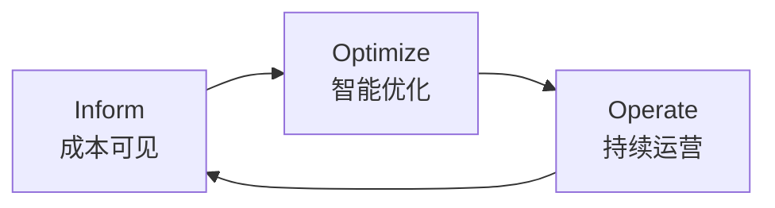
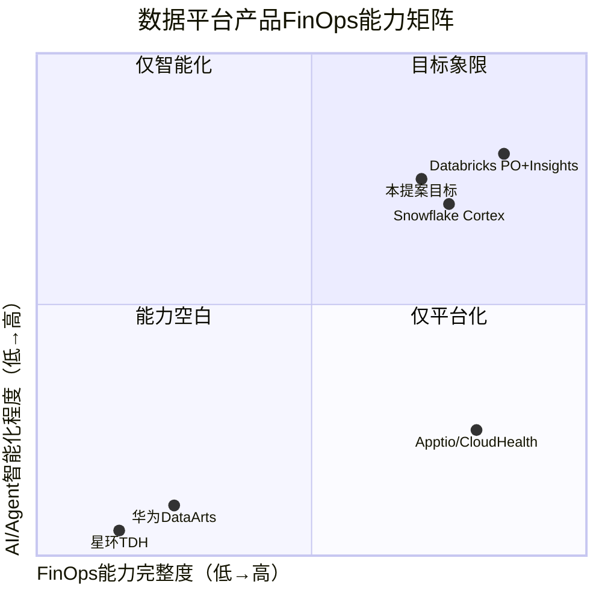
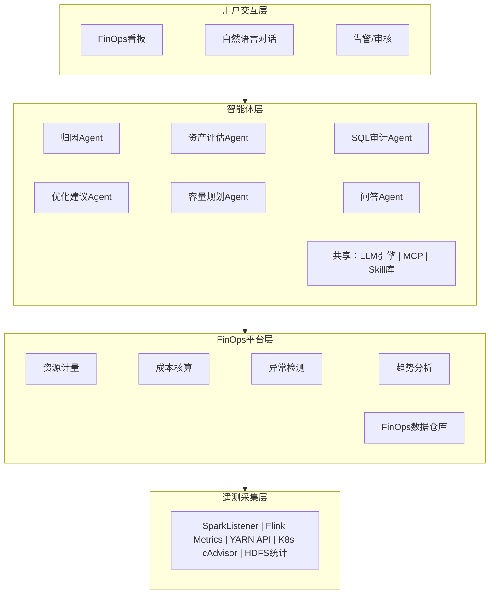
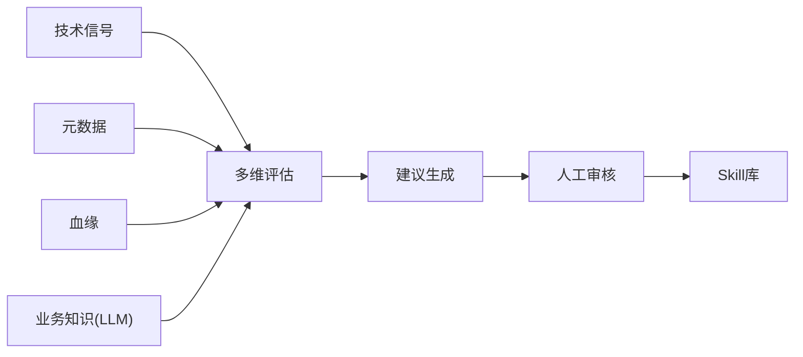
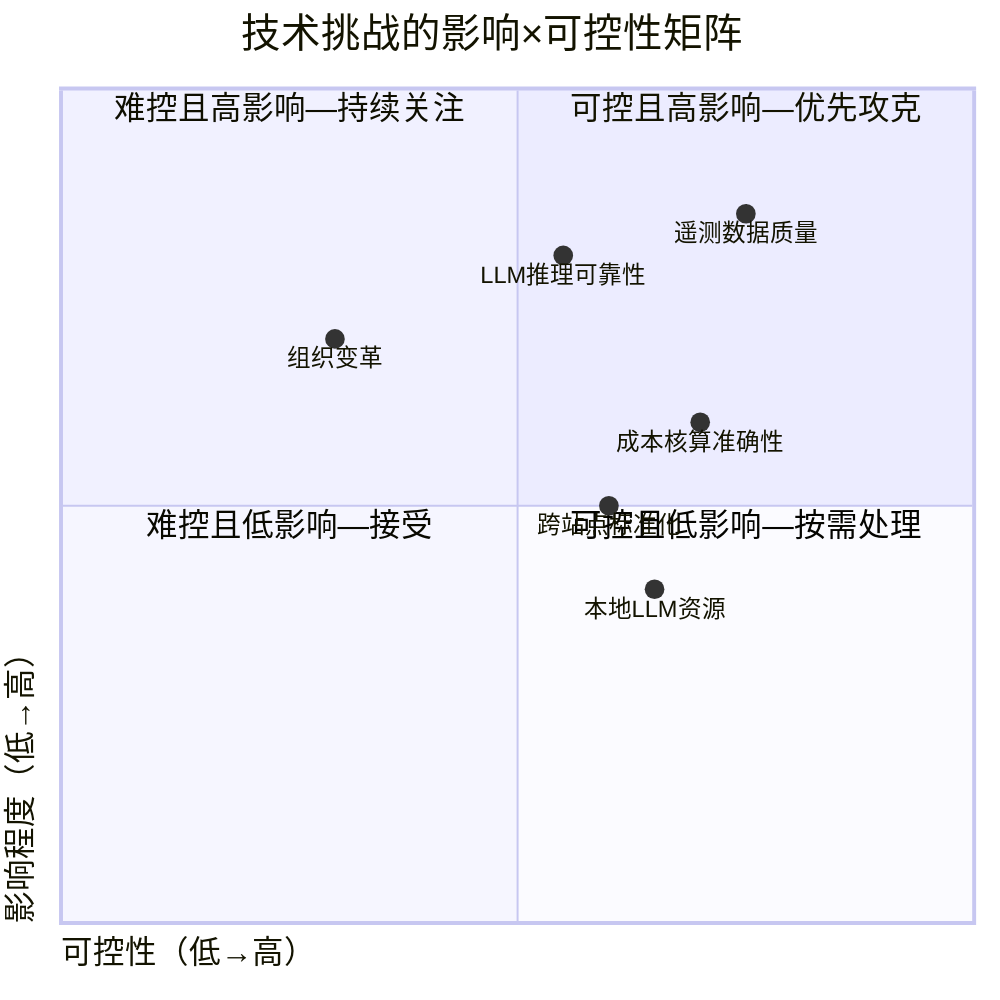

# 数据平台成本智能治理——前瞻技术提案V3.1

> **编号**：TECH-2026-DI-003 &nbsp;|&nbsp; **作者**：向春（架构师） &nbsp;|&nbsp; **日期**：2026年5月
> **提交对象**：公司技术委员会 &nbsp;|&nbsp; **提案类型**：前瞻技术储备

---

## 摘要

本提案面向公司数据平台产品（全球100+布点），论证将FinOps框架与LLM Agent技术相结合、构建数据平台内建的成本智能治理能力的技术可行性与战略价值。核心论点：传统基于规则和人工经验的成本治理范式已无法应对数据规模指数膨胀与服务器采购成本持续攀升的双重压力；以FinOps为框架、以本地部署LLM Agent为技术载体的智能化方案，已具备1-2年内落地的技术成熟度，且100+布点的产品化规模赋予其独特的杠杆效应。

---

## 第一章 行业趋势

**核心观点：数据成本的三重压力与FinOps智能化的产业共振，使"成本智能治理"从可选项变为必选项。**

### 1.1 成本结构的三重变形

AI时代数据基础设施的成本结构正在被三股力量同时改变。

**数据侧**，非结构化数据从"暗数据"转为核心资产（一张2MB图片的存储费用等效于约1,000条结构化记录），向量/Embedding数据构成全新成本科目（1536维Embedding的存储与索引开销可达原始文本的数倍），总存储支出的增速通常是单价下降速度的3-5倍。

**治理侧**，数据资产规模五年内增长约10倍，治理人力仅增长约1.5倍，人均管理资产以每年20%-30%的速度恶化。依赖人力扩编覆盖治理需求，在数学上不可持续。

**成本侧**，本地部署面临特有的成本刚性——固定成本为主（采购折旧+机房+运维），缩容几乎不可能，近两年服务器采购成本上升30%-50%（国产化/信创+芯片供应链），而静态资源池利用率普遍低于30%-40%。公有云FinOps的核心杠杆是"花得更少"（通过选型和弹性控制账单），本地部署FinOps的核心杠杆则是"花得更值"（通过可见性和利用率让已投入资产发挥最大价值）。

### 1.2 FinOps框架的兴起

FinOps由FinOps Foundation（Linux Foundation旗下，2019年成立，截至2025年底8,000+成员企业）标准化定义，其生命周期为Inform（成本可见）→ Optimize（智能优化）→ Operate（持续运营）的持续迭代循环。Gartner在2024 Hype Cycle for Cloud Management中预测"到2027年，60%的企业将采用FinOps实践"。IBM于2023年以49亿美元收购Apptio，印证了该赛道的战略价值。

### 1.3 AI/Agent驱动的范式跃迁

FinOps经历了三代演进：第一代（2018-2022）以人工报表为核心，问题发现滞后4-6周；第二代（2022-2025）以FinOps平台为核心，实现了数据的自动采集和实时展示，但从数据到洞察的"最后一公里"仍依赖人工分析；第三代（2025-）以AI/Agent为核心，将异常发现、归因分析、优化建议、效果跟踪全链路智能化。

第三代的标志性事件包括：Databricks Predictive Optimization于2024年6月GA，2400+客户采用，累计自动VACUUM 130PB+、自动COMPACT 14PB+，官方数据显示50%存储成本节省（来源：Databricks官方Blog[4][5]）；Snowflake Cortex AISQL于2025年部分函数GA，filter/join场景最高60%成本节省（来源：Snowflake Summit 2025公告[10]）；CAST AI于2024年完成D轮融资$76M，估值超$500M。这些信号表明FinOps智能化已从前瞻设想进入产业规模化商用阶段。

---

## 第二章 战略意义

**核心观点：100+布点的产品化规模赋予FinOps智能化独特的"一次开发、百倍收益"杠杆，且本地部署市场存在清晰的竞争空白。**

### 2.1 100+布点的乘数效应

公司数据平台产品在全球有100+布点。在该规模下，任何一项成本优化能力一旦产品化，将自动在所有站点生效——单站点利用率提升10%意味着100+站点的等效收益被同步放大。这一杠杆结构决定了FinOps能力必须以**产品内建**方式交付，而非单站点定制。一次模型训练全局受益，一次Skill库积累全局复用——这是定制化方案无法实现的规模效应。

### 2.2 竞争空白

在本地部署数据平台产品中，华为DataArts/FusionInsight、星环TDH、腾讯WeData均停留在基础资源监控阶段（第一代FinOps），阿里DataWorks本地版功能受限于MaxCompute依赖，开源方案（Spark+YARN）则完全空白。"完整FinOps能力+Agent智能化"构成一个**未被占领的产品差异化维度**。

### 2.3 有效成本模型

数据基础设施的有效成本可表达为 \(\text{单位单价} \times \text{资源用量} \times (1 - \eta)\)，其中 \(\eta\) 为智能化优化系数。单价受市场决定、用量受业务驱动，两者可控性均低；唯一高可控性变量是 \(\eta\)——当前企业间方差极大。谁先建立"AI驱动的成本治理飞轮"，谁就确立长期、不可简单复制的成本竞争力。

---

## 第三章 技术现状

**核心观点：FinOps平台层所需的全部底层技术已达生产就绪；智能体层的核心依赖（本地LLM、MCP协议、SQL解析、时序检测）均有成熟开源方案，整体技术风险可控。**

### 3.1 平台层成熟度

FinOps平台层包含四个引擎——资源计量、成本核算、异常检测、趋势分析。资源计量依赖的SparkListener、Flink Metrics Reporter、YARN Timeline Server v2、K8s cAdvisor均为引擎原生接口，零侵入采集，技术完全成熟。成本核算依赖维度建模和增量ETL，有阿里DataWorks成本治理[11]和Apptio Cloudability[14]作为商用参考。异常检测依赖STL分解、Prophet（Meta开源，GitHub 18K+ Stars）和Isolation Forest，技术完全成熟。趋势分析依赖TFT和DeepAR，有Google Borg资源预测（EuroSys 2015[17]）和AWS Compute Optimizer作为商用参考。

### 3.2 智能体层成熟度

六个Agent的核心技术依赖均已具备可用方案：本地部署LLM有Qwen-72B、DeepSeek-V3、Llama 3.1 70B等多个选项（低风险）；LLM推理引擎有vLLM、SGLang（低风险）；MCP协议由Anthropic于2024年底发布，核心接口已稳定（中风险）；SQL多方言解析有sqlglot（GitHub 6K+ Stars）和Apache Calcite（低风险）；血缘图数据库有Neo4j和JanusGraph（低风险）。

### 3.3 学术基础

提案涉及的核心学术成果包括：Bao（Marcus et al., SIGMOD 2021[16]）证明了"增强而非替换CBO"的学习型查询优化技术路线在工程上可行；Google Borg论文（Verma et al., EuroSys 2015[17]）奠定了大规模集群资源预测与调度的方法论；DeepAR（Salinas et al.[19]）和TFT（Lim et al., IJoF 2021[20]）提供了容量预测中概率分布输出和多变量可解释预测的核心方法。

---

## 第四章 技术原理

**核心观点：采用"遥测采集→FinOps平台→智能体→用户交互"四层架构，平台层提供确定性计算（计量/核算/检测/预测），智能体层提供LLM驱动的归因/评估/审计/优化/规划/问答能力，全部本地部署、零侵入现有系统。**

### 4.1 总体架构

架构遵循四项原则：**零侵入**（通过引擎原生监听接口采集，不修改引擎代码，采集开销<1%）；**全本地**（LLM推理、数据存储、Agent运行全部在客户内网，元数据/SQL文本不外传）；**松耦合**（Agent通过MCP协议调用平台层API，新增数据源仅需注册MCP Server）；**跨站点**（每站点独立部署，中心化同步脱敏后的Skill库）。

### 4.2 Inform阶段：平台层核心引擎

**资源计量引擎**通过SparkListener自定义Plugin、Flink Metrics Reporter、YARN REST API/Timeline Server v2、K8s cAdvisor/Metrics Server、HDFS NameNode API五类采集接口，覆盖Spark/Flink/Hive/Presto/YARN/K8s/HDFS全栈，采集粒度达到作业/SQL/用户/项目四级。本地部署场景缺乏公有云的统一租户体系，Owner归集需适配多种情况（YARN队列映射、作业标签解析、调度系统DAG元数据、共享引擎SQL提交信息提取等）。

**成本核算引擎**自建内部核算体系：将硬件资产总成本拆分为固定成本（采购折旧50-60%、机房20-25%、网络5-10%、运维10-15%）和变动成本，按资源池总容量均摊得到CPU/Memory/Storage/GPU各资源类型的单价，再按 \(Cost_j = \sum_r Usage_{j,r} \times Price_r\) 计算作业级成本。共享资源分摊模型同时反映固定成本的"配额责任"和变动成本的"使用责任"。

**异常检测引擎**采用STL分解（将时序分解为趋势+季节+残差，在残差上做 \(k\sigma\) 检测，消除正常周期波动干扰）、Prophet（多重季节性+假日效应）、Isolation Forest（多维联合异常检测）三种方法。检测对象覆盖项目日成本、作业执行成本、队列利用率、存储增长和集群总利用率。

**趋势分析引擎**对不同资源维度选择最适合的预测模型——CPU使用TFT（强周期性+可解释注意力）、Memory使用Prophet（近似线性增长）、GPU使用DeepAR（波动大，需概率分布输出）——预测结果以 \(p_{10}/p_{50}/p_{90}\) 概率分布输出，通过蒙特卡洛仿真传播多维不确定性。

### 4.3 Optimize阶段：智能体核心能力

**成本归因Agent**在异常检测触发后，按L1（项目/团队）→L2（作业类型）→L3（具体作业）→L4（SQL/操作）→L5（根因判定）五级策略逐层下钻，通过8个MCP Tool（`query_cost_breakdown`、`query_job_history`、`query_sql_stats`、`query_explain_history`、`query_table_metadata`、`query_lineage`、`query_cluster_utilization`、`query_storage_analysis`）调用FinOps数据仓库和元数据系统，采用ReAct推理范式生成自然语言归因报告。历史归因案例通过Skill库跨100+站点共享，加速后续归因。

**数据资产价值评估Agent**综合四类信号——技术信号（访问频率/趋势）、元数据（Owner/业务域）、血缘（下游消费/审计链路）、业务知识（LLM语义理解）——执行"资产发现→信号采集→多维评估→建议生成→人工审核→反馈学习"流程。前三类信号可由规则处理，第四类业务知识必须靠LLM理解，这是Agent化方法区别于规则方法的本质所在。借用内部《深度调研》的乘法公式[29]，Agent对"表能否删除"的端到端可靠性约48.8%，数据删除为不可逆操作，必须严格限制在L2（建议+人工审核）。

**SQL审计/重写Agent**采用规则级+语义级双层检测架构。规则级检测（笛卡尔积/SELECT */隐式类型转换/冗余DISTINCT/不必要ORDER BY）为确定性分析，可autonomous告警。语义级检测由LLM驱动，识别规则无法覆盖的反模式——如自连接可替代为窗口函数、COUNT(DISTINCT)可预聚合、IN子查询可替代为EXISTS、多次全表扫描可用CASE WHEN合并。所有LLM生成的改写必须通过EXPLAIN对比验证（Schema一致性+预估行数合理性），等价改写严格保留人工审核。

**优化建议Agent**综合资源计量、异常检测、资产评估、SQL审计的结果，覆盖八类优化场景：闲置资源回收、作业资源超配、低效SQL、冷数据降级、重复数据治理、执行时段优化、队列资源再平衡、Shuffle优化。该Agent区别于规则驱动的关键能力是**业务上下文理解**——例如规则判定"项目CPU连续7天<10%应缩容"，Agent通过查询调度元数据发现这是月度作业间歇期而非闲置，转而建议改用弹性资源池。

### 4.4 Operate阶段：持续运营闭环

**容量规划Agent**基于趋势分析引擎的预测数据，支持场景仿真（输入假设条件计算容量影响）和采购决策优化。本地部署的采购决策本质是预测不确定性下的库存决策——平衡采购不足（影响业务）与采购过度（浪费投资），可建模为 \(Q^* = \arg\min_Q [C_{purchase} \cdot Q + C_{penalty} \cdot E[\max(D-Q,0)]]\)，其中 \(D\) 的分布来自TFT/DeepAR预测。该Agent还可对比100+站点间的利用率差异，识别最佳实践站点并推广经验。

**Skill库与跨站点同步**是Operate阶段的核心资产。Skill库存储归因案例、SQL优化模式、资产评估校准数据和优化效果反馈，通过中心化Skill Hub聚合脱敏后同步到全部站点——A站点的归因经验直接推荐给B站点的相似异常。同步内容为脱敏后的结构化经验（如"表名含alarm且180天无访问，建议降冷，通过率85%"），不同步原始数据。

**FinOps问答Agent**通过受限Schema上的NL2SQL将自然语言查询转化为FinOps数据仓库的SQL，结合语义层统一"成本""利用率""效率"等概念的口径定义，支持多轮对话。

六个Agent共享统一基础设施：本地部署LLM推理引擎（Qwen-72B/DeepSeek-V3 + vLLM）、MCP Server（统一Tool注册和调用）、Skill库（跨站点同步）、记忆层和权限控制。

---

## 第五章 技术优势

**核心观点：本方案在适用场景（异构本地栈）、数据安全（全本地）、定制性（开放Skill库）、规模效应（100+站点共享）四个维度形成差异化，且Skill库积累构成时间壁垒。**

与公有云FinOps方案相比，本方案支持异构本地部署栈（Spark+Flink+Hive+Presto+YARN+K8s），不绑定特定引擎；基于硬件利用率而非云账单构建成本模型，更贴合本地部署场景；LLM/数据/Agent全在客户内网，满足数据安全要求；开放Skill库支持客户注入行业特定优化经验，非厂商黑盒；100+站点共享Skill库形成跨站点知识复制能力。

与同类本地部署产品相比，现有竞品（华为DataArts、星环TDH等）停留在基础资源监控阶段，而本方案提供完整FinOps框架（计量→核算→归因→Showback→优化）、六个LLM驱动Agent、自然语言问答、四类信号数据价值评估、规则+LLM语义双层SQL审计、Skill库反馈闭环和跨站点知识共享。

护城河分三层：第一层FinOps产品能力（中复制难度，6-12个月），第二层Agent智能化（中偏高，12-18个月），第三层Skill库积累——100+站点的行业知识、归因经验、优化模式需要以年为单位积累，无法跳跃，且100+布点使飞轮转速达到竞品的100倍。**第一、二层是门票，第三层是壁垒。**

---

## 第六章 技术挑战

**核心观点：主要挑战集中在遥测数据质量和LLM推理可靠性两项，均具有较高可控性；组织变革影响大但可控性低，需技术与管理并行推进。**

**遥测数据质量**是最高优先级挑战。短生命周期作业可能漏采，历史作业缺乏Owner标签，跨引擎的资源度量口径不一致。缓解措施包括端到端完整性对账（采集条目数vs调度系统提交数）、标签规范强制注入和统一度量口径转换。核心原则是"没有高质量的遥测数据，Agent智能化就是空中楼阁"——这决定了阶段一（Inform）必须在Agent建设之前完成。

**LLM推理可靠性**是第二高优先级挑战。归因报告首次部署预计通过率60%-70%，SQL改写可能生成语义不等价的结果，资产删除决策的端到端可靠性约48.8%。缓解措施包括Skill库反馈闭环持续校准、EXPLAIN验证+结果集采样、不可逆操作严格L2人工审核，以及MCP Tool提供结构化数据作为事实锚点以对抗LLM幻觉。

**成本核算准确性**需遵循"近似正确优于精确错误"原则——80%准确+持续校准远优于追求100%准确但永远上不了线。核算的目标是驱动正确的行为方向，而非会计级精确。

**本地部署LLM的资源开销**需在模型精度和GPU资源间取得平衡（72B模型需2-4张A100/H100，可评估32B模型替代），但Agent任务为非实时场景（异常归因、优化建议），对推理延迟不敏感。

**组织变革**是技术之外的核心挑战。Showback将成本下沉到业务部门涉及考核机制变化，应先展示（Showback）后结算（Chargeback），渐进推进。Agent建议的信任建立需要完整推理链和数据依据支撑，初期应保守运营（仅推送高置信度建议）。

---

## 附录 参考文献

**框架与标准**：[1] FinOps Framework, FinOps Foundation. [2] FinOps Maturity Model. [3] State of FinOps Report.

**商用产品**：[4] Databricks Predictive Optimization GA公告（2024-06）. [5] Databricks PO性能与TCO Blog. [6] Liquid Clustering GA公告（2024）. [7] Photon GA Blog（2022-08）. [8] System Tables文档. [9] Snowflake Cortex AISQL文档（2025-11部分GA）. [10] Cortex AISQL公告（Summit 2025）. [11] 阿里DataWorks成本治理. [12] 阿里DAS自动SQL优化. [13] 华为openGauss AI4DB. [14] Apptio Cloudability. [15] CloudHealth.

**学术论文**：[16] Marcus et al., "Bao: Making Learned Query Optimization Practical," SIGMOD 2021. [17] Verma et al., "Large-scale Cluster Management at Google with Borg," EuroSys 2015. [18] Pedreira et al., "Velox: Meta's Unified Execution Engine," VLDB 2022. [19] Salinas et al., "DeepAR: Probabilistic Forecasting," Int'l Journal of Forecasting. [20] Lim et al., "Temporal Fusion Transformers," IJoF 2021.

**开源项目**：[21] SparkListener. [22] Prophet. [23] vLLM. [24] Qwen/DeepSeek-V3. [25] sqlglot. [26] Bao for PostgreSQL.

**内部文档**：[27] 前瞻技术提案V1.0. [28] 成本智能治理技术提案V2.0. [29] 深度调研（瓶颈翻转/知识飞轮/L2-L3边界）.

---

> **提案编号**：TECH-2026-DI-003 &nbsp;|&nbsp; **版本**：V3.1 &nbsp;|&nbsp; **提交日期**：2026年5月
> **下一步**：请技术委员会评审本提案的技术可行性与优先级定位，并给出POC范围建议
