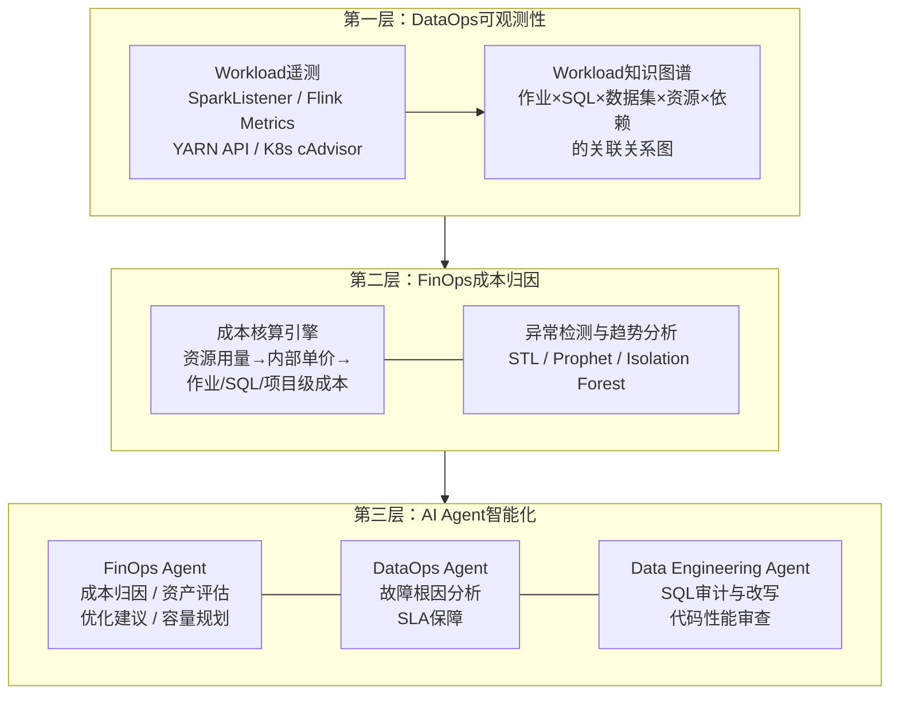
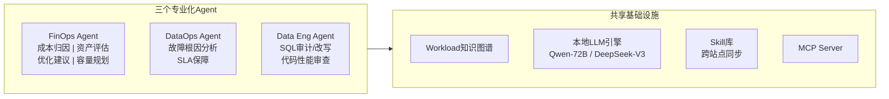
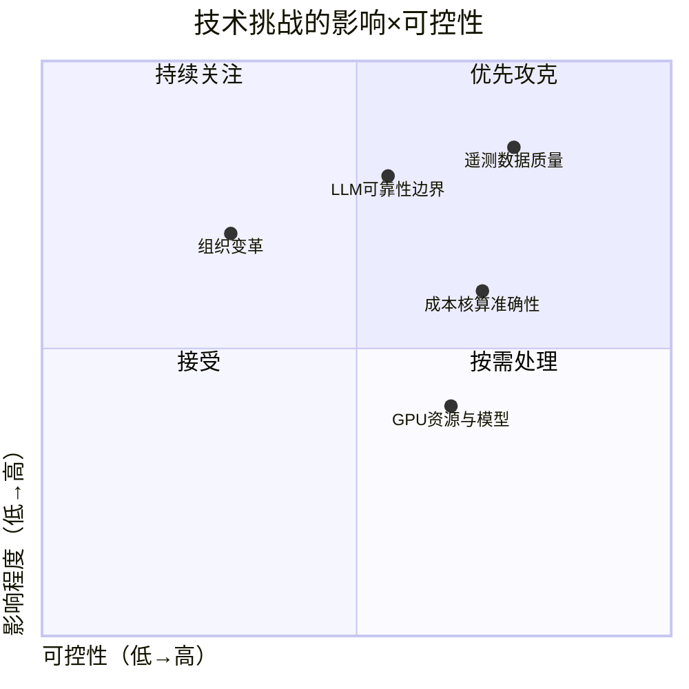

# 数据平台成本智能治理——前瞻技术提案V3.1

> **编号**：TECH-2026-DI-003 &nbsp;|&nbsp; **作者**：向春（架构师） &nbsp;|&nbsp; **日期**：2026年5月
> **提交对象**：公司技术委员会 &nbsp;|&nbsp; **提案类型**：前瞻技术储备

---

## 摘要

本提案论证在公司数据平台产品中内建DataFinOps能力并通过AI Agent体系实现智能化的技术可行性。DataFinOps是DataOps与FinOps的融合范式——以DataOps的workload可观测性为数据基础，以FinOps的成本归因与优化为业务目标，以AI Agent为执行引擎，形成"观测→归因→优化→治理"的自动化闭环。提案按行业趋势、战略意义、技术现状、技术原理、技术优势、技术挑战六章展开。

---

## 第一章 行业趋势

### 1.1 数据平台成本已成为企业最大且增速最快的IT支出项

根据IDC的统计，数据管理相关支出已占典型企业云账单的约39%，是最大且增速最快的工作负载类别。2026年FinOps Foundation发布的State of FinOps Report进一步确认：数据云平台（Databricks、Snowflake、BigQuery等）已取代通用计算，成为企业最积极管理的成本科目。Forrester的调研显示，80%的数据管理从业者表示难以准确预测数据相关的云成本。这一趋势在本地部署场景同样显著——近两年受芯片供应链与国产化要求叠加影响，同等算力的服务器采购成本上升30%-50%，而数据规模以年均25%-40%的速率持续膨胀。

成本压力的根源不仅是"数据变多了"，更在于数据基础设施的利用效率长期低下。Flexera年度报告估算，企业平均每年浪费约32%的云支出。在本地部署场景中，由于硬件一旦采购即为沉没成本且无法弹性缩容，静态资源池的利用率普遍低于30%-40%，浪费更为隐蔽且难以量化。

### 1.2 DataOps与FinOps从独立走向融合

DataOps和FinOps各自解决数据平台治理的一个侧面——DataOps关注数据流水线的可靠性与效率（"数据跑得顺不顺"），FinOps关注资源消耗的经济性（"钱花得值不值"）。两者长期独立发展，但近两年出现了清晰的融合趋势。

Unravel Data是这一融合趋势的代表性厂商。该公司起源于2015年杜克大学的研究项目，最初聚焦Hadoop MapReduce作业的配置优化，随后演进为覆盖Databricks、Snowflake、BigQuery、Cloudera的全栈数据平台优化平台。其产品定位从纯DataOps可观测性逐步扩展为"DataFinOps"——将DataOps的workload级可观测数据作为FinOps成本归因的数据基础，实现从"看到资源消耗"到"理解成本去向"的贯通。

这一融合的技术驱动力在于：FinOps要做到作业级、SQL级的精细成本归因，必须依赖DataOps层面的workload遥测数据——包括查询执行计划、Shuffle统计、数据扫描量、DAG依赖关系等。没有workload级的可观测性，FinOps只能停留在"集群级"或"队列级"的粗粒度归因，无法回答"这笔成本是哪条SQL、哪个作业、哪行代码造成的"。

### 1.3 AI Agent正在重塑数据平台优化的范式

传统数据平台优化依赖"观测工具发现问题→专家人工分析→专家手动修复"的链条。AI Agent技术正在将这一链条中的人工环节自动化。

Unravel于2025年推出的Arvix AI引擎代表了这一方向的产品化形态。Arvix的核心差异点不是通用LLM的"从零推理"，而是基于已分析的10亿+工作负载、100+企业环境构建的领域知识图谱——其六步优化循环为：采集信号→映射依赖→匹配知识库→验证方案→执行或人工审批→持续重评估。生产环境数据显示平均首年ROI为5.95倍、平均成本节省47%、查询速度提升3倍、典型回收期不到6个月（来源：Unravel官方产品页）。

Unravel将Agent体系分为三个专业化角色：**FinOps Agent**负责成本优化与预算管控（通过智能资源调整、代码修复和策略护栏实现约70%的浪费缩减）；**DataOps Agent**负责运维故障排除与根因分析；**Data Engineering Agent**负责代码上线前的性能审查。三个Agent共享同一知识图谱，但各自聚焦不同的优化目标。

这一趋势的关键判断是：数据平台优化正在从"工具+专家"模式转向"知识图谱+Agent"模式。Agent的价值不仅在于自动化执行，更在于将跨客户、跨工作负载的优化经验编码为可复用的知识资产。

---

## 第二章 战略意义

### 2.1 产品差异化：本地部署数据平台的DataFinOps空白

当前本地部署数据平台产品的成本治理能力普遍薄弱。华为DataArts/FusionInsight提供集群级资源监控但缺乏作业级成本归因与Showback；星环TDH的Guardian提供资源配额管理但无成本概念；阿里DataWorks云版具备成本治理模块但本地版功能受限于MaxCompute依赖；开源方案（Spark+YARN）在成本治理方面完全空白。

与此同时，上述厂商均未将DataOps可观测性与FinOps成本归因进行融合，更未引入AI Agent进行智能化优化。Unravel等厂商的DataFinOps能力目前仅服务于公有云数据平台（Databricks/Snowflake/BigQuery），尚未覆盖本地部署的异构数据栈。

这意味着：**在本地部署数据平台产品中，"DataOps+FinOps融合+AI Agent智能化"构成一个尚未被占领的差异化维度。**

### 2.2 规模杠杆：100+布点的乘数效应

公司数据平台产品在全球有100+布点。这一规模赋予DataFinOps产品化独特的杠杆结构——任何一项优化能力一旦在产品中实现，将自动在100+站点生效。更重要的是，Agent的知识积累具备跨站点复制特性：A站点发现的优化模式可自动推荐给B站点的同类问题。单站点定制化方案无法实现此规模效应。

### 2.3 成本竞争力的唯一可控变量

数据基础设施的有效成本可表达为单位资源单价×资源用量×(1-η)，其中η为智能化优化系数。单价受市场决定、用量受业务驱动，均属低可控变量。**η是唯一的高可控变量**，且当前企业间方差极大。谁先建立持续运转的优化飞轮，谁就在η上形成不可简单复制的长期优势。

---

## 第三章 技术现状

### 3.1 行业标杆产品的技术路线分析

**Unravel Data / Arvix AI**。核心技术路线为"知识图谱+专业化Agent"。知识图谱整合云支出、资源利用率、工作负载特征、配置设置等跨平台元数据，追踪超过200个workload级信号进行关联分析。Arvix引擎已分析10亿+工作负载，积累了500+故障模式。Agent体系分为FinOps/DataOps/Data Engineering三个角色，支持AutoApply（全自动执行）和Human-in-Loop（人工审批）两种控制模式。生产客户包括Novartis、Mastercard、Citi、Equifax等Fortune 500企业。

**Databricks**。通过System Tables提供细粒度成本遥测，通过Predictive Optimization（2024年6月GA，2400+客户，累计VACUUM 130PB+）实现自治化存储优化，通过AI Insights提供异常分析。优势是与Unity Catalog深度集成，局限是绑定Databricks生态。

**Snowflake**。通过Cortex AISQL（2025年部分GA）将LLM能力嵌入SQL引擎，filter/join场景最高60%成本节省。优势是语义级查询优化，局限是仅限Snowflake引擎。

### 3.2 关键技术依赖的成熟度判断

本提案所需的核心技术依赖均已具备成熟的可用方案。**workload遥测**层面，SparkListener、Flink Metrics Reporter、YARN Timeline Server v2、K8s cAdvisor均为引擎原生接口，零侵入采集，技术完全成熟。**时序分析**层面，STL分解、Prophet（Meta开源，GitHub 18K+ Stars）、Isolation Forest均为经过大规模验证的成熟算法。**LLM推理**层面，Qwen-72B、DeepSeek-V3、Llama 3.1 70B等开源模型已达商用水平，vLLM/SGLang等推理框架可支撑本地部署。**SQL解析**层面，sqlglot（GitHub 6K+ Stars）和Apache Calcite支持多方言解析。**Agent协议**层面，MCP（Model Context Protocol）由Anthropic于2024年底发布，核心接口已稳定。

学术基础方面，MIT的Bao（SIGMOD 2021）证明了"增强而非替换CBO"的学习型查询优化路线在工程上可行；Google Borg（EuroSys 2015）奠定了大规模集群资源预测方法论；TFT（Lim et al., IJoF 2021）提供了多变量可解释时序预测的核心方法。

---

## 第四章 技术原理

### 4.1 核心理念：从DataOps可观测性到DataFinOps可行动性

借鉴Unravel的产品思路，本方案的技术路线是**先建DataOps层面的workload知识图谱，再叠加FinOps层面的成本归因与优化，最后通过Agent体系实现智能化闭环**。三个层次的关系是递进依赖的——没有workload级的可观测数据，成本归因就无法精细化；没有精细的成本归因，优化建议就缺乏量化依据；没有Agent，优化的执行和反馈就无法规模化。

### 4.2 第一层：Workload知识图谱

Workload知识图谱是整个方案的数据基础。区别于传统监控的"指标时序存储"，知识图谱将作业、SQL、数据集、资源、用户、依赖关系建模为**一个互联的实体关系网络**，支持跨维度的关联查询。

遥测采集通过各引擎的原生监听接口实现：Spark通过自定义SparkListener Plugin采集Application/Job/Stage/Task各级的CPU·秒、Peak Memory、Shuffle、IO等指标；Flink通过Metrics Reporter采集Job/Task级的CPU使用率、Back Pressure、Checkpoint统计；Hive/Presto/Trino通过EventListener采集SQL级的扫描量、执行时间、Plan信息；YARN/K8s通过REST API/cAdvisor采集容器级的资源使用量；HDFS/对象存储通过NameNode API采集表/目录级的存储统计。全部采集通过引擎原生接口完成，不修改引擎代码，开销控制在总资源的1%以内。

知识图谱的关键建模是**关联**——一条SQL属于哪个作业，该作业由哪个调度DAG触发，消费了哪些表，这些表的Owner是谁，上游作业是什么，下游有谁依赖。这种关联使后续的成本归因能够从"集群CPU高了"下钻到"因为项目A的作业B执行了SQL C，该SQL全表扫描了表D（120GB），而表D的Owner是团队E"。

### 4.3 第二层：FinOps成本归因

在本地部署场景中，不存在云厂商账单，成本归因需要自建内部核算体系。核算引擎将硬件资产总成本（服务器折旧约占50-60%、机房约20-25%、网络约5-10%、运维约10-15%）拆分并均摊为CPU/Memory/Storage/GPU各资源类型的单价，再按各作业的实际资源使用量乘以单价计算作业级成本。共享资源（公共服务组件、共享队列）通过"固定成本按配额分摊+变动成本按使用量分摊"的混合模型归集。

异常检测引擎对各维度的成本时序做持续监控。STL分解将时序拆分为趋势、季节性和残差三个分量，仅在残差上做异常检测，避免将正常的日/周周期性波动误报为异常。Prophet适用于具有多重季节性和假日效应的时序。Isolation Forest适用于多维度的联合异常检测（如"CPU升高但IO降低"的组合模式）。检测结果以结构化异常事件的形式传递给Agent进行归因分析。

趋势分析引擎为容量规划提供预测支持，对不同资源维度选择适配的模型：CPU使用TFT（Temporal Fusion Transformer，适合强周期性+多外生变量的场景），存储使用Prophet（适合单调增长的趋势外推），GPU使用DeepAR（适合波动大、需要概率分布输出的场景）。预测结果以p10/p50/p90概率分布输出，而非单点估计。

### 4.4 第三层：AI Agent体系

借鉴Unravel将Agent分为三个专业化角色的思路，本方案构建如下Agent体系：

**FinOps Agent**承担成本侧的智能化能力，包含四个子功能。**成本归因**：异常检测触发后，Agent通过MCP协议调用知识图谱的查询接口，按项目→作业类型→具体作业→SQL→根因的路径逐级下钻，结合LLM的推理能力生成自然语言归因报告。**数据资产价值评估**：综合技术信号（访问频率、最后访问时间）、元数据（Owner、业务域）、血缘（下游消费链路）和业务知识（LLM对表名/列注释的语义理解）四类信号，评估数据资产的价值，输出归档/降冷/删除建议。**优化建议**：覆盖闲置资源回收、作业资源超配检测、冷数据降级、执行时段优化、队列资源再平衡等场景，每条建议附带量化的节省估算。**容量规划**：基于趋势分析引擎的预测数据，支持场景仿真和采购决策辅助。

**DataOps Agent**承担运维侧的智能化能力。核心功能是自动化的故障根因分析——当作业失败或SLA即将违约时，Agent通过知识图谱追溯影响链路，定位根因（是数据问题、资源问题还是代码问题），并生成修复建议。与FinOps Agent共享同一知识图谱，但优化目标从"降成本"转为"保可用"。

**Data Engineering Agent**承担代码质量侧的智能化能力。核心功能是SQL审计与改写——通过规则级检测（笛卡尔积、SELECT *、隐式类型转换等确定性反模式）和LLM语义级检测（自连接可替代为窗口函数、COUNT(DISTINCT)可预聚合、多次全表扫描可合并等语义反模式）的双层架构识别低效SQL，生成候选改写并通过EXPLAIN验证语义等价性。该Agent可集成到CI/CD流水线中，在代码上线前进行性能审查。

三个Agent共享统一的基础设施：本地部署的LLM推理引擎（Qwen-72B或DeepSeek-V3 + vLLM），MCP Server（统一注册知识图谱和FinOps平台的查询API为Tool），以及Skill库（存储历史优化案例、归因经验、审核反馈，通过中心化Hub脱敏同步到100+站点）。

### 4.5 自治等级控制

借鉴Unravel的AutoApply/Human-in-Loop双模式设计，Agent的每项输出均有明确的自治等级控制：

**可全自动执行的**：规则级SQL反模式告警（确定性检测，无歧义）、资源使用异常告警（基于统计阈值）、利用率报告生成。

**建议+人工审批的**：LLM驱动的SQL改写（涉及语义等价性判断，错改可能导致数据错误）、数据资产归档/删除建议（涉及业务价值判断，不可逆操作的端到端可靠性约48.8%）、成本归因报告（涉及根因推断）、资源配额调整建议。

自治等级可按工作负载、团队、环境维度独立配置，且支持随时切换。

---

## 第五章 技术优势

### 5.1 DataOps+FinOps融合的深度

公有云FinOps工具（Apptio、CloudHealth）从账单出发做成本分析，归因粒度停留在VM/容器级；通用DataOps工具（Monte Carlo、Bigeye）聚焦数据质量但不涉及成本。本方案从workload知识图谱出发，将DataOps的workload级可观测性与FinOps的成本归因贯通，实现从"集群CPU高了"到"因为某条SQL全表扫描了某张120GB的表"的全链路下钻。这是单纯的FinOps工具或DataOps工具均无法独立实现的。

### 5.2 本地部署适配的完整性

Unravel等厂商的DataFinOps能力面向公有云数据平台（Databricks/Snowflake/BigQuery），依赖云厂商的原生遥测接口和账单体系。本方案面向本地部署的异构数据栈（Spark+Flink+Hive/Presto+YARN/K8s+HDFS），自建内部成本核算体系，LLM/数据/Agent全部在客户内网部署，元数据与SQL文本不外传。

### 5.3 知识积累的飞轮效应

三个Agent在运营过程中持续积累Skill库——归因案例、SQL优化模式、资产评估校准、优化效果反馈。100+布点共享Skill库使飞轮转速达到单站点方案的100倍。技术选型可以被复制，但跨站点积累的行业知识、组织偏好和优化经验需要以年为单位持续投入，构成第三层护城河。

### 5.4 竞品差异化总结

与公有云FinOps方案（绑定特定引擎、依赖云账单、元数据可能外传）相比，本方案支持异构栈、基于利用率核算、全本地部署。与同类本地部署产品（华为DataArts、星环TDH等仅具备基础资源监控）相比，本方案提供完整的DataFinOps框架（从workload可观测到成本归因到Agent优化）和三个专业化AI Agent。

---

## 第六章 技术挑战

### 6.1 遥测数据质量

这是最高优先级的挑战。短生命周期作业可能漏采，历史作业缺乏Owner标签，跨引擎（Spark/Flink/Presto）的资源度量口径不一致。缓解措施包括端到端的完整性对账（采集条目数与调度系统提交数比对）、标签规范强制注入（通过调度系统模板约束）、统一度量口径转换层。**没有高质量的遥测数据，知识图谱和Agent的输出就不可信**——这决定了workload可观测性必须在Agent建设之前优先完成。

### 6.2 本地部署的成本核算准确性

本地部署不存在云厂商账单，内部核算不可避免地包含分摊假设（折旧方式、公共服务归集比例等）。核心原则是"近似正确优于精确错误"——核算的目标是驱动正确的行为方向（让资源大户意识到自己的消耗），而非达到会计级精确。应提供多种分摊策略供客户选择，并确保分摊逻辑完全可审计。

### 6.3 LLM推理的可靠性边界

Agent的归因和改写能力依赖LLM推理，存在幻觉和错误风险。SQL改写涉及语义等价性判断，错改可能导致数据错误。数据资产删除建议涉及不可逆操作。缓解措施包括：MCP Tool提供结构化数据作为事实锚点（对抗幻觉）、EXPLAIN验证改写的Plan一致性、不可逆操作严格限制为Human-in-Loop模式、Skill库反馈闭环持续校准Agent准确性。初期应保守运营，仅推送高置信度建议，随着Skill库积累逐步扩大自动化范围。

### 6.4 GPU资源与模型选型

72B参数模型的推理需要2-4张A100/H100 GPU。考虑到Agent任务为非实时场景（异常归因、优化建议、代码审查），对推理延迟不敏感（30-60秒可接受），可评估32B模型在精度与资源开销间的平衡点。同时需建立模型评估流水线，随开源模型的快速迭代定期评估新模型在DataFinOps领域的表现。

### 6.5 组织变革

Showback将成本下沉到业务部门涉及考核机制变化，技术方案仅是必要条件而非充分条件。应先展示（Showback）后结算（Chargeback），渐进推进。Agent建议的信任建立需要时间——建议应附带完整的推理链和数据依据，让用户能够验证而非盲目接受。

遥测数据质量和LLM可靠性是影响最大的两项挑战，但均具有较高可控性——前者通过工程手段解决，后者通过Skill库闭环持续改善。组织变革影响大但可控性低，需技术与管理并行推进。

---

> **提案编号**：TECH-2026-DI-003 &nbsp;|&nbsp; **版本**：V3.1 &nbsp;|&nbsp; **提交日期**：2026年5月
> **下一步**：请技术委员会评审本提案的技术可行性与优先级定位，并给出POC范围建议
